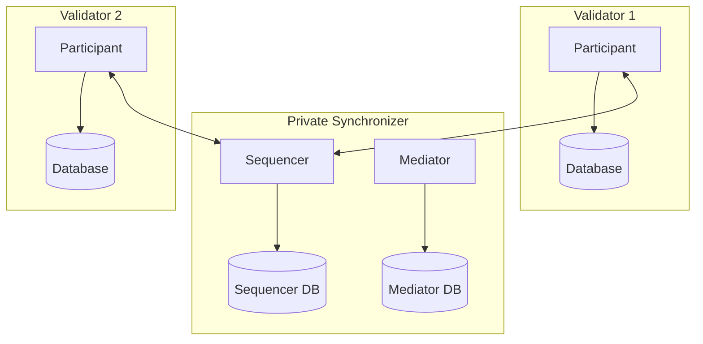

<Warning>
  이 페이지는 팀 리서치를 위한 비공식 한글 번역입니다. 이 페이지는 현재 authoring source가 아닌 배포 문서 snapshot을 기준으로 합니다. 기술적 판단에는 [공식 영어 원문](https://docs.canton.network/global-synchronizer/extension-synchronizers/other-private-synchronizers.md)을 사용하세요.
</Warning>

> ## Documentation Index
> 전체 documentation index는 https://docs.canton.network/llms.txt 에서 가져올 수 있습니다.
> 다른 문서를 탐색하기 전에 이 file로 사용 가능한 page를 확인하세요.

# Standalone Private Synchronizers

> Global Synchronizer와 독립적으로 private Canton Synchronizer 운영

모든 Canton deployment가 Global Synchronizer에 연결될 필요는 없습니다. 조직이나 consortium 내부에서만 수행되는 workflow를 위해 완전히 standalone인 Private Synchronizer를 운영할 수 있습니다. 이러한 deployment는 Canton Coin, 더 넓은 Canton Network와의 interaction, Canton Foundation infrastructure 의존성 없이 독립적으로 동작합니다.

## Standalone Synchronizer가 적합한 경우

Global Synchronizer와 연결되지 않은 Private Synchronizer는 다음 상황에 적합합니다.

- **모든 Party가 내부 주체인 경우**: External Canton Network Party와 상호작용할 필요 없이 한 조직 또는 알려진 participant의 폐쇄된 group 안에서 workflow를 실행합니다.
- **Regulatory isolation이 필요한 경우**: Compliance rule에 따라 transaction data와 metadata를 특정 infrastructure boundary 안에 두고 external network connection을 차단해야 합니다.
- **Network 참여 없이 Canton의 privacy 및 synchronization model이 필요한 경우**: Canton의 sub-transaction privacy, multi-party workflow 및 Daml smart contract는 Canton Network ecosystem과 독립적으로도 사용할 수 있습니다.
- **Canton을 평가하는 경우**: Standalone Synchronizer 운영은 Global Synchronizer onboarding을 결정하기 전에 Canton의 기능을 test하는 가장 단순한 방법입니다.

## 포기해야 하는 기능

Global Synchronizer에 연결하지 않으면 다음 작업을 수행할 수 없습니다.

- **Canton Coin 사용**: Canton Coin은 Global Synchronizer에 native한 token이며 Standalone Synchronizer에서는 사용할 수 없습니다.
- **다른 Canton Network participant와 interoperate**: Private Synchronizer의 contract를 Global Synchronizer로 reassign하거나 그곳의 contract와 상호작용할 수 없습니다.
- **Canton Network governance 참여**: 해당 Validator는 Canton Network Topology의 일부가 아닙니다.

나중에 Global Synchronizer 연결이 필요해지면 Validator를 Global Synchronizer에 연결하고 필요에 따라 contract를 reassign하여 추가할 수 있습니다. [Validator를 여러 Synchronizer에 연결하는 방법](/global-synchronizer/extension-synchronizers/linking-validator-multi-sync)을 참조하세요.

## Architecture

Standalone Private Synchronizer는 다음 component로 구성됩니다.

- **하나 이상의 Sequencer Node**: Synchronizer의 message ordering 제공
- **하나 이상의 Mediator Node**: Transaction confirmation을 수집하고 result 결정
- **PostgreSQL database**: Sequencer state와 Mediator state를 위한 backend storage
- **Validators**: Private Synchronizer에만 연결

## Deployment 개요

Standalone Synchronizer deployment는 Global Synchronizer onboarding step을 제외하면 hybrid setup의 Private Synchronizer deployment와 같은 process를 따릅니다. 다음 작업이 필요합니다.

1. PostgreSQL database와 함께 Sequencer Node와 Mediator Node 배포
2. Synchronizer identity와 Topology initialize
3. Validator를 배포하고 자체 Synchronizer에 연결
4. Validator에 Party를 allocate하고 transaction 시작

단계별 지침은 [Private Synchronizer deployment guide](/global-synchronizer/extension-synchronizers/deployment)를 참조하세요.

## Global Synchronizer 운영과의 차이

Standalone Synchronizer를 실행하면 다음과 같이 operational model이 달라집니다.

- **모든 infrastructure를 직접 책임집니다**: Super Validator가 없습니다. 단독 또는 consortium 내부에서 Sequencer, Mediator 및 모든 Validator를 직접 운영합니다.
- **Traffic fee가 없습니다**: Global Synchronizer가 없으므로 Canton Coin traffic metering도 없습니다. 비용은 infrastructure cost로만 구성됩니다.
- **Upgrade schedule을 직접 설정합니다**: Global Synchronizer upgrade timeline을 따를 필요 없이 자체 schedule에 따라 Canton version을 upgrade할 수 있습니다. 다만 security patch는 최신 상태로 유지하는 것이 좋습니다.
- **Topology가 더 단순합니다**: Onboarding secret, IP allowlisting, sponsor relationship이 없습니다. 전체 Network Topology를 직접 control합니다.

## Scaling 고려 사항

소수의 Validator와 중간 수준의 transaction volume을 가진 작은 deployment에는 PostgreSQL backend를 사용하는 하나의 Sequencer와 Mediator로 충분합니다. Transaction volume이 증가하면 다음 방법으로 확장할 수 있습니다.

- CPU, memory 또는 더 빠른 storage를 추가하여 PostgreSQL database를 vertical scaling
- Validator database에 read replica 추가
- Private network 안에서 fault tolerance가 필요하면 여러 Sequencer와 Mediator instance 배포

<Note>
  Centralized Sequencer, 즉 단일 PostgreSQL backend는 현재 Alpha입니다. Production workload에서는 이 ordering backend를 선택하기 전에 예상 transaction volume에 맞춰 performance와 stability를 validate하세요.
</Note>
