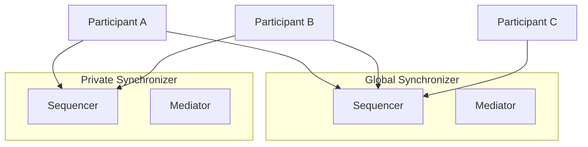

<Warning>
  이 페이지는 팀 리서치를 위한 비공식 한글 번역입니다. 이 페이지는 현재 authoring source가 아닌 배포 문서 snapshot을 기준으로 합니다. 기술적 판단에는 [공식 영어 원문](https://docs.canton.network/global-synchronizer/extension-synchronizers/private-synchronizers.md)을 사용하세요.
</Warning>

> ## Documentation Index
> 전체 documentation index는 https://docs.canton.network/llms.txt 에서 가져올 수 있습니다.
> 다른 문서를 탐색하기 전에 이 file로 사용 가능한 page를 확인하세요.

# Private Synchronizers

> Canton Network에서 Global Synchronizer와 함께 Private Synchronizer 운영

Canton Network application은 Global Synchronizer만 사용하도록 제한되지 않습니다. 서로 다른 privacy, performance 또는 governance 특성이 필요한 workload를 위해 Global Synchronizer와 함께 Private Synchronizer, 또는 Extension Synchronizer를 운영할 수 있습니다.

## Private Synchronizer를 사용하는 이유

Global Synchronizer는 Canton Network의 public backbone입니다. Canton Coin, identity management 및 cross-organizational workflow를 위한 synchronization layer를 제공합니다. 하지만 다음과 같은 요구 사항은 dedicated Synchronizer가 더 적합할 수 있습니다.

- **Privacy**: Private Synchronizer의 transaction data는 전체 Global Synchronizer network가 아니라 stakeholder Party에게만 표시됩니다. Synchronizer operator도 encrypted message envelope만 확인합니다.
- **Performance**: Dedicated Synchronizer는 다른 network traffic의 영향을 받지 않고 특정 throughput 및 latency requirement에 맞게 tuning할 수 있습니다.
- **Governance**: Synchronizer configuration, access policy 및 upgrade schedule을 직접 control합니다.
- **Cost**: Private Synchronizer traffic은 Canton Coin Traffic Credit을 소비하지 않습니다.

## 동작 방식

Private Synchronizer는 자체 Sequencer Node와 Mediator Node를 운영합니다. Participant는 Canton Coin 및 cross-network interoperability를 위해 Global Synchronizer에 연결하고, application-specific transaction을 위해 하나 이상의 Private Synchronizer에도 연결합니다.

Canton의 Multi-Synchronizer Protocol을 사용하면 하나의 Participant가 여러 Synchronizer에 동시에 연결될 수 있습니다. Contract는 연결된 임의의 Synchronizer에 assign할 수 있습니다. 서로 다른 Synchronizer에 있는 contract가 상호작용해야 할 때 Canton Protocol이 Cross-Synchronizer Transaction을 자동으로 처리합니다.



이 예에서 Participant A와 B는 두 Synchronizer에 모두 연결되어 어느 쪽에서도 transaction을 수행할 수 있습니다. Participant C는 Global Synchronizer에만 연결되므로 Private Synchronizer의 contract와 상호작용할 수 없습니다.

## Private Synchronizer 사용 시점

Private Synchronizer는 다음 경우에 적합합니다.

- 알려진 participant 집합 사이에서 application이 high-volume transaction을 처리
- Regulatory requirement에 따라 transaction data를 특정 jurisdiction 또는 infrastructure 안에 유지
- Global Synchronizer load와 독립적인 guaranteed performance 특성이 필요
- 더 넓은 network에 공개할 필요가 없는 bilateral 또는 multilateral agreement를 workflow에서 사용

Private Synchronizer는 다음 경우에 필요하지 않습니다.

- Application이 주로 Canton Coin transfer를 사용하며, 이 operation에는 Global Synchronizer가 필요
- 다른 Canton Network application과 최대 수준의 interoperability가 필요
- 하나의 Synchronizer connection만 운영하는 단순성을 선호

## Deployment Models

### Self-Operated

자체 Sequencer Node와 Mediator Node를 운영합니다. Infrastructure, configuration 및 access policy를 완전히 control할 수 있습니다. Availability, backup 및 upgrade도 직접 책임집니다.

### Third Party 운영

신뢰하는 third party가 Synchronizer infrastructure를 대신 운영합니다. Participant는 해당 operator의 Sequencer endpoint에 연결합니다. Operator가 infrastructure를 control하지만 Canton privacy model에 따라 transaction content는 확인할 수 없고 encrypted message envelope만 볼 수 있습니다.

### Multi-Operator, BFT

여러 조직이 BFT Consensus Protocol을 사용해 Synchronizer를 공동 운영합니다. Global Synchronizer model과 유사하지만 더 작은 private operator 집합을 사용합니다. 단일 operator가 offline 상태가 되거나 malicious하게 행동하는 상황에 대한 resilience를 제공합니다.

## Private Synchronizer 연결

Participant는 Canton Admin API 또는 Canton Console을 통해 Private Synchronizer에 연결합니다. 연결에는 Sequencer endpoint URL과 적절한 authentication credential이 필요합니다.

```scala theme={"theme":{"light":"github-light","dark":"github-dark"}}
@ bootstrap.synchronizer(synchronizerName = "my-private-sync", sequencers = Seq(sequencer1), mediators = Seq(mediator1), synchronizerOwners = Seq(sequencer1), synchronizerThreshold = PositiveInt.one, staticSynchronizerParameters = StaticSynchronizerParameters.defaultsWithoutKMS(ProtocolVersion.forSynchronizer))
    res1: PhysicalSynchronizerId = my-private-sync::122032922613...::35-0
```

```scala theme={"theme":{"light":"github-light","dark":"github-dark"}}
@ participant1.synchronizers.connect_local(sequencer1, "my-private-sync")
```

```scala theme={"theme":{"light":"github-light","dark":"github-dark"}}
@ participant1.synchronizers.list_connected()
    res3: Seq[ListConnectedSynchronizersResult] = Vector(
      ListConnectedSynchronizersResult(
        synchronizerAlias = Synchronizer 'my-private-sync',
        physicalSynchronizerId = my-private-sync::122032922613...::35-0,
        healthy = true
      )
    )
```

연결되면 Participant는 transaction submission에서 target Synchronizer로 Private Synchronizer를 지정하여 그곳에 contract를 생성할 수 있습니다.

## Global Synchronizer와의 관계

Private Synchronizer와 Global Synchronizer는 상호 보완적입니다.

- **Canton Coin** operation은 항상 Global Synchronizer를 사용합니다.
- **Smart contract**는 Participant에만 존재하지만 requirement에 따라 어느 Synchronizer에도 assign할 수 있습니다.
- 서로 다른 Synchronizer의 contract가 상호작용해야 할 때 **Cross-Synchronizer Transaction**이 가능하며 Canton이 coordination을 자동 처리합니다.
- **Party identity**는 Synchronizer 사이에서 공유됩니다. Global Synchronizer에 등록된 Party를 연결된 모든 Private Synchronizer에서 사용할 수 있습니다.

## 다음 단계

- [Hybrid Synchronizer Pattern](/global-synchronizer/extension-synchronizers/hybrid-synchronizer-pattern): Public Synchronizer와 Private Synchronizer 결합
- [Deployment](/global-synchronizer/extension-synchronizers/deployment): Extension Synchronizer infrastructure 배포
- [Linking Validators](/global-synchronizer/extension-synchronizers/linking-validator-multi-sync): Multi-Synchronizer Validator configuration
