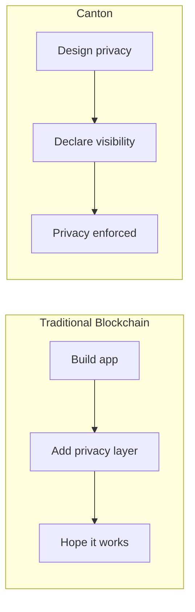

> ## Documentation Index
> Fetch the complete documentation index at: https://docs.canton.network/llms.txt
> Use this file to discover all available pages before exploring further.

# Module 1: Understanding Canton

> Build the foundational understanding needed for Canton development

This module provides the conceptual foundation you need before writing Canton code. Even if you're eager to start coding, taking time to understand these concepts will make you more effective.

## Module Overview

| Section                | Purpose                               |
| ---------------------- | ------------------------------------- |
| **Mental Models**      | Build intuition for how Canton works  |
| **Development Stack**  | Understand the tools and technologies |
| **How Canton Differs** | See what makes Canton unique          |

## Why This Module Matters

Canton is not just another blockchain with different syntax. It represents a fundamentally different approach to distributed ledgers:

* **Privacy is native**, not bolted on
* **Consensus is targeted**, not global
* **State is distributed**, not replicated
* **Authorization is declared**, not coded

Understanding these principles upfront will save you from fighting against the architecture later.

## Core Insights

### Privacy First

On most blockchains, you build an application and then try to add privacy. On Canton, you start with privacy and choose what to reveal and whom to reveal it to.

### No Global State

There is no single "blockchain" you can query for all information. Each party has their own view of the ledger.

| Traditional View       | Canton Reality                                        |
| ---------------------- | ----------------------------------------------------- |
| "Query the blockchain" | Query *your* data from *your* validator               |
| "Total supply"         | Only visible if the application exposes it via an API |
| "All transactions"     | *Your* transactions only                              |

### Immutable Everything

Contracts don't change. When you "update" a contract, you archive the old one and create a new one. This isn't a limitation—it's the foundation of privacy and integrity guarantees.

### Explicit Authorization

You declare what each party can do at compile time, and the protocol enforces it. Unlike traditional systems where you check caller identity at runtime, Canton's authorization is structural.

## Prerequisites Check

Before proceeding, you should:

* **Understand** what Canton is ([Five-Minute Overview](/overview/understand/five-minute-overview))
* **Know** the basic components ([Core Concepts](/overview/understand/core-concepts))
* **Have** programming experience (any language)

No blockchain experience is required—and if you have it, be prepared to unlearn some things.

## What You'll Learn

By the end of this module, you'll understand:

1. How to think about Canton's privacy model
2. The relationship between parties, validators, and synchronizers
3. How transactions flow through the system
4. What tools you'll use for development

## Learning Path

<CardGroup cols={2}>
  <Card title="Mental Models" icon="brain" href="/appdev/modules/m1-mental-models">
    Build intuition for Canton's approach to distributed ledgers.
  </Card>

  <Card title="Development Stack" icon="wrench" href="/appdev/modules/m1-development-stack">
    Understand the tools and technologies you'll use.
  </Card>
</CardGroup>

After completing this module, continue to:

* **[Module 2](/appdev/modules/m2-canton-for-ethereum-devs)**: If you have Ethereum/blockchain experience
* **[Choose your path](/appdev/get-started/choose-your-path)**: If you're ready to start writing Daml
