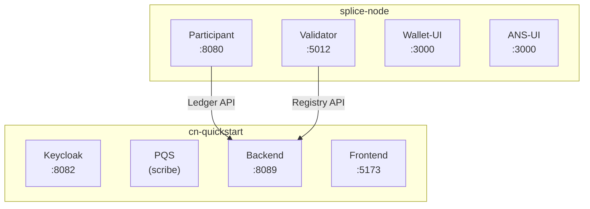

> ## Documentation Index
> Fetch the complete documentation index at: https://docs.canton.network/llms.txt
> Use this file to discover all available pages before exploring further.

# Deploy Quickstart to DevNet

> Deploy the Canton Network Quickstart application from LocalNet to DevNet, including validator request, VPN setup, and end-to-end workflow verification.

## Overview

In this guide, you'll deploy the Quickstart app from LocalNet to DevNet.
You'll deploy the original DAR, deploy to the backend, frontend and test
the workflow.

You should have the Quickstart application
*installed* and understand the
[Project Structure](/appdev/quickstart/project-structure) guide.

## DevNet validator prerequisite

You must have successfully submitted a validator request to successfully
complete this guide.

Submit your request at:
[https://canton.foundation/apply-to-set-up-a-validator-node/](https://canton.foundation/apply-to-set-up-a-validator-node/)

Visit the global synchronizer docs to learn more about the validator
onboarding process and how to deploy a validator with Docker Compose.

You can find up-to-date Canton Foundation DevNet Super Validator Node
Information at: [https://canton.foundation/sv-network-status/](https://canton.foundation/sv-network-status/)

## Architectural overview

The Quickstart DevNet deployment splits across two components:

* **splice-node**: Provides the validator infrastructure (participant,
  validator, wallet-ui, ans-ui)
* **cn-quickstart**: Provides the application layer (keycloak, pqs,
  backend-service, frontend)



`splice-node` ports are internal container ports and routed via nginx by
hostname. `cn-quickstart` ports are directly exposed.

The frontend communicates with the backend via HTTP REST calls to
`/api/*` endpoints. The Vite development server proxies these requests
to the backend, which translates them into Ledger API calls. For a
detailed explanation of this fully mediated architecture, see
[Project Structure](/appdev/quickstart/project-structure).

## Quickstart configuration for DevNet

Quickstart environment variables are set for `LocalNet` usage by
default, but ledger connections differ between `LocalNet` and `DevNet`
configurations. For example:

| Variable      | LocalNet Value | DevNet Value                |
| ------------- | -------------- | --------------------------- |
| `LEDGER_HOST` | `localhost`    | `grpc-ledger-api.localhost` |
| `LEDGER_PORT` | `5001`         | `80` or `8080`              |

## Configure Host entries

`nginx.conf` uses virtual hosting to route requests to backend services.
As a result, nginx inspects your `Host` HTTP header to determine backend
routing. Add explicit host entires for reliable routing.

Add these entries to `/etc/hosts`:

```bash theme={"theme":{"light":"github-light","dark":"github-dark"}}
   sudo vim /etc/hosts

   127.0.0.1 json-ledger-api.localhost
   127.0.0.1 grpc-ledger-api.localhost
   127.0.0.1 validator.localhost
   127.0.0.1 app-provider.localhost
   127.0.0.1 participant.localhost
   127.0.0.1 wallet.localhost
   127.0.0.1 ans.localhost
   127.0.0.1 keycloak.localhost
   127.0.0.1 host.docker.internal

```

You only need to complete this step one time.

| Host Entry                  | URL                                   | Purpose                                      |
| --------------------------- | ------------------------------------- | -------------------------------------------- |
| `json-ledger-api.localhost` | `http://json-ledger-api.localhost/`   | JSON Ledger API (REST commands, DAR uploads) |
| `grpc-ledger-api.localhost` | `http://grpc-ledger-api.localhost/`   | gRPC Ledger API (backend's `LEDGER_HOST`)    |
| `validator.localhost`       | `http://validator.localhost/`         | Validator application API                    |
| `wallet.localhost`          | `http://wallet.localhost/`            | Canton Wallet web interface                  |
| `app-provider.localhost`    | `http://app-provider.localhost:5173/` | Quickstart frontend web interface            |
| `participant.localhost`     | `http://participant.localhost/`       | Participant admin/metrics                    |
| `ans.localhost`             | `http://ans.localhost/`               | Canton Name Service (ANS) web interface      |
| `keycloak.localhost`        | `http://keycloak.localhost:8082/`     | OAuth2/OIDC provider                         |

DevNet Host Entries

The nginx proxy routes based on hostname. Default port is 80. MacOS
users may need to change the validator port from 80 to 8080 to avoid
`vmnetd` errors. See `vmnetd-error` in the Troubleshooting section.

## Download the Splice node release bundle

In `DevNet`, your Splice node validator runs locally and connects to the `DevNet` synchronizer.
Download and extract the Splice node bundle by following the Requirements
step in the [Docker Compose Validator Deployment guide](/global-synchronizer/deployment/validator-docker-compose#requirements).

The extracted `splice-node` directory and `cn-quickstart` should be
siblings to one another:

```bash theme={"theme":{"light":"github-light","dark":"github-dark"}}
.
└── Canton_Network_App_Dev
    ├── cn-quickstart
    └── splice-node
```

<Note>
  Find the most recent Splice release on the [canton-network/splice releases page](https://github.com/canton-network/splice/releases).
</Note>

## Navigate to the validator's Docker Compose directory

```bash theme={"theme":{"light":"github-light","dark":"github-dark"}}
cd splice-node/docker-compose/validator
```

## Connect to a Canton Network Validator Node

Navigate to your OS's VPN settings, then connect to your sponsoring
validator node.

VPN access is required for `DevNet`. Contact your sponsoring SV for VPN
credentials.

### Mac OS

Settings > VPN


Enable your Canton Network VPN


### Linux

Network > VPN


## Clean Docker

Clear Docker If this is not your first time connecting to `DevNet` so
that stale containers do not interfere.

```bash theme={"theme":{"light":"github-light","dark":"github-dark"}}
   docker compose down -v

```

## Get network information

### Retrieve DevNet migration ID and Splice version

In terminal, from the `/validator` directory run:

```bash theme={"theme":{"light":"github-light","dark":"github-dark"}}
   INFO_URL="https://docs.dev.global.canton.network.sync.global/info"
   SPLICE_VERSION=$(curl -s "$INFO_URL" | jq -r '.synchronizer?.active?.version')
   MIGRATION_ID=$(curl -s "$INFO_URL" | jq -r '.synchronizer?.active?.migration_id')

   echo "Splice Version: $SPLICE_VERSION"
   echo "Migration ID: $MIGRATION_ID"

```

Verify that the Splice version matches the splice-node version that you
recently downloaded and unzipped. Minor Splice versions change on a
regular basis. You may elect to hard code `SPLICE_VERSION` rather than
saving the most recent version, e.g. `SPLICE_VERSION=0.6.4`

### Get the onboarding secret

You may use the following Super Validator URL if you are connected to
the Canton Network Global Synchronizer. If not, your sponsoring SV will
provide the appropriate URL. In this case, you must replace the provided
`SPONSOR_SV_URL` with your provided URL.

```bash theme={"theme":{"light":"github-light","dark":"github-dark"}}
   # GSF Sponsor SV URL for DevNet
   SPONSOR_SV_URL="https://sv.sv-1.dev.global.canton.network.sync.global"

   # Request and store the onboarding secret
   ONBOARDING_SECRET=$(curl -s -X POST "$SPONSOR_SV_URL/api/sv/v0/devnet/onboard/validator/prepare")
   echo $ONBOARDING_SECRET

```

<div class="tip" markdown="1">
  <div class="title" markdown="1">
    Tip
  </div>

  The onboarding secret is only good for 1 hour. If containers ever show
  unhealthy, try requesting a new onboarding secret as your first step in
  troubleshooting.
</div>

### Party Hint

Set a Party Hint. The party hint must match the expected hint that is
established when running `make setup` from `cn-quickstart/quickstart`.

If you don't remember your party hint, you can open a terminal and
navigate to `cn-quickstart/quickstart/`, then run `make setup`.

The default party hint is `quickstart-USERNAME-1`

Return to the terminal in the `validator` directory. Set `PARTY_HINT`.

```bash theme={"theme":{"light":"github-light","dark":"github-dark"}}
   PARTY_HINT="quickstart-USERNAME-1"

```

This value must match the expected party hint.

## Authentication

<div class="note" markdown="1">
  <div class="title" markdown="1">
    Note
  </div>

  If you would like to connect to `DevNet` without authentication, you may
  skip this section and initiate the `start.sh` script without the `-a`
  flag.
</div>

Update authentication variables in
`splice-node/docker-compose/validator/.env` using Quickstart's
pre-configured Keycloak values. The following Authentication values can
be found in `cn-quickstart`'s keycloak `env`, realm and user JSON files.
Files include
`quickstart/quickstart/docker/modules/keycloak/compose.env`,
`AppProvider-realm.json`, and `AppProvider-users-0.json`.

`splice-node/docker-compose/validator/.env`

```bash theme={"theme":{"light":"github-light","dark":"github-dark"}}
   # Authentication

   # OIDC Provider URLs
   AUTH_URL="http://keycloak.localhost:8082"
   AUTH_JWKS_URL="http://host.docker.internal:8082/realms/AppProvider/protocol/openid-connect/certs"
   AUTH_WELLKNOWN_URL="http://host.docker.internal:8082/realms/AppProvider/.well-known/openid-configuration"

   # Audiences
   LEDGER_API_AUTH_AUDIENCE="https://canton.network.global"
   LEDGER_API_AUTH_SCOPE=""       # Optional, leave empty
   VALIDATOR_AUTH_AUDIENCE="https://canton.network.global"

   # Validator client credentials
   VALIDATOR_AUTH_CLIENT_ID="app-provider-validator"
   VALIDATOR_AUTH_CLIENT_SECRET="AL8648b9SfdTFImq7FV56Vd0KHifHBuC"

   # Admin users 
   LEDGER_API_ADMIN_USER="service-account-app-provider-validator"
   WALLET_ADMIN_USER="app-provider"

   # UI Clients
   WALLET_UI_CLIENT_ID="app-provider-wallet"
   ANS_UI_CLIENT_ID="app-provider-ans"

```

<div class="note" markdown="1">
  <div class="title" markdown="1">
    Note
  </div>

  These are development secrets and should be changed for production.
</div>

## Start the validator with the start.sh script.

Verify that you are in the `validator` directory, then run this command
to connect to `DevNet`:

```bash theme={"theme":{"light":"github-light","dark":"github-dark"}}
   ./start.sh \
    -s "https://sv.sv-1.dev.global.canton.network.sync.global" \
    -o "$ONBOARDING_SECRET" \
    -p "$PARTY_HINT" \
    -m $MIGRATION_ID \
    -w \
    -a

```

### Flag descriptions

| Flag | Description                                |
| ---- | ------------------------------------------ |
| `-s` | Sponsor SV URL                             |
| `-o` | Onboarding secret                          |
| `-p` | Your unique party hint                     |
| `-m` | Migration ID (a non-negative integer)      |
| `-w` | Wait for validator to be fully operational |
| `-a` | Enable authentication                      |

<div class="note" markdown="1">
  <div class="title" markdown="1">
    Note
  </div>

  You can omit the `-a` flag to skip authentication setup. This may make
  initial testing easier, but you should enable authentication for
  production use.
</div>

While `DevNet` is starting, move on to the next step. (You'll need to
complete the next step before `DevNet` is able to connect).

## Spin up the Quickstart DevNet

In a second terminal, navigate to the Quickstart `DevNet` Docker Compose
directory.

```bash theme={"theme":{"light":"github-light","dark":"github-dark"}}
   cd cn-quickstart/quickstart/docker/modules/devnet

   docker compose --env-file compose.env --profile devnet up -d postgres-keycloak keycloak nginx-keycloak postgres-pqs pqs-app-provider backend-service

```

```text theme={"theme":{"light":"github-light","dark":"github-dark"}}
   devnet ~ % docker compose --env-file compose.env --profile devnet up -d postgres-keycloak keycloak nginx-keycloak postgres-pqs pqs-app-provider backend-service
   [+] Running 7/7
    ✔ Container postgres-pqs          Healthy                  27.5s 
    ✔ Container postgres-keycloak     Healthy                  6.2s 
    ✔ Container keycloak              Healthy                  26.7s 
    ✔ Container nginx-keycloak        Started                  26.7s 
    ✔ Container splice-onboarding     Healthy                  41.3s 
    ✔ Container pqs-app-provider      Started                  27.3s 
    ✔ Container backend-service       Started                  41.4s 

```

`DevNet` connects shortly after spinning up the docker containers. A
successful connection shows healthy containers.


<div class="note" markdown="1">
  <div class="title" markdown="1">
    Note
  </div>

  See the Troubleshooting section if you experience a `vmnetd` error.
</div>

## Build and upload the DAR

Return to the `/quickstart` directory.

```bash theme={"theme":{"light":"github-light","dark":"github-dark"}}
   cd ../../../

```

Then build the Daml code.

```bash theme={"theme":{"light":"github-light","dark":"github-dark"}}
   make build-daml

```

Verify that the `DAR` was created.

```bash theme={"theme":{"light":"github-light","dark":"github-dark"}}
   ls -la daml/licensing/.daml/dist/quickstart-licensing-0.0.1.dar

```

If successful, this command returns the `DAR` file.

```text theme={"theme":{"light":"github-light","dark":"github-dark"}}
   -rw-r--r--  1 username  staff  685582 Nov 25 09:00 daml/licensing/.daml/dist/quickstart-licensing-0.0.1.dar

```

## Upload the DAR to your DevNet validator

Get a token from Keycloak to make an authenticated request:

```bash theme={"theme":{"light":"github-light","dark":"github-dark"}}
   TOKEN=$(curl -s -X POST "http://keycloak.localhost:8082/realms/AppProvider/protocol/openid-connect/token" \
     -d "grant_type=client_credentials" \
     -d "client_id=app-provider-validator" \
     -d "client_secret=AL8648b9SfdTFImq7FV56Vd0KHifHBuC" | jq -r .access_token)

```

(Note that the `client_secret` matches the `app-provider-validator`'s
`secret` in Keycloak's `AppProvider-realm.json`).

From the `/quickstart` directory, upload the `DAR` to your `DevNet`
validator (MacOS users replace `${LEDGER_PORT}` with `8080`):

### MacOS

```bash theme={"theme":{"light":"github-light","dark":"github-dark"}}
   curl -X POST "http://json-ledger-api.localhost:8080/v2/dars?vetAllPackages=true" \
     -H "Authorization: Bearer $TOKEN" \
     -H 'Content-Type: application/octet-stream' \
     --data-binary @daml/licensing/.daml/dist/quickstart-licensing-0.0.1.dar

```

### Linux

```bash theme={"theme":{"light":"github-light","dark":"github-dark"}}
   curl -X POST "http://json-ledger-api.localhost:${LEDGER_PORT}/v2/dars?vetAllPackages=true" \
     -H "Authorization: Bearer $TOKEN" \
     -H 'Content-Type: application/octet-stream' \
     --data-binary @daml/licensing/.daml/dist/quickstart-licensing-0.0.1.dar

```

An empty response of `{}` indicates a successful upload.

## Build the Backend

Build the backend from the `/quickstart` directory:

```bash theme={"theme":{"light":"github-light","dark":"github-dark"}}
   make build-backend

```

## Configure Quickstart frontend for DevNet

The frontend communicates with the backend via HTTP REST calls to
`/api/*` endpoints. The Vite development server proxies these requests
to the backend, which translates them into Ledger API calls to the
`DevNet` participant. Review `vite.config.ts` for details.

Build the frontend from the `/quickstart` directory:

```bash theme={"theme":{"light":"github-light","dark":"github-dark"}}
   make build-frontend

```

Start the Vite development server.

```bash theme={"theme":{"light":"github-light","dark":"github-dark"}}
   make vite-dev

```

The frontend runs on `port 5173`. Open your browser to:

[http://app-provider.localhost:5173](http://app-provider.localhost:5173)

It's extremely important to prepend `localhost` with `app-provider` in
order to successfully log in through Keycloak.

Select AppProvider


Login as `app-provider` with password `abc123`


You sign in to the App Provider's Quickstart homepage. Congratulations!
You've launched Quickstart to `DevNet`!


<div class="note" markdown="1">
  <div class="title" markdown="1">
    Note
  </div>

  Quickstart won't immediately operate as it does on `LocalNet`. You'll
  need to refactor to resolve connectivity issues. Perhaps begin with
  `make create-app-install-request`.
</div>

## Appendix

### Recipes

#### Start and stop scripts

In the future, use the provided `start.sh` and `stop.sh` scripts to
quickly start and stop Quickstart `DevNet` Docker containers.

Use `./start.sh` to run a live log stream in terminal. (exit with
ctrl+c) Opt for `./start.sh -d` to spin up the containers without a log
stream.

Stop all of the Quickstart `DevNet` Docker containers with `./stop.sh`.
You may also remove the volumes with `./stop.sh -v`.

#### Health check

You can check that Docker services are connected by checking
`docker ps`. To check a specific service use grep. e.g.
`docker ps | grep backend-service`.

```bash theme={"theme":{"light":"github-light","dark":"github-dark"}}
   docker ps --format "table {{.Names}}\t{{.Status}}"

```

Via, CURL, get a token and then ping the service.

Get an auth token:

```bash theme={"theme":{"light":"github-light","dark":"github-dark"}}
   TOKEN=$(curl -s -X POST "http://keycloak.localhost:8082/realms/AppProvider/protocol/openid-connect/token" \
     -d "grant_type=client_credentials" \
     -d "client_id=app-provider-backend" \
     -d "client_secret=05dmL9DAUmDnIlfoZ5EQ7pKskWmhBlNz" | jq -r .access_token)

```

Call the service of your choice:

```bash theme={"theme":{"light":"github-light","dark":"github-dark"}}
   Backend health check: curl -H "Authorization: Bearer $TOKEN" http://localhost:8089/actuator/health

```

#### Super validator connectivity check

You may make a connectivity check to the `DevNet` super validator at
anytime:

```bash theme={"theme":{"light":"github-light","dark":"github-dark"}}
   curl -s "https://scan.sv-1.dev.global.canton.network.sync.global/api/scan/v0/splice-instance-names"

```


#### View tables

You can explore the container schema by querying the list of tables.

```bash theme={"theme":{"light":"github-light","dark":"github-dark"}}
   docker exec -it splice-validator-postgres-splice-1 psql -U cnadmin -d validator -c "
     SELECT schemaname, tablename 
     FROM pg_tables 
     WHERE schemaname = 'validator' 
     ORDER BY tablename;"

```

#### Confirm current migration ID

```bash theme={"theme":{"light":"github-light","dark":"github-dark"}}
   curl -s "https://docs.dev.global.canton.network.sync.global/info" | jq '.synchronizer?.active?.migration_id'

```

#### Find DSO fingerprint

```bash theme={"theme":{"light":"github-light","dark":"github-dark"}}
   curl -s "https://scan.sv-1.dev.global.canton.network.sync.global/api/scan/v0/dso-party-id"

```

### Docker

#### Read docker logs

```bash theme={"theme":{"light":"github-light","dark":"github-dark"}}
   docker logs FAILING_VALIDATOR --tail 100

```

#### Kill running containers

```bash theme={"theme":{"light":"github-light","dark":"github-dark"}}
   docker kill $(docker ps -q)

```

#### Stop gracefully

```bash theme={"theme":{"light":"github-light","dark":"github-dark"}}
   docker stop $(docker ps -q)

```

`docker ps -q` lists the container IDs of running containers `$()`
passes those IDs to the kill or stop command

#### Remove containers after stopping

```bash theme={"theme":{"light":"github-light","dark":"github-dark"}}
   docker rm $(docker ps -aq)

```

#### One command

```bash theme={"theme":{"light":"github-light","dark":"github-dark"}}
   docker stop $(docker ps -q) && docker rm $(docker ps -aq)

```

### Troubleshooting

#### Resolve vmnetd errorIf you experience a `vmnetd` error response then the most

straightforward solution is to update the validator compose port from 80
to 8080.


If necessary, to resolve "vmnetd running errors", find `nginx` service
in `splice-node/docker-compose/validator/compose.yaml`. It is currently
at line 163. Change port `80:80` in `"${HOST_BIND_IP:-127.0.0.1}:80:80"`
to `8080:80`.

`splice-node/docker-compose/validator/compose.yaml`

```yaml theme={"theme":{"light":"github-light","dark":"github-dark"}}
   nginx:
      image: "nginx:${NGINX_VERSION}"
      volumes:
        - ./nginx.conf:/etc/nginx/nginx.conf
        - ./nginx:/etc/nginx/includes
      ports:
        - "${HOST_BIND_IP:-127.0.0.1}:8080:80" # Change this line from 80:80 to 8080:80
      depends_on:
        - ans-web-ui
        - wallet-web-ui
        - validator
      restart: always
      networks:
        - ${DOCKER_NETWORK:-splice_validator}
      healthcheck:
        test: ["CMD", "service", "nginx", "status"]
        interval: 30s
        timeout: 10s
        retries: 3
        start_period: 60s

```

#### Troubleshoot frontend JavaScript mapping errors

##### Switch BACKEND\_PORT from 8080 to 8089

Open `cn-quickstart/quickstart/.env` in a text editor and change
`BACKEND_PORT=8080` to `BACKEND_PORT=8089`.

##### Update proxyReq in vite configuration

Change line 35 in `vite.config.ts` from
`proxyReq.setHeader('host', 'app-provider.localhost')` to
`proxyReq.setHeader('host', 'app-provider.localhost:5173')`.

##### Ping app-provider.localhost

```bash theme={"theme":{"light":"github-light","dark":"github-dark"}}
   ping -c 1 app-provider.localhost

```

If successful, navigate to the app at
[http://app-provider.localhost:5173](http://app-provider.localhost:5173) and login.

##### Check backend-service logs for errors

```bash theme={"theme":{"light":"github-light","dark":"github-dark"}}
   docker logs backend-service --tail 30

```

##### Find the login options

```bash theme={"theme":{"light":"github-light","dark":"github-dark"}}
   curl -s http://localhost:8089/login-links | jq

```

##### Get token for backend API access

```bash theme={"theme":{"light":"github-light","dark":"github-dark"}}
   TOKEN=$(curl -s -X POST "http://keycloak.localhost:8082/realms/AppProvider/protocol/openid-connect/token" \
     -d "grant_type=client_credentials" \
     -d "client_id=app-provider-backend" \
     -d "client_secret=05dmL9DAUmDnIlfoZ5EQ7pKskWmhBlNz" | jq -r .access_token)

```

##### Verify token was retrieved

```bash theme={"theme":{"light":"github-light","dark":"github-dark"}}
   echo "Token length: ${#TOKEN}"

```

##### Query data from PQS

Query app install requests

```bash theme={"theme":{"light":"github-light","dark":"github-dark"}}
   curl -H "Authorization: Bearer $TOKEN" http://localhost:8089/app-install-requests | head -10

```

Query license data

```bash theme={"theme":{"light":"github-light","dark":"github-dark"}}
   curl -H "Authorization: Bearer $TOKEN" http://localhost:5173/api/licenses

```

#### Error port is already in use

If terminal shows `Error: Port 5173 is already in use` identify and kill
the associated node process, then run your command again.

```bash theme={"theme":{"light":"github-light","dark":"github-dark"}}
   lsof -i :5173

```

```text theme={"theme":{"light":"github-light","dark":"github-dark"}}
   COMMAND   PID     USER       FD   TYPE  DEVICE  SIZE/OFF  NODE  NAME
   node      12345   USERNAME   34u  IPv6  DEVICE  0t0       TCP   localhost:5173 (LISTEN)

```

```bash theme={"theme":{"light":"github-light","dark":"github-dark"}}
   kill -9 12345

```

#### Restart unhealthy Docker containers

If you have trouble connecting to healthy containers, restart the Docker
containers and capture full logs.

Stop the container

```bash theme={"theme":{"light":"github-light","dark":"github-dark"}}
   docker compose -f splice-node/docker-compose/validator/compose.yaml down

```

Start fresh and capture the logs

```bash theme={"theme":{"light":"github-light","dark":"github-dark"}}
   docker compose -f splice-node/docker-compose/validator/compose.yaml up validator 2>&1 | tee validator-startup.log

```

Read logs in terminal:

```bash theme={"theme":{"light":"github-light","dark":"github-dark"}}
   docker logs splice-validator-validator-1 2>&1 | head -300

```

Replace `splice-validator-validator-1` with the desired container.

#### Keycloak

<div class="note" markdown="1">
  <div class="title" markdown="1">
    Note
  </div>

  You can login to the Keycloak admin GUI at
  `http://host.docker.internal:8082/` Use `admin` for the username and
  password.
</div>


Check Keycloak logs:

```bash theme={"theme":{"light":"github-light","dark":"github-dark"}}
   docker logs keycloak

```

Check PostgreSQL:

```bash theme={"theme":{"light":"github-light","dark":"github-dark"}}
   docker logs postgres-keycloak

```

Check the OIDC discovery endpoint:

```bash theme={"theme":{"light":"github-light","dark":"github-dark"}}
   curl -s http://keycloak.localhost:8082/realms/AppProvider/.well-known/openid-configuration | jq .

```

Get an OAuth2 `AppProvider realm` token:

```bash theme={"theme":{"light":"github-light","dark":"github-dark"}}
   curl -s -X POST http://keycloak.localhost:8082/realms/AppProvider/protocol/openid-connect/token \
    -H "Content-Type: application/x-www-form-urlencoded" \
    -d "grant_type=password" \
    -d "client_id=app-provider-unsafe" \
    -d "username=app-provider" \
    -d "password=app-provider" | jq .access_token

```

Get an OAuth2 `AppUser realm` token:

```bash theme={"theme":{"light":"github-light","dark":"github-dark"}}
   curl -s -X POST http://keycloak.localhost:8082/realms/AppUser/protocol/openid-connect/token \
    -H "Content-Type: application/x-www-form-urlencoded" \
    -d "grant_type=password" \
    -d "client_id=app-user-unsafe" \
    -d "username=app-user" \
    -d "password=app-user" | jq .access_token

```

Check Keycloak's public key location:

```bash theme={"theme":{"light":"github-light","dark":"github-dark"}}
   curl -s http://keycloak.localhost:8082/realms/AppProvider/.well-known/openid-configuration | jq .issuer

```

Expected response is
`"http://host.docker.internal:8082/realms/AppProvider"`

#### Unable to login to Keycloak as admin

```bash theme={"theme":{"light":"github-light","dark":"github-dark"}}
   docker logs keycloak 2>&1 | grep -i "ssl\|https\|require" | tail -20

```

The following command disables the SSL requirements for the master realm
and allows you to login as admin at `localhost:8082`.

```bash theme={"theme":{"light":"github-light","dark":"github-dark"}}
   docker exec -it keycloak /opt/keycloak/bin/kcadm.sh config credentials \
     --server http://localhost:8082 --realm master --user admin --password admin

   docker exec -it keycloak /opt/keycloak/bin/kcadm.sh update realms/master \
     -s sslRequired=NONE

```

#### Splice-onboarding troubleshooting

Find specific env values:

```bash theme={"theme":{"light":"github-light","dark":"github-dark"}}
   docker exec splice-onboarding env | grep -E "PARTICIPANT|LEDGER"

```

Restart the `splice-onboarding` container:

```bash theme={"theme":{"light":"github-light","dark":"github-dark"}}
   cd cn-quickstart/quickstart/docker/modules/devnet
   docker compose --env-file compose.env -f compose.yaml --profile devnet down -v
   docker compose --env-file compose.env -f compose.yaml --profile devnet build --no-cache splice-onboarding
   docker compose --env-file compose.env -f compose.yaml --profile devnet up -d

```

Watch the logs:

```bash theme={"theme":{"light":"github-light","dark":"github-dark"}}
   docker logs -f splice-onboarding

```

Query `splice-onboarding` networks:

```bash theme={"theme":{"light":"github-light","dark":"github-dark"}}
   docker inspect splice-onboarding --format '{{json .NetworkSettings.Networks}}' | jq

```

Check which network the `splice-validator-nginx` is on:

```bash theme={"theme":{"light":"github-light","dark":"github-dark"}}
   docker ps --format "{{.Names}}" | grep -E "nginx|validator|participant"

```

Then inspect that container to see its network:

```bash theme={"theme":{"light":"github-light","dark":"github-dark"}}
   docker inspect splice-validator-nginx-1 --format '{{json .NetworkSettings.Networks}}' 2>/dev/null | jq || \
   docker network inspect splice-validator_splice_validator --format '{{range .Containers}}{{.Name}} {{end}}'

```

Check if `splice-onboarding` is initialized:

```bash theme={"theme":{"light":"github-light","dark":"github-dark"}}
   docker exec splice-onboarding cat /tmp/all-done && echo "SUCCESS"

```

#### Splice-onboarding connection issue

If you run `splice-onboarding` logs and see:

```text theme={"theme":{"light":"github-light","dark":"github-dark"}}
   (base) devnet ~ % docker logs -f splice-onboarding
   Start with mode --init
   Initializing DevNet onboarding...
   Waiting for external participant at grpc-ledger-api.localhost:8080...
   Waiting for participant... attempt 1/60
   Waiting for participant... attempt 2/60
   Waiting for participant... attempt 3/60
   Waiting for participant... attempt 4/60
   Waiting for participant... attempt 5/60

```

Then there is likely an error in `LEDGER_HOST` or `LEDGER_PORT`. Unset
the variables or quit and restart terminal.
