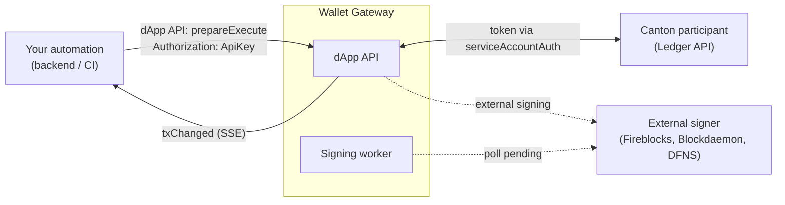

> ## Documentation Index
> Fetch the complete documentation index at: https://docs.canton.network/llms.txt
> Use this file to discover all available pages before exploring further.

# Service account automations

> Automate ledger transactions from a backend, CI pipeline, or service using a Wallet Gateway API key.

Service account automation lets a backend job, CI pipeline, or other service submit ledger
transactions through the Wallet Gateway without a person in the loop. It uses the **same dApp
API** as interactive dApps (`prepareExecute`, `txChanged` events), but the request is
authenticated with a user-generated **API key**. When an API key is used, the Wallet Gateway
prepares, signs, and executes the transaction straight through after `prepareExecute`.

This differs from [Automate with the User API](/integrations/wallet-gateway/automation/automate-with-user-api),
which drives the User API with a user JWT. Service account automation drives the **dApp API**
with an API key and runs unattended.

## How it fits together



**How authentication works:**

1. An operator logs into the Wallet Gateway with the normal user OAuth flow (`auth`, typically
   `authorization_code`).
2. The operator creates wallets and generates an **API key** (`generateApiKey` in the User API,
   or the User UI).
3. The automation sends that API key on dApp API requests: `Authorization: ApiKey <key>`.
4. The Wallet Gateway validates the key, scopes the request to the key owner's stored wallets
   and network, and obtains a **ledger access token** using the network's **`serviceAccountAuth`**
   configuration (typically `client_credentials` OAuth).

**What service account automation enables:**

* On `prepareExecute` with API key auth, the Wallet Gateway immediately runs
  **prepare → sign → execute** when signing returns `signed`.
* For external custody signers that approve asynchronously, a background **Signing worker**
  polls pending transactions and completes them when the provider approves.
* The `userUrl` in the `prepareExecute` response is still returned for API compatibility;
  automations should rely on **`txChanged`** events (or polling transaction status) instead of
  the approval UI.

**What it does not enable:**

* Ledger **users**, **parties**, and **rights** still come from your Canton / IDP setup.
* The Wallet Gateway still needs a **stored wallet** (party) for the API key owner before
  `prepareExecute` can succeed.
* Interactive users still authenticate with `auth`; API keys are an additional automation
  credential, not a replacement for end-user login.

## Prerequisites

Complete every item below before calling `prepareExecute` from automation.

**1. A ledger user must exist in the Wallet Gateway.**
The API key is tied to the Wallet Gateway user who created it. That user must have completed a
normal login session at least once so wallets and network context exist in the store. The
ledger user ID used for ledger operations comes from the token obtained via `serviceAccountAuth`,
so configure that OAuth client such that the minted token's `sub` (or your IDP mapping) matches
the ledger user that holds rights for the automated party.

**2. A wallet (party) must exist with ledger rights.**
`prepareExecute` uses the API key owner's **primary wallet** when `actAs` is omitted. That party
must exist on the Canton participant and grant the ledger user sufficient rights (typically
`actAs` / `readAs`) to prepare and submit the commands you automate. Create or sync wallets
through the [User API](/integrations/wallet-gateway/reference/user-api) (`createWallet`,
`syncWallets`) or the User UI before automation runs. If no primary wallet is stored,
`prepareExecute` fails with "No primary wallet found".

**3. A signing provider must be configured.**
Each wallet records a `signingProviderId` that selects which driver signs the transaction:

| Provider        | Typical use                                        |
| --------------- | -------------------------------------------------- |
| `participant`   | Keys on the Canton participant node                |
| `fireblocks`    | Fireblocks custody                                 |
| `blockdaemon`   | Blockdaemon signing                                |
| `dfns`          | DFNS custody                                       |
| `wallet-kernel` | Internal Wallet Gateway signing (development only) |

The provider must be installed and configured on the Wallet Gateway host. See
[Signing providers](/integrations/wallet-gateway/operate/signing-providers).

<Note>
  The signing provider is chosen at **wallet creation** time. Automation cannot switch providers
  per request; it always uses the primary wallet's configured provider.
</Note>

**4. An API key must be generated.**
Create an API key for the target network while logged in as the automation owner:

* **User UI**: open **API Keys** and create a key (copy it immediately, it is shown only once).
* **User API**: call `generateApiKey({ "name": "my-automation" })` and store the returned
  `apiKey` securely.

Each key is bound to the current network at creation time. Revoke keys with `removeApiKey` or the
User UI when they are no longer needed.

**5. The network must define `serviceAccountAuth`.**
Straight-through execution requires a `serviceAccountAuth` block on the network, which the Wallet
Gateway uses to obtain ledger tokens when an API key request arrives. It must use the
`client_credentials` OAuth method. See
[Configure the Wallet Gateway](/integrations/wallet-gateway/operate/configure).

## Wallet Gateway configuration

### Network: `auth`, `adminAuth`, and `serviceAccountAuth`

A typical production network keeps interactive login on `authorization_code` and adds a
dedicated `serviceAccountAuth` block for automation:

```json theme={"theme":{"light":"github-light","dark":"github-dark"}}
{
    "id": "canton:mainnet",
    "name": "Mainnet",
    "identityProviderId": "idp-oauth",
    "ledgerApi": {
        "baseUrl": "https://ledger.example.com"
    },
    "auth": {
        "method": "authorization_code",
        "clientId": "wallet-gateway-user",
        "audience": "https://canton.network.global",
        "scope": "openid daml_ledger_api offline_access"
    },
    "adminAuth": {
        "method": "client_credentials",
        "clientId": "wallet-gateway-admin",
        "clientSecretEnv": "WG_ADMIN_CLIENT_SECRET",
        "audience": "https://canton.network.global",
        "scope": "openid daml_ledger_api offline_access"
    },
    "serviceAccountAuth": {
        "method": "client_credentials",
        "clientId": "wallet-gateway-automation",
        "clientSecretEnv": "WG_SERVICE_ACCOUNT_CLIENT_SECRET",
        "audience": "https://canton.network.global",
        "scope": "openid daml_ledger_api offline_access"
    }
}
```

| Field                | Purpose                                                                                  |
| -------------------- | ---------------------------------------------------------------------------------------- |
| `auth`               | End-user OAuth login (User UI, interactive dApps).                                       |
| `adminAuth`          | Machine credentials for wallet sync and party allocation on first setup.                 |
| `serviceAccountAuth` | Machine credentials the Wallet Gateway uses for ledger access during API key automation. |

`adminAuth` is required when the user has no wallets yet and the Wallet Gateway should discover
parties from the ledger on `addSession`.

<Warning>
  Store `serviceAccountAuth` and `adminAuth` secrets via `clientSecretEnv` and Kubernetes secrets
  (Helm `oauthSecrets`) rather than plain text in config files.
</Warning>

### Server: signing worker

```json theme={"theme":{"light":"github-light","dark":"github-dark"}}
{
    "server": {
        "signingWorker": {
            "pollInterval": 5000
        }
    }
}
```

| Field                        | Description                                                                                                              |
| ---------------------------- | ------------------------------------------------------------------------------------------------------------------------ |
| `signingWorker.pollInterval` | How often the Signing worker polls external signers when a transaction stays `pending` after submit. Default: `5000` ms. |

Participant-only signing does not require external custody configuration.

## One-time setup workflow

Perform these steps once per Wallet Gateway user and network you automate (or repeat when
wallets change).

<Steps>
  <Step title="Log in and create a session">
    The automation owner logs into the User UI or calls User API `addSession` with a normal user
    OAuth token. This establishes wallets, network context, and the ability to create API keys.
  </Step>

  <Step title="Ensure a primary wallet exists">
    List wallets (`listWallets` or the User UI). If empty, create a wallet or sync from the ledger,
    then set a primary wallet. Verify the primary party via the dApp API:

    ```bash theme={"theme":{"light":"github-light","dark":"github-dark"}}
    curl -s -X POST "https://gateway.example.com/api/v0/dapp" \
      -H "Authorization: ApiKey ${API_KEY}" \
      -H "Content-Type: application/json" \
      -d '{"jsonrpc":"2.0","id":1,"method":"listAccounts","params":[]}'
    ```
  </Step>

  <Step title="Generate an API key">
    ```bash theme={"theme":{"light":"github-light","dark":"github-dark"}}
    curl -s -X POST "https://gateway.example.com/api/v0/user" \
      -H "Authorization: Bearer ${USER_ACCESS_TOKEN}" \
      -H "Content-Type: application/json" \
      -d '{
        "jsonrpc": "2.0",
        "id": 2,
        "method": "generateApiKey",
        "params": { "name": "ci-automation" }
      }'
    ```

    Store the returned `apiKey` securely. It cannot be retrieved again.
  </Step>
</Steps>

## Submitting transactions

### `prepareExecute` (straight-through)

Use the dApp API with API key authentication:

```bash theme={"theme":{"light":"github-light","dark":"github-dark"}}
curl -s -X POST "https://gateway.example.com/api/v0/dapp" \
  -H "Authorization: ApiKey ${API_KEY}" \
  -H "Content-Type: application/json" \
  -d '{
    "jsonrpc": "2.0",
    "id": 3,
    "method": "prepareExecute",
    "params": {
      "commands": [{
        "CreateCommand": {
          "templateId": "#AdminWorkflows:Canton.Internal.Ping:Ping",
          "createArguments": {
            "id": "automation-ping-1",
            "initiator": "my-party::fingerprint",
            "responder": "my-party::fingerprint"
          }
        }
      }]
    }
  }'
```

For service accounts, the Wallet Gateway:

1. Validates the API key and resolves the owner's wallets and network.
2. Obtains a ledger token via `serviceAccountAuth`.
3. Prepares the transaction on the ledger.
4. Signs with the primary wallet's signing provider.
5. Executes immediately when signing returns `signed`.
6. Returns `{ "userUrl": "…" }` (ignore for automation; monitor events instead).

Ensure `actAs` / `readAs` in the command match parties the API key owner has in the Wallet
Gateway store. When omitted, the primary wallet's `partyId` is used.

### Participant signing (synchronous)

When the primary wallet uses `participant` signing, the full flow usually completes inside the
`prepareExecute` call.

### External signing (asynchronous)

When the primary wallet uses Fireblocks, Blockdaemon, or DFNS:

1. `prepareExecute` prepares the transaction and submits it to the custody provider.
2. Signing may return `pending` until the provider approves the request.
3. The Signing worker background process polls pending external transactions and calls
   sign → execute when approval completes.
4. Tune `signingWorker.pollInterval` if you need faster completion.

Your automation should wait for a `txChanged` event with status `executed` (or handle `failed`
or prolonged `pending`).

### Monitor with Server-Sent Events

Subscribe to dApp API events for transaction lifecycle updates. Pass the API key as the `token`
query parameter:

```javascript theme={"theme":{"light":"github-light","dark":"github-dark"}}
const eventsUrl = new URL('/api/v0/dapp/events', 'https://gateway.example.com')
eventsUrl.searchParams.set('token', apiKey)
const es = new EventSource(eventsUrl.toString())

es.addEventListener('txChanged', (e) => {
    const tx = JSON.parse(e.data)
    console.log('Transaction update:', tx.status, tx.commandId)
})
```

See [Real-time events](/integrations/wallet-gateway/reference/dapp-api#real-time-events-sse).

## End-to-end checklist

| Step | Action                                                          | API / UI      |
| ---- | --------------------------------------------------------------- | ------------- |
| 1    | Configure network with `serviceAccountAuth` + signing provider  | Config        |
| 2    | Log in as automation owner; create/sync wallet; set primary     | User API / UI |
| 3    | `generateApiKey` and store the secret                           | User API / UI |
| 4    | `listAccounts` to confirm primary party                         | dApp API      |
| 5    | `prepareExecute` with Daml commands (`Authorization: ApiKey …`) | dApp API      |
| 6    | Listen for `txChanged` until `executed`                         | dApp SSE      |

## Production operations

Treat service account automation as a critical dependency in production.

### Configuration hardening

* Configure `adminAuth` even when wallets are pre-provisioned; recovery flows and manual sync
  still depend on it.
* Configure `serviceAccountAuth` with a dedicated OAuth client scoped for automation ledger
  access.
* Verify every automated wallet uses a
  [signing provider](/integrations/wallet-gateway/operate/signing-providers) that is configured
  and monitored in the target environment.
* Rotate API keys and `serviceAccountAuth` secrets on a schedule; revoke compromised keys
  immediately with `removeApiKey`.

### Observability

Monitor Wallet Gateway logs for these structured messages:

| Log message                                                           | Meaning                                                                |
| --------------------------------------------------------------------- | ---------------------------------------------------------------------- |
| `Service account straight-through prepare/sign/execute`               | `prepareExecute` entered the automation path.                          |
| `Service account sign/execute failed after prepare`                   | Prepare succeeded but sign or execute failed; investigate immediately. |
| `Signing worker completed service account transaction`                | Background completion of an external signing request.                  |
| `Signing worker: transaction still awaiting external signing`         | Custody approval still pending.                                        |
| `Skipping signing worker tick: no primary wallet configured for user` | Wallet setup missing for a pending external transaction.               |

Subscribe to `txChanged` SSE events and alert when status stays `pending` longer than your
custody SLA, status becomes `failed`, or `prepareExecute` returns an error.

### Availability

* The Signing worker runs inside the Wallet Gateway process and polls pending external
  transactions at `signingWorker.pollInterval` (default 5 s). Run at least one Wallet Gateway
  replica with this process active (enabled on startup by default).
* Persist the Wallet Gateway store (PostgreSQL recommended) so wallets, API keys, and pending
  transactions survive restarts.

### Pre-flight validation

Before promoting an automation to production, verify in staging that:

1. `listAccounts` (dApp API with API key) returns the expected primary party.
2. A test `prepareExecute` reaches `executed` (or `pending` → `executed` for external signers).
3. Revoked API keys are rejected with HTTP 401.

## Security recommendations

* Store API keys and `clientSecret` values in a secrets manager; never commit them to source
  control.
* Issue one API key per automation or environment so revocation is scoped.
* Use a dedicated OAuth client for `serviceAccountAuth`, separate from `adminAuth` and end-user
  `auth`, when your IDP supports least-privilege clients.
* Prefer external custody signers over `wallet-kernel` internal signing in production. See
  [Signing providers](/integrations/wallet-gateway/operate/signing-providers).

## Troubleshooting

| Symptom                                                  | Likely cause                                                                            |
| -------------------------------------------------------- | --------------------------------------------------------------------------------------- |
| `No primary wallet found`                                | No wallet in the store, or none marked primary; complete setup step 2.                  |
| `API Key is invalid`                                     | Wrong or revoked key; generate a new key.                                               |
| `Network '…' does not have a service account configured` | Missing `serviceAccountAuth` on the network.                                            |
| `No driver found for …`                                  | Signing provider not configured on the Wallet Gateway.                                  |
| Transaction stays `pending`                              | External signer awaiting approval; check the custody dashboard and Signing worker logs. |
| HTTP 401 on User API                                     | Expired user token; API keys apply to the dApp API only.                                |

See also [Troubleshooting](/integrations/wallet-gateway/operate/troubleshooting) for ledger
connectivity, `addSession` errors, and auth debugging.

## Related

* [Automate with the User API](/integrations/wallet-gateway/automation/automate-with-user-api)
* [Signing providers](/integrations/wallet-gateway/operate/signing-providers)
* [User API reference](/integrations/wallet-gateway/reference/user-api)
* [dApp API reference](/integrations/wallet-gateway/reference/dapp-api)
