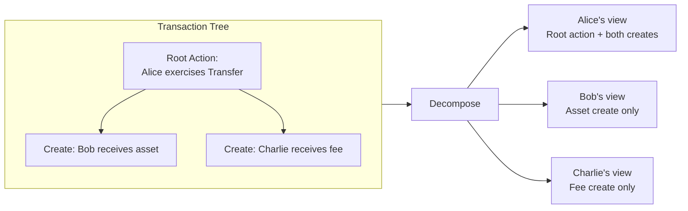

<Warning>
  이 페이지는 팀 리서치를 위한 비공식 한국어 번역입니다. 기술적 판단에는 [공식 영어 원문](https://docs.canton.network/appdev/deep-dives/privacy-model.md)을 사용하세요.
</Warning>

import DamlAppdevDeepDivesPrivacyModelL57 from "/snippets/daml-docs/appdev_deep-dives_privacy-model_L57.mdx";
import DamlAppdevDeepDivesPrivacyModelL74 from "/snippets/daml-docs/appdev_deep-dives_privacy-model_L74.mdx";
import DamlAppdevDeepDivesPrivacyModelL92 from "/snippets/daml-docs/appdev_deep-dives_privacy-model_L92.mdx";

Canton architecture를 특징짓는 핵심 기능은 sub-transaction privacy입니다. 이는 하나의 atomic Transaction을 실행하면서 각 Party가 자신과 관련된 부분만 볼 수 있게 하는 기능입니다. 이 page에서는 작동 방식과 application에서 privacy-aware pattern을 사용하는 방법을 설명합니다.

## Transaction Tree 분해

여러 Party가 관련된 Transaction을 제출할 때 Canton은 전체 Transaction을 모든 Validator에 보내지 않습니다. 대신 Transaction tree를 stakeholder group마다 하나씩 **view**로 분해합니다.

각 view에는 해당 stakeholder group이 이해관계를 갖는 action(create, exercise, fetch)만 포함됩니다. View는 해당 stakeholder를 host하는 Validator만 decrypt할 수 있도록 암호화됩니다.

Bob은 Charlie의 fee를 알 수 없고 Charlie는 Bob의 asset을 알 수 없습니다. Submitter이자 signatory인 Alice는 자신의 action과 그 결과 전체를 봅니다.

## Stakeholder Consensus와 Privacy

Validator는 decrypt할 수 있는 view만 confirm합니다. Alice를 host하는 Validator는 Alice의 view를 confirm하고, Bob을 host하는 Validator는 Bob의 view를 confirm합니다. Synchronizer는 이러한 confirmation을 수집하고 Transaction outcome을 결정합니다.

각 역할이 볼 수 있는 정보는 다음과 같습니다.

- **Validator**는 자신이 host하는 Party의 view만 봅니다. Transaction에 관련된 Party를 하나도 host하지 않는 Validator는 해당 Transaction에 관한 어떤 정보도 받지 않습니다.
- **Synchronizer**는 암호화된 blob, routing metadata(어느 Validator에 전달할지) 및 confirmation result를 봅니다. Transaction content, contract data, view 내부의 Party relationship 또는 amount와 term은 읽을 수 없습니다.
- **Non-stakeholder**는 Transaction payload나 metadata에 관한 어떤 정보도 받지 않습니다. Transaction이 발생했다는 사실도 알 수 없습니다.

## Privacy 보장

Canton은 protocol level에서 다음을 보장합니다.

- Transaction content는 stakeholder(관련 action의 signatory, observer, controller)에게만 보입니다.
- 각 Validator는 자신이 host하는 Party의 data만 저장하며 global state replication은 없습니다.
- Synchronizer는 어떤 Transaction payload도 읽을 수 없습니다.
- View에 대한 권한이 없는 Party는 관련 Party의 identity를 포함하여 그 view에 대해 아무것도 알 수 없습니다.

자신의 Party에 관한 모든 data를 보는 유일한 entity는 해당 Validator입니다. Custodian이나 cloud provider를 선택할 때와 같은 수준의 주의를 기울여 Validator를 선택하세요.

## Privacy Pattern

### 양자 간 합의

Contract에 두 signatory가 있고 observer가 없다면 두 Party만 해당 contract를 볼 수 있습니다. 같은 Validator의 다른 Party를 포함하여 어떤 제3자도 볼 수 없습니다.

<DamlAppdevDeepDivesPrivacyModelL57 />

제3자의 visibility가 필요하지 않은 confidential two-party contract에 이 pattern을 사용합니다.

### Observer Disclosure

추가 Party를 observer로 선언하여 read access를 부여할 수 있습니다. Observer는 contract를 볼 수 있지만 별도로 controller로 선언되지 않은 한 contract의 choice를 exercise할 수 없습니다.

<DamlAppdevDeepDivesPrivacyModelL74 />

Regulator는 loan 및 lifecycle event를 볼 수 있지만 수정할 수는 없습니다. Compliance 또는 audit requirement에 따라 제3자의 visibility가 필요할 때 이 pattern을 사용합니다.

### Divulgence

다른 Party의 Transaction 안에서 contract를 fetch하거나 exercise하면 해당 Party는 fetch된 contract에 대한 visibility를 자동으로 얻습니다. 이를 divulgence라고 합니다.

<DamlAppdevDeepDivesPrivacyModelL92 />

Divulgence는 Transaction 구조의 결과로 자동 발생합니다. 모든 fetch가 visibility를 넓힐 수 있으므로 Transaction 안에서 어느 contract를 fetch할지 신중하게 결정하세요.

### Explicit Contract Disclosure

Canton은 Party가 일반적인 stakeholder model 외부에서 다른 Party와 contract reference를 공유하는 explicit disclosure도 지원합니다. 그러면 receiving Party가 자신의 Transaction에서 해당 contract를 사용할 수 있습니다. Explicit disclosure를 사용하면 contract observer list를 수정하지 않고도 information sharing을 세밀하게 제어할 수 있습니다.

## Privacy와 Auditability

Privacy가 audit capability의 상실을 의미하지는 않습니다. 여러 mechanism이 privacy boundary를 유지하면서 auditability를 지원합니다.

**PQS(Participant Query Store)**는 Validator의 ledger state와 동기화된 PostgreSQL database를 유지합니다. 자신의 Transaction history, contract state 및 archived contract에 SQL query를 실행할 수 있습니다. PQS는 해당 Party가 볼 수 있는 것만 보며 동일한 privacy boundary를 준수합니다.

**Scan**은 Global Synchronizer의 public service로 round information, CC minting 및 aggregate statistic과 같은 network-level data를 공개합니다. Scan은 private contract data를 공개하지 않습니다.

**Auditor-as-observer**는 audit trail이 필요한 contract에 auditor Party를 observer로 추가하는 Daml pattern입니다. Auditor는 contract와 lifecycle을 볼 수 있지만 이에 대해 action을 수행할 수는 없습니다.

핵심 원칙은 각 Party가 볼 권한이 있는 모든 것을 audit할 수 있지만 그 이상은 볼 수 없다는 것입니다.

## 다음 단계

- [Privacy Model 설명](/overview/learn/privacy-model): Protocol level의 sub-transaction privacy 기술 개요
- [Ethereum과의 Privacy 차이](/appdev/modules/m2-privacy-differences): Canton model과 public blockchain의 비교
- [Design Pattern](/appdev/modules/m3-design-patterns): Authorization 및 multi-party workflow pattern
