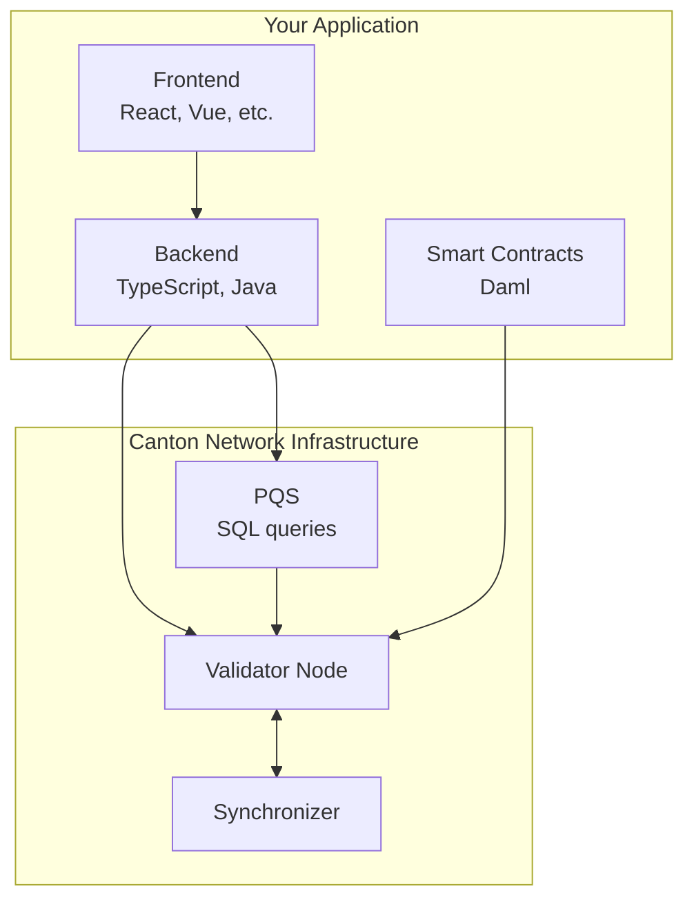

<Warning>
  이 페이지는 팀 리서치를 위한 비공식 한글 번역입니다. 기술적 판단에는 [공식 영어 원문](https://docs.canton.network/appdev/get-started/choose-your-path.md)을 사용하세요.
</Warning>

blockchain을 처음 접하거나 다른 platform에서 migration하는 경우, 이 guide를 사용해 Canton Network에서 개발을 시작하는 가장 효율적인 경로를 찾을 수 있습니다.

## 빠른 평가

<AccordionGroup>

<Accordion title="blockchain 개발이 처음입니다">
**권장 경로:**
1. [5분 개요](/overview/understand/five-minute-overview) - Canton이 무엇인지 이해합니다.
2. [핵심 개념](/overview/understand/core-concepts) - 기본 사항을 학습합니다.
3. [Module 1: Canton 이해하기](/appdev/modules/m1-understanding-canton) - mental model을 구축합니다.
4. [Module 3: Daml Smart Contract](/appdev/modules/m3-dev-environment) - coding을 시작합니다.
5. [Module 4: Application 구축](/appdev/modules/m4-building-apps-intro) - example application을 사용해 실습합니다.
</Accordion>

<Accordion title="Ethereum/Solidity 경험이 있습니다">
**권장 경로:**
1. [Ethereum Developer를 위한 Canton](/appdev/modules/m2-canton-for-ethereum-devs) - 기존 지식을 Canton 개념에 대응시킵니다.
2. [Privacy Model](/overview/learn/privacy-model) - 핵심 차이를 이해합니다.
3. [Module 3: Daml Smart Contract](/appdev/modules/m3-dev-environment) - Daml syntax를 학습합니다.
4. [Module 4: Application 구축](/appdev/modules/m4-building-apps-intro) - full-stack Canton app을 구축하며 실습합니다.

**반드시 이해해야 할 핵심 차이:**
- contract는 immutable입니다. mutate하는 대신 archive하고 새로 생성합니다.
- authorization은 명시적입니다. `msg.sender`가 아니라 signatory/controller를 사용합니다.
- privacy가 기본값입니다. 데이터를 숨기는 대신 observer를 선언합니다.
</Accordion>

<Accordion title="다른 blockchain 경험이 있습니다 (Solana, Cosmos 등)">
**권장 경로:**
1. [5분 개요](/overview/understand/five-minute-overview) - Canton의 접근 방식을 살펴봅니다.
2. [Ethereum Developer를 위한 Canton](/appdev/modules/m2-canton-for-ethereum-devs) - 개념을 대응시킵니다. 다른 blockchain 경험자에게도 유용합니다.
3. [Architecture 개요](/overview/learn/architecture) - component가 작동하는 방식을 이해합니다.
4. [Module 3: Daml Smart Contract](/appdev/modules/m3-dev-environment) - coding을 시작합니다.
</Accordion>

<Accordion title="coding 없이 Canton을 이해하고 싶습니다 (architect/PM)">
**권장 경로:**
1. [5분 개요](/overview/understand/five-minute-overview)
2. [Canton이 해결하는 문제](/overview/understand/the-problem)
3. [Canton의 해결책](/overview/understand/cantons-solution)
4. [Use Case](/overview/understand/use-cases)
5. [Architecture 개요](/overview/learn/architecture)
</Accordion>

</AccordionGroup>

## 학습 Module

developer documentation은 단계적으로 진행되는 Module로 구성되어 있습니다.

| Module | 중점 내용 | 사전 학습 |
|--------|-------|---------------|
| **Module 1** | Canton 이해하기 | 없음 |
| **Module 2** | Ethereum Developer를 위한 Canton | Ethereum/blockchain 경험 |
| **Module 3** | Daml Smart Contract | Module 1 또는 2 |
| **Module 4** | Application 구축 | Module 3 |
| **Module 5** | Test & Deployment | Module 4 |
| **Module 6** | Smart Contract Upgrade | Module 3-5 |
| **Module 7** | Production Best Practice | Module 5 |

## Development Stack 개요

Canton Network 개발에는 다음 component가 포함됩니다.

## 사전 요구 사항

개발을 시작하기 전에 다음 사항을 확인하세요.

### 필수

- 언어와 관계없는 **programming 경험**
- **Command line** 사용 경험
- version control을 위한 **Git**

### 도움이 되는 항목 (필수 아님)

- **functional programming** 개념 (Haskell, OCaml, F# 또는 유사 언어)
- local environment 실행을 위한 **Docker**
- PQS query를 위한 **PostgreSQL**

### 개발 환경

<CardGroup cols={2}>

<Card title="Daml SDK" icon="download" href="/sdks-tools/sdks/daml-sdk">
  Daml compiler와 도구가 포함된 SDK를 설치합니다.
</Card>

<Card title="VS Code Extension" icon="code" href="https://marketplace.visualstudio.com/items?itemName=DigitalAssetHoldingsLLC.daml">
  syntax highlighting과 IDE 지원을 위해 Daml VS Code extension을 설치합니다.
</Card>

</CardGroup>

## 실습

구축을 시작할 준비가 되었나요? [Module 4: Application 구축](/appdev/modules/m4-building-apps-intro)에서는 사전 요구 사항, demo 실행, backend 및 frontend 개발, JSON Ledger API, observability를 포함한 full-stack Canton Network application을 처음부터 끝까지 구축합니다.

## 도움 받기

<CardGroup cols={3}>

<Card title="Community Slack" icon="slack" href="mailto:cf-global-synchronize-aaaapqznpatdmupdm5thaarsly@daholdings.slack.com">
  app developer Slack channel 가입 요청을 email로 보냅니다.
</Card>

<Card title="Forum" icon="comments" href="https://forum.canton.network/">
  기술 토론 및 Q&A
</Card>

<Card title="FAQ" icon="question" href="/appdev/faq">
  자주 묻는 질문과 답변
</Card>

</CardGroup>
