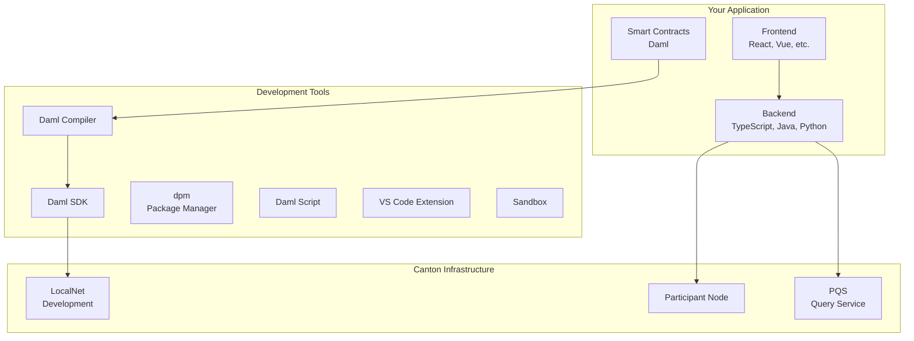
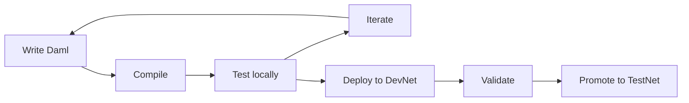

<Warning>
  이 페이지는 팀 리서치를 위한 비공식 한글 번역입니다. 기술적 판단에는 [공식 영어 원문](https://docs.canton.network/appdev/modules/m1-development-stack.md)을 사용하세요.
</Warning>

import DamlAppdevModulesM1DevelopmentStackL56 from "/snippets/daml-docs/appdev_modules_m1-development-stack_L56.mdx";


이 페이지에서는 Canton application을 구축할 때 사용할 development stack을 소개합니다. 이러한 component를 이해하면 전체 요소가 어떻게 맞물리는지 파악하는 데 도움이 됩니다.

## Stack 개요



## Smart Contract Layer

### Daml

Daml은 Canton의 smart contract language로, multi-party workflow를 위해 설계된 functional language입니다.

| 측면 | 세부 정보 |
|--------|---------|
| **Paradigm** | Functional programming |
| **Type system** | inference를 지원하는 strongly typed system |
| **Compile 대상** | Daml-LF (ledger format) |
| **주요 용도** | contract, choice, authorization 정의 |

**예시:**

<DamlAppdevModulesM1DevelopmentStackL56 />

### Daml Compiler

Daml compiler인 `dpm build`는 Daml source code를 Participant Node에 deploy할 수 있는 DAR file인 Daml Archive로 compile합니다.

```bash
# Compile Daml code
dpm build

# Output: .dar file containing compiled contracts
```

## Application Layer

### Backend Integration

backend는 Ledger API를 통해 Canton에 연결됩니다.

| Option | Protocol | 가장 적합한 용도 |
|--------|----------|----------|
| **gRPC API** | gRPC/Protobuf | high-performance, typed integration |
| **JSON API** | HTTP/JSON | 더 간단하고 web 친화적인 integration |

**지원 언어:**
- TypeScript/JavaScript (`dpm codegen-js`로 code generation 사용 가능)
- Java (`dpm codegen-java`로 code generation 사용 가능)
- gRPC 또는 JSON API를 사용할 수 있는 모든 언어

Python, Rust, Go용 community-supported binding도 있습니다.

### Code Generation

Daml code에서 type-safe binding을 생성합니다.

```bash
# Generate TypeScript bindings
dpm codegen-js .dar -o generated

# Generate Java bindings
dpm codegen-java .dar -o generated
```

생성된 code는 다음을 제공합니다.
- type-safe contract representation
- Command submission helper
- event handling utility

### Frontend

어떤 web framework든 사용할 수 있습니다. 일반적인 선택지는 다음과 같습니다.

| Framework | 참고 사항 |
|-----------|-------|
| **React** | Canton ecosystem에서 가장 일반적 |
| **Vue** | 좋은 대안 |
| **Angular** | enterprise에서 선호 |

frontend는 일반적으로 Ledger API communication을 처리하는 backend를 통해 연결됩니다.

## Development Tool

### Daml SDK

Daml SDK는 Canton 개발에 필요한 모든 항목을 묶어 제공합니다.

| Component | 목적 |
|-----------|---------|
| **Daml compiler** | smart contract compile |
| **Daml Script** | contract test 및 interaction |
| **Sandbox** | test용 단일 Canton node 실행 |
| **Canton runtime** | local Participant Node 실행 |
| **Console** | interactive administration |
| **Template** | project scaffolding |

### dpm (Daml Package Manager)

dependency와 build workflow를 관리합니다.

```bash
# Initialize project
dpm init

# Add dependency by editing dam.yaml

# Build
dpm build
```

### VS Code Extension

Daml VS Code extension인 Daml Studio는 다음 기능을 제공합니다.

- syntax highlighting
- type checking
- error diagnostics
- code navigation
- integrated terminal

extension은 DPM과 함께 자동으로 설치됩니다. VS Code 1.87 이상이 필요합니다. Daml Studio를 실행하려면 project directory에서 `dpm studio`를 실행하세요.

## Infrastructure Component

### LocalNet

LocalNet은 개발을 위한 local Global Synchronizer simulation입니다.

```bash
# Start LocalNet (via QuickStart)
make setup
make build
make start

# Or run a single Canton node via Daml SDK
dpm sandbox
```

LocalNet은 다음을 제공합니다.
- local Synchronizer
- local Participant Node
- test Canton Coin
- 외부 dependency 없음

### Participant Node

Participant Node는 Canton runtime을 hosting하는 Validator의 일부이며 다음 작업을 수행합니다.
- Party hosting
- contract data 저장
- Daml logic 실행
- Ledger API 공개

production에서는 Validator의 일부로 실행됩니다.

### PQS (Participant Query Store)

PQS는 복잡한 data access를 위한 SQL 기반 query 기능을 제공합니다.

| Use Case | Ledger API | PQS |
|----------|------------|-----|
| 간단한 query | 좋음 | 좋음 |
| 복잡한 aggregation | 제한적 | 매우 좋음 |
| reporting | 어려움 | 쉬움 |
| real-time update | 매우 좋음 | 매우 좋음 |

PQS는 ledger state와 synchronize된 PostgreSQL database를 유지합니다.

## Development Workflow

### 일반적인 흐름



### 단계

1. business logic을 정의하는 Daml contract를 **작성**합니다
2. `daml build`로 **compile**합니다
3. Daml Script 또는 LocalNet으로 local에서 **test**합니다
4. backend integration을 **구축**합니다
5. integration test를 위해 DevNet에 **deploy**합니다
6. TestNet을 거쳐 MainNet으로 **승격**합니다

## QuickStart Project

[cn-quickstart](https://github.com/digital-asset/cn-quickstart) repository는 build tooling을 포함한 완전한 예시를 제공합니다.

| Component | Technology |
|-----------|------------|
| **Contract** | Daml |
| **Backend** | TypeScript |
| **Frontend** | React |
| **Infrastructure** | Docker Compose LocalNet |

```bash
# Clone and run
git clone https://github.com/digital-asset/cn-quickstart
cd cn-quickstart
direnv allow
cd quickstart
make setup
make build
make start
```

자세한 지침은 Canton Network Quickstart [사전 요구 사항 및 설치](/appdev/quickstart/prerequisites)를 참고하세요.

## 다른 Platform과 Tool 비교

| 목적 | Ethereum | Canton |
|---------|----------|--------|
| **Smart contract** | Solidity | Daml |
| **Build tool** | Hardhat/Foundry | daml build/dpm |
| **IDE** | Remix, VS Code | VS Code + Daml extension |
| **Testing** | Mocha, Foundry tests | Daml Script |
| **Local network** | Hardhat node, Anvil | LocalNet, Canton Sandbox |
| **API** | JSON-RPC | Ledger API (gRPC/JSON) |
| **Indexing** | The Graph | PQS |

## 다음 단계

<CardGroup cols={2}>

<Card title="QuickStart" icon="rocket" href="/appdev/quickstart">
  example application을 실행합니다.
</Card>

<Card title="Module 3: Daml" icon="code" href="/appdev/modules/m3-dev-environment">
  smart contract 작성을 시작합니다.
</Card>

</CardGroup>
