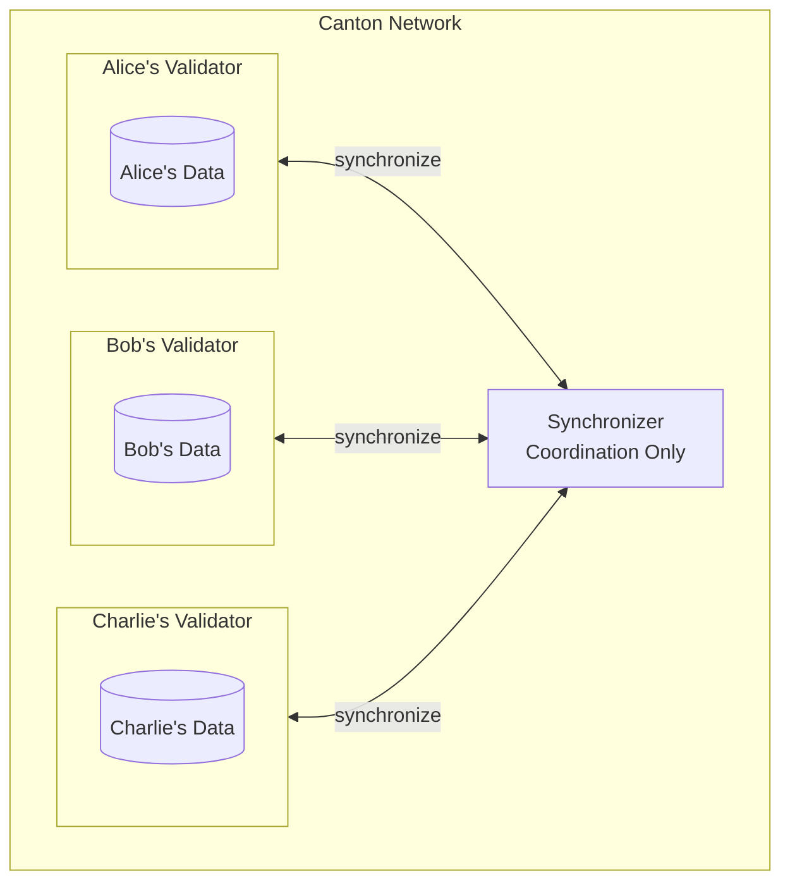
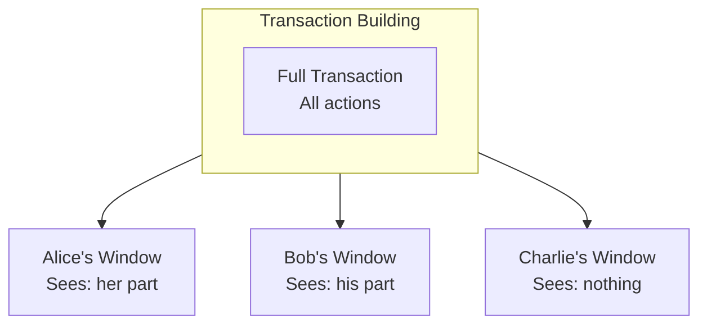
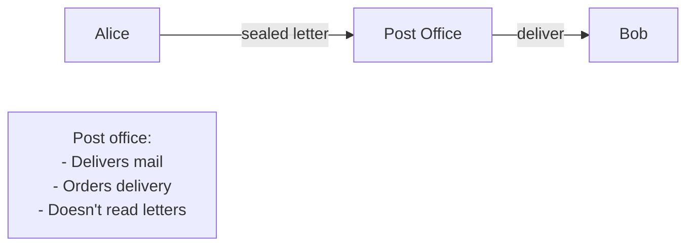
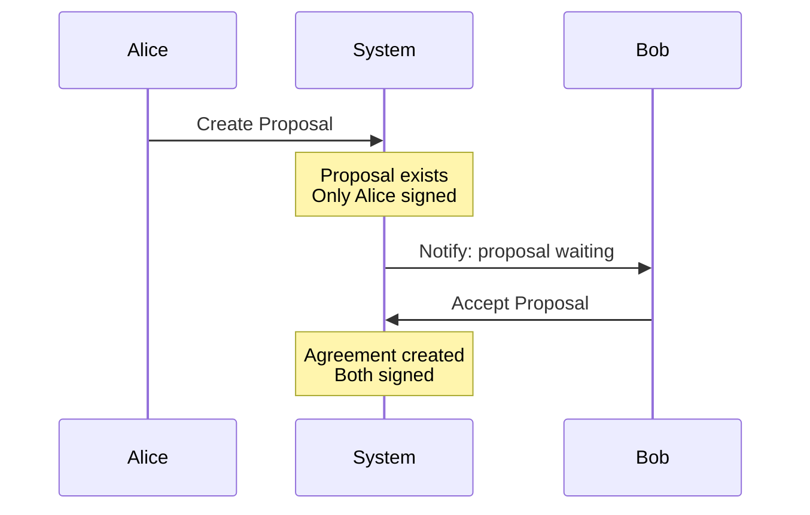

<Warning>
  이 페이지는 팀 리서치를 위한 비공식 한글 번역입니다. 기술적 판단에는 [공식 영어 원문](https://docs.canton.network/appdev/modules/m1-mental-models.md)을 사용하세요.
</Warning>

import DamlAppdevModulesM1MentalModelsL84 from "/snippets/daml-docs/appdev_modules_m1-mental-models_L84.mdx";


효과적인 Canton 개발에는 올바른 mental model이 필요합니다. 이 페이지는 다른 모든 내용을 자연스럽게 이해하는 데 필요한 직관을 구축하도록 돕습니다.

## Private Database Network

Canton을 blockchain이 아니라 서로 synchronize할 수 있는 private blockchain 또는 database의 network라고 생각하세요.

### Model



**핵심 통찰:** 각 Party의 data는 해당 Party의 Validator에 유지됩니다. Alice와 Bob이 transact할 때 Alice와 Bob의 Validator만 참여합니다. Charlie의 data에는 영향이 없으며 Charlie는 해당 Transaction이 일어났다는 사실조차 알지 못합니다.

### 이것이 중요한 이유

- **query 관점:** 자신의 data만 query할 수 있습니다
- **design 관점:** 어떤 data가 어디로 이동하는지 고려해야 합니다
- **privacy 관점:** data는 이를 볼 수 있어야 하는 Party에게만 유지됩니다

## 사실로서의 Contract

contract를 실행되는 code가 아니라 존재하는 **사실**로 생각하세요.

### Model

| 기존 관점 | Canton 관점 |
|------------------|-------------|
| "Contract의 state가 X다" | "사실: Alice는 token 100개를 소유한다" |
| "state를 Y로 update한다" | "기존 사실을 archive하고 새 사실을 생성한다" |
| "주소 Z의 Contract" | "ID로 식별되는 사실이며 archive될 수 있다" |

### 예시

```
Action 1: "Alice creates a contract with 100 tokens" (exists)
Action 2: Alice transfers 30 to Bob
Fact 1: "Alice owns 100 tokens" (archived)
Fact 2: "Alice owns 70 tokens" (created)
Fact 3: "Bob owns 30 tokens" (created)
```

**핵심 통찰:** 사실은 절대 수정하지 않습니다. 기존 사실은 history가 되고 새 사실이 생성됩니다. 이 방식은 immutable audit trail을 제공하고 privacy 보장을 가능하게 합니다.

## 구조로서의 Authorization

authorization을 작성하는 code가 아니라 선언하는 **구조**로 생각하세요.

### 기존 Authorization

```
function doThing() {
  if (msg.sender != owner) revert();
  // do thing
}
```

code는 runtime에 authorization을 확인합니다. 이 확인을 빠뜨리면 누구나 호출할 수 있습니다.

### Canton Authorization

<DamlAppdevModulesM1MentalModelsL84 />

**핵심 통찰:** Authorization은 type system에 선언됩니다. protocol이 이를 강제합니다. 확인할 항목 자체가 없으므로 authorization 확인을 빠뜨릴 수도 없습니다.

## 창으로서의 View

Transaction에는 서로 다른 Party가 들여다보는 **창**인 view가 있다고 생각하세요.

### Model

Transaction을 서로 다른 창이 있는 건물이라고 상상해 보세요.



각 Party는 자신의 창을 통해 자신에게 허용된 내용만 봅니다. 건물인 Transaction은 같지만 view는 서로 다릅니다.

**핵심 통찰:** privacy는 data를 숨기는 일이 아니라 각 Party가 공유된 현실에 대해 자신만의 view를 갖는 것입니다.

## Stakeholder로서의 Party

Party를 "account"가 아니라 특정 role을 가진 **stakeholder**로 생각하세요.

### Role

| Role | 의미 | 비유 |
|------|---------|---------|
| **Signatory** | authorize해야 하며 항상 볼 수 있음 | 법률 문서의 서명자 |
| **Observer** | 볼 수 있지만 행동할 수 없음 | email의 참조 수신자 |
| **Controller** | 특정 action을 실행할 수 있음 | 특정 문을 여는 열쇠를 가진 사람 |

### 예시: Loan Agreement

```
Loan Contract:
- Signatory: Bank (must authorize the loan)
- Signatory: Borrower (must authorize the loan)
- Observer: Auditor (can see the loan)
- Controller for Repay: Borrower (only they can repay)
- Controller for Foreclose: Bank (only they can foreclose)
```

**핵심 통찰:** 각 Party는 contract와 특정한 관계를 맺습니다. 이 관계에 따라 Party가 보고 수행할 수 있는 작업이 결정됩니다.

## 우체국으로서의 Synchronizer

Synchronizer를 blockchain이 아니라 **우체국**으로 생각하세요.

### Model



우체국은 다음 작업을 수행합니다.
- 봉인된 편지인 encrypted message를 받습니다
- 편지의 순서를 정합니다
- 수신자에게 전달합니다
- 편지를 열거나 읽지 않습니다

**핵심 통찰:** Synchronizer는 infrastructure이며 Validator가 아닙니다. 사용자가 무엇인가를 하고 있다는 사실만 알 수 있고 무엇을 하는지는 볼 수 없습니다.

## 제안으로서의 Transaction

multi-party Transaction을 수락이 필요한 **제안**으로 생각하세요.

### Model

Alice가 Bob도 서명해야 하는 contract를 생성하려는 경우는 다음과 같습니다.



**핵심 통찰:** multi-party authorization에는 명시적 동의가 필요합니다. 상대방에게 contract를 강요할 수 없으며 상대방이 수락해야 합니다.

## 모두 종합하기

Canton에서 개발할 때는 다음 model을 기억하세요.

| 상황 | 적용할 Model |
|-----------|-------------|
| data storage design | Private Database Network |
| state change design | Contracts as Facts |
| permission design | Authorization as Structure |
| privacy design | Views as Windows |
| Party design | Parties as Stakeholders |
| infrastructure 이해 | Synchronizer as Post Office |
| workflow design | Transactions as Proposals |

## 흔한 오해

| 오해 | 실제 방식 |
|---------------|---------|
| "Canton은 또 하나의 blockchain일 뿐이다" | 근본적으로 다른 architecture임 |
| "모든 contract를 query할 수 있다" | 자신의 Party data만 query할 수 있음 |
| "Smart contract에는 주소가 있다" | Contract에는 ID가 있으며 archive/create 시 변경됨 |
| "Validator는 모든 것을 본다" | Validator는 자신이 hosting하는 Party의 data만 봄 |
| "Synchronizer가 내 data를 저장한다" | Synchronizer는 아무것도 저장하지 않음 |

## 다음 단계

<CardGroup cols={2}>

<Card title="Development Stack" icon="layer-group" href="/appdev/modules/m1-development-stack">
  사용할 tool을 이해합니다.
</Card>

<Card title="Architecture 개요" icon="diagram-project" href="/overview/learn/architecture">
  component가 기술적으로 함께 작동하는 방식을 살펴봅니다.
</Card>

</CardGroup>
