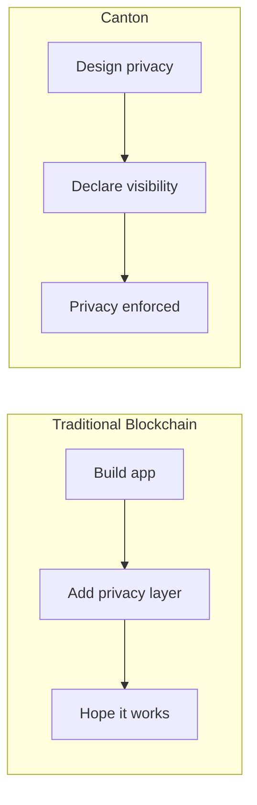

<Warning>
  이 페이지는 팀 리서치를 위한 비공식 한글 번역입니다. 기술적 판단에는 [공식 영어 원문](https://docs.canton.network/appdev/modules/m1-understanding-canton.md)을 사용하세요.
</Warning>

이 module은 Canton code를 작성하기 전에 필요한 개념적 토대를 제공합니다. 바로 coding을 시작하고 싶더라도 시간을 들여 이러한 개념을 이해하면 더 효과적으로 개발할 수 있습니다.

## Module 개요

| Section | 목적 |
|---------|---------|
| **Mental Model** | Canton이 작동하는 방식에 대한 직관 구축 |
| **Development Stack** | tool과 technology 이해 |
| **Canton의 차이점** | Canton을 고유하게 만드는 특성 파악 |

## 이 Module이 중요한 이유

Canton은 syntax만 다른 또 하나의 blockchain이 아닙니다. Canton은 distributed ledger에 대한 근본적으로 다른 접근 방식을 제시합니다.

- **privacy는 native**이며 나중에 덧붙이는 기능이 아닙니다
- **consensus는 targeted**이며 global이 아닙니다
- **state는 distributed**되며 replicated되지 않습니다
- **authorization은 declared**되며 code로 작성하지 않습니다

이러한 원칙을 미리 이해하면 나중에 architecture에 역행하며 씨름하는 일을 피할 수 있습니다.

## 핵심 통찰

### Privacy 우선

대부분의 blockchain에서는 application을 구축한 다음 privacy를 추가하려고 합니다. Canton에서는 privacy를 출발점으로 삼고 무엇을 누구에게 공개할지 선택합니다.

### Global State 없음

모든 정보를 조회할 수 있는 하나의 "blockchain"은 없습니다. 각 Party는 자신만의 ledger view를 갖습니다.

| 기존 관점 | Canton의 실제 방식 |
|------------------|----------------|
| "blockchain 조회" | *자신의* Validator에서 *자신의* data 조회 |
| "총공급량" | application이 API를 통해 공개하는 경우에만 볼 수 있음 |
| "모든 transaction" | *자신의* transaction만 볼 수 있음 |

### 모든 것이 Immutable

contract는 변경되지 않습니다. contract를 "update"할 때는 기존 contract를 archive하고 새 contract를 생성합니다. 이는 제약이 아니라 privacy와 integrity 보장의 토대입니다.

### 명시적 Authorization

각 Party가 수행할 수 있는 작업을 compile time에 선언하면 protocol이 이를 강제합니다. runtime에 caller identity를 확인하는 기존 system과 달리 Canton의 authorization은 구조적입니다.

## 선수 지식 확인

계속하기 전에 다음 조건을 충족해야 합니다.

- Canton이 무엇인지 **이해**해야 합니다. ([5분 개요](/overview/understand/five-minute-overview))
- 기본 component를 **알아야** 합니다. ([핵심 개념](/overview/understand/core-concepts))
- 언어에 관계없이 programming 경험이 **있어야** 합니다.

blockchain 경험은 필요하지 않습니다. 경험이 있다면 일부 지식을 버리고 새로 배울 준비를 하세요.

## 학습 내용

이 module을 마치면 다음을 이해하게 됩니다.

1. Canton의 privacy model을 바라보는 방법
2. Party, Validator, Synchronizer 간 관계
3. system에서 Transaction이 흐르는 방식
4. 개발에 사용할 tool

## 학습 경로

<CardGroup cols={2}>

<Card title="Mental Model" icon="brain" href="/appdev/modules/m1-mental-models">
  distributed ledger에 대한 Canton의 접근 방식에 관한 직관을 구축합니다.
</Card>

<Card title="Development Stack" icon="wrench" href="/appdev/modules/m1-development-stack">
  사용할 tool과 technology를 이해합니다.
</Card>

</CardGroup>

이 module을 완료한 후 다음 단계로 진행하세요.
- Ethereum/blockchain 경험이 있는 경우 **[Module 2](/appdev/modules/m2-canton-for-ethereum-devs)**
- Daml 작성을 시작할 준비가 된 경우 **[학습 경로 선택하기](/appdev/get-started/choose-your-path)**
