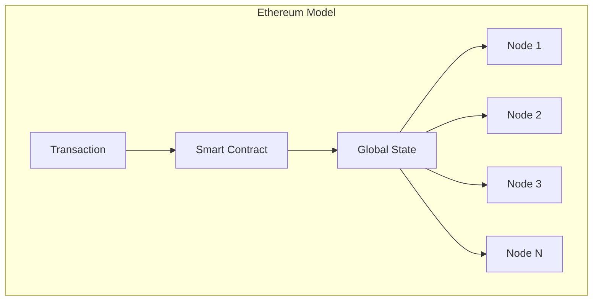
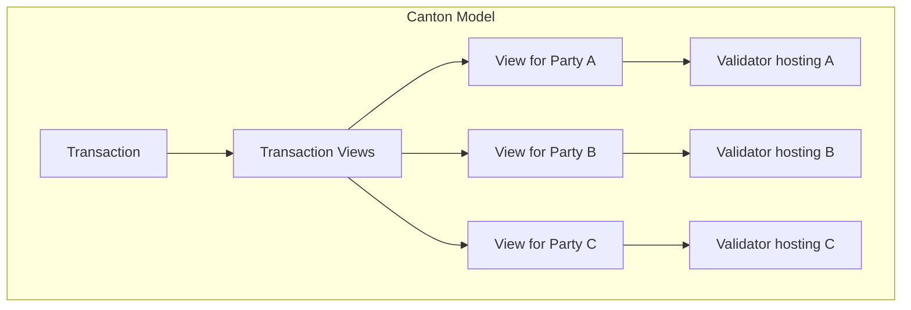
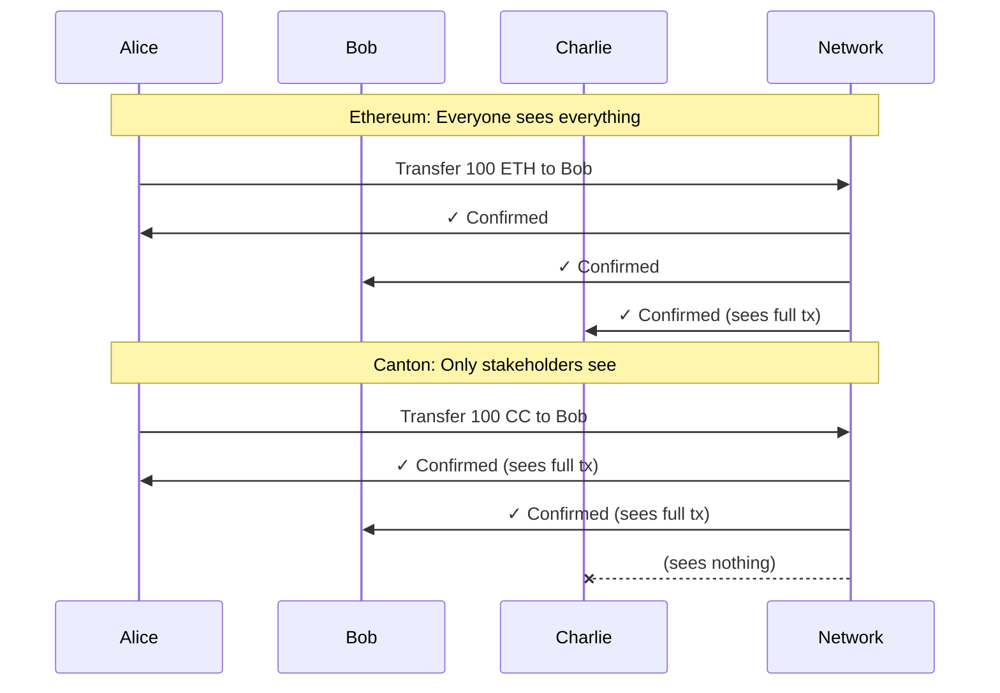

<Warning>
  이 페이지는 팀 리서치를 위한 비공식 한글 번역입니다. 기술적 판단에는 [공식 영어 원문](https://docs.canton.network/appdev/modules/m2-canton-for-ethereum-devs.md)을 사용하세요.
</Warning>

import DamlAppdevModulesM2CantonForEthereumDevsL159 from "/snippets/daml-docs/appdev_modules_m2-canton-for-ethereum-devs_L159.mdx";
import DamlAppdevModulesM2CantonForEthereumDevsL184 from "/snippets/daml-docs/appdev_modules_m2-canton-for-ethereum-devs_L184.mdx";
import DamlAppdevModulesM2CantonForEthereumDevsL236 from "/snippets/daml-docs/appdev_modules_m2-canton-for-ethereum-devs_L236.mdx";
import DamlAppdevModulesM2CantonForEthereumDevsL73 from "/snippets/daml-docs/appdev_modules_m2-canton-for-ethereum-devs_L73.mdx";


Ethereum, Solana 또는 다른 blockchain platform 경험이 있다면 Canton은 익숙하면서도 근본적으로 다르게 느껴질 것입니다. 이 section에서는 익숙한 개념을 Canton의 대응 개념에 연결하고 mental model을 바꿔야 하는 부분을 강조합니다.

## 핵심 개념 매핑

다음 표는 익숙한 Ethereum 개념을 Canton의 대응 개념에 매핑합니다.

| Ethereum 개념 | Canton 대응 개념 | Canton 참고 사항 |
|-----------------|-------------------|--------------|
| Blockchain | Synchronizer | state를 저장하지 않고 consensus를 조정 |
| Smart Contract | Template | data schema와 실행 가능한 choice 정의 |
| Contract Instance | Contract | immutable하며 state change 시 새 contract 생성 |
| Function | Choice | contract를 archive하거나 생성하는 action |
| EOA (Address) | Party | 명시적 permission을 가진 cryptographic identity |
| Transaction | Transaction | 권한이 있는 Party만 관련 view를 볼 수 있음 |
| Global State | Distributed State | global state가 없으며 각 node는 자신의 Party data를 저장 |
| Node | Validator (Participant) | hosting하는 Party의 data만 저장 |
| Gas | Traffic | Canton Coin으로 지불하는 network usage fee |

## Mental Model 전환

**Ethereum에서는:** global state를 변경하는 code를 작성합니다. 모든 사람이 모든 것을 봅니다. contract는 누구나 호출할 수 있는 주소에 존재합니다.

**Canton에서는:** 어떤 data가 존재하고 어떤 action이 가능한지 정의하는 template을 작성합니다. contract는 생성되고 archive되며 절대 변경되지 않습니다. 관련 Party만 data를 봅니다. authorization은 model에 내장되며 나중에 덧붙이는 기능이 아닙니다.





## Smart Contract Paradigm: Template과 Solidity

Solidity에서는 mutable state와 해당 state를 변경하는 function으로 contract를 정의합니다.

```solidity
// Solidity: Mutable state
contract Token {
    mapping(address => uint256) public balances;

    function transfer(address to, uint256 amount) public {
        balances[msg.sender] -= amount;
        balances[to] += amount;
    }
}
```

Canton의 smart contract language인 Daml에서는 immutable contract와 기존 contract를 archive하고 새 contract를 생성하는 choice로 template을 정의합니다.

<DamlAppdevModulesM2CantonForEthereumDevsL73 />

### 핵심 차이점

다음은 Solidity와 Daml programming model의 근본적인 차이입니다.

| 측면 | Solidity | Daml |
|--------|----------|------|
| **State model** | mutable storage variable | immutable contract, 변경 시 새 contract 생성 |
| **Authorization** | runtime `msg.sender` 확인 | compile-time `signatory`/`controller` 선언 |
| **기본 visibility** | 기본적으로 public | 기본적으로 private, 명시적 `observer` 선언 |
| **실행 제어** | 누구나 public function 호출 가능 | 선언된 Controller만 choice exercise 가능 |

Daml의 `Transfer` choice는 기존 contract를 변경하지 않습니다. 현재 contract를 **archive**하고 새 owner가 포함된 새 contract를 **생성**합니다. 이러한 immutability는 Canton의 privacy와 integrity 보장의 근간입니다.

## Privacy Model 차이

**Ethereum 기본값:** 모든 것이 public입니다.

**Canton 기본값:** 모든 것이 private입니다. visibility는 명시적으로 선언해야 합니다.



## Data 읽기: Global RPC 없음

Ethereum에서는 모든 node가 어떤 state에 관한 query에도 응답할 수 있습니다. Canton에서는 **원하는 data를 소유한 Party를 hosting하는 Validator에 연결해야 합니다.**

<Note>
모든 data를 가져올 수 있는 단일 blockchain RPC endpoint는 없습니다. 대신 자신의 Party data에는 자신의 Validator의 Ledger API를 사용하고, application provider의 data에는 필요에 따라 해당 provider의 API를 사용합니다.
</Note>

이는 privacy의 직접적인 결과입니다. Charlie가 on-ledger에서 Alice의 data를 볼 수 없다면 Charlie의 node에는 query할 Alice의 data가 없습니다.

## Authorization Model

Canton의 authorization은 Ethereum과 근본적으로 다르게 작동합니다.

| Ethereum | Canton |
|----------|--------|
| `msg.sender`가 authorization 결정 | `signatory`와 `controller`가 authorization 결정 |
| 누구나 public function 호출 가능 | 지정된 Party만 choice exercise 가능 |
| authorization은 runtime check | authorization은 compile-time 보장이며 runtime에 다시 확인 |

Canton authorization model은 세 가지 핵심 role을 사용합니다.

- **Signatory**: contract 생성을 authorize해야 하는 Party입니다. Signatory는 항상 contract를 볼 수 있으며 Controller로도 선언되었다면 choice를 exercise할 수 있습니다.
- **Observer**: contract를 볼 수 있지만 Controller로도 선언되지 않는 한 choice를 exercise할 수 없는 Party입니다.
- **Controller**: contract의 특정 choice를 실행할 수 있는 Party입니다. Controller는 exercise할 때 contract를 볼 수 있습니다.

### Authorization 예시

<DamlAppdevModulesM2CantonForEthereumDevsL159 />

이 template에서 다음이 적용됩니다.
- `issuer`는 contract 생성을 위해 서명해야 합니다. (Signatory)
- `owner`와 `auditor`는 contract를 볼 수 있습니다. (Observer)
- `owner`만 `Transfer` choice를 exercise할 수 있습니다. (Controller)

`controller` 선언은 choice별로 이루어집니다. 하나의 template에 서로 다른 Controller를 가진 여러 choice가 있을 수 있습니다.

<DamlAppdevModulesM2CantonForEthereumDevsL184 />

## Developer Tooling 비교

Canton에는 대부분의 Ethereum development workflow에 대응하는 tooling이 있습니다.

| Ethereum Tool | Canton 대응 항목 | 참고 사항 |
|--------------|-------------------|-------|
| Solidity | Daml | functional paradigm과 imperative paradigm의 차이 |
| Hardhat / Foundry | Daml SDK + dpm | build, test, deploy toolchain |
| Remix | VS Code + Daml Extension | language support를 제공하는 IDE |
| MetaMask | Wallet SDK | user wallet integration |
| Web3.js / ethers.js | Ledger API (gRPC/JSON) | application integration |
| ERC standard | CIP | [CIP-0056](https://github.com/canton-foundation/cips/blob/main/cip-0056/cip-0056.md) (token), [CIP-0103](https://github.com/canton-foundation/cips/blob/main/cip-0103/cip-0103.md) (dApp standard) |

## Multi-Party Workflow

Canton은 multi-party coordination을 핵심 관심사로 다룹니다. Ethereum에서는 수동 coordination pattern이 필요하지만 Canton에서는 language에 내장되어 있습니다.

### Ethereum 접근 방식: 수동 Multi-Sig

```solidity
// Solidity: Manual signature collection
contract MultiSig {
    mapping(address => bool) public approved;
    uint256 public approvalCount;

    function approve() public {
        require(!approved[msg.sender], "Already approved");
        approved[msg.sender] = true;
        approvalCount++;
    }

    function execute() public {
        require(approvalCount >= 2, "Need 2 approvals");
        // ... execute action
    }
}
```

### Canton 접근 방식: 내장 Multi-Party

<DamlAppdevModulesM2CantonForEthereumDevsL236 />

Daml version은 protocol level에서 강제됩니다. 두 signature 없이는 contract를 생성할 수 없으며 두 Party 모두 없이는 `Execute`를 exercise할 수 없습니다.

<Note>
Canton의 multi-party authorization은 서로 다른 Validator에서 hosting될 수 있는 Party의 signature를 수집해야 합니다. 일반적으로 한 Party가 action을 제안하고 다른 Party가 수락하는 workflow pattern이 사용됩니다. multi-party workflow 구현의 자세한 pattern은 developer module을 참고하세요.
</Note>

## 버려야 할 기존 습관

Ethereum 경험이 있다면 다음 습관을 바꿔야 합니다.

| Ethereum 습관 | Canton의 실제 방식 |
|----------------|----------------|
| **어떤 node에서든 모든 state query** | 관련 Party를 hosting하는 Validator에서 query |
| **contract storage 변경** | state change 시 새 contract 생성, 기존 contract archive |
| **msg.sender를 통한 암묵적 authorization** | Signatory와 Controller의 명시적 선언 |
| **기본적으로 public** | 기본적으로 private, visibility를 위해 Observer를 명시적으로 추가 |
| **서로 바꿔 쓸 수 있는 node** | Validator는 hosting하는 Party의 state를 저장 |

### 네 가지 Mental Model 전환

1. **global state query 없음:** network 전체의 "모든 token"을 query할 수 없습니다
2. **immutable contract:** state change 시 새 contract가 생성되고 기존 contract는 archive됩니다
3. **명시적 authorization:** 모든 action에는 명시적인 Signatory/Controller 선언이 필요합니다
4. **기본적으로 privacy 적용:** visibility를 opt-out하는 것이 아니라 opt-in해야 합니다

## 흔한 실수

<Warning>
다음은 blockchain developer가 Canton에서 처음 개발할 때 가장 흔히 저지르는 실수입니다.
</Warning>

| 실수 | 발생 이유 | 방지 방법 |
|--------|---------------|--------------|
| **public state lookup 구축** | Ethereum 방식의 global query 예상 | 처음부터 Party 범위 query에 맞게 design |
| **multi-party authorization 누락** | Ethereum의 permissionless model | 누가 서명해야 하는지, 누가 행동할 수 있는지 항상 고려 |
| **contract 변경 시도** | Solidity의 mutable storage model | create/archive pattern 채택 |
| **너무 많은 Party design** | Ethereum address는 무료 | 각 Party는 storage overhead 발생, Party structure를 신중하게 design |

## 다음 단계

- **[Architecture 개요](/overview/learn/architecture)** - Canton component model 자세히 살펴보기
- **[Privacy Model 설명](/overview/learn/privacy-model)** - sub-transaction privacy 이해하기
- **[Developer Track Module 3: Daml 개발](/appdev/modules/m3-dev-environment)** - Daml code 작성 시작하기
