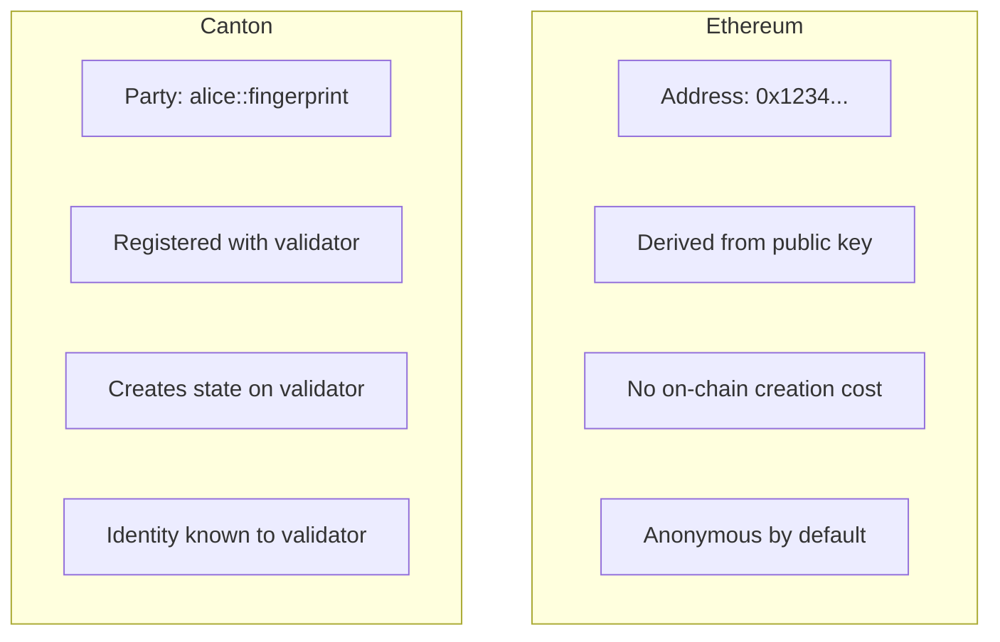

<Warning>
  이 페이지는 팀 리서치를 위한 비공식 한글 번역입니다. 기술적 판단에는 [공식 영어 원문](https://docs.canton.network/appdev/modules/m2-concept-translation.md)을 사용하세요.
</Warning>

import DamlAppdevModulesM2ConceptTranslationL144 from "/snippets/daml-docs/appdev_modules_m2-concept-translation_L144.mdx";
import DamlAppdevModulesM2ConceptTranslationL79 from "/snippets/daml-docs/appdev_modules_m2-concept-translation_L79.mdx";


이 reference는 Ethereum 개념을 Canton의 대응 개념으로 자세히 변환해 보여 줍니다. 익숙한 용어를 접하고 Canton의 대응 개념을 이해해야 할 때 빠른 reference로 활용하세요.

## 핵심 Protocol 개념

| Ethereum | Canton | 핵심 차이점 |
|----------|--------|-----------------|
| **Blockchain** | Synchronizer | Canton Synchronizer는 state를 저장하지 않고 coordination 수행 |
| **Block** | 직접 대응하는 개념 없음 | Transaction은 개별적으로 정렬되며 Participant는 관련 view만 수신 |
| **Node** | Validator / Participant | hosting하는 Party의 data만 저장 |
| **Global state** | Distributed state | global view가 없으며 각 Party가 자신만의 view 보유 |
| **Finality** | Confirmation | confirmation 후 deterministic finality |
| **Reorg** | 해당 없음 | Canton에는 chain reorganization이 없음 |

## Identity와 Account

| Ethereum | Canton | 핵심 차이점 |
|----------|--------|-----------------|
| **EOA (Address)** | Party | Party에는 명시적인 authorization semantic이 있음 |
| **Private key** | Party key | local에서 Validator가 보유하거나 external로 관리 가능 |
| **msg.sender** | Controller | runtime이 아니라 compile-time에 선언 |
| **Contract address** | Contract ID | deployer에서 파생되지 않는 unique identifier |
| **ENS name** | Canton Name Service (CNS) | 사람이 읽을 수 있는 Party identifier |

### Party와 Address 자세히 비교



**영향:**
- Ethereum address와 달리 Party를 불필요하게 생성하지 마세요
- Party 생성에는 Validator와의 interaction이 필요합니다
- Party는 Ethereum address와 같은 방식으로 pseudonymous하지 않습니다

## Smart Contract 개념

| Ethereum | Canton | 핵심 차이점 |
|----------|--------|-----------------|
| **Smart contract** | Template | Daml은 type과 choice를 정의 |
| **Contract instance** | Contract | immutable하며 state change 시 새 contract 생성 |
| **Function** | Choice | Choice는 typed되고 authorized됨 |
| **Constructor** | `create` | template에서 contract 생성 |
| **Storage variable** | Contract field | contract instance 내에서 immutable |
| **ABI** | Daml type | type-safe interface definition |

### State Model 비교

**Ethereum: Mutable State**
```solidity
contract Token {
    mapping(address => uint256) balances;

    function transfer(address to, uint256 amount) public {
        balances[msg.sender] -= amount;  // Mutate in place
        balances[to] += amount;
    }
}
```

**Canton: Immutable Contracts**
<DamlAppdevModulesM2ConceptTranslationL79 />

| 측면 | Ethereum | Canton |
|--------|----------|--------|
| **Modification** | storage variable update | 기존 contract archive, 새 contract 생성 |
| **History** | state transition에 암묵적으로 포함 | contract lifecycle에 명시적으로 포함 |
| **Atomicity** | Transaction 단위 | Transaction 단위 |
| **Rollback** | state change revert | protocol의 일부로 숨겨짐 |

## Transaction 개념

| Ethereum | Canton | 핵심 차이점 |
|----------|--------|-----------------|
| **Transaction** | Transaction / Command | Canton Transaction은 privacy-preserving |
| **Transaction hash** | Transaction ID | unique identifier |
| **Gas** | Traffic | Canton Coin으로 지불 |
| **Gas price** | Traffic cost | Transaction size와 complexity에 기반 |
| **Nonce** | 불필요 | Canton이 ordering 처리 |
| **Receipt** | Completion | Command 실행 confirmation |

### Transaction Visibility

| Ethereum | Canton |
|----------|--------|
| 모든 node가 Transaction을 볼 수 있음 | Transaction이 view로 분할됨 |
| 모든 사람이 sender, recipient, data를 봄 | 각 Party는 자신의 view만 봄 |
| public mempool | encrypted submission |
| block explorer가 모든 것을 표시 | block explorer가 자신의 Transaction만 표시 |

## Authorization 개념

| Ethereum | Canton | 핵심 차이점 |
|----------|--------|-----------------|
| **msg.sender** | Controller | compile-time check와 runtime check의 차이 |
| **require()** | Signatory/Controller 선언 | protocol이 강제 |
| **Ownable** | Signatory pattern | language에 내장 |
| **Access control** | Observer/Controller 선언 | 명시적 visibility control |
| **Multi-sig** | 여러 Signatory | native multi-party 지원 |

### Authorization 예시

**Ethereum: Runtime Check**
```solidity
function transfer(address to, uint256 amount) public {
    require(msg.sender == owner, "Not authorized");
    // ... transfer logic
}
```

**Canton: Compile-Time Declaration**
<DamlAppdevModulesM2ConceptTranslationL144 />

## Event와 Data 개념

| Ethereum | Canton | 핵심 차이점 |
|----------|--------|-----------------|
| **Event** | Transaction tree | action의 structured record |
| **emit** | Transaction에 암묵적으로 포함 | 모든 create/archive가 기록됨 |
| **Indexed parameter** | Contract field | Ledger API/PQS로 query 가능 |
| **Log** | Active Contract Set (ACS) | 현재 state query 가능 |
| **eth_getLogs** | GetTransactionTrees | historical Transaction data |

## Network 개념

| Ethereum | Canton | 핵심 차이점 |
|----------|--------|-----------------|
| **MainNet** | Canton Network MainNet | 실제 가치가 있는 production 환경 |
| **Testnet (Sepolia)** | DevNet / TestNet | test environment |
| **Local (Hardhat/Anvil)** | LocalNet | development environment |
| **RPC endpoint** | Ledger API | gRPC 또는 JSON interface |
| **Infura/Alchemy** | Validator service | hosted infrastructure |
| **Chain ID** | Synchronizer ID | network identifier |

### Environment 비교

| Environment | Ethereum | Canton |
|-------------|----------|--------|
| **Local development** | Hardhat, Anvil, Ganache | LocalNet (Daml SDK) |
| **Shared testing** | Sepolia, Goerli | DevNet (sponsorship 필요) |
| **Pre-production** | Sepolia | TestNet (approval 필요) |
| **Production** | MainNet | MainNet (전체 onboarding 필요) |

## Development Tooling

| Ethereum | Canton | 참고 사항 |
|----------|--------|-------|
| **Solidity** | Daml | 서로 다른 paradigm: functional과 imperative |
| **Hardhat/Foundry** | dpm + daml build | build 및 test toolchain |
| **Remix** | VS Code + Daml extension | IDE support |
| **ethers.js/web3.js** | Ledger API (gRPC/JSON) | application integration |
| **MetaMask** | Wallet SDK | user wallet integration |
| **Etherscan** | Scan API | network exploration |
| **The Graph** | PQS | indexed data query |

## 일반적인 Pattern

| Ethereum Pattern | Canton 대응 항목 |
|------------------|-------------------|
| **ERC-20** | Token Standard ([CIP-0056](https://github.com/canton-foundation/cips/blob/main/cip-0056/cip-0056.md)) |
| **ERC-721/ERC-1155** | dApp Standard ([CIP-0103](https://github.com/mjuchli-da/cips/blob/cip-dapp-standard/cip-0103/cip-0103.md)) |
| **Proxy pattern** | Smart Contract Upgrade (SCU) |
| **Factory pattern** | Template instantiation |
| **Pull payment** | Propose/accept pattern |
| **Access control list** | Observer list |
| **Pausable** | Contract lifecycle choice |
| **Reentrancy guard** | 불필요함 (sequential execution) |

## 직접 대응하지 않는 개념

일부 Ethereum 개념은 Canton에 직접 대응하지 않습니다.

| Ethereum | Canton의 실제 방식 |
|----------|----------------|
| **기본적으로 public** | 기본적으로 private |
| **어떤 node에서든 모든 state query 가능** | 자신의 Party data만 query |
| **anonymous participation** | Party에 identity가 있음 |
| **permissionless contract deployment** | Validator가 package vetting 수행 |
| **Flash loan** | 서로 다른 execution model |
| **MEV/front-running** | Transaction이 encrypted됨 |

## 다음 단계

<CardGroup cols={2}>

<Card title="Privacy 차이" icon="lock" href="/appdev/modules/m2-privacy-differences">
  Canton과 Ethereum의 privacy model을 자세히 살펴봅니다.
</Card>

<Card title="Smart Contract Paradigm" icon="code" href="/appdev/modules/m2-smart-contract-paradigm">
  Daml과 Solidity programming model을 이해합니다.
</Card>

</CardGroup>
