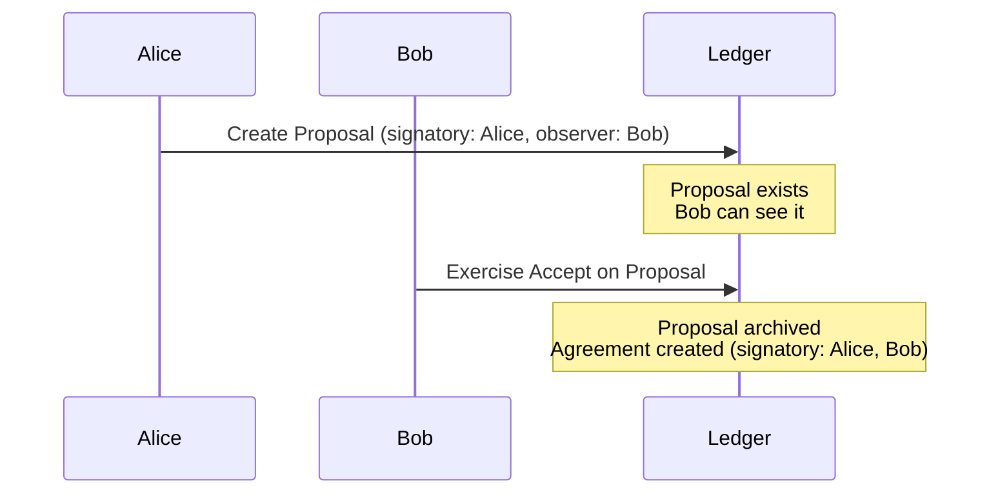
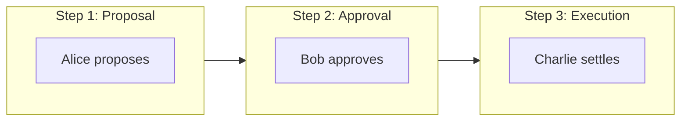
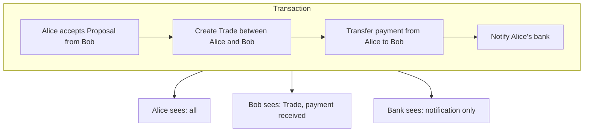

<Warning>
  이 페이지는 팀 리서치를 위한 비공식 한글 번역입니다. 기술적 판단에는 [공식 영어 원문](https://docs.canton.network/appdev/modules/m2-multi-party-workflows.md)을 사용하세요.
</Warning>

import DamlAppdevModulesM2MultiPartyWorkflowsL106 from "/snippets/daml-docs/appdev_modules_m2-multi-party-workflows_L106.mdx";
import DamlAppdevModulesM2MultiPartyWorkflowsL131 from "/snippets/daml-docs/appdev_modules_m2-multi-party-workflows_L131.mdx";
import DamlAppdevModulesM2MultiPartyWorkflowsL174 from "/snippets/daml-docs/appdev_modules_m2-multi-party-workflows_L174.mdx";
import DamlAppdevModulesM2MultiPartyWorkflowsL208 from "/snippets/daml-docs/appdev_modules_m2-multi-party-workflows_L208.mdx";
import DamlAppdevModulesM2MultiPartyWorkflowsL260 from "/snippets/daml-docs/appdev_modules_m2-multi-party-workflows_L260.mdx";
import DamlAppdevModulesM2MultiPartyWorkflowsL37 from "/snippets/daml-docs/appdev_modules_m2-multi-party-workflows_L37.mdx";


multi-party workflow는 Ethereum과 비교할 때 Canton architecture의 강점이 가장 잘 드러나는 부분입니다. 이 페이지에서는 핵심 pattern과 이를 다르게 바라보는 방법을 설명합니다.

## 핵심 차이

Ethereum에서 multi-party agreement는 **직접 구현하는 pattern**입니다. Canton에서는 **protocol이 보장하는 특성**입니다.

| 측면 | Ethereum | Canton |
|--------|----------|--------|
| **Multi-sig 생성** | contract를 deploy하고 시간에 걸쳐 signature 수집 | 시간에 걸쳐 signature를 수집하거나 한 번에 모두 제출 |
| **Authorization** | runtime mapping check | protocol-level enforcement |
| **Atomicity** | 수동 state machine | 내장된 all-or-nothing 처리 |
| **Visibility** | 모든 Party가 모든 것을 봄 | 각 Party가 자신의 view만 봄 |

## Propose-Accept Pattern

Canton은 모든 Signatory가 contract 생성을 authorize하도록 요구하므로 multi-party contract를 일방적으로 생성할 수 없습니다. 표준 pattern은 **propose-accept**입니다.



### Daml에서 구현

<DamlAppdevModulesM2MultiPartyWorkflowsL37 />

### Ethereum과 비교

```solidity
// Ethereum: Manual approval tracking
contract TradeEscrow {
    address public buyer;
    address public seller;
    bool public buyerApproved;
    bool public sellerApproved;

    function approve() public {
        if (msg.sender == buyer) buyerApproved = true;
        if (msg.sender == seller) sellerApproved = true;
    }

    function execute() public {
        require(buyerApproved && sellerApproved, "Not approved");
        // Execute trade...
    }
}
```

Canton version은 다음과 같습니다.
- authorization이 application-level check가 아니라 protocol에 의해 강제됩니다
- state transition이 atomic하므로 partial state나 inconsistent state가 발생하지 않습니다
- visibility 범위가 관련 Party로 자동 제한됩니다

## Delegation Pattern

Canton은 한 Party가 다른 Party에게 자신을 대신해 행동할 권한을 부여하는 정교한 delegation을 지원합니다.

### Controller Delegation

<DamlAppdevModulesM2MultiPartyWorkflowsL106 />

### 별도 Contract를 통한 Delegation

<DamlAppdevModulesM2MultiPartyWorkflowsL131 />

## Multi-Step Workflow

여러 Party가 차례로 참여해야 하는 workflow는 다음과 같습니다.



### Workflow State Machine

<DamlAppdevModulesM2MultiPartyWorkflowsL174 />

## Atomic Multi-Contract Operation

Canton은 하나의 Transaction에서 여러 contract를 atomically update할 수 있습니다.

<DamlAppdevModulesM2MultiPartyWorkflowsL208 />

### 이것이 중요한 이유

Ethereum에서 atomic swap에는 다음이 필요합니다.
- escrow contract
- time-locked phase
- failure recovery logic
- 세심한 reentrancy protection

Canton에서는 atomicity를 **protocol이 보장**합니다. 일부라도 실패하면 아무 일도 일어나지 않습니다.

## Multi-Party Workflow의 Privacy

각 Party는 자신과 관련된 부분만 봅니다.



## 일반적인 Workflow Pattern

| Pattern | Use Case | 핵심 특성 |
|---------|----------|-------------|
| **Propose-Accept** | two-party agreement | 단순하고 명확한 동의 |
| **Propose-Accept-Settle** | three-party workflow | sequential authorization |
| **Delegation** | 대리 행동 | 통제된 authority transfer |
| **Escrow** | conditional execution | atomic swap 보장 |
| **Voting** | group decision | threshold 기반 approval |

### Voting 예시

<DamlAppdevModulesM2MultiPartyWorkflowsL260 />

## 관련 주제

<CardGroup cols={2}>

<Card title="Migration Checklist" icon="list-check" href="/appdev/modules/m2-migration-checklist">
  Ethereum에서 migration하기 위한 실용적인 checklist입니다.
</Card>

<Card title="Module 3: Daml" icon="code" href="/appdev/modules/m3-dev-environment">
  Daml smart contract 작성을 시작합니다.
</Card>

</CardGroup>
