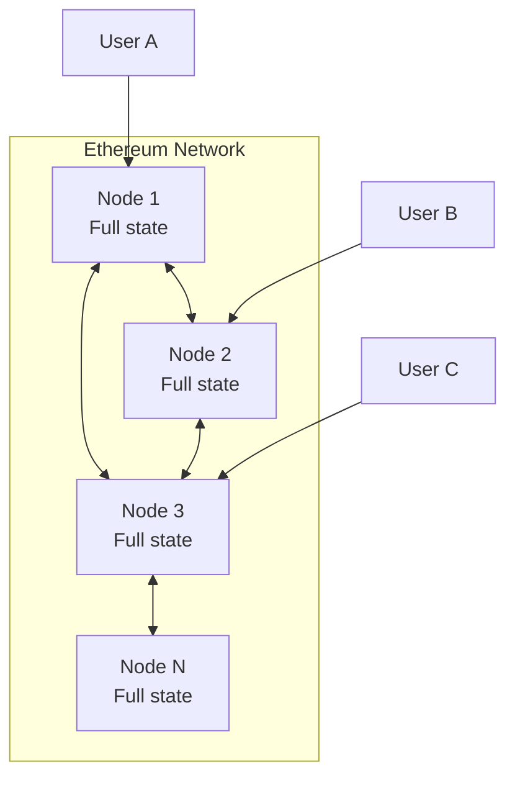
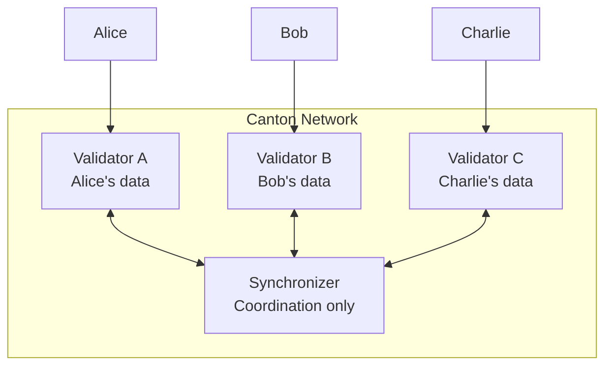
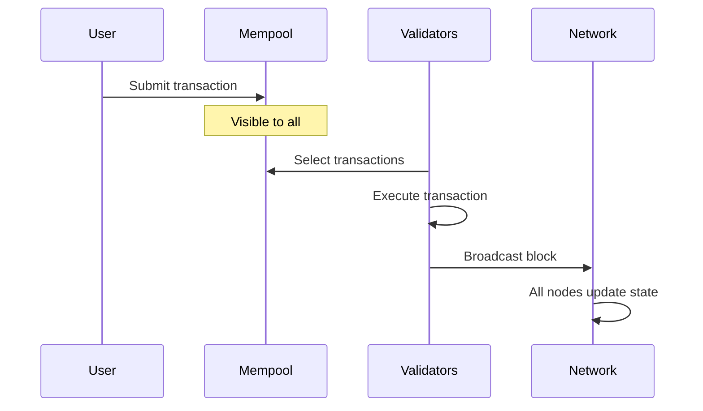
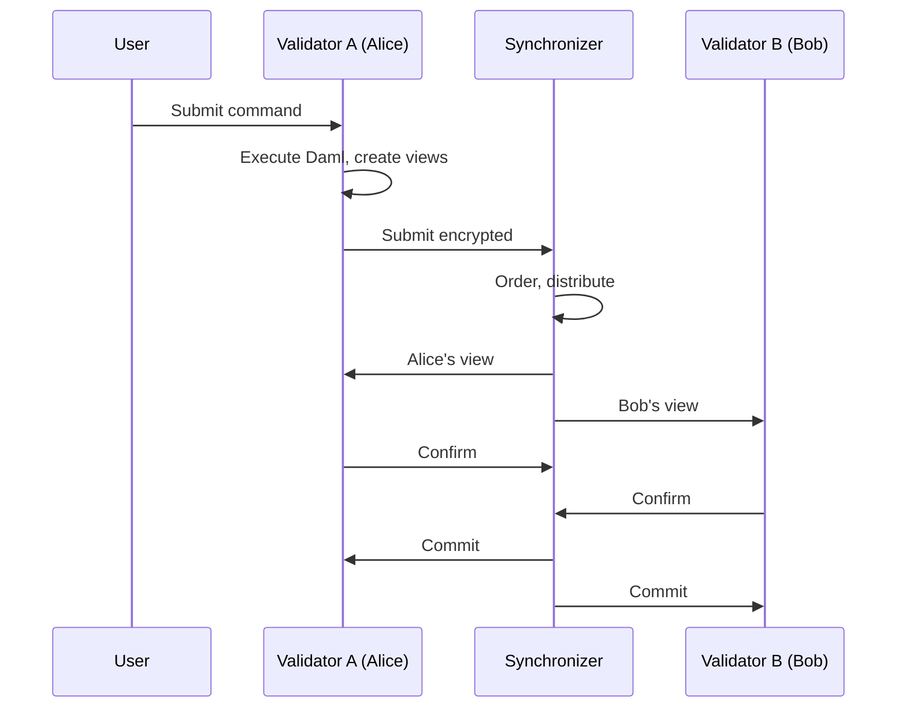
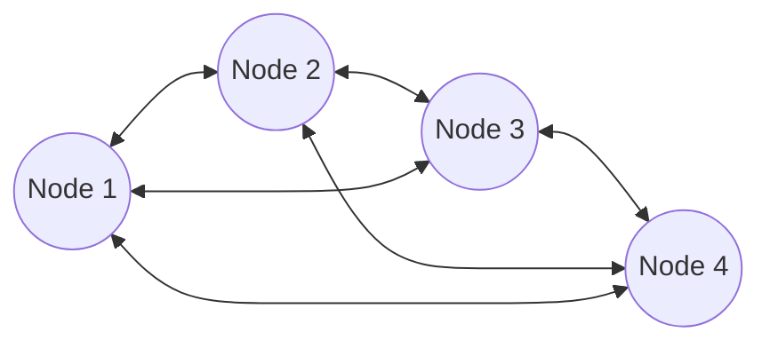
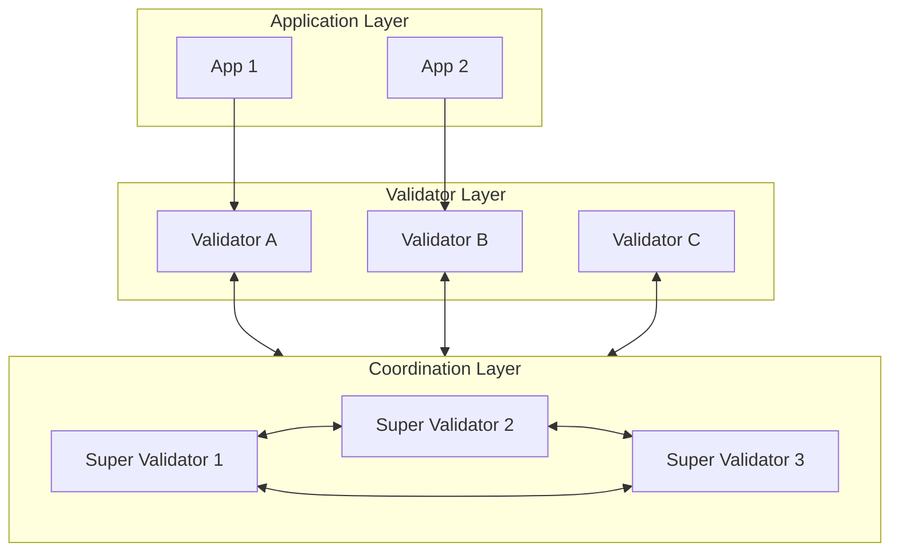

<Warning>
  이 페이지는 팀 리서치를 위한 비공식 한글 번역입니다. 기술적 판단에는 [공식 영어 원문](https://docs.canton.network/appdev/modules/m2-network-architecture.md)을 사용하세요.
</Warning>

import DamlDocsAppdevModulesM2NetworkArchitectureL126 from "/snippets/daml-docs/appdev_modules_m2-network-architecture_L126.mdx";
import DamlDocsAppdevModulesM2NetworkArchitectureL136 from "/snippets/daml-docs/appdev_modules_m2-network-architecture_L136.mdx";

Canton의 network architecture는 Ethereum과 근본적으로 다릅니다. 이 페이지에서는 두 architecture를 비교해 application에 미치는 영향을 이해하도록 돕습니다.

## High-Level Architecture

### Ethereum Architecture

**핵심 특성:**
- 모든 node가 모든 state를 저장합니다
- 어떤 node든 모든 query에 응답할 수 있습니다
- consensus에 모든 Validator가 필요합니다
- horizontal scaling이 제한됩니다

### Canton Architecture

**핵심 특성:**
- Validator는 자신의 Party data만 저장합니다
- Synchronizer는 저장하지 않고 coordination을 수행합니다
- consensus에는 영향을 받는 Party만 참여합니다
- 하나의 Party를 여러 Validator에서 hosting할 수 있습니다. (multihosting)

## Canton Component

### Validator

Validator는 자신의 Party data만 저장하고 hosting하는 Party에 대해서만 query에 응답합니다. consensus에서는 자신의 Party에 영향을 주는 Transaction만 validate합니다.

### Synchronizer

Synchronizer는 state를 저장하지 않고 Transaction ordering을 조정합니다. 영향을 받는 모든 Party가 일관된 ordering을 보도록 보장합니다.

### 기존 Blockchain과의 핵심 차이

Canton에서는 다음이 적용됩니다.
- global state가 없으며 각 Party가 자신만의 view를 가집니다
- state visibility는 stakeholder에게만 제공됩니다
- hosting하는 Validator만 자신의 Party를 위한 query에 응답할 수 있습니다
- confirmation 후 finality가 deterministic합니다

## Data Flow 비교

### Ethereum Transaction Flow

### Canton Transaction Flow

## Query Architecture

### Ethereum: Global Query

<DamlDocsAppdevModulesM2NetworkArchitectureL126 />

### Canton: Party 범위 Query

<DamlDocsAppdevModulesM2NetworkArchitectureL136 />

| Query Type | Ethereum | Canton |
|------------|----------|--------|
| **내 balance** | 어떤 node에서든 query | 내 Validator에서 query |
| **다른 Party의 balance** | 어떤 node에서든 query | Observer여야 함 |
| **총공급량** | 어떤 node에서든 query | 공개하도록 design된 경우에만 가능 |
| **Transaction history** | 어떤 node에서든 query | 내 Transaction만 가능 |

## Application Design에 미치는 영향

### Data Availability

| 고려 사항 | Ethereum | Canton |
|---------------|----------|--------|
| **Read replica** | 어떤 node든 가능 | 자신의 Validator만 가능 |
| **Caching** | 모든 data cache 가능 | 권한이 있는 data만 cache 가능 |
| **Analytics** | on-chain data가 public | 명시적 data sharing 필요 |

### User Experience

| 측면 | Ethereum | Canton |
|--------|----------|--------|
| **Wallet 연결** | 어떤 RPC endpoint든 가능 | 자신의 Validator API 사용 |
| **Balance 표시** | public state query | 자신의 contract query |
| **Transaction history** | public block explorer | 개인 Transaction view |

### Scaling

Validator는 자신이 hosting하는 Party에 영향을 주는 Transaction만 처리하므로 Canton architecture는 load를 자연스럽게 분산합니다. 더 많은 Validator에 Party를 분산해 capacity를 추가할 수 있습니다.

## Network Topology

### Ethereum: Flat P2P

모든 node가 peer이며 같은 data를 저장합니다.

### Canton: Hierarchical

Synchronizer가 조정하고 Validator가 Party를 지원합니다.

## Trust Model 비교

| Entity | Ethereum Trust | Canton Trust |
|--------|----------------|--------------|
| **Validator** | 모든 것을 보고 모두 validate | 관련 내용만 보고 관련 항목만 validate |
| **Network operator** | block producer가 모든 것을 봄 | Synchronizer는 아무것도 보지 못함 |
| **자신의 node** | 자신의 node를 신뢰 | 자신의 Validator를 신뢰 |
| **다른 user** | block space를 두고 경쟁 | 독립적인 Transaction |

## Migration 고려 사항

Ethereum에서 Canton으로 migration할 때는 다음을 수행합니다.

| 측면 | 필요한 조치 |
|--------|-----------------|
| **State query** | Party 범위 query에 맞게 재설계 |
| **Analytics** | 필요한 경우 명시적 data sharing 구축 |
| **Node infrastructure** | full node가 아니라 Validator 설정 |
| **User onboarding** | user를 자신의 Validator에 연결 |
| **Third-party integration** | gRPC 또는 JSON API로 Ledger API access |

## 다음 단계

<CardGroup cols={2}>

<Card title="Architecture 자세히 살펴보기" icon="diagram-project" href="/overview/learn/architecture">
  자세한 Canton architecture documentation입니다.
</Card>

<Card title="개발 시작하기" icon="code" href="/appdev/modules/m3-dev-environment">
  Daml smart contract 작성을 시작합니다.
</Card>

</CardGroup>
