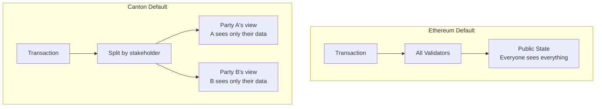
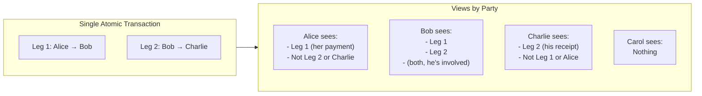
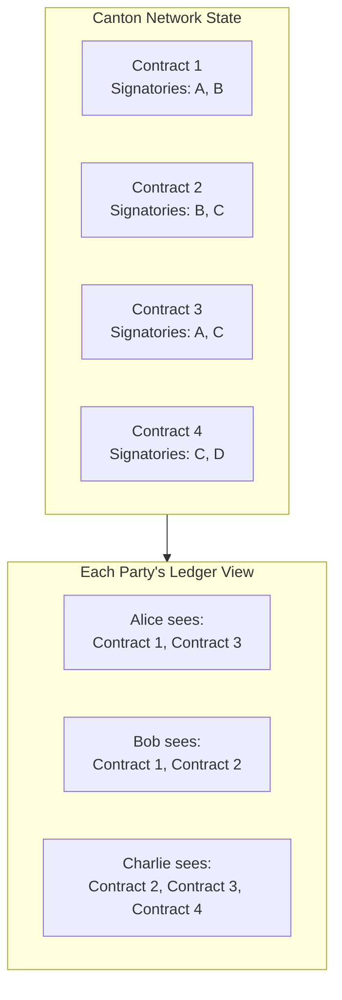

<Warning>
  이 페이지는 팀 리서치를 위한 비공식 한글 번역입니다. 기술적 판단에는 [공식 영어 원문](https://docs.canton.network/appdev/modules/m2-privacy-differences.md)을 사용하세요.
</Warning>

import DamlAppdevModulesM2PrivacyDifferencesL277 from "/snippets/daml-docs/appdev_modules_m2-privacy-differences_L277.mdx";
import DamlAppdevModulesM2PrivacyDifferencesL62 from "/snippets/daml-docs/appdev_modules_m2-privacy-differences_L62.mdx";


privacy는 Canton과 Ethereum의 가장 중요한 architecture 차이입니다. 이 페이지에서는 차이를 자세히 설명하고 사고방식을 조정하는 방법을 안내합니다.

## 근본적인 차이

| 측면 | Ethereum | Canton |
|--------|----------|--------|
| **기본 visibility** | public | private |
| **접근 방식** | privacy를 위에 추가 | privacy를 내장 |
| **Data 위치** | 모든 node가 모든 data 저장 | node는 관련 data만 저장 |
| **Opt-in model** | privacy에 opt-in하기 어려움 | 명시적 Observer를 통해 visibility에 opt-in |



## 기본 Visibility 비교

### Ethereum: 기본적으로 Public

Ethereum에서 contract를 deploy하거나 Transaction을 보내면 다음이 적용됩니다.

1. **Transaction data**는 실행 전에 mempool에서 볼 수 있습니다
2. **State change**는 모든 node에 기록됩니다
3. **Historical data**는 누구나 영구적으로 query할 수 있습니다
4. **Contract code**는 누구나 읽을 수 있습니다
5. **모든 interaction**은 모든 Observer에게 보입니다

Solidity의 "private" variable도 실제로 private하지 않습니다. ABI를 통해 공개되지 않을 뿐입니다. 누구나 storage slot을 직접 읽을 수 있습니다.

```solidity
// Solidity: "private" is misleading
contract NotReallyPrivate {
    uint256 private secretValue;  // Anyone can read this from storage
}
```

### Canton: 기본적으로 Private

Canton에서 data는 권한이 있는 Party에게만 보입니다.

1. **Transaction content**는 submission 중 encrypted됩니다
2. **View**는 관련 Validator에만 전달됩니다
3. **State**는 stakeholder를 hosting하는 Validator에만 저장됩니다
4. **Contract data**는 Signatory와 Observer에게만 보입니다
5. **Third party**는 명시적으로 선언되지 않는 한 아무것도 보지 못합니다

<DamlAppdevModulesM2PrivacyDifferencesL62 />

## Sub-Transaction Privacy

Canton의 핵심 혁신은 동일한 Transaction의 서로 다른 부분이 서로 다른 Party에게 보이는 **sub-transaction privacy**입니다.

### 예시: Atomic Three-Party Transfer

Alice가 Bob에게 Canton Coin을 지불하는 동시에 Bob이 Charlie에게 지불하는 상황을 살펴보겠습니다.

**Ethereum에서는:**
- 모든 사람이 Alice가 Bob에게, Bob이 Charlie에게 지불한 사실을 봅니다
- 모든 사람이 amount, Party, timing을 압니다
- 관련 없는 Carol도 모든 세부 정보를 볼 수 있습니다

**Canton에서는:**



### 이것이 중요한 이유

| Use Case | Ethereum 문제 | Canton Solution |
|----------|------------------|-----------------|
| **Trading** | competitor가 trade를 봄 | counterparty만 trade를 봄 |
| **Lending** | loan term이 public | borrower/lender만 term을 봄 |
| **Supply chain** | 모든 Party가 모든 price를 봄 | 각 Party가 자신의 부분만 봄 |
| **Compliance** | authorized되지 않은 Party에게 data가 보임 | Regulator만 Observer로 추가 |

## Ethereum Privacy Solution과 비교

### Layer 2 Solution

**접근 방식:** Transaction을 MainNet 밖으로 이동하고 on-chain에서 settle합니다.

| 측면 | L2 Solution | Canton |
|--------|--------------|--------|
| **Operator visibility** | L2 operator가 모든 Transaction을 봄 | Synchronizer는 아무것도 보지 못함 |
| **Data availability** | 어딘가에서 사용할 수 있어야 함 | 권한이 있는 Party에게만 제공 |
| **Settlement** | L1 confirmation 필요 | immediate finality |
| **Trust model** | L2 operator 신뢰 | cryptographic privacy |

### Zero-Knowledge Solution

**접근 방식:** data를 공개하지 않고 validity를 증명합니다.

Canton은 zero-knowledge proof를 사용하지 않습니다. 대신 selective data distribution을 통해 privacy를 달성합니다. Party는 자신에게 허용된 Transaction view만 수신합니다. 이 방식은 ZK circuit complexity나 proof generation overhead 없이 더 단순한 programming model을 제공합니다.

### Private Channel (Hyperledger Fabric)

**접근 방식:** private Transaction에 별도의 channel을 사용합니다.

| 측면 | Private Channel | Canton |
|--------|------------------|--------|
| **Granularity** | channel level | sub-transaction level |
| **Cross-channel** | 구현이 복잡 | native atomic Transaction |
| **Membership** | channel membership 관리 필요 | contract에 선언 |
| **Flexibility** | 경직된 channel structure | Transaction마다 동적으로 결정 |

### Encryption at Rest

**접근 방식:** on-chain에 저장된 data를 encrypt합니다.

| 측면 | Encryption | Canton |
|--------|------------|--------|
| **Key management** | 복잡한 key distribution | shared key 불필요 |
| **Metadata** | Transaction pattern이 보임 | 전체가 encrypted됨 |
| **미래 위험** | 나중에 decrypt될 수 있음 | decrypt할 data 자체를 저장하지 않음 |
| **Computation** | encrypted data에서 계산할 수 없음 | view에서 완전한 computation 가능 |

## Private Ledger View

Canton에서 각 Party는 자신이 stakeholder인 모든 contract의 집합인 고유한 **private ledger view**를 가집니다.

### 이것이 의미하는 바



**핵심 영향:**

| Ethereum에서 | Canton에서 |
|-------------|-----------|
| 모든 token query: `getAllTokens()` | *자신의* token query: `getMyContracts()` |
| global state 존재 | global state 개념 없음 |
| total supply가 알려짐 | visibility를 명시적으로 design한 경우에만 total supply를 볼 수 있음 |
| 어떤 node든 모든 query에 응답 | 자신의 Validator만 자신의 query에 응답 |

### Data Query

**Ethereum 접근 방식:**
```javascript
// Anyone can query any data
const totalSupply = await token.totalSupply();
const aliceBalance = await token.balanceOf(alice);
const bobBalance = await token.balanceOf(bob);
```

**Canton 접근 방식:**
```typescript
// You can only query your own data
const myContracts = await ledgerApi.getActiveContracts({
  templateId: "Token",
  party: myParty  // Only your party
});

// Can't query Bob's balance unless you're an observer
```

## Synchronizer가 볼 수 있는 것과 볼 수 없는 것

Synchronizer인 Sequencer와 Mediator는 Transaction을 조정하지만 content는 볼 수 없습니다.

### Synchronizer가 볼 수 있는 것

- 전달해야 하는 encrypted message blob
- network routing을 위한 message size
- ordering을 위한 timestamp
- finality를 위한 committed 또는 rejected 같은 confirmation result
- routing을 위한 Validator identifier
- routing을 위한 Party identifier, 단 end-user identity는 아님

### Synchronizer가 볼 수 없는 것

- encrypted된 Transaction content
- Synchronizer로 전송되지 않는 contract data
- encrypted된 exercised choice
- encrypted된 amount, price, term

### Trust에 미치는 영향

Canton의 trust model은 기존 blockchain과 근본적으로 다릅니다.

**Synchronizer를 신뢰하는 부분:**
- 특정 Party에게 유리하도록 순서를 바꾸지 않고 Transaction을 공정하게 ordering하는 것
- 권한이 있는 모든 Participant에게 message를 전달하는 것
- transact해야 할 때 online 상태를 유지하는 availability

**Synchronizer를 신뢰할 필요가 없는 부분:**
- data privacy: encrypted blob만 봅니다
- Transaction validation: 자신의 Validator가 수행합니다
- 올바른 execution: protocol이 cryptographically 강제합니다

**자신의 Validator를 신뢰하는 부분:**
- contract data를 안전하게 저장하는 것
- 자신을 대신해 Transaction을 올바르게 실행하는 것
- unauthorized Party에게 data를 공개하지 않는 것

<Warning>
hosting Validator는 해당 Party의 모든 data를 봅니다. Validator를 신중하게 선택하세요. 이는 bank나 custodian을 선택하는 것과 유사한 trust relationship입니다.
</Warning>

| Ethereum | Canton |
|----------|--------|
| 모든 Validator가 censor하지 않을 것이라고 신뢰 | Synchronizer가 censor하지 않을 것이라고 신뢰 |
| 모든 Validator가 모든 것을 봄 | Synchronizer는 encrypted view만 봄 |
| Validator가 pending Transaction을 보므로 MEV 가능 | Transaction이 encrypted되므로 MEV가 훨씬 어려움 |
| front-running이 구조적으로 가능 | front-running이 훨씬 어려움 |
| query에 어떤 node든 신뢰 | 자신의 data에는 자신의 Validator만 신뢰 |

## Developer를 위한 Design 영향

### State Query 다시 생각하기

**Ethereum mindset:** "global state를 어떻게 query할까?"

**Canton mindset:** "내 Party는 무엇을 볼 수 있으며, 다른 누구에게 visibility가 필요한가?"

### Observer Pattern

contract를 design할 때 다음을 명시적으로 고려하세요.

1. **Signatory는 누구입니까?** authorize해야 하며 항상 봅니다.
2. **Observer는 누구입니까?** 볼 수 있지만 행동할 수 없습니다.
3. **누가 choice를 exercise할 수 있습니까?** 각 choice의 Controller입니다.
4. **무엇이 divulge됩니까?** Transaction에서 contract를 fetch하면 contract가 공개됩니다.

<DamlAppdevModulesM2PrivacyDifferencesL277 />

### Privacy Checklist

Canton application을 design할 때 다음을 확인하세요.

| 질문 | Design 영향 |
|----------|---------------|
| 누가 이 contract를 봐야 합니까? | Signatory + Observer 선언 |
| 누가 이 contract에 행동할 수 있습니까? | choice별 Controller 선언 |
| contract가 fetch되면 어떻게 됩니까? | divulgence 고려 |
| third party에 visibility가 필요합니까? | Observer를 명시적으로 추가 |
| Validator가 모든 것을 봐야 합니까? | Party hosting 방식 고려 |

## 다음 단계

<CardGroup cols={2}>

<Card title="Smart Contract Paradigm" icon="code" href="/appdev/modules/m2-smart-contract-paradigm">
  Daml의 immutable contract model과 Solidity를 비교해 이해합니다.
</Card>

<Card title="Privacy Model 자세히 살펴보기" icon="lock" href="/overview/learn/privacy-model">
  sub-transaction privacy의 기술적 세부 정보를 살펴봅니다.
</Card>

</CardGroup>
