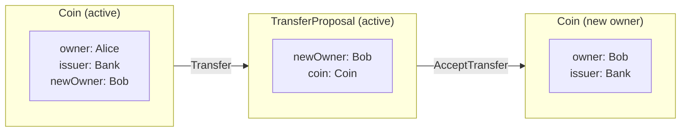
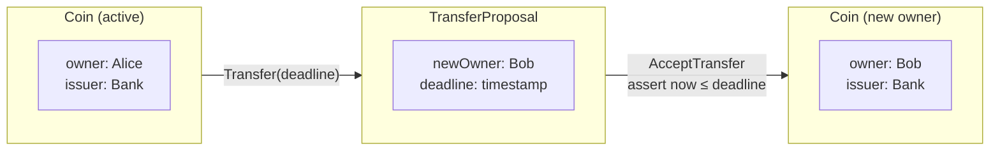
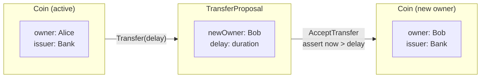
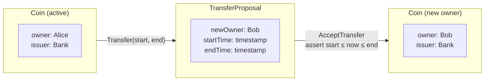

<Warning>
  이 페이지는 팀 리서치를 위한 비공식 한국어 번역입니다. 기술적 판단에는 [공식 영어 원문](https://docs.canton.network/appdev/modules/m3-working-with-time.md)을 사용하세요.
</Warning>

import DamlAppdevModulesM3WorkingWithTimeL105 from "/snippets/daml-docs/appdev_modules_m3-working-with-time_L105.mdx";
import DamlAppdevModulesM3WorkingWithTimeL118 from "/snippets/daml-docs/appdev_modules_m3-working-with-time_L118.mdx";
import DamlAppdevModulesM3WorkingWithTimeL159 from "/snippets/daml-docs/appdev_modules_m3-working-with-time_L159.mdx";
import DamlAppdevModulesM3WorkingWithTimeL172 from "/snippets/daml-docs/appdev_modules_m3-working-with-time_L172.mdx";
import DamlAppdevModulesM3WorkingWithTimeL213 from "/snippets/daml-docs/appdev_modules_m3-working-with-time_L213.mdx";
import DamlAppdevModulesM3WorkingWithTimeL232 from "/snippets/daml-docs/appdev_modules_m3-working-with-time_L232.mdx";
import DamlAppdevModulesM3WorkingWithTimeL25 from "/snippets/daml-docs/appdev_modules_m3-working-with-time_L25.mdx";
import DamlAppdevModulesM3WorkingWithTimeL276 from "/snippets/daml-docs/appdev_modules_m3-working-with-time_L276.mdx";
import DamlAppdevModulesM3WorkingWithTimeL295 from "/snippets/daml-docs/appdev_modules_m3-working-with-time_L295.mdx";
import DamlAppdevModulesM3WorkingWithTimeL38 from "/snippets/daml-docs/appdev_modules_m3-working-with-time_L38.mdx";
import DamlAppdevModulesM3WorkingWithTimeL49 from "/snippets/daml-docs/appdev_modules_m3-working-with-time_L49.mdx";
import DamlAppdevModulesM3WorkingWithTimeL60 from "/snippets/daml-docs/appdev_modules_m3-working-with-time_L60.mdx";
import DamlAppdevModulesM3WorkingWithTimeL67 from "/snippets/daml-docs/appdev_modules_m3-working-with-time_L67.mdx";
import DamlAppdevModulesM3WorkingWithTimeL239 from "/snippets/daml-docs/appdev_modules_m3-working-with-time_L239.mdx";
import DamlAppdevModulesM3WorkingWithTimeL254 from "/snippets/daml-docs/appdev_modules_m3-working-with-time_L254.mdx";
import DamlAppdevModulesM3WorkingWithTimeL263 from "/snippets/daml-docs/appdev_modules_m3-working-with-time_L263.mdx";
import DamlAppdevModulesM3WorkingWithTimeL314 from "/snippets/daml-docs/appdev_modules_m3-working-with-time_L314.mdx";
import DamlAppdevModulesM3WorkingWithTimeL325 from "/snippets/daml-docs/appdev_modules_m3-working-with-time_L325.mdx";
import DamlAppdevModulesM3WorkingWithTimeL339 from "/snippets/daml-docs/appdev_modules_m3-working-with-time_L339.mdx";
import DamlAppdevModulesM3WorkingWithTimeL362 from "/snippets/daml-docs/appdev_modules_m3-working-with-time_L362.mdx";
import DamlAppdevModulesM3WorkingWithTimeL411 from "/snippets/daml-docs/appdev_modules_m3-working-with-time_L411.mdx";
import DamlAppdevModulesM3WorkingWithTimeL444 from "/snippets/daml-docs/appdev_modules_m3-working-with-time_L444.mdx";
import DamlAppdevModulesM3WorkingWithTimeL476 from "/snippets/daml-docs/appdev_modules_m3-working-with-time_L476.mdx";
import DamlAppdevModulesM3WorkingWithTimeL488 from "/snippets/daml-docs/appdev_modules_m3-working-with-time_L488.mdx";
import DamlAppdevModulesM3WorkingWithTimeL500 from "/snippets/daml-docs/appdev_modules_m3-working-with-time_L500.mdx";
import DamlAppdevModulesM3WorkingWithTimeL510 from "/snippets/daml-docs/appdev_modules_m3-working-with-time_L510.mdx";

{/* COPIED_START source="docs-website:docs/replicated/daml/3.4/sdk/sdlc-howtos/smart-contracts/develop/patterns/implementing-time-constraints.rst" hash="17e57ac2" */}

# 시간 제약을 구현하는 방법

Contract 시간 제약은 다음 중 한 가지 방식으로 구현할 수 있습니다.

- Ledger time primitive, 즉 `isLedgerTimeLT`, `isLedgerTimeLE`, `isLedgerTimeGT`, `isLedgerTimeGE` 또는 assertion, 즉 `assertWithinDeadline`, `assertDeadlineExceeded` 사용

  > - Ledger time primitive와 assertion을 사용해도 Transaction preparation과 submission 사이의 time bound를 제한하지 않습니다. 예를 들어 External Party가 Transaction에 서명하는 workflow에 적합합니다.

- 또는 `getTime` 호출

  > - `getTime` 호출은 Transaction preparation과 submission workflow가 기본적으로 1분 이내에 이루어지도록 제한합니다.
  > - 1분은 Ledger Time Record Time Tolerance parameter인 dynamic Synchronizer parameter의 default 값입니다.

다음 subsection에서는 Party가 Ledger write를 수행할 수 있는 시점을 제어하도록 아래 Coin 및 TransferProposal Contract를 서로 다른 유형의 Ledger time 제약으로 수정하는 방법을 보여줍니다.

Coin Contract

<DamlAppdevModulesM3WorkingWithTimeL25 />

<DamlAppdevModulesM3WorkingWithTimeL38 />

TransferProposal Contract

<DamlAppdevModulesM3WorkingWithTimeL49 />

<DamlAppdevModulesM3WorkingWithTimeL60 />

<DamlAppdevModulesM3WorkingWithTimeL67 />

*동의 철회를 포함한 간단한 Coin transfer*

## Deadline이 유효한지 확인하는 방법

이 design pattern은 Choice가 주어진 deadline까지 발생하도록 제한하는 방법을 보여줍니다.

### 동기

Party가 주어진 deadline까지 Ledger write를 수행해야 하는 경우에 사용합니다.

### 구현

Transfer proposal은 언제든 accepted될 수 있습니다. Acceptance가 고정된 시각까지 발생하도록 이 동작을 제한하려면 AcceptTransfer Choice 실행에 guard를 추가할 수 있습니다.

TransferProposal Contract
TransferProposal Contract에서 AcceptTransfer Choice의 body를 수정하여 Contract deadline이 유효한지 assert합니다.

<DamlAppdevModulesM3WorkingWithTimeL105 />

Transfer proposal은 Transfer Choice가 실행될 때 생성되므로 AcceptTransfer를 실행할 수 있는 시각을 Choice parameter로 전달해야 합니다.

Coin Contract
Coin Contract에서 Transfer Choice에 deadline argument를 추가하여 TransferProposal Contract에 고정된 lifetime을 부여할 수 있습니다.

<DamlAppdevModulesM3WorkingWithTimeL118 />

*시간이 제한된 Coin 소유권 transfer*

## Deadline이 지났는지 확인하는 방법

이 design pattern은 Choice가 주어진 deadline 이후에만 발생하도록 보장하는 방법을 보여줍니다.

### 동기

Party가 고정된 시간 지연 후 Ledger write를 수행해야 하는 경우에 사용합니다.

### 구현

Transfer proposal은 언제든 accepted될 수 있습니다. Acceptance가 고정된 지연 후에만 발생하도록 이 동작을 제한하려면 AcceptTransfer Choice 실행에 guard를 추가할 수 있습니다.

TransferProposal Contract
TransferProposal Contract에서 AcceptTransfer Choice의 body를 수정하여 Contract deadline이 초과되었거나 지났는지 assert합니다.

<DamlAppdevModulesM3WorkingWithTimeL159 />

Transfer proposal은 Transfer Choice가 실행될 때 생성되므로 AcceptTransfer를 실행할 수 있게 되는 delay time을 Choice parameter로 전달해야 합니다.

Coin Contract
Coin Contract에서 Transfer Choice에 deadline argument를 추가하여 TransferProposal Contract에 delay를 부여할 수 있습니다.

<DamlAppdevModulesM3WorkingWithTimeL172 />

*지연된 Coin 소유권 transfer*

## Party에 시간 제한 write 권한 부여

이 design pattern은 Party에 시간 제한이 있는 write 권한을 부여하는 방법을 보여줍니다.

### 동기

Party가 Ledger write를 수행할 수 있어야 하지만 특정 time window에만 write가 허용되어야 하는 경우에 사용합니다.

### 구현

Transfer proposal은 언제든 accepted될 수 있습니다. Acceptance가 주어진 time window 안에서만 발생하도록 이 동작을 제한하려면 AcceptTransfer Choice 실행에 guard를 추가할 수 있습니다.

TransferProposal Contract
TransferProposal Contract에서 AcceptTransfer Choice의 body를 수정하여 Contract deadline이 초과되었거나 지났는지 assert합니다.

<DamlAppdevModulesM3WorkingWithTimeL213 />

Transfer proposal은 Transfer Choice가 실행될 때 생성되므로 AcceptTransfer를 실행할 수 있는 interval의 start time과 end time을 Choice parameter로 전달해야 합니다.

Coin Contract
Coin Contract에서 Transfer Choice에 deadline argument를 추가하여 TransferProposal Contract에 delay를 부여할 수 있습니다.

<DamlAppdevModulesM3WorkingWithTimeL232 />

*Time window 내 Coin 소유권 transfer*

## getTime을 사용할 위치

Transaction을 prepare하고 submit하는 workflow에서 getTime 호출을 사용할 때는 주의해야 합니다. getTime을 호출하면 Transaction이 Ledger Time에 bind되고, 그에 따라 Sequencer가 Transaction을 reorder할 수 있는 방식이 제한되기 때문입니다. Global Synchronizer는 Transaction prepare 및 submit time window가 1분이 되도록 구성되므로 getTime을 사용하는 workflow는 이 1분 time window 안에 Transaction을 prepare하고 submit해야 합니다.

이 제약을 충족할 수 없는 workflow, 예를 들어 External Party를 사용하여 Transaction에 서명하는 workflow는 Ledger time primitive와 assertion을 사용하도록 설계하는 것이 좋습니다.

### 동기

Party가 주어진 deadline까지 Ledger write를 수행해야 하며 1분 이내에 Transaction을 prepare하고 submit할 수 있는 경우에 사용합니다.

### 구현

Transfer proposal은 언제든 accepted될 수 있습니다. 고정된 시각까지 acceptance가 이루어지도록 하려면 AcceptTransfer Choice 실행에 guard를 추가할 수 있습니다. 여기서는 getTime을 호출하여 현재 Ledger Time을 확인합니다.

TransferProposal Contract
TransferProposal Contract에서 AcceptTransfer Choice의 body를 수정하여 getTime 호출이 반환한 Ledger Time을 기준으로 Contract deadline이 유효한지 assert합니다.

<DamlAppdevModulesM3WorkingWithTimeL276 />

Transfer proposal은 Transfer Choice가 실행될 때 생성되므로 AcceptTransfer를 실행할 수 있는 시각을 Choice parameter로 전달해야 합니다.

Coin Contract
Coin Contract에서 Transfer Choice에 deadline argument를 추가하여 TransferProposal Contract에 고정된 lifetime을 부여할 수 있습니다.

<DamlAppdevModulesM3WorkingWithTimeL295 />

{/* COPIED_END */}
{/* COPIED_START source="docs-website:docs/replicated/daml/3.4/sdk/tutorials/smart-contracts/constraints.rst" hash="dc7e974c" */}

# Contract에 제약 추가

Contract model에 저장되는 data 또는 허용되는 data transformation을 제한해야 하는 경우가 많습니다. 이 section에서는 Daml이 제공하는 두 가지 주요 mechanism을 알아봅니다.

- `ensure` keyword
- `assert`, `abort`, `error` keyword

두 번째 mechanism을 이해하기 위해 `Update`, `Script` type과 `do` block도 자세히 알아봅니다. 이는 `compose`에서 `do` block을 사용해 Choice를 복잡한 Transaction으로 구성하기 위한 좋은 준비가 됩니다.

마지막으로 Ledger와 Daml Script의 시간에 관해 알아봅니다.

<Tip>
이 section의 모든 code를 `intro-constraints` folder에 load하려면 `dpm new intro-constraints  --template daml-intro-constraints`를 실행하세요.
</Tip>

## Template precondition

Contract model에 적용할 수 있는 첫 번째 유형의 제한은 *Template precondition*입니다. 이는 해당 Template의 Contract에 저장할 수 있는 data에 대한 제한입니다.

예를 들어 `SimpleIou` Contract가 `simple_iou`에서 양수 amount만 저장할 수 있어야 한다고 가정합니다. `ensure` keyword를 사용하여 이를 강제할 수 있습니다.

<DamlAppdevModulesM3WorkingWithTimeL239 />

`ensure` keyword는 `Bool` type의 expression 하나를 받습니다. 더 많은 제한을 추가하려면 logical operator `&&`, `||`, `not`을 사용해 expression을 구성합니다. 아래에서는 currency가 대문자 세 글자라는 추가 제한을 보여줍니다.

<DamlAppdevModulesM3WorkingWithTimeL254 />

<Tip>
여기서 `T`는 Daml Standard Library의 `DA.Text`를 나타내며 `import DA.Text as T`를 사용하여 import했습니다.
</Tip>

<DamlAppdevModulesM3WorkingWithTimeL263 />

## Assertion

두 번째로 흔한 제한 유형은 data transformation에 관한 제한입니다.

예를 들어 `simple_iou`의 simple Iou에서는 `owner`가 자신에게 transfer하는 no-op가 허용되었습니다. Script context에서 이미 살펴본 `assert` statement를 사용하면 이를 방지할 수 있습니다.

`assert`는 유용한 error를 반환하지 않으므로 custom error message를 받는 `assertMsg` function을 사용하는 편이 더 나을 때가 많습니다.

<DamlAppdevModulesM3WorkingWithTimeL314 />

<DamlAppdevModulesM3WorkingWithTimeL325 />

마찬가지로 `Redeem` Choice를 작성하여 `owner`가 *평일 업무 시간 중* `Iou`를 redeem할 수 있게 할 수 있습니다. 아래 `Redeem` Choice implementation은 `getTime`이 평일 업무 시간에 해당하는 값을 반환하는지 확인합니다. 모든 검사를 통과하면 Choice는 `SimpleIou`를 archive하는 것 외에는 아무 작업도 하지 않습니다. 이는 실제 현금 교환이 off-ledger에서 이루어진다고 가정합니다.

<DamlAppdevModulesM3WorkingWithTimeL339 />

위 example에서는 `DA.Date`와 `DA.Time`의 Standard Library function을 사용하여 시간을 요일과 시각으로 나눕니다. 시각은 8시부터 18시 범위인지 확인하고 요일은 토요일이나 일요일이 아닌지 확인합니다.

다음 example은 script에서 `Redeem` Choice를 exercise하는 방법을 보여줍니다.

<DamlAppdevModulesM3WorkingWithTimeL362 />

`Redeem` Choice를 test하기 위해 위 code는 `setTime`과 `passTime` function으로 각각 Ledger Time을 설정하고 진행시킵니다. Choice exercise는 요일과 시각에 따라 실패하거나 성공해야 합니다. 이는 이해하기 쉽지만 Daml Ledger의 시간 문제는 더 자세히 논의할 가치가 있습니다.

## Daml Ledger의 시간

Daml Ledger의 각 Transaction에는 *Ledger Time(LT)*과 *Record Time(RT)*이라는 두 timestamp가 있습니다.

**Ledger Time(LT)**은 Participant가 결정하며 Ledger Model에서 Transaction과 연결되는 시간입니다. Business와 application 관점에서 본 Transaction의 시간입니다. `getTime을 호출하면 LT가 반환됩니다. LT는 서로 관련된 Transaction과 commit을 reasoning할 때 사용합니다. LT를 다른 LT와 비교하여 model consistency를 보장할 수 있습니다. 예를 들어 LT는 존재하지 않는 Contract에 의존하는 Transaction이 없도록 강제하는 데 사용합니다. 이를 "causal monotonicity" requirement라고 합니다.

**Record Time(RT)**은 persistence layer가 할당하는 시간입니다. Transaction이 "물리적으로" 기록되는 시간을 나타냅니다. 예를 들어 backing database Ledger가 특정 시각의 timestamp를 이 Transaction에 할당한 경우입니다. RT의 유일한 목적은 Transaction이 적시에 기록되도록 보장하는 것입니다.

각 Daml Ledger에는 LT와 RT 사이에 허용되는 차이에 관한 *skew* policy가 있습니다. Distributed system이므로 일관된 zero-skew는 실현할 수 없습니다. 차이가 너무 크면 Transaction이 rejected됩니다. 이를 "bounded skew" requirement라고 합니다. 이 skew 판단 외에는 RT가 관련되지 않습니다.

*업무 시간*이라는 주제로 돌아가 다음 example을 살펴보겠습니다. Ledger skew가 10초라고 가정합니다. 업무 시간이 끝나기 직전인 17:59:55에 Alice가 Iou를 redeem하는 Transaction을 제출합니다. 1초 후 Transaction에 17:59:56의 LT가 할당됩니다. 하지만 Transaction이 underlying storage에 persist되기까지 몇 초가 더 걸릴 수 있습니다. 예를 들어 Transaction이 *업무 시간 이후*인 18:00:06에 underlying backing store에 기록될 수 있습니다. LT는 업무 시간 안에 있고 LT - RT \.

### Test script의 시간

Test에서는 다음 function으로 시간을 설정할 수 있습니다.

- `setTime`: Ledger Time을 주어진 시각으로 설정합니다.
- `passTime`: `RelTime`을 받아 그만큼 Ledger 시간을 진행시킵니다.

Distributed Daml Ledger에서는 LT나 RT가 strictly increasing이라고 보장되지 않습니다. 유일한 보장은 Ledger Time이 *causality에 따라* 증가한다는 것입니다. 즉 Transaction `TX2`가 Transaction `TX1`에 의존하면 Ledger는 `TX2`의 LT가 `TX1`의 LT보다 크거나 같도록 강제합니다.

다음 script는 logical time을 3일 전으로 되돌린 다음 *아직 생성되지 않은* Contract에서 Choice를 exercise하여 이 개념을 보여줍니다. 기대한 대로 실패합니다.

<DamlAppdevModulesM3WorkingWithTimeL411 />

## Action과 `do` block

지금까지 `do` block과 `<-` notation을 `Script`, `Update`라는 두 context에서 살펴보았습니다. 둘 다 `Action`의 example이며 functional programming에서는 *Monad*라고도 합니다. `Actions`는 `do` notation을 사용해 편리하게 구성할 수 있습니다.

따라서 올바른 Contract model을 구성하고 test하려면 `Actions`와 `do` block을 이해하는 것이 중요합니다. 이 section에서는 이를 자세히 설명합니다.

### Pure expression과 action 비교

Daml의 expression은 side effect가 없다는 의미에서 pure합니다. External state를 읽지도 수정하지도 않습니다. Scope 내 모든 variable의 값을 알고 expression을 작성한다면 종이와 펜만으로 그 expression의 값을 계산할 수 있습니다.

하지만 지금까지 본 `<-` notation을 사용하는 expression은 그렇지 않습니다. 예를 들어 `getTime`은 `Action`입니다. 앞서 사용한 example은 다음과 같습니다.

``daml
now syntax for functions later.

위에서 `Coin`과 `play`는 의도적으로 자세히 설명하지 않았습니다. Action `getCoin`으로 `Coin`을 `Script` context에서 얻을 수 있으며, action `flipCoin`은 단 한 번의 coin flip으로 `Face`를 산출하는 가장 단순한 game을 나타냅니다.

Coin이 없으므로 종이와 펜만으로 `CoinGame` game을 실행할 수는 없지만 game을 위한 script 또는 recipe는 작성할 수 있습니다.

<DamlAppdevModulesM3WorkingWithTimeL444 />

`game` expression은 coin을 세 번 flip하는 `CoinGame`입니다. 세 번 모두 `Heads`가 나오면 결과는 `"Win"`이고 그렇지 않으면 `"Loss"`입니다.

`Script` context에서는 `Coin`을 LT로 seed를 계산하는 `getCoin` action을 통해 얻고 game을 실행할 수 있습니다.

어떤 방식으로든 `Coin`은 여러 action을 거치며 전달됩니다. 내부 작동을 깊이 이해하려면 source file에서 `CoinGame` action의 구현을 살펴볼 수 있습니다. 다만 해당 implementation은 이 introduction에서 아직 다루지 않은 많은 Daml feature를 사용합니다.

더 일반적으로 Action, 즉 Monad를 자세히 알아보려면 functional programming, 특히 Haskell에 관한 일반 course를 권장합니다. 몇 가지 제안은 `haskell-connection`을 참조하세요.

## Error

앞에서 잠재적으로 실패할 수 있는 action을 나타내는 `assertMsg`와 `abort`를 배웠습니다. Action은 수행될 때만 effect가 있으므로 다음 script는 `abortScript` 값에 따라 성공하거나 실패합니다.

<DamlAppdevModulesM3WorkingWithTimeL476 />

그렇다면 action 이외의 context에서 발생하는 error는 어떨까요? 정수를 다른 양의 정수의 거듭제곱으로 계산하는 `pow` function을 구현한다고 가정합니다. 두 번째 parameter가 양수여야 한다는 조건을 어떻게 처리해야 할까요?

한 가지 방법은 `Optional`을 반환하여 function을 명시적으로 partial하게 만드는 것입니다.

<DamlAppdevModulesM3WorkingWithTimeL488 />

Error case를 처리할 수 있어야 할 때 유용한 pattern이지만 `Optional`에서 결과를 추출해야 하므로 항상 error case를 처리해야 합니다. 위 function 정의에서 편의성에 미치는 영향을 확인할 수 있습니다. 0으로 나누기나 위 function 같은 경우에는 대신 치명적으로 실패하는 편이 나을 수 있습니다.

<DamlAppdevModulesM3WorkingWithTimeL500 />

큰 단점은 사용하지 않는 error도 failure를 일으킨다는 점입니다. 다음 script는 `failingComputation`이 evaluate되므로 실패합니다.

<DamlAppdevModulesM3WorkingWithTimeL510 />

따라서 `error`는 error case가 발생할 가능성이 낮고 명시적인 partiality가 function usability에 과도한 영향을 주는 경우에만 사용해야 합니다.

## 다음 단계

이제 Daml Ledger를 위한 정밀한 data 및 data-transformation model을 지정할 수 있습니다. `parties`에서는 여러 Party를 Contract에 올바르게 참여시키는 방법, Daml에서 authority가 작동하는 방식, 서로 신뢰하지 않는 entity가 있는 context에서 강력한 보장을 갖춘 Contract model을 구축하는 방법을 알아봅니다.

{/* COPIED_END */}
