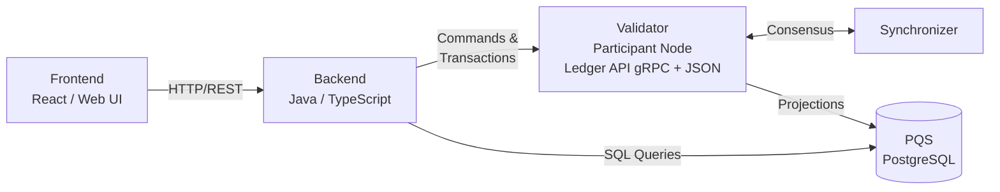

<Warning>
  이 페이지는 팀 리서치를 위한 비공식 한글 번역입니다. 기술적 판단에는 [공식 영어 원문](https://docs.canton.network/appdev/modules/m4-app-architecture.md)을 사용하세요.
</Warning>

Canton application은 Daml smart contract가 공유 business logic을 정의하고, backend가 ledger access를 중개하며, frontend가 user interface를 제공하는 layered architecture를 따릅니다. 이 페이지에서는 관련 role과 layer가 연결되는 방식을 설명합니다.

## Role

대부분의 Canton application에는 세 가지 role이 있습니다.

**App Provider** -- application을 구축, deploy, 운영하는 조직입니다. App Provider는 일반적으로 자체 Validator를 실행하고 backend service를 hosting하며 frontend를 제공합니다. App Provider의 Validator는 provider의 Party를 hosting하므로 provider 측 contract data를 저장하고 backend가 연결되는 Ledger API를 공개합니다.

**App User** -- application contract와 interaction하는 Party입니다. provider가 user의 Party를 hosting하는 경우 App User는 App Provider의 Validator를 통해 연결할 수 있으며, 그렇지 않으면 자체 Validator를 통해 연결할 수 있습니다. 어느 경우든 user의 Party는 관련 Synchronizer에 참여하는 Validator에 allocate되어야 합니다.

**End User** -- browser, mobile application, wallet UI를 통해 application과 interaction하는 사람입니다. End User는 일반적으로 Validator를 관리하거나 ledger mechanism을 고려하지 않습니다. frontend를 통해 authenticate하고 backend가 대신 ledger operation을 처리합니다.

## Architecture Layer

Canton application에는 세 가지 주요 layer가 있습니다.

### Daml Model

Daml model은 공유 business logic을 구성하는 contract, choice, authorization rule을 정의합니다. `dpm build`로 DAR file로 compile하면 관련 Party를 hosting하는 Validator에 이 model을 deploy합니다. Daml model은 ledger에 존재하는 data와 가능한 action에 관한 single source of truth입니다.

### Backend

backend는 Validator의 Ledger API에 연결되는 Java 또는 TypeScript service입니다. contract 생성 및 choice exercise 같은 Command를 submit하고 Transaction stream을 읽거나 PQS에 contract state를 query합니다. backend는 authentication, on-ledger에 속하지 않는 business logic, external system integration도 처리합니다.

[cn-quickstart](https://github.com/digital-asset/cn-quickstart) reference application의 backend는 Spring Boot Java service입니다.

### Frontend

frontend는 HTTP를 통해 backend와 communication하는 web application이며 이 경우 React입니다. Ledger API에 직접 연결하지 않습니다. backend는 OpenAPI schema로 정의된 REST API를 공개하고 frontend는 생성된 TypeScript client로 이를 사용합니다.

이러한 분리는 ledger 관련 concern을 browser 밖에 유지하고 authentication 및 access control을 backend에 중앙화합니다.

## Component Diagram

다음 diagram은 runtime에 layer가 연결되는 방식을 보여 줍니다.

- **frontend**는 backend에 HTTP request를 보냅니다.
- **backend**는 Ledger API인 gRPC를 통해 Command를 submit하고 Transaction을 읽습니다.
- **Validator**인 Participant Node는 LAPI를 통해 submit된 Command를 처리하고 자신이 hosting하는 Party의 contract data를 저장하며 Synchronizer를 통해 다른 Validator와 synchronize합니다.
- **PQS**는 backend가 SQL로 query할 수 있는 ledger state의 PostgreSQL projection을 유지합니다.

## PQS가 사용되는 위치

Ledger API는 Command submission과 Transaction update streaming에 최적화되어 있습니다. dashboard, report, filtered query, aggregation 같은 read-heavy workload에는 PQS가 더 적합합니다. PQS는 Validator의 Transaction stream을 구독하고 contract data를 PostgreSQL table에 기록합니다. backend는 standard SQL로 이 table을 query합니다. PQS는 standard SQL join으로 data를 결합하여 새로운 data projection을 생성하는 데 사용할 수 있습니다. PQS는 audit에 사용할 수 있는 historical data도 저장합니다.

PQS를 사용하면 read path가 Ledger API resource를 두고 write path와 경쟁하지 않으며 contract data에 PostgreSQL의 모든 기능인 join, index, full-text search를 사용할 수 있습니다.

## Architecture Style 선택

cn-quickstart project는 backend가 모든 ledger interaction을 처리하고 frontend는 backend하고만 통신하는 **fully mediated** architecture를 사용합니다. 대부분의 application에 가장 단순한 model입니다.

다른 방법은 frontend가 `dpm codegen-js`의 TypeScript binding을 사용해 Ledger API에 직접 Command를 submit하고 backend는 query를 처리하는 **CQRS** architecture입니다. frontend를 ledger와 더 긴밀하게 integrate할 수 있지만 frontend가 Party ID, Contract ID 같은 Canton 개념을 이해해야 합니다.

frontend에 ledger 개념을 공개할 구체적인 이유가 없다면 fully mediated 접근 방식을 선택하세요.

## 다음 단계

- [SDK와 API](/appdev/modules/m4-sdks-apis) -- 각 layer에서 사용할 수 있는 tool과 interface
- [Backend 개발](/appdev/modules/m4-backend-dev) -- Ledger API와 PQS에 연결하는 pattern
- [Frontend 개발](/appdev/modules/m4-frontend-dev) -- backend API를 사용하는 React UI 구축
