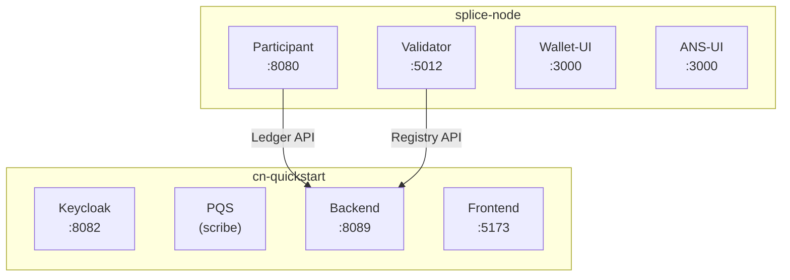

<Warning>
  이 페이지는 팀 리서치를 위한 비공식 한국어 번역입니다. 기술적 판단에는 [공식 영어 원문](https://docs.canton.network/appdev/quickstart/deploy-to-devnet.md)을 사용하세요.
</Warning>

import CantonGlobalSynchronizerDeploymentInstallationL41 from "/snippets/canton-docs/global-synchronizer_deployment_installation_L41.mdx";
import ExternalCnQuickstartMainCnQuickstartRstCodeSdkDocsSharableSdkQuickstartOperateDeployQuickstartToDevnetBash96 from "/snippets/external/cn-quickstart/main/cn-quickstart-rst-code-sdk-docs-sharable-sdk-quickstart-operate-deploy-quickstart-to-devnet-bash-96.mdx";
import ExternalCnQuickstartMainCnQuickstartRstCodeSdkDocsSharableSdkQuickstartOperateDeployQuickstartToDevnetBash174 from "/snippets/external/cn-quickstart/main/cn-quickstart-rst-code-sdk-docs-sharable-sdk-quickstart-operate-deploy-quickstart-to-devnet-bash-174.mdx";
import ExternalCnQuickstartMainCnQuickstartRstCodeSdkDocsSharableSdkQuickstartOperateDeployQuickstartToDevnetBash233 from "/snippets/external/cn-quickstart/main/cn-quickstart-rst-code-sdk-docs-sharable-sdk-quickstart-operate-deploy-quickstart-to-devnet-bash-233.mdx";
import ExternalCnQuickstartMainCnQuickstartRstCodeSdkDocsSharableSdkQuickstartOperateDeployQuickstartToDevnetBash245 from "/snippets/external/cn-quickstart/main/cn-quickstart-rst-code-sdk-docs-sharable-sdk-quickstart-operate-deploy-quickstart-to-devnet-bash-245.mdx";
import ExternalCnQuickstartMainCnQuickstartRstCodeSdkDocsSharableSdkQuickstartOperateDeployQuickstartToDevnetBash265 from "/snippets/external/cn-quickstart/main/cn-quickstart-rst-code-sdk-docs-sharable-sdk-quickstart-operate-deploy-quickstart-to-devnet-bash-265.mdx";
import ExternalCnQuickstartMainCnQuickstartRstCodeSdkDocsSharableSdkQuickstartOperateDeployQuickstartToDevnetBash291 from "/snippets/external/cn-quickstart/main/cn-quickstart-rst-code-sdk-docs-sharable-sdk-quickstart-operate-deploy-quickstart-to-devnet-bash-291.mdx";
import ExternalCnQuickstartMainCnQuickstartRstCodeSdkDocsSharableSdkQuickstartOperateDeployQuickstartToDevnetBash310 from "/snippets/external/cn-quickstart/main/cn-quickstart-rst-code-sdk-docs-sharable-sdk-quickstart-operate-deploy-quickstart-to-devnet-bash-310.mdx";
import ExternalCnQuickstartMainCnQuickstartRstCodeSdkDocsSharableSdkQuickstartOperateDeployQuickstartToDevnetBash345 from "/snippets/external/cn-quickstart/main/cn-quickstart-rst-code-sdk-docs-sharable-sdk-quickstart-operate-deploy-quickstart-to-devnet-bash-345.mdx";
import ExternalCnQuickstartMainCnQuickstartRstCodeSdkDocsSharableSdkQuickstartOperateDeployQuickstartToDevnetBash390 from "/snippets/external/cn-quickstart/main/cn-quickstart-rst-code-sdk-docs-sharable-sdk-quickstart-operate-deploy-quickstart-to-devnet-bash-390.mdx";
import ExternalCnQuickstartMainCnQuickstartRstCodeSdkDocsSharableSdkQuickstartOperateDeployQuickstartToDevnetText396 from "/snippets/external/cn-quickstart/main/cn-quickstart-rst-code-sdk-docs-sharable-sdk-quickstart-operate-deploy-quickstart-to-devnet-text-396.mdx";
import ExternalCnQuickstartMainCnQuickstartRstCodeSdkDocsSharableSdkQuickstartOperateDeployQuickstartToDevnetBash424 from "/snippets/external/cn-quickstart/main/cn-quickstart-rst-code-sdk-docs-sharable-sdk-quickstart-operate-deploy-quickstart-to-devnet-bash-424.mdx";
import ExternalCnQuickstartMainCnQuickstartRstCodeSdkDocsSharableSdkQuickstartOperateDeployQuickstartToDevnetBash430 from "/snippets/external/cn-quickstart/main/cn-quickstart-rst-code-sdk-docs-sharable-sdk-quickstart-operate-deploy-quickstart-to-devnet-bash-430.mdx";
import ExternalCnQuickstartMainCnQuickstartRstCodeSdkDocsSharableSdkQuickstartOperateDeployQuickstartToDevnetBash436 from "/snippets/external/cn-quickstart/main/cn-quickstart-rst-code-sdk-docs-sharable-sdk-quickstart-operate-deploy-quickstart-to-devnet-bash-436.mdx";
import ExternalCnQuickstartMainCnQuickstartRstCodeSdkDocsSharableSdkQuickstartOperateDeployQuickstartToDevnetText442 from "/snippets/external/cn-quickstart/main/cn-quickstart-rst-code-sdk-docs-sharable-sdk-quickstart-operate-deploy-quickstart-to-devnet-text-442.mdx";
import ExternalCnQuickstartMainCnQuickstartRstCodeSdkDocsSharableSdkQuickstartOperateDeployQuickstartToDevnetBash451 from "/snippets/external/cn-quickstart/main/cn-quickstart-rst-code-sdk-docs-sharable-sdk-quickstart-operate-deploy-quickstart-to-devnet-bash-451.mdx";
import ExternalCnQuickstartMainCnQuickstartRstCodeSdkDocsSharableSdkQuickstartOperateDeployQuickstartToDevnetBash465 from "/snippets/external/cn-quickstart/main/cn-quickstart-rst-code-sdk-docs-sharable-sdk-quickstart-operate-deploy-quickstart-to-devnet-bash-465.mdx";
import ExternalCnQuickstartMainCnQuickstartRstCodeSdkDocsSharableSdkQuickstartOperateDeployQuickstartToDevnetBash475 from "/snippets/external/cn-quickstart/main/cn-quickstart-rst-code-sdk-docs-sharable-sdk-quickstart-operate-deploy-quickstart-to-devnet-bash-475.mdx";
import ExternalCnQuickstartMainCnQuickstartRstCodeSdkDocsSharableSdkQuickstartOperateDeployQuickstartToDevnetBash489 from "/snippets/external/cn-quickstart/main/cn-quickstart-rst-code-sdk-docs-sharable-sdk-quickstart-operate-deploy-quickstart-to-devnet-bash-489.mdx";
import ExternalCnQuickstartMainCnQuickstartRstCodeSdkDocsSharableSdkQuickstartOperateDeployQuickstartToDevnetBash503 from "/snippets/external/cn-quickstart/main/cn-quickstart-rst-code-sdk-docs-sharable-sdk-quickstart-operate-deploy-quickstart-to-devnet-bash-503.mdx";
import ExternalCnQuickstartMainCnQuickstartRstCodeSdkDocsSharableSdkQuickstartOperateDeployQuickstartToDevnetBash509 from "/snippets/external/cn-quickstart/main/cn-quickstart-rst-code-sdk-docs-sharable-sdk-quickstart-operate-deploy-quickstart-to-devnet-bash-509.mdx";
import ExternalCnQuickstartMainCnQuickstartRstCodeSdkDocsSharableSdkQuickstartOperateDeployQuickstartToDevnetBash569 from "/snippets/external/cn-quickstart/main/cn-quickstart-rst-code-sdk-docs-sharable-sdk-quickstart-operate-deploy-quickstart-to-devnet-bash-569.mdx";
import ExternalCnQuickstartMainCnQuickstartRstCodeSdkDocsSharableSdkQuickstartOperateDeployQuickstartToDevnetBash577 from "/snippets/external/cn-quickstart/main/cn-quickstart-rst-code-sdk-docs-sharable-sdk-quickstart-operate-deploy-quickstart-to-devnet-bash-577.mdx";
import ExternalCnQuickstartMainCnQuickstartRstCodeSdkDocsSharableSdkQuickstartOperateDeployQuickstartToDevnetBash586 from "/snippets/external/cn-quickstart/main/cn-quickstart-rst-code-sdk-docs-sharable-sdk-quickstart-operate-deploy-quickstart-to-devnet-bash-586.mdx";
import ExternalCnQuickstartMainCnQuickstartRstCodeSdkDocsSharableSdkQuickstartOperateDeployQuickstartToDevnetBash595 from "/snippets/external/cn-quickstart/main/cn-quickstart-rst-code-sdk-docs-sharable-sdk-quickstart-operate-deploy-quickstart-to-devnet-bash-595.mdx";
import ExternalCnQuickstartMainCnQuickstartRstCodeSdkDocsSharableSdkQuickstartOperateDeployQuickstartToDevnetBash607 from "/snippets/external/cn-quickstart/main/cn-quickstart-rst-code-sdk-docs-sharable-sdk-quickstart-operate-deploy-quickstart-to-devnet-bash-607.mdx";
import ExternalCnQuickstartMainCnQuickstartRstCodeSdkDocsSharableSdkQuickstartOperateDeployQuickstartToDevnetBash618 from "/snippets/external/cn-quickstart/main/cn-quickstart-rst-code-sdk-docs-sharable-sdk-quickstart-operate-deploy-quickstart-to-devnet-bash-618.mdx";
import ExternalCnQuickstartMainCnQuickstartRstCodeSdkDocsSharableSdkQuickstartOperateDeployQuickstartToDevnetBash625 from "/snippets/external/cn-quickstart/main/cn-quickstart-rst-code-sdk-docs-sharable-sdk-quickstart-operate-deploy-quickstart-to-devnet-bash-625.mdx";
import ExternalCnQuickstartMainCnQuickstartRstCodeSdkDocsSharableSdkQuickstartOperateDeployQuickstartToDevnetBash635 from "/snippets/external/cn-quickstart/main/cn-quickstart-rst-code-sdk-docs-sharable-sdk-quickstart-operate-deploy-quickstart-to-devnet-bash-635.mdx";
import ExternalCnQuickstartMainCnQuickstartRstCodeSdkDocsSharableSdkQuickstartOperateDeployQuickstartToDevnetBash642 from "/snippets/external/cn-quickstart/main/cn-quickstart-rst-code-sdk-docs-sharable-sdk-quickstart-operate-deploy-quickstart-to-devnet-bash-642.mdx";
import ExternalCnQuickstartMainCnQuickstartRstCodeSdkDocsSharableSdkQuickstartOperateDeployQuickstartToDevnetBash649 from "/snippets/external/cn-quickstart/main/cn-quickstart-rst-code-sdk-docs-sharable-sdk-quickstart-operate-deploy-quickstart-to-devnet-bash-649.mdx";
import ExternalCnQuickstartMainCnQuickstartRstCodeSdkDocsSharableSdkQuickstartOperateDeployQuickstartToDevnetBash659 from "/snippets/external/cn-quickstart/main/cn-quickstart-rst-code-sdk-docs-sharable-sdk-quickstart-operate-deploy-quickstart-to-devnet-bash-659.mdx";
import ExternalCnQuickstartMainCnQuickstartRstCodeSdkDocsSharableSdkQuickstartOperateDeployQuickstartToDevnetBash666 from "/snippets/external/cn-quickstart/main/cn-quickstart-rst-code-sdk-docs-sharable-sdk-quickstart-operate-deploy-quickstart-to-devnet-bash-666.mdx";
import ExternalCnQuickstartMainCnQuickstartRstCodeSdkDocsSharableSdkQuickstartOperateDeployQuickstartToDevnetYaml689 from "/snippets/external/cn-quickstart/main/cn-quickstart-rst-code-sdk-docs-sharable-sdk-quickstart-operate-deploy-quickstart-to-devnet-yaml-689.mdx";
import ExternalCnQuickstartMainCnQuickstartRstCodeSdkDocsSharableSdkQuickstartOperateDeployQuickstartToDevnetBash728 from "/snippets/external/cn-quickstart/main/cn-quickstart-rst-code-sdk-docs-sharable-sdk-quickstart-operate-deploy-quickstart-to-devnet-bash-728.mdx";
import ExternalCnQuickstartMainCnQuickstartRstCodeSdkDocsSharableSdkQuickstartOperateDeployQuickstartToDevnetBash737 from "/snippets/external/cn-quickstart/main/cn-quickstart-rst-code-sdk-docs-sharable-sdk-quickstart-operate-deploy-quickstart-to-devnet-bash-737.mdx";
import ExternalCnQuickstartMainCnQuickstartRstCodeSdkDocsSharableSdkQuickstartOperateDeployQuickstartToDevnetBash744 from "/snippets/external/cn-quickstart/main/cn-quickstart-rst-code-sdk-docs-sharable-sdk-quickstart-operate-deploy-quickstart-to-devnet-bash-744.mdx";
import ExternalCnQuickstartMainCnQuickstartRstCodeSdkDocsSharableSdkQuickstartOperateDeployQuickstartToDevnetBash761 from "/snippets/external/cn-quickstart/main/cn-quickstart-rst-code-sdk-docs-sharable-sdk-quickstart-operate-deploy-quickstart-to-devnet-bash-761.mdx";
import ExternalCnQuickstartMainCnQuickstartRstCodeSdkDocsSharableSdkQuickstartOperateDeployQuickstartToDevnetBash770 from "/snippets/external/cn-quickstart/main/cn-quickstart-rst-code-sdk-docs-sharable-sdk-quickstart-operate-deploy-quickstart-to-devnet-bash-770.mdx";
import ExternalCnQuickstartMainCnQuickstartRstCodeSdkDocsSharableSdkQuickstartOperateDeployQuickstartToDevnetBash776 from "/snippets/external/cn-quickstart/main/cn-quickstart-rst-code-sdk-docs-sharable-sdk-quickstart-operate-deploy-quickstart-to-devnet-bash-776.mdx";
import ExternalCnQuickstartMainCnQuickstartRstCodeSdkDocsSharableSdkQuickstartOperateDeployQuickstartToDevnetBash785 from "/snippets/external/cn-quickstart/main/cn-quickstart-rst-code-sdk-docs-sharable-sdk-quickstart-operate-deploy-quickstart-to-devnet-bash-785.mdx";
import ExternalCnQuickstartMainCnQuickstartRstCodeSdkDocsSharableSdkQuickstartOperateDeployQuickstartToDevnetText789 from "/snippets/external/cn-quickstart/main/cn-quickstart-rst-code-sdk-docs-sharable-sdk-quickstart-operate-deploy-quickstart-to-devnet-text-789.mdx";
import ExternalCnQuickstartMainCnQuickstartRstCodeSdkDocsSharableSdkQuickstartOperateDeployQuickstartToDevnetBash794 from "/snippets/external/cn-quickstart/main/cn-quickstart-rst-code-sdk-docs-sharable-sdk-quickstart-operate-deploy-quickstart-to-devnet-bash-794.mdx";
import ExternalCnQuickstartMainCnQuickstartRstCodeSdkDocsSharableSdkQuickstartOperateDeployQuickstartToDevnetBash805 from "/snippets/external/cn-quickstart/main/cn-quickstart-rst-code-sdk-docs-sharable-sdk-quickstart-operate-deploy-quickstart-to-devnet-bash-805.mdx";
import ExternalCnQuickstartMainCnQuickstartRstCodeSdkDocsSharableSdkQuickstartOperateDeployQuickstartToDevnetBash811 from "/snippets/external/cn-quickstart/main/cn-quickstart-rst-code-sdk-docs-sharable-sdk-quickstart-operate-deploy-quickstart-to-devnet-bash-811.mdx";
import ExternalCnQuickstartMainCnQuickstartRstCodeSdkDocsSharableSdkQuickstartOperateDeployQuickstartToDevnetBash817 from "/snippets/external/cn-quickstart/main/cn-quickstart-rst-code-sdk-docs-sharable-sdk-quickstart-operate-deploy-quickstart-to-devnet-bash-817.mdx";
import ExternalCnQuickstartMainCnQuickstartRstCodeSdkDocsSharableSdkQuickstartOperateDeployQuickstartToDevnetBash837 from "/snippets/external/cn-quickstart/main/cn-quickstart-rst-code-sdk-docs-sharable-sdk-quickstart-operate-deploy-quickstart-to-devnet-bash-837.mdx";
import ExternalCnQuickstartMainCnQuickstartRstCodeSdkDocsSharableSdkQuickstartOperateDeployQuickstartToDevnetBash843 from "/snippets/external/cn-quickstart/main/cn-quickstart-rst-code-sdk-docs-sharable-sdk-quickstart-operate-deploy-quickstart-to-devnet-bash-843.mdx";
import ExternalCnQuickstartMainCnQuickstartRstCodeSdkDocsSharableSdkQuickstartOperateDeployQuickstartToDevnetBash849 from "/snippets/external/cn-quickstart/main/cn-quickstart-rst-code-sdk-docs-sharable-sdk-quickstart-operate-deploy-quickstart-to-devnet-bash-849.mdx";
import ExternalCnQuickstartMainCnQuickstartRstCodeSdkDocsSharableSdkQuickstartOperateDeployQuickstartToDevnetBash855 from "/snippets/external/cn-quickstart/main/cn-quickstart-rst-code-sdk-docs-sharable-sdk-quickstart-operate-deploy-quickstart-to-devnet-bash-855.mdx";
import ExternalCnQuickstartMainCnQuickstartRstCodeSdkDocsSharableSdkQuickstartOperateDeployQuickstartToDevnetBash866 from "/snippets/external/cn-quickstart/main/cn-quickstart-rst-code-sdk-docs-sharable-sdk-quickstart-operate-deploy-quickstart-to-devnet-bash-866.mdx";
import ExternalCnQuickstartMainCnQuickstartRstCodeSdkDocsSharableSdkQuickstartOperateDeployQuickstartToDevnetBash877 from "/snippets/external/cn-quickstart/main/cn-quickstart-rst-code-sdk-docs-sharable-sdk-quickstart-operate-deploy-quickstart-to-devnet-bash-877.mdx";
import ExternalCnQuickstartMainCnQuickstartRstCodeSdkDocsSharableSdkQuickstartOperateDeployQuickstartToDevnetBash886 from "/snippets/external/cn-quickstart/main/cn-quickstart-rst-code-sdk-docs-sharable-sdk-quickstart-operate-deploy-quickstart-to-devnet-bash-886.mdx";
import ExternalCnQuickstartMainCnQuickstartRstCodeSdkDocsSharableSdkQuickstartOperateDeployQuickstartToDevnetBash892 from "/snippets/external/cn-quickstart/main/cn-quickstart-rst-code-sdk-docs-sharable-sdk-quickstart-operate-deploy-quickstart-to-devnet-bash-892.mdx";
import ExternalCnQuickstartMainCnQuickstartRstCodeSdkDocsSharableSdkQuickstartOperateDeployQuickstartToDevnetBash905 from "/snippets/external/cn-quickstart/main/cn-quickstart-rst-code-sdk-docs-sharable-sdk-quickstart-operate-deploy-quickstart-to-devnet-bash-905.mdx";
import ExternalCnQuickstartMainCnQuickstartRstCodeSdkDocsSharableSdkQuickstartOperateDeployQuickstartToDevnetBash911 from "/snippets/external/cn-quickstart/main/cn-quickstart-rst-code-sdk-docs-sharable-sdk-quickstart-operate-deploy-quickstart-to-devnet-bash-911.mdx";
import ExternalCnQuickstartMainCnQuickstartRstCodeSdkDocsSharableSdkQuickstartOperateDeployQuickstartToDevnetBash920 from "/snippets/external/cn-quickstart/main/cn-quickstart-rst-code-sdk-docs-sharable-sdk-quickstart-operate-deploy-quickstart-to-devnet-bash-920.mdx";
import ExternalCnQuickstartMainCnQuickstartRstCodeSdkDocsSharableSdkQuickstartOperateDeployQuickstartToDevnetBash926 from "/snippets/external/cn-quickstart/main/cn-quickstart-rst-code-sdk-docs-sharable-sdk-quickstart-operate-deploy-quickstart-to-devnet-bash-926.mdx";
import ExternalCnQuickstartMainCnQuickstartRstCodeSdkDocsSharableSdkQuickstartOperateDeployQuickstartToDevnetBash932 from "/snippets/external/cn-quickstart/main/cn-quickstart-rst-code-sdk-docs-sharable-sdk-quickstart-operate-deploy-quickstart-to-devnet-bash-932.mdx";
import ExternalCnQuickstartMainCnQuickstartRstCodeSdkDocsSharableSdkQuickstartOperateDeployQuickstartToDevnetBash938 from "/snippets/external/cn-quickstart/main/cn-quickstart-rst-code-sdk-docs-sharable-sdk-quickstart-operate-deploy-quickstart-to-devnet-bash-938.mdx";
import ExternalCnQuickstartMainCnQuickstartRstCodeSdkDocsSharableSdkQuickstartOperateDeployQuickstartToDevnetBash945 from "/snippets/external/cn-quickstart/main/cn-quickstart-rst-code-sdk-docs-sharable-sdk-quickstart-operate-deploy-quickstart-to-devnet-bash-945.mdx";
import ExternalCnQuickstartMainCnQuickstartRstCodeSdkDocsSharableSdkQuickstartOperateDeployQuickstartToDevnetText954 from "/snippets/external/cn-quickstart/main/cn-quickstart-rst-code-sdk-docs-sharable-sdk-quickstart-operate-deploy-quickstart-to-devnet-text-954.mdx";

{/* COPIED_START source="docs-website:docs/replicated/quickstart/3.5/sdk/quickstart/operate/deploy-quickstart-to-devnet.rst" hash="d9f5e11c" */}

## 개요

이 guide에서는 Quickstart App을 LocalNet에서 DevNet으로 deploy합니다.
원본 DAR, Backend, Frontend를 deploy하고 workflow를 test합니다.

Quickstart Application을 *install*하고
[Project 구조](/appdev/quickstart/project-structure) guide를 이해해야 합니다.

## DevNet Validator prerequisite

이 guide를 완료하려면 Validator request를 성공적으로 제출한 상태여야 합니다.

다음 위치에서 request를 제출합니다.
[https://canton.foundation/apply-to-set-up-a-validator-node/](https://canton.foundation/apply-to-set-up-a-validator-node/)

Validator onboarding process와 Docker Compose를 사용한 Validator deploy 방법에 관한 자세한 내용은 Global Synchronizer documentation을 참조하세요.

최신 Canton Foundation DevNet Super Validator Node 정보는 [https://canton.foundation/sv-network-status/](https://canton.foundation/sv-network-status/)에서 확인할 수 있습니다.

## Architecture 개요

Quickstart DevNet deployment는 두 component로 나뉩니다.

-   **splice-node**: Validator infrastructure 제공, Participant,
    Validator, wallet-ui, ans-ui
-   **cn-quickstart**: Application layer 제공, Keycloak, PQS,
    backend-service, Frontend



{/* LOCAL_MODIFICATION: the architectural overview diagram was converted from ASCII box-drawing to mermaid for consistency with other diagrams in the project. The upstream snippet (cn-quickstart-rst-code-sdk-docs-sharable-sdk-quickstart-operate-deploy-quickstart-to-devnet-text-37.mdx) contains the original ASCII art. */}

`splice-node` port는 internal container port이며 hostname을 기준으로 nginx를 통해 route됩니다. `cn-quickstart` port는 직접 노출됩니다.

Frontend는 `/api/*` endpoint에 HTTP REST call을 보내 Backend와 통신합니다. Vite development server는 이 request를 Backend로 proxy하고 Backend는 Ledger API call로 변환합니다. 이 fully mediated architecture의 자세한 설명은 [Project 구조](/appdev/quickstart/project-structure)를 참조하세요.

## DevNet용 Quickstart configuration

Quickstart environment variable은 default로 `LocalNet` 사용에 맞게 설정되지만 Ledger connection은 `LocalNet`과 `DevNet` configuration에서 서로 다릅니다. 예를 들면 다음과 같습니다.

| Variable      | LocalNet 값 | DevNet 값                |
|---------------|----------------|-----------------------------|
| `LEDGER_HOST` | `localhost`    | `grpc-ledger-api.localhost` |
| `LEDGER_PORT` | `5001`         | `80` or `8080`              |

## Host entry 구성

`nginx.conf`는 virtual hosting으로 request를 Backend service에 route합니다. 따라서 nginx는 Backend routing을 결정하기 위해 `Host` HTTP header를 검사합니다. 안정적인 routing을 위해 명시적인 host entry를 추가합니다.

다음 entry를 `/etc/hosts`에 추가합니다.

<ExternalCnQuickstartMainCnQuickstartRstCodeSdkDocsSharableSdkQuickstartOperateDeployQuickstartToDevnetBash96 />

이 단계는 한 번만 수행하면 됩니다.

| Host entry                  | URL                                   | 목적                                      |
|-------------------|--------------------------------|----------------------|
| `json-ledger-api.localhost` | `http://json-ledger-api.localhost/`   | JSON Ledger API, REST command 및 DAR upload |
| `grpc-ledger-api.localhost` | `http://grpc-ledger-api.localhost/`   | gRPC Ledger API, Backend의 `LEDGER_HOST`    |
| `validator.localhost`       | `http://validator.localhost/`         | Validator Application API                    |
| `wallet.localhost`          | `http://wallet.localhost/`            | Canton Wallet Web Interface                  |
| `app-provider.localhost`    | `http://app-provider.localhost:5173/` | Quickstart Frontend Web Interface            |
| `participant.localhost`     | `http://participant.localhost/`       | Participant admin/metrics                    |
| `ans.localhost`             | `http://ans.localhost/`               | Canton Name Service(ANS) Web Interface      |
| `keycloak.localhost`        | `http://keycloak.localhost:8082/`     | OAuth2/OIDC provider                         |

DevNet Host entry

Nginx proxy는 hostname을 기준으로 route합니다. Default port는 80입니다. MacOS user는 `vmnetd` error를 피하기 위해 Validator port를 80에서 8080으로 변경해야 할 수 있습니다. Troubleshooting section의 `vmnetd-error`를 참조하세요.

## Splice Node release bundle download

`DevNet`에서는 Splice Node Validator가 local에서 실행되며 `DevNet` Synchronizer에 연결됩니다. [Docker Compose Validator Deployment guide](/global-synchronizer/deployment/validator-docker-compose#requirements)의 Requirements 단계를 따라 Splice Node bundle을 download하고 extract합니다.

Extract한 `splice-node` directory와 `cn-quickstart`는 서로 sibling이어야 합니다.

```bash
.
└── Canton_Network_App_Dev
    ├── cn-quickstart
    └── splice-node
```

<Note>
최신 Splice release는 [canton-network/splice release page](https://github.com/canton-network/splice/releases)에서 확인합니다.
</Note>

## Validator의 Docker Compose directory로 이동

<CantonGlobalSynchronizerDeploymentInstallationL41 />

## Canton Network Validator Node에 연결

OS의 VPN setting으로 이동하여 sponsor Validator Node에 연결합니다.

`DevNet`에는 VPN access가 필요합니다. VPN credential은 sponsor SV에 문의하세요.

### Mac OS

Setting \> VPN


Canton Network VPN을 활성화합니다.


### Linux

Network \> VPN


## Docker 정리

`DevNet`에 처음 연결하는 것이 아니라면 stale container가 방해하지 않도록 Docker를 정리합니다.

<ExternalCnQuickstartMainCnQuickstartRstCodeSdkDocsSharableSdkQuickstartOperateDeployQuickstartToDevnetBash233 />

## Network 정보 가져오기

### DevNet Migration ID 및 Splice version 조회

Terminal의 `/validator` directory에서 다음을 실행합니다.

<ExternalCnQuickstartMainCnQuickstartRstCodeSdkDocsSharableSdkQuickstartOperateDeployQuickstartToDevnetBash245 />

Splice version이 최근 download하여 unzip한 splice-node version과 일치하는지 확인합니다. Minor Splice version은 정기적으로 바뀝니다. 최신 version을 저장하는 대신 `SPLICE_VERSION`을 hard-code할 수도 있습니다. 예: `SPLICE_VERSION=0.6.4`

### Onboarding secret 가져오기

Canton Network Global Synchronizer에 연결되어 있다면 다음 Super Validator URL을 사용할 수 있습니다. 그렇지 않으면 sponsor SV가 적절한 URL을 제공합니다. 이 경우 제공된 `SPONSOR_SV_URL`을 해당 URL로 바꿔야 합니다.

<ExternalCnQuickstartMainCnQuickstartRstCodeSdkDocsSharableSdkQuickstartOperateDeployQuickstartToDevnetBash265 />

<div class="tip" markdown="1">

<div class="title" markdown="1">

팁

</div>

Onboarding secret은 1시간 동안만 유효합니다. Container가 unhealthy 상태로 표시되면 troubleshooting의 첫 단계로 새 onboarding secret을 요청해 보세요.

</div>

### Party Hint

Party Hint를 설정합니다. Party Hint는 `cn-quickstart/quickstart`에서 `make setup`을 실행할 때 정해지는 예상 hint와 일치해야 합니다.

Party Hint가 기억나지 않으면 terminal을 열고 `cn-quickstart/quickstart/`로 이동한 다음 `make setup`을 실행합니다.

Default Party Hint는 `quickstart-USERNAME-1`입니다.

`validator` directory의 terminal로 돌아갑니다. `PARTY_HINT`를 설정합니다.

<ExternalCnQuickstartMainCnQuickstartRstCodeSdkDocsSharableSdkQuickstartOperateDeployQuickstartToDevnetBash291 />

이 값은 예상 Party Hint와 일치해야 합니다.

## Authentication

<div class="note" markdown="1">

<div class="title" markdown="1">

참고

</div>

Authentication 없이 `DevNet`에 연결하려면 이 section을 건너뛰고 `-a` flag 없이 `start.sh` Script를 시작할 수 있습니다.

</div>

Quickstart에 미리 구성된 Keycloak 값을 사용하여 `splice-node/docker-compose/validator/.env`의 authentication variable을 update합니다. 다음 Authentication 값은 `cn-quickstart`의 Keycloak `env`, realm 및 user JSON file에서 확인할 수 있습니다. 해당 file에는 `quickstart/quickstart/docker/modules/keycloak/compose.env`, `AppProvider-realm.json`, `AppProvider-users-0.json`이 포함됩니다.

`splice-node/docker-compose/validator/.env`

<ExternalCnQuickstartMainCnQuickstartRstCodeSdkDocsSharableSdkQuickstartOperateDeployQuickstartToDevnetBash310 />

<div class="note" markdown="1">

<div class="title" markdown="1">

참고

</div>

이 값은 development secret이며 production에서는 변경해야 합니다.

</div>

## start.sh Script로 Validator 시작

`validator` directory에 있는지 확인한 다음 이 command를 실행하여 `DevNet`에 연결합니다.

<ExternalCnQuickstartMainCnQuickstartRstCodeSdkDocsSharableSdkQuickstartOperateDeployQuickstartToDevnetBash345 />

### Flag 설명

| Flag | 설명                                |
|------|--------------------------------------------|
| `-s` | Sponsor SV URL                             |
| `-o` | Onboarding secret                          |
| `-p` | Unique Party Hint                     |
| `-m` | Migration ID, non-negative integer      |
| `-w` | Validator가 fully operational할 때까지 대기 |
| `-a` | Authentication 활성화                      |

<div class="note" markdown="1">

<div class="title" markdown="1">

참고

</div>

`-a` flag를 생략하면 authentication 설정을 건너뛸 수 있습니다. Initial testing은 쉬워질 수 있지만 production에서는 authentication을 활성화해야 합니다.

</div>

`DevNet`이 시작되는 동안 다음 단계로 진행합니다. `DevNet`이 연결되기 전에 다음 단계를 완료해야 합니다.

## Quickstart DevNet 시작

두 번째 terminal에서 Quickstart `DevNet` Docker Compose directory로 이동합니다.

<ExternalCnQuickstartMainCnQuickstartRstCodeSdkDocsSharableSdkQuickstartOperateDeployQuickstartToDevnetBash390 />

<ExternalCnQuickstartMainCnQuickstartRstCodeSdkDocsSharableSdkQuickstartOperateDeployQuickstartToDevnetText396 />

Docker container가 시작된 직후 `DevNet`이 연결됩니다. 연결에 성공하면 healthy container가 표시됩니다.


<div class="note" markdown="1">

<div class="title" markdown="1">

참고

</div>

`vmnetd` error가 발생하면 Troubleshooting section을 참조하세요.

</div>

## DAR build 및 upload

`/quickstart` directory로 돌아갑니다.

<ExternalCnQuickstartMainCnQuickstartRstCodeSdkDocsSharableSdkQuickstartOperateDeployQuickstartToDevnetBash424 />

그런 다음 Daml code를 build합니다.

<ExternalCnQuickstartMainCnQuickstartRstCodeSdkDocsSharableSdkQuickstartOperateDeployQuickstartToDevnetBash430 />

`DAR`가 생성되었는지 확인합니다.

<ExternalCnQuickstartMainCnQuickstartRstCodeSdkDocsSharableSdkQuickstartOperateDeployQuickstartToDevnetBash436 />

성공하면 이 command가 `DAR` file을 반환합니다.

<ExternalCnQuickstartMainCnQuickstartRstCodeSdkDocsSharableSdkQuickstartOperateDeployQuickstartToDevnetText442 />

## DevNet Validator에 DAR upload

Authenticated request를 보내기 위해 Keycloak에서 token을 가져옵니다.

<ExternalCnQuickstartMainCnQuickstartRstCodeSdkDocsSharableSdkQuickstartOperateDeployQuickstartToDevnetBash451 />

`client_secret`는 Keycloak의 `AppProvider-realm.json`에 있는 `app-provider-validator`의 `secret`와 일치합니다.

`/quickstart` directory에서 `DAR`를 `DevNet` Validator에 upload합니다. MacOS user는 `${LEDGER_PORT}`를 `8080`으로 바꿉니다.

### MacOS

<ExternalCnQuickstartMainCnQuickstartRstCodeSdkDocsSharableSdkQuickstartOperateDeployQuickstartToDevnetBash465 />

### Linux

<ExternalCnQuickstartMainCnQuickstartRstCodeSdkDocsSharableSdkQuickstartOperateDeployQuickstartToDevnetBash475 />

빈 response `{}`는 upload success를 나타냅니다.

## Backend build

`/quickstart` directory에서 Backend를 build합니다.

<ExternalCnQuickstartMainCnQuickstartRstCodeSdkDocsSharableSdkQuickstartOperateDeployQuickstartToDevnetBash489 />

## DevNet용 Quickstart Frontend 구성

Frontend는 `/api/*` endpoint에 HTTP REST call을 보내 Backend와 통신합니다. Vite development server는 이 request를 Backend로 proxy하고 Backend는 `DevNet` Participant에 대한 Ledger API call로 변환합니다. 자세한 내용은 `vite.config.ts`를 검토하세요.

`/quickstart` directory에서 Frontend를 build합니다.

<ExternalCnQuickstartMainCnQuickstartRstCodeSdkDocsSharableSdkQuickstartOperateDeployQuickstartToDevnetBash503 />

Vite development server를 시작합니다.

<ExternalCnQuickstartMainCnQuickstartRstCodeSdkDocsSharableSdkQuickstartOperateDeployQuickstartToDevnetBash509 />

Frontend는 `port 5173`에서 실행됩니다. Browser에서 다음 주소를 엽니다.

[http://app-provider.localhost:5173](http://app-provider.localhost:5173)

Keycloak을 통해 성공적으로 login하려면 `localhost` 앞에 `app-provider`를 붙이는 것이 매우 중요합니다.

AppProvider를 선택합니다.


`app-provider`로 login하며 password는 `abc123`입니다.


App Provider의 Quickstart homepage에 sign in합니다. 축하합니다. Quickstart를 `DevNet`에 실행했습니다.


<div class="note" markdown="1">

<div class="title" markdown="1">

참고

</div>

Quickstart는 즉시 `LocalNet`에서처럼 작동하지 않습니다. Connectivity 문제를 해결하려면 refactor해야 합니다. `make create-app-install-request`부터 시작할 수 있습니다.

</div>

## 부록
### Recipe
#### Start 및 stop Script
이후에는 제공된 `start.sh`와 `stop.sh` Script를 사용하여 Quickstart `DevNet` Docker container를 빠르게 시작하고 중지합니다.

`./start.sh`로 terminal에서 live log stream을 실행합니다. ctrl+c로 종료합니다. Log stream 없이 container를 시작하려면 `./start.sh -d`를 사용합니다.

`./stop.sh`로 모든 Quickstart `DevNet` Docker container를 중지합니다. `./stop.sh -v`로 volume도 제거할 수 있습니다.

#### Health check
`docker ps`를 확인하여 Docker service가 연결되었는지 확인할 수 있습니다. 특정 service를 확인하려면 grep을 사용합니다. 예: `docker ps | grep backend-service`

<ExternalCnQuickstartMainCnQuickstartRstCodeSdkDocsSharableSdkQuickstartOperateDeployQuickstartToDevnetBash569 />

CURL을 통해 token을 가져온 다음 service에 ping합니다.

Auth token을 가져옵니다.

<ExternalCnQuickstartMainCnQuickstartRstCodeSdkDocsSharableSdkQuickstartOperateDeployQuickstartToDevnetBash577 />

원하는 service를 call합니다.

<ExternalCnQuickstartMainCnQuickstartRstCodeSdkDocsSharableSdkQuickstartOperateDeployQuickstartToDevnetBash586 />

#### Super Validator connectivity check
언제든 `DevNet` Super Validator connectivity를 확인할 수 있습니다.

<ExternalCnQuickstartMainCnQuickstartRstCodeSdkDocsSharableSdkQuickstartOperateDeployQuickstartToDevnetBash595 />


#### Table 확인
Table list를 query하여 container schema를 살펴볼 수 있습니다.

<ExternalCnQuickstartMainCnQuickstartRstCodeSdkDocsSharableSdkQuickstartOperateDeployQuickstartToDevnetBash607 />

#### 현재 Migration ID 확인
<ExternalCnQuickstartMainCnQuickstartRstCodeSdkDocsSharableSdkQuickstartOperateDeployQuickstartToDevnetBash618 />

#### DSO fingerprint 찾기
<ExternalCnQuickstartMainCnQuickstartRstCodeSdkDocsSharableSdkQuickstartOperateDeployQuickstartToDevnetBash625 />

### Docker
#### Docker log 읽기
<ExternalCnQuickstartMainCnQuickstartRstCodeSdkDocsSharableSdkQuickstartOperateDeployQuickstartToDevnetBash635 />

#### 실행 중인 container kill
<ExternalCnQuickstartMainCnQuickstartRstCodeSdkDocsSharableSdkQuickstartOperateDeployQuickstartToDevnetBash642 />

#### Graceful stop
<ExternalCnQuickstartMainCnQuickstartRstCodeSdkDocsSharableSdkQuickstartOperateDeployQuickstartToDevnetBash649 />

`docker ps -q`는 실행 중인 container ID를 나열하고 `$()`는 이 ID를 kill 또는 stop command에 전달합니다.

#### 중지 후 container 제거
<ExternalCnQuickstartMainCnQuickstartRstCodeSdkDocsSharableSdkQuickstartOperateDeployQuickstartToDevnetBash659 />

#### 단일 command
<ExternalCnQuickstartMainCnQuickstartRstCodeSdkDocsSharableSdkQuickstartOperateDeployQuickstartToDevnetBash666 />

### Troubleshooting
#### vmnetd error 해결
`vmnetd` error response가 발생하면 가장 간단한 해결 방법은 Validator Compose port를 80에서 8080으로 update하는 것입니다.


필요한 경우 "vmnetd running errors"를 해결하려면 `splice-node/docker-compose/validator/compose.yaml`에서 `nginx` service를 찾습니다. 현재 line 163에 있습니다. `"${HOST_BIND_IP:-127.0.0.1}:80:80"`의 port `80:80`을 `8080:80`으로 변경합니다.

`splice-node/docker-compose/validator/compose.yaml`

<ExternalCnQuickstartMainCnQuickstartRstCodeSdkDocsSharableSdkQuickstartOperateDeployQuickstartToDevnetYaml689 />

#### Frontend JavaScript mapping error 해결
##### BACKEND_PORT를 8080에서 8089로 변경
Text editor에서 `cn-quickstart/quickstart/.env`를 열고 `BACKEND_PORT=8080`을 `BACKEND_PORT=8089`로 변경합니다.

##### Vite configuration의 proxyReq update
`vite.config.ts`의 line 35를 `proxyReq.setHeader('host', 'app-provider.localhost')`에서 `proxyReq.setHeader('host', 'app-provider.localhost:5173')`로 변경합니다.

##### app-provider.localhost에 ping
<ExternalCnQuickstartMainCnQuickstartRstCodeSdkDocsSharableSdkQuickstartOperateDeployQuickstartToDevnetBash728 />

성공하면 [http://app-provider.localhost:5173](http://app-provider.localhost:5173)의 App으로 이동하여 login합니다.

##### Backend-service log의 error 확인
<ExternalCnQuickstartMainCnQuickstartRstCodeSdkDocsSharableSdkQuickstartOperateDeployQuickstartToDevnetBash737 />

##### Login option 찾기
<ExternalCnQuickstartMainCnQuickstartRstCodeSdkDocsSharableSdkQuickstartOperateDeployQuickstartToDevnetBash744 />

##### Backend API access용 token 가져오기
<ExternalCnQuickstartMainCnQuickstartRstCodeSdkDocsSharableSdkQuickstartOperateDeployQuickstartToDevnetBash577 />

##### Token 조회 확인
<ExternalCnQuickstartMainCnQuickstartRstCodeSdkDocsSharableSdkQuickstartOperateDeployQuickstartToDevnetBash761 />

##### PQS에서 data query
App install request를 query합니다.

<ExternalCnQuickstartMainCnQuickstartRstCodeSdkDocsSharableSdkQuickstartOperateDeployQuickstartToDevnetBash770 />

License data를 query합니다.

<ExternalCnQuickstartMainCnQuickstartRstCodeSdkDocsSharableSdkQuickstartOperateDeployQuickstartToDevnetBash776 />

#### Port already in use error
Terminal에 `Error: Port 5173 is already in use`가 표시되면 관련 Node process를 식별하여 kill한 다음 command를 다시 실행합니다.

<ExternalCnQuickstartMainCnQuickstartRstCodeSdkDocsSharableSdkQuickstartOperateDeployQuickstartToDevnetBash785 />

<ExternalCnQuickstartMainCnQuickstartRstCodeSdkDocsSharableSdkQuickstartOperateDeployQuickstartToDevnetText789 />

<ExternalCnQuickstartMainCnQuickstartRstCodeSdkDocsSharableSdkQuickstartOperateDeployQuickstartToDevnetBash794 />

#### Unhealthy Docker container restart
Healthy container에 연결하기 어렵다면 Docker container를 restart하고 전체 log를 capture합니다.

Container를 중지합니다.

<ExternalCnQuickstartMainCnQuickstartRstCodeSdkDocsSharableSdkQuickstartOperateDeployQuickstartToDevnetBash805 />

새로 시작하고 log를 capture합니다.

<ExternalCnQuickstartMainCnQuickstartRstCodeSdkDocsSharableSdkQuickstartOperateDeployQuickstartToDevnetBash811 />

Terminal에서 log를 읽습니다.

<ExternalCnQuickstartMainCnQuickstartRstCodeSdkDocsSharableSdkQuickstartOperateDeployQuickstartToDevnetBash817 />

`splice-validator-validator-1`을 원하는 container로 바꿉니다.

#### Keycloak
<div class="note" markdown="1">

<div class="title" markdown="1">

참고

</div>

`http://host.docker.internal:8082/`에서 Keycloak admin GUI에 login할 수 있습니다. Username과 password에는 `admin`을 사용합니다.

</div>


Keycloak log를 확인합니다.

<ExternalCnQuickstartMainCnQuickstartRstCodeSdkDocsSharableSdkQuickstartOperateDeployQuickstartToDevnetBash837 />

PostgreSQL을 확인합니다.

<ExternalCnQuickstartMainCnQuickstartRstCodeSdkDocsSharableSdkQuickstartOperateDeployQuickstartToDevnetBash843 />

OIDC discovery endpoint를 확인합니다.

<ExternalCnQuickstartMainCnQuickstartRstCodeSdkDocsSharableSdkQuickstartOperateDeployQuickstartToDevnetBash849 />

OAuth2 `AppProvider realm` token을 가져옵니다.

<ExternalCnQuickstartMainCnQuickstartRstCodeSdkDocsSharableSdkQuickstartOperateDeployQuickstartToDevnetBash855 />

OAuth2 `AppUser realm` token을 가져옵니다.

<ExternalCnQuickstartMainCnQuickstartRstCodeSdkDocsSharableSdkQuickstartOperateDeployQuickstartToDevnetBash866 />

Keycloak Public Key 위치를 확인합니다.

<ExternalCnQuickstartMainCnQuickstartRstCodeSdkDocsSharableSdkQuickstartOperateDeployQuickstartToDevnetBash877 />

예상 response는 다음과 같습니다.
`"http://host.docker.internal:8082/realms/AppProvider"`

#### Admin으로 Keycloak에 login할 수 없음
<ExternalCnQuickstartMainCnQuickstartRstCodeSdkDocsSharableSdkQuickstartOperateDeployQuickstartToDevnetBash886 />

다음 command는 master realm의 SSL requirement를 비활성화하여 `localhost:8082`에서 admin으로 login할 수 있게 합니다.

<ExternalCnQuickstartMainCnQuickstartRstCodeSdkDocsSharableSdkQuickstartOperateDeployQuickstartToDevnetBash892 />

#### Splice-onboarding troubleshooting
특정 environment 값을 찾습니다.

<ExternalCnQuickstartMainCnQuickstartRstCodeSdkDocsSharableSdkQuickstartOperateDeployQuickstartToDevnetBash905 />

`splice-onboarding` container를 restart합니다.

<ExternalCnQuickstartMainCnQuickstartRstCodeSdkDocsSharableSdkQuickstartOperateDeployQuickstartToDevnetBash911 />

Log를 확인합니다.

<ExternalCnQuickstartMainCnQuickstartRstCodeSdkDocsSharableSdkQuickstartOperateDeployQuickstartToDevnetBash920 />

`splice-onboarding` network를 query합니다.

<ExternalCnQuickstartMainCnQuickstartRstCodeSdkDocsSharableSdkQuickstartOperateDeployQuickstartToDevnetBash926 />

`splice-validator-nginx`가 속한 network를 확인합니다.

<ExternalCnQuickstartMainCnQuickstartRstCodeSdkDocsSharableSdkQuickstartOperateDeployQuickstartToDevnetBash932 />

그런 다음 해당 container를 inspect하여 network를 확인합니다.

<ExternalCnQuickstartMainCnQuickstartRstCodeSdkDocsSharableSdkQuickstartOperateDeployQuickstartToDevnetBash938 />

`splice-onboarding`이 initialize되었는지 확인합니다.

<ExternalCnQuickstartMainCnQuickstartRstCodeSdkDocsSharableSdkQuickstartOperateDeployQuickstartToDevnetBash945 />

#### Splice-onboarding connection 문제
`splice-onboarding` log를 실행했을 때 다음이 표시되는 경우:

<ExternalCnQuickstartMainCnQuickstartRstCodeSdkDocsSharableSdkQuickstartOperateDeployQuickstartToDevnetText954 />

`LEDGER_HOST` 또는 `LEDGER_PORT`에 error가 있을 가능성이 큽니다. Variable을 unset하거나 terminal을 종료한 후 restart합니다.

{/* COPIED_END */}
