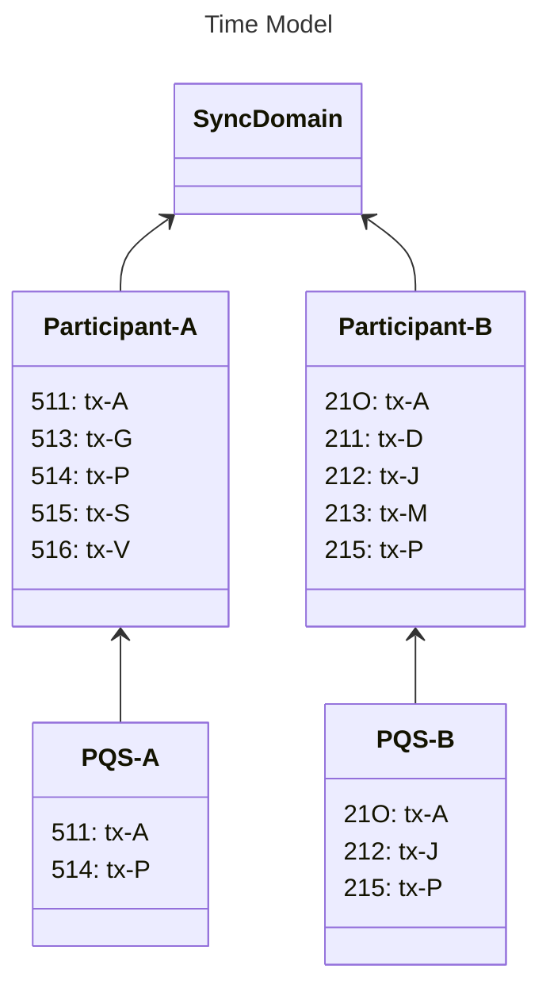

<Warning>
  이 페이지는 팀 리서치를 위한 비공식 한글 번역입니다. 기술적 판단에는 [공식 영어 원문](https://docs.canton.network/appdev/reference/pqs-sql-reference.md)을 사용하세요.
</Warning>

import DamlDocsAppdevReferencePqsSqlReferenceL316 from "/snippets/daml-docs/appdev_reference_pqs-sql-reference_L316.mdx";
import DamlDocsAppdevReferencePqsSqlReferenceL323 from "/snippets/daml-docs/appdev_reference_pqs-sql-reference_L323.mdx";
import DamlDocsAppdevReferencePqsSqlReferenceL347 from "/snippets/daml-docs/appdev_reference_pqs-sql-reference_L347.mdx";
import DamlDocsAppdevReferencePqsSqlReferenceL370 from "/snippets/daml-docs/appdev_reference_pqs-sql-reference_L370.mdx";
import DamlDocsAppdevReferencePqsSqlReferenceL381 from "/snippets/daml-docs/appdev_reference_pqs-sql-reference_L381.mdx";
import DamlDocsAppdevReferencePqsSqlReferenceL391 from "/snippets/daml-docs/appdev_reference_pqs-sql-reference_L391.mdx";
import DamlDocsAppdevReferencePqsSqlReferenceL410 from "/snippets/daml-docs/appdev_reference_pqs-sql-reference_L410.mdx";
import DamlDocsAppdevReferencePqsSqlReferenceL416 from "/snippets/daml-docs/appdev_reference_pqs-sql-reference_L416.mdx";
import DamlDocsAppdevReferencePqsSqlReferenceL432 from "/snippets/daml-docs/appdev_reference_pqs-sql-reference_L432.mdx";
import DamlDocsAppdevReferencePqsSqlReferenceL455 from "/snippets/daml-docs/appdev_reference_pqs-sql-reference_L455.mdx";
import ExternalScribeMainScribeRstCodeDocsUserComponentHowtosPqsReferencesSqlApiSql208 from "/snippets/external/scribe/main/scribe-rst-code-docs-user-component-howtos-pqs-references-sql-api-sql-208.mdx";
import ExternalScribeMainScribeRstCodeDocsUserComponentHowtosPqsReferencesSqlApiSql216 from "/snippets/external/scribe/main/scribe-rst-code-docs-user-component-howtos-pqs-references-sql-api-sql-216.mdx";
import ExternalScribeMainScribeRstCodeDocsUserComponentHowtosPqsReferencesSqlApiSql244 from "/snippets/external/scribe/main/scribe-rst-code-docs-user-component-howtos-pqs-references-sql-api-sql-244.mdx";

PQS SQL API는 PostgreSQL database에 직접 provision됩니다. data consumer는 PQS process 자체가 아니라 SQL을 통해 이 API와 interact합니다.

PQS data는 contract table 간에 join하여 projection을 만들 수 있습니다(예: holding과 account template join). temporal offset model과 historical event function(`creates`, `archives`, `exercises`) 덕분에 PQS는 audit trail과 compliance query에 적합합니다.

{/* COPIED_START source="docs-website:replicated/pqs/3.5/component-howtos/pqs/references/sql-api.rst" hash="addc8b94" */}

# SQL API

data consumer는 PQS process와 직접 communicate하지 않지만 PQS가 database 자체에 provision한 API를 사용합니다. 이 SQL API는 user가 ledger에 access할 수 있는 consistent하고 stable한 interface를 제공하도록 설계되었습니다. reader가 interact해야 하는 유일한 database artifact인 function 집합으로 구성됩니다.

## Ledger time model

ledger를 query할 때 고려할 핵심 측면은 시간에 따른 history를 사용할 수 있다는 점입니다. 또한 distributed environment에는 여러 clock이 있으므로 time을 이해하기 어려울 수 있습니다.

### Offset

Participant Node는 *offset*이라는 index를 사용해 time을 model합니다. offset은 Participant Node의 local ledger에 대한 unique index입니다. 이를 ledger의 특정 offset 또는 index를 사용해 ledger item을 선택하는 것으로 생각할 수 있습니다.

offset은 ordered되며 Participant Node ledger의 transaction 순서를 나타냅니다. privacy와 filtering으로 인해 Participant Node의 offset sequence에는 일반적으로 gap이 있는 것처럼 보입니다.

offset은 Participant Node별로 고유하며 같은 transaction을 처리하는 peer Participant Node 간에도 consistent하지 않습니다. 각 Participant Node가 자체 ledger를 보유하고 permissioned transaction view를 기반으로 자체 offset을 allocate하기 때문입니다.

offset은 `created_at_offset`, `archived_at_offset`, `exercised_at_offset` column에서 string(Daml 2.x) 또는 integer(Daml 3.3 이상)로 표현됩니다(`pqs-references-types-of-returned-data` 참조).

### Ledger time

ledger time은 causal ordering을 보존하는 approximate wall-clock time(bounded skew 이내)입니다. 즉, 특정 time에 contract가 생성되면 그 time 이후에만 사용할 수 있습니다. ledger time은 `created_effective_at`, `archived_effective_at`, `exercised_effective_at` column으로 표현됩니다(`pqs-references-types-of-returned-data` 참조).

### Transaction ID

transaction ID와 offset의 관계는 다음과 같습니다:

- 모든 offset에 transaction ID가 있는 것은 아닙니다. 예를 들어 rejected transaction의 completion event는 실패했으므로 transaction ID가 없습니다.
- 주어진 offset에는 transaction ID가 최대 하나 있습니다.
- 각 transaction ID는 unique하며 항상 하나의 offset을 갖습니다.
- offset은 Participant Node가 allocate하고 해당 Participant Node에 고유하지만 transaction ID value는 모든 Participant Node에 공통입니다.
- 관련 offset으로 표현되는 transaction ordering은 Participant Node마다 다를 수 있습니다.
- transaction ID는 완전히 opaque하며 identification 이외의 information을 전달하지 않습니다.

### Which should I use?

data analysis 유형에 따라 서로 다른 tool이 필요합니다. 예를 들어 다음 유형의 analysis에는 아래 identifier가 유용할 수 있습니다:

- Causal: **Offset**은 participant가 결정한 ledger commit ordering과 일치하는 causal order로 event를 이해할 수 있게 합니다.
- Systematic: **Transaction ID**는 개별 transaction의 공통 identifier 역할을 하며 여러 Participant Node 간 correlation에 필요합니다.
- Temporal: **Ledger Time**은 bounded skew를 적용한 wall-clock time 기준 event ordering을 제공합니다. 필요한 precision에 따라 유용할 수 있습니다.

## PQS time model

PQS는 세 identifier를 모두 제공하지만 order는 offset이 정의합니다. 이를 통해 PQS는 ledger transaction의 consistent view를 제공할 수 있습니다.

offset은 SQL API에 깊이 embedded되어 user가 consistency를 제공하는 방식으로 ledger를 query할 수 있게 합니다. user는 query할 offset을 지정하거나 사용 가능한 최신 offset을 query할 수 있습니다.

다음 figure는 두 Participant Node와 각각의 ledger를 보여 줍니다. 각 Participant Node에는 자체 PQS instance가 있으며, PQS는 항상 해당 node가 볼 권한이 있는 ledger 부분을 보유합니다:

offset(prefix)은 Participant Node와 PQS에 공통이지만 Transaction ID(suffix)는 전체에서 공유되는 것도 확인할 수 있습니다.

## Offset management

다음 function은 ledger의 temporal perspective를 제어하며 query에서 time을 고려하는 방식을 제어할 수 있게 합니다. PQS는 ledger의 eventually consistent perspective를 expose하므로 다음 방식으로 query할 수 있습니다:

- **Ignore**: *사용 가능한 최신* state입니다.
- **Pin**: 특정 time의 ledger state입니다.
- **Span**: audit trail 등 time range에 걸친 ledger event입니다.
- **Consistency**: ledger와 수행한 다른 interaction(read 또는 write)과 consistency를 유지하는 방식의 ledger입니다.

다음 function을 사용하면 ledger의 temporal scope를 제어할 수 있습니다. 이는 후속 query가 실행되는 context를 설정합니다:

- `set_latest(offset)`: ledger 관찰에 포함할 최신 data의 offset을 지정합니다. `NULL`이면 사용 가능한 최신 offset을 사용합니다. 실제 사용할 offset을 반환합니다. 제공한 offset이 사용 가능한 범위를 벗어나면 error가 발생합니다.
- `validate_offset_exists(offset)`: datastore가 제공된 offset까지 포함하는 complete history를 보유하는지 validate합니다. 지정한 offset을 사용할 수 없으면(너무 오래되었거나 너무 최신이면) error를 반환합니다.
- `set_oldest(offset)`: query scope에 포함할 가장 오래된 event의 offset을 지정합니다. `NULL`이면 사용 가능한 가장 오래된 offset을 사용합니다. function은 실제 사용된 offset을 반환합니다. 제공한 offset이 사용 가능한 범위를 벗어나면 error가 발생합니다.
- `nearest_offset(time)`: 주어진 time 또는 현재 이전의 interval에 해당하는 offset을 결정하는 helper function입니다.
- `pruned_offset()`: database가 prune된 지점까지의 offset을 반환하며 pruning이 발생하지 않았으면 `NULL`을 반환합니다.

## Accessing contracts and exercises

이 scope에서 다음 table function[^1]은 ledger access를 허용하며 query에서 직접 사용됩니다. table 또는 view와 유사한 방식으로 사용하도록 설계되어 offset의 영향을 제거한 상태에서 user가 query하려는 data에 집중할 수 있게 합니다.

- `active(name, [at_offset])`: 최신 offset 시점에 존재한 target template/interface view의 active instance
- `creates(name, [from_offset], [to_offset])`: 가장 오래된 offset과 최신 offset 사이에 발생한 target template/interface view의 create event
- `archives(name, [from_offset], [to_offset])`: 가장 오래된 offset과 최신 offset 사이에 발생한 target template/interface view의 archive event
- `exercises(name, [from_offset], [to_offset])`: 가장 오래된 offset과 최신 offset 사이에 발생한 target choice의 exercise event

<Note>
pruning 후 `archives()`, `exercises()` 및 관련 summary function(`summary_archives`, `summary_exercises`, `summary_transients`)은 가능한 경우 `from_offset`의 default를 pruned offset으로 설정해 pruned range에 대한 불필요한 scan을 방지합니다. `creates()`, `summary_creates()`, `summary_updates()`는 active contract와 archived contract를 모두 다루므로 영향을 받지 않습니다.
</Note>

`name` identifier는 package 지정 여부와 관계없이 사용할 수 있습니다:

- Fully qualified: `<package>:<module>:<template|interface|choice>`
- Partially qualified: `<module>:<template|interface|choice>` 또는 `<template|interface|choice>`(unambiguous한 경우)

ambiguous한 결과가 있으면 partially qualified identifier가 실패합니다.

이 function에는 user가 사용할 offset range를 지정할 수 있는 optional parameter가 있습니다. 이 argument를 제공하는 것은 session에서 먼저 `set_*` function을 사용하는 방식의 대안입니다. 다음 query는 동일합니다:

Implicit: context-oriented exploration에 적합합니다.

<ExternalScribeMainScribeRstCodeDocsUserComponentHowtosPqsReferencesSqlApiSql208 />

Explicit: 전체 context를 inline하여 하나의 statement로 내보낼 때 유용합니다.

<ExternalScribeMainScribeRstCodeDocsUserComponentHowtosPqsReferencesSqlApiSql216 />

## Accessing transactions metadata

경우에 따라 contract/exercise 자체 대신 ledger transaction의 metadata에 access해야 할 수 있습니다. 이전 section에서 설명한 primary table function이 직접 expose하지 않는 추가 data를 제공하는 `transactions` view를 통해 이를 수행할 수 있습니다:

| 이름                        | Type                       | 설명                                                                                                                                                                                                   |
|-----------------------------|----------------------------|---------------------------------------------------------------------------------------------------------------------------------------------------------------------------------------------------------------|
| `ix`                        | `bigint`                   | ledger transaction의 internal primary key |
| `offset`                    | `bigint`                   | Ledger offset |
| `transaction_id`            | `text`                     | ledger가 assign한 Transaction ID |
| `effective_at`              | `timestamp with time zone` | Ledger effective time |
| `workflow_id`               | `text`                     | Command submission에 사용된 Workflow ID |
| `trace_context`             | `trace_context`            | Ledger API trace context(`(trace_parent: text, trace_state: text)`를 포함하는 user-defined type, `trace_context <com.daml.ledger.api.v2.Completion.trace_context>` 및 `pqs-trace-context-propagation` 참조) |
| `external_transaction_hash` | `bytea`                    | External Party가 제출한 transaction의 hash(`external_transaction_hash <com.daml.ledger.api.v2.Transaction.external_transaction_hash>` 참조) |
| `paid_traffic_cost`         | `bigint`                   | 제출한 Participant Node가 지불한 traffic cost입니다. Participant Node가 submitter가 아니거나 Ledger API에서 traffic cost 제공을 시작하기 전에 처리되었거나 repair transaction이면 Null입니다. submitter의 Synchronizer가 traffic control을 enforce하지 않으면 0이고, enforce하면 양수입니다(sequencer에 `enforceRateLimiting = true`를 설정해야 `TrafficReceipt`가 채워져 non-null value를 생성함). `paid_traffic_cost <com.daml.ledger.api.v2.Transaction.paid_traffic_cost>`를 참조하세요. |

contract/exercise 대상 query는 적절한 `*_at_ix` column을 통해 join하여 transaction metadata로 쉽고 효율적으로 보강할 수 있습니다. 예:

<ExternalScribeMainScribeRstCodeDocsUserComponentHowtosPqsReferencesSqlApiSql244 />

## Summary functions

지정한 offset range에서 사용 가능한 ledger data overview를 제공하는 summary function이 있습니다:

- `summary_transients(from_offset, to_offset)`: offset range 내 Daml fully qualified name별 transient 수입니다.
- `summary_updates(from_offset, to_offset)`: offset range 내 Daml fully qualified name별 create 및 archive count summary입니다.

다음 function은 `template_fqn`별 event count를 조회합니다:

- `summary_active(at_offset)`
- `summary_creates(from_offset, to_offset)`
- `summary_archives(from_offset, to_offset)`
- `summary_exercises(from_offset, to_offset)`

## Lookup functions

- `lookup_contract(contract_id)`는 Daml qualified name을 알 필요 없이 contract data를 조회하는 mechanism입니다. 이 function은 contract와 관련된 모든 interface view projection을 모두 반환하며 `payload_type` column으로 구분할 수 있습니다.
- `lookup_exercises(contract_id)`는 Daml qualified name을 알 필요 없이 choice exercise data를 조회하는 mechanism이며 Contract ID만 알면 됩니다.

## Types of returned data

contract data를 반환하는 모든 function은 다음 column을 반환합니다:

| 이름                    | Type                          | 설명                                                                                                                                            |
|-------------------------|-------------------------------|--------------------------------------------------------------------------------------------------------------------------------------------------------|
| `template_fqn`          | `text`                        | template 또는 interface의 fully-qualified name |
| `payload_type`          | `'template'` or `'interface'` | contract payload type |
| `create_event_pk`       | `bigint`                      | contract creation event primary key 참조 |
| `create_event_id`       | `(bigint, integer)`           | creation event의 orderable addressing type `(offset, node ID)` |
| `created_at_ix`         | `bigint`                      | creation event를 포함하는 transaction의 ordinal index |
| `created_at_offset`     | `bigint`                      | creation event를 포함하는 transaction의 ledger offset |
| `created_effective_at`  | `timestamp with time zone`    | creation event를 포함하는 transaction의 Ledger effective time |
| `archive_event_pk`      | `bigint`                      | contract archival event primary key 참조 |
| `archive_event_id`      | `(bigint, integer)`           | archival event의 orderable addressing type `(offset, node ID)` |
| `archived_at_ix`        | `bigint`                      | archival event를 포함하는 transaction의 ordinal index |
| `archived_at_offset`    | `bigint`                      | archival event를 포함하는 transaction의 ledger offset |
| `archived_effective_at` | `timestamp with time zone`    | archival event를 포함하는 transaction의 Ledger effective time |
| `life_ix`               | `int8range`                   | ordinal index로 표현된 contract lifespan |
| `contract_id`           | `text`                        | ledger가 assign한 Contract ID |
| `payload`               | `jsonb`                       | contract data의 JSONB representation |
| `metadata`              | `bytea`                       | explicit contract disclosure metadata(`stakeholder-contract-share` 참조) |
| `package_name`          | `text`                        | Daml package name |
| `package_version`       | `text`                        | representative Daml package의 version |
| `package_id`            | `text`                        | representative Package ID입니다. decoding에 사용되는 Daml package이며 연결된 Participant Node에 존재하는 것이 보장됩니다. |
| `creation_package_id`   | `text`                        | ledger의 original creation-time Package ID입니다. 연결된 Participant Node에 없는 package를 참조할 수 있습니다. |
| `redaction_id`          | `text`                        | Redaction process 참조 |
| `signatories`           | `text[]`                      | contract 생성에 동의한 Party |
| `observers`             | `text[]`                      | contract를 볼 수 있는 추가 stakeholder |
| `witnesses`             | `text[]`                      | 이 event에 대한 notification을 받는 Party |
| `divulged_only`         | `boolean`                     | contract가 divulge만 되었는지(`true`) 또는 적절히 disclose되었는지(`false`) 나타냅니다. background information은 `da-model-divulgence`를 참조하세요. |

#### Package ID and Daml upgrades

- `package_id`는 decoding에 사용되는 representative Package ID이며 연결된 Participant Node에 존재하는 것이 보장됩니다.
- `creation_package_id`는 creation transaction의 original Package ID입니다.
- `package_version`은 representative package의 version을 반영합니다.

Smart Contract Upgrade(SCU)에서는 re-encoding이 발생하지 않습니다. creation package는 package store에 유지되고 representative package로 남으므로 `package_id`와 `creation_package_id`가 동일합니다.

Major Upgrade(MUT)에서는 Participant Node가 새 package version을 사용해 contract data를 re-encode합니다. 이 경우 `package_id`는 새 representative package를 참조하고 `creation_package_id`는 Participant Node에 더 이상 존재하지 않을 수 있는 원본을 보존합니다.

exercise data를 반환하는 모든 function은 다음 column을 반환합니다:

| 이름                      | Type                       | 설명                                                                                                                                                                                                    |
|---------------------------|----------------------------|----------------------------------------------------------------------------------------------------------------------------------------------------------------------------------------------------------------|
| `template_fqn`            | `text`                     | choice가 정의된 template의 fully-qualified name |
| `choice_fqn`              | `text`                     | choice의 fully-qualified name |
| `choice`                  | `text`                     | Choice name |
| `consuming`               | `boolean`                  | choice가 consuming인지 여부 |
| `exercise_event_pk`       | `bigint`                   | choice exercise event primary key 참조 |
| `exercise_event_id`       | `(bigint, integer)`        | exercise event의 orderable addressing type `(offset, node ID)` |
| `exercised_at_ix`         | `bigint`                   | exercise event를 포함하는 transaction의 ordinal index |
| `exercised_at_offset`     | `bigint`                   | exercise event를 포함하는 transaction의 ledger offset |
| `exercised_effective_at`  | `timestamp with time zone` | exercise event를 포함하는 transaction의 Ledger effective time |
| `contract_id`             | `text`                     | ledger가 assign한 Contract ID |
| `argument`                | `jsonb`                    | choice argument type의 JSONB representation |
| `result`                  | `jsonb`                    | choice return type의 JSONB representation |
| `package_name`            | `text`                     | Daml package name |
| `package_version`         | `text`                     | representative Daml package의 version |
| `package_id`              | `text`                     | representative Package ID입니다. decoding에 사용되는 Daml package이며 연결된 Participant Node에 존재하는 것이 보장됩니다. |
| `redaction_id`            | `text`                     | Redaction process 참조 |
| `signatories`             | `text[]`                   | choice가 exercise된 contract의 생성에 동의한 Party |
| `observers`               | `text[]`                   | choice가 exercise된 contract의 생성을 알게 된 추가 stakeholder |
| `controllers`             | `text[]`                   | 이 choice를 공동으로 exercise한 Party(`acting_parties <com.daml.ledger.api.v2.ExercisedEvent.acting_parties>` 참조) |
| `witnesses`               | `text[]`                   | 이 event에 대한 notification을 받는 Party |
| `last_descendant_node_id` | `integer`                  | 이 exercise event의 결과로 나타난 동일 transaction 내 event에 대한 node ID의 upper boundary(`last_descendant_node_id <com.daml.ledger.api.v2.ExercisedEvent.last_descendant_node_id>` 참조) |

## JSONB encoding

PQS는 Daml-LF value의 Daml-LF JSON-based encoding(`reference-json-lf-value-specification` 참조)을 사용해 ledger를 저장합니다. encoding overview는 아래와 같습니다.

SQL에서 JSONB data[^2]를 native하게 다루는 방법은 PostgreSQL documentation을 참조하세요.

ledger의 value(contract payload와 key, interface view, exercise argument, return value)는 primitive type, user-defined record, variant 또는 enum일 수 있습니다. 이 type은 다음과 같이 JSON type[^3]으로 변환됩니다:

### Primitive types

| Daml type    | JSON type                                                                                                                                                                               |
|--------------|-----------------------------------------------------------------------------------------------------------------------------------------------------------------------------------------|
| `ContractID` | [string](https://json-schema.org/understanding-json-schema/reference/string)으로 표현 |
| `Int64`      | [string](https://json-schema.org/understanding-json-schema/reference/string)으로 표현 |
| `Decimal`    | [string](https://json-schema.org/understanding-json-schema/reference/string)으로 표현 |
| `List`       | [array](https://json-schema.org/understanding-json-schema/reference/array)로 표현 |
| `Text`       | [string](https://json-schema.org/understanding-json-schema/reference/string)으로 표현 |
| `Date`       | [string](https://json-schema.org/understanding-json-schema/reference/string)으로 표현된 ISO 8601 date |
| `Time`       | [string](https://json-schema.org/understanding-json-schema/reference/string)으로 표현된 ISO 8601 time(UTC) |
| `Bool`       | [boolean](https://json-schema.org/understanding-json-schema/reference/boolean)로 표현 |
| `Party`      | [string](https://json-schema.org/understanding-json-schema/reference/string)으로 표현 |
| `Unit`       | 빈 object `{}`로 표현 |
| `Optional`   | [nullable](https://json-schema.org/understanding-json-schema/reference/null) value 또는 [array](https://json-schema.org/understanding-json-schema/reference/array)(context에 따라 다름) |

### User-defined types

| Daml type | JSON type                                                                                                                                                                                                       |
|-----------|-----------------------------------------------------------------------------------------------------------------------------------------------------------------------------------------------------------------|
| `Record`  | 각 create parameter name이 key이고 parameter value가 JSON-encoded value인 [object](https://json-schema.org/understanding-json-schema/reference/object)로 표현 |
| `Variant` | `{"tag": "CONSTRUCTOR", "value": <JSON-encoded value>}` format을 사용해 [object](https://json-schema.org/understanding-json-schema/reference/object)로 표현합니다. 예: `{"tag": "Left", "value": true}` |
| `Enum`    | value가 constructor name인 [string](https://json-schema.org/understanding-json-schema/reference/string)으로 표현 |

[^1]: [PostgreSQL table function](https://www.postgresql.org/docs/current/xfunc-sql.html#XFUNC-SQL-TABLE-FUNCTIONS)

[^2]: [PostgreSQL JSONB containment](https://www.postgresql.org/docs/current/datatype-json.html#JSON-CONTAINMENT)

[^3]: [JSON Schema type reference](https://json-schema.org/understanding-json-schema/reference/type)

{/* COPIED_END */}

## Offset model

validator는 local ledger에 대한 unique integer index인 **offset**을 사용해 time을 model합니다. offset은 ordered되며 transaction의 causal order를 나타냅니다. privacy filtering으로 인해 주어진 validator의 offset sequence에는 일반적으로 gap이 있습니다.

offset은 개별 validator에 고유하며 같은 transaction에 대해서도 peer 간에 consistent하지 않습니다. 각 node는 permissioned view를 기반으로 자체 offset을 allocate합니다.

PQS는 offset 외에도 **ledger time**(causal ordering을 보존하는 approximate wall-clock time)과 **transaction ID**(모든 validator에 공통인 opaque identifier)를 expose합니다. causal analysis에는 offset을, cross-node correlation에는 transaction ID를, temporal query에는 ledger time을 사용하세요.

## Offset management

temporal window를 pin하려면 session에서 query를 실행하기 전에 `set_oldest`와 `set_latest`를 호출하거나 table function에 offset argument를 직접 전달하세요(아래 참조).

## Table functions for contracts and exercises

<Warning>
결과가 ambiguous하면 partially qualified identifier가 실패합니다.
</Warning>

이 function은 `set_oldest`/`set_latest`를 미리 호출하는 방식의 대안으로 optional offset parameter를 받습니다. 다음 두 방식은 동일합니다:

<DamlDocsAppdevReferencePqsSqlReferenceL316 />

<DamlDocsAppdevReferencePqsSqlReferenceL323 />

## Lookup functions

## Transactions view

`transactions` view는 위 table function이 직접 expose하지 않는 transaction metadata를 제공합니다.

| Column | Type | 설명 |
|---|---|---|
| `ix` | `bigint` | ledger transaction의 internal primary key |
| `offset` | `bigint` | Ledger offset |
| `transaction_id` | `text` | ledger가 assign한 Transaction ID |
| `effective_at` | `timestamp with time zone` | Ledger effective time |
| `workflow_id` | `text` | Command submission에 사용된 Workflow ID |
| `trace_context` | `trace_context` | Ledger API trace context(user-defined type이며 `trace_parent`와 `trace_state`를 포함) |
| `external_transaction_hash` | `bytea` | External Party가 제출한 transaction의 hash |
| `paid_traffic_cost` | `bigint` | 제출한 Participant Node가 지불한 traffic cost입니다. 전체 semantic은 위 첫 번째 transactions table을 참조하세요. |

`*_at_ix` column을 통해 join하여 contract 또는 exercise data를 transaction metadata로 보강합니다:

<DamlDocsAppdevReferencePqsSqlReferenceL347 />

## Summary functions

이 section은 향후 update에서 확장될 예정입니다. PQS query pattern과 usage는 [PQS documentation](/appdev/deep-dives/query-with-pqs)을 참조하세요.

## Contract columns

이 section은 향후 update에서 확장될 예정입니다. contract column은 `creates()` function이 반환하는 table에서 사용할 수 있습니다. join pattern은 위 `transactions` table을 참조하세요.

## Exercise columns

이 section은 향후 update에서 확장될 예정입니다. exercise column은 `exercises()` function이 반환하는 table에서 사용할 수 있습니다.

## JSONB indexing

PQS metadata column은 default로 index되지만 `payload` content(JSONB column)에 대한 query가 적절한 performance를 내려면 custom index가 필요합니다. `create_index_for_contract` helper를 사용해 internal contract table에 expression index를 생성하세요:

<DamlDocsAppdevReferencePqsSqlReferenceL370 />

index를 생성한 후 PostgreSQL이 statistics를 수집하도록 underlying table에서 `VACUUM ANALYZE`를 실행하세요:

<DamlDocsAppdevReferencePqsSqlReferenceL381 />

text field에서 equality-only lookup을 수행할 때는 `hash` index가 더 compact합니다:

<DamlDocsAppdevReferencePqsSqlReferenceL391 />

<Note>
index된 두 field 사이에 statistical dependency가 있으면(예: `wallet.holder`가 `wallet.label`을 결정) PostgreSQL이 result cardinality를 크게 과소평가할 수 있습니다. 이를 보정하려면 dependent expression에 [extended statistics](https://www.postgresql.org/docs/current/sql-createstatistics.html)를 생성하세요.
</Note>

## Maintenance functions

### Pruning

`prune_to_offset(offset)`는 주어진 offset까지 포함한 모든 transaction을 영구적으로 제거합니다. Active contract는 새 offset 아래 보존되며 그 밖의 모든 transaction data(archived contract, exercise event)는 삭제됩니다.

<DamlDocsAppdevReferencePqsSqlReferenceL410 />

timestamp 또는 interval 기준으로 prune하려면 `nearest_offset()`과 함께 사용하세요:

<DamlDocsAppdevReferencePqsSqlReferenceL416 />

<Warning>
Pruning은 되돌릴 수 없습니다. target offset은 contiguous history의 bound 안에 있어야 하며 최신 consistent checkpoint와 일치할 수 없습니다.
</Warning>

### Redaction

Redaction은 event metadata를 보존하면서 특정 contract 또는 exercise에서 sensitive data를 제거합니다.

- `redact_contract(contract_id, redaction_id)` -- archived contract 및 해당 interface view의 `payload`와 `contract_key`를 null로 만듭니다. 영향을 받은 entry 수를 반환합니다.
- `redact_exercise(event_id, redaction_id)` -- exercise event의 `argument`와 `result`를 null로 만듭니다.

<DamlDocsAppdevReferencePqsSqlReferenceL432 />

active contract는 redact할 수 없으며 이미 redact된 contract를 다시 redact할 수도 없습니다. exercise event에는 이러한 제한이 없습니다. redaction 후 query result의 `redaction_id` column에 값이 채워지고 data column은 `NULL`을 반환합니다.

### History Slicing

PQS는 `--pipeline-ledger-start` 및 `--pipeline-ledger-stop` command-line option을 통한 history slicing을 지원합니다. 이 option을 사용하면 ledger history의 특정 range를 요청할 수 있습니다. 특정 time window만 다루는 PQS instance가 필요할 때 유용합니다. 예를 들어 특정 분기의 data로 reporting database를 채우거나 participant가 prune된 후 오래된 history를 건너뛰는 lightweight instance를 만들 수 있습니다.

start 및 stop offset에는 제약이 있습니다. 다음 경우 PQS는 즉시 실패합니다:

- 요청한 offset range가 participant의 사용 가능한 ledger history를 벗어나는 경우
- start offset이 pruned region 또는 pruned ledger의 genesis를 참조하는 경우
- 요청한 range가 PQS datastore의 기존 history에 gap을 만드는 경우(datastore가 아직 확인하지 않은 offset을 건너뛸 수 없음)

pruned participant를 사용하는 경우 `--pipeline-ledger-start`를 participant의 pruning point 또는 그 이후 offset으로 설정하세요.

### Resetting

`reset_to_offset(offset)`는 주어진 offset **이후**의 모든 transaction을 제거하여 PQS가 해당 지점부터 processing을 resume할 수 있게 합니다. 먼저 dry-run validation을 사용할 수 있습니다:

<DamlDocsAppdevReferencePqsSqlReferenceL455 />

<Warning>
Resetting은 destructive하며 permanent합니다. reset하기 전에 PQS와 모든 consuming application을 중지하세요. 특히 disaster-recovery scenario에서는 validator operator와 조율하세요.
</Warning>
