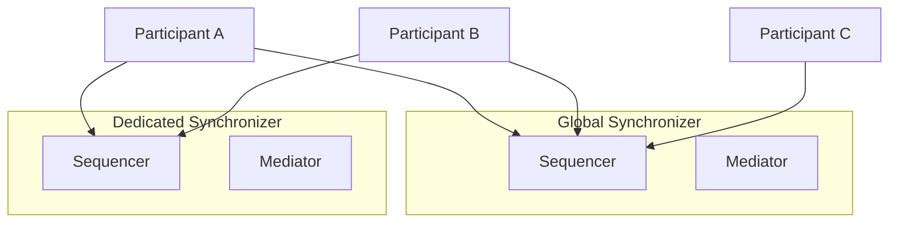

<Warning>
  이 페이지는 팀 리서치를 위한 비공식 한글 번역입니다. [공식 영어 원문](https://docs.canton.network/global-synchronizer/extension-synchronizers/dedicated-synchronizers.md)을 함께 확인하세요.
</Warning>

import CANTON_DOCS_CN_GS_EXTENSION_SYNCHRONIZERS_PRIVATE_SYNCHRONIZERS_0 from "/snippets/external/canton/main/docs-open/target/snippet_json_data/docs-cn/global-synchronizer-extension-synchronizers-private-synchronizers-0.mdx";

Canton Network application은 Global Synchronizer만 사용하도록 제한되지 않습니다. 서로 다른 privacy, performance 또는 governance 특성이 필요한 workload를 위해 Global Synchronizer와 함께 Dedicated Synchronizer, Extension Synchronizer 또는 Private Synchronizer라고도 부르는 Synchronizer를 운영할 수 있습니다.

## Dedicated Synchronizer를 사용하는 이유

Global Synchronizer는 Canton Network의 public backbone으로, Canton Coin, identity management 및 조직 간 workflow를 위한 synchronization layer를 제공합니다. 하지만 일부 workload는 다음과 같은 이유로 Dedicated Synchronizer가 더 적합합니다.

- **Privacy**: Dedicated Synchronizer의 transaction data는 전체 MainNet이 아니라 stakeholder party에게만 표시됩니다.
  Contract를 Dedicated Synchronizer에 유지하면 "harvest now, decrypt later" 방식의 quantum threat를 완화할 수 있습니다.
- **Performance**: Dedicated Synchronizer는 다른 network traffic의 영향을 받지 않고 특정 throughput 및 latency requirement에 맞게 조정할 수 있습니다.
- **Control and Compliance**: Regulatory, security 또는 operational requirement 때문에 자체 Synchronizer가 필요할 수 있습니다.
- **Reserved bandwidth**: Workload를 위해 확보한 hardware와 bandwidth로 볼 수 있습니다. 하나의 network를 유지하면서 모두를 위한 capacity를 추가합니다.

Dedicated Synchronizer는 private blockchain이 아니라 공유 Canton Network의 dedicated capacity입니다. 이 때문에 "private"가 아니라 "dedicated"라는 용어를 사용합니다.

## 동작 방식

Dedicated Synchronizer는 자체 Sequencer Node와 Mediator Node를 운영합니다. Participant는 Canton Coin 및 cross-network interoperability를 위해 Global Synchronizer에 연결하고, application-specific transaction을 위해 하나 이상의 Dedicated Synchronizer에도 연결합니다.

Canton의 Multi-Synchronizer Protocol을 사용하면 하나의 Participant가 여러 Synchronizer에 동시에 연결될 수 있습니다. Contract는 연결된 임의의 Synchronizer에 assign할 수 있습니다. 서로 다른 Synchronizer에 있는 contract가 상호작용해야 할 때 Canton Protocol이 Cross-Synchronizer Transaction을 자동으로 처리합니다.

이 예에서 Participant A와 B는 두 Synchronizer에 모두 연결되어 어느 쪽에서도 transaction을 수행할 수 있습니다. Participant C는 Global Synchronizer에만 연결되므로 Dedicated Synchronizer의 contract와 상호작용할 수 없습니다.

## Dedicated Synchronizer 요구 사항

Dedicated Synchronizer를 배포하거나 배포를 계획하는 조직은 다음 operational obligation을 이해해야 합니다.

- **Canton Coin(CC) fee burning**: 가까운 미래에는 Dedicated Synchronizer의 Validator가 Canton Network에서 CC를 burn해야 합니다.
- **Global Synchronizer compatibility**: Dedicated Synchronizer는 항상 Global Synchronizer와 compatibility를 유지해야 합니다.
  Network interoperability를 유지하려면 Validator가 mandated upgrade를 적시에 적용해야 합니다.
- **Global Synchronizer connection 유지**: Dedicated Synchronizer를 운영하는 조직은 accounting과 settlement를 위해 Global Synchronizer와 persistent connection을 유지해야 합니다. 이 connection을 통해 fee를 계산하고 CC burn obligation을 이행합니다.

## Dedicated Synchronizer 사용 시점

Dedicated Synchronizer는 다음 경우에 적합합니다.

- 알려진 participant 집합 사이에서 application이 high-volume transaction을 처리해 Dedicated Synchronizer가 더 경제적인 경우
- Regulatory requirement에 따라 transaction data를 특정 jurisdiction 또는 infrastructure 안에 유지해야 하는 경우
- Global Synchronizer load와 독립적인 guaranteed performance 특성이 필요한 경우
- 더 넓은 network에 공개할 필요가 없는 bilateral 또는 multilateral agreement를 workflow에서 사용하는 경우. 이는 "harvest now, decrypt later" 방식의 quantum threat를 완화합니다.

Dedicated Synchronizer는 다음 경우에 필요하지 않습니다.

- 다른 Canton Network application 및 wallet과의 최대 수준 interoperability만 필요한 경우
- 하나의 Synchronizer connection을 운영하는 단순성을 선호하는 경우

## Deployment Model

### Self-Operated

자체 Sequencer Node와 Mediator Node를 운영합니다. Infrastructure, configuration 및 access policy를 완전히 control할 수 있으며 availability, backup 및 upgrade도 직접 책임집니다.

### Third Party 운영

신뢰하는 third party가 Synchronizer infrastructure를 대신 운영합니다. Participant는 해당 operator의 Sequencer endpoint에 연결합니다. Operator가 infrastructure를 control하지만 Canton privacy model에 따라 transaction content는 확인할 수 없고 encrypted message envelope만 볼 수 있습니다.

### Multi-Operator, BFT

여러 조직이 BFT consensus protocol을 사용하는 decentralized governance를 통해 Synchronizer를 공동 운영합니다. Global Synchronizer model과 유사하지만 더 작은 private operator 집합을 사용합니다. 단일 operator가 offline 상태가 되거나 malicious하게 행동하는 상황에 대한 resilience를 제공합니다.

## Dedicated Synchronizer 연결

Validator는 Canton Admin API 또는 Canton Console을 통해 Dedicated Synchronizer에 연결합니다. 연결에는 Sequencer endpoint URL과 적절한 authentication credential이 필요합니다.

<CANTON_DOCS_CN_GS_EXTENSION_SYNCHRONIZERS_PRIVATE_SYNCHRONIZERS_0 />

연결되면 Validator는 transaction submission에서 target Synchronizer로 Dedicated Synchronizer를 지정하여 그곳에 contract를 생성할 수 있습니다.

## Global Synchronizer와의 관계

Dedicated Synchronizer와 Global Synchronizer는 상호 보완적입니다.

- **Canton Coin** operation은 항상 Global Synchronizer를 사용합니다.
- **Smart contract**는 Validator에만 존재하지만 requirement에 따라 어느 Synchronizer에도 assign할 수 있습니다.
- 서로 다른 Synchronizer의 contract가 상호작용해야 할 때 **Cross-Synchronizer Transaction**이 가능하며 Canton이 coordination을 자동 처리하거나 Synchronizer를 직접 지정할 수 있습니다.

## 다음 단계

- [Hybrid Synchronizer Pattern](/global-synchronizer/extension-synchronizers/hybrid-synchronizer-pattern): Public Synchronizer와 Dedicated Synchronizer 결합
- [Deployment](/global-synchronizer/extension-synchronizers/deployment): Extension Synchronizer infrastructure 배포
- [Linking Validators](/global-synchronizer/extension-synchronizers/linking-validator-multi-sync): Multi-Synchronizer Validator configuration
