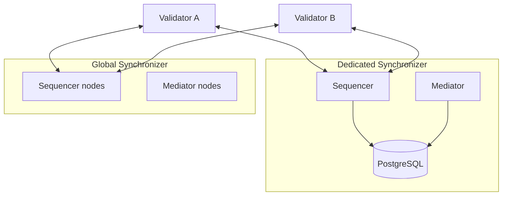
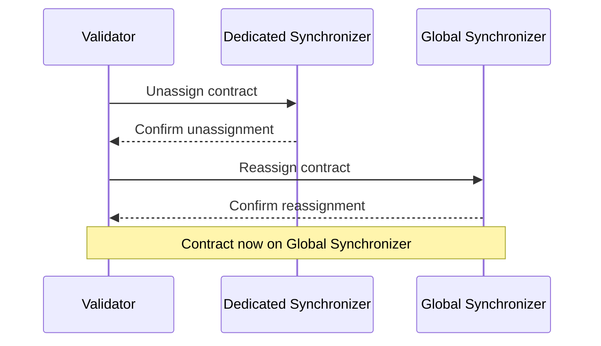

import CANTON_DOCS_CN_GS_EXTENSION_SYNCHRONIZERS_HYBRID_SYNCHRONIZER_PATTERN_0 from "/snippets/external/canton/main/docs-open/target/snippet_json_data/docs-cn/global-synchronizer-extension-synchronizers-hybrid-synchronizer-pattern-0.mdx";

<Warning>
  이 페이지는 팀 리서치를 위한 비공식 한글 번역입니다. 기술적 판단에는 [공식 영어 원문](https://docs.canton.network/global-synchronizer/extension-synchronizers/hybrid-synchronizer-pattern.md)을 사용하세요.
</Warning>


Canton Network의 일반적인 deployment pattern은 Dedicated Synchronizer와 Global Synchronizer를 결합합니다. Validator는 양쪽에 모두 연결되어 high-volume 또는 confidential workflow를 Dedicated Synchronizer에서 실행하고 Global Synchronizer를 통해 결과를 settle하거나 공유합니다.

## Hybrid setup을 사용하는 이유

Global Synchronizer는 Network 전체 interoperability와 Canton Coin access를 제공하지만 모든 workflow가 shared infrastructure에서 실행될 때 이점을 얻는 것은 아닙니다. 다음과 같은 경우 hybrid pattern이 적합합니다.

- **High-volume bilateral flow** — 작은 Party 집합 사이의 빈번한 Transaction(예: 두 counterparty의 trade confirmation)이 Global Synchronizer의 불필요한 traffic을 소비하는 경우
- **Confidential processing stage** — Intermediate computation step은 직접 control하는 infrastructure에 유지하고 final result만 Global Synchronizer에 publish해야 하는 경우
- **Latency-sensitive operation** — Dedicated Synchronizer가 더 적은 Node를 실행하므로 Global Synchronizer보다 낮은 latency가 필요한 workflow
- **비용 최적화** — Transaction throughput이 높을 때 Canton Coin traffic 비용 절감

## Architecture 개요

Hybrid deployment에서 각 Validator는 Global Synchronizer와 하나 이상의 Dedicated Synchronizer 모두에 connection을 유지합니다. Contract는 current lifecycle stage에 적합한 Synchronizer에 assign됩니다.



두 Validator는 어느 Synchronizer에서도 Transaction을 수행할 수 있습니다. Dedicated Synchronizer에서 생성된 contract는 나중에 Canton unassignment/Reassignment protocol을 사용해 Global Synchronizer로 Reassignment할 수 있으며 반대 방향도 가능합니다.

## Contract assignment 전략

Contract 생성 시 해당 contract가 존재할 Synchronizer를 control하며 필요에 따라 Synchronizer 사이에서 contract를 이동할 수 있습니다.

**Dedicated에서 생성하고 public에서 settle:**

1. 두 Party가 Transaction volume이 높고 latency가 낮은 Dedicated Synchronizer에서 trade contract를 생성하고 update합니다.
2. Trade가 settlement 준비를 마치면 submitting Party가 contract를 Global Synchronizer로 Reassignment합니다.
3. Global Synchronizer에서 settlement가 실행되어 다른 RWA 및 다른 Network Participant가 보유한 contract와 상호 작용할 수 있습니다.

**Public에서 생성하고 dedicated에서 처리:**

1. 모든 Party가 contract를 discover하고 상호 작용할 수 있도록 Global Synchronizer에서 생성합니다.
2. 두 Party가 함께 작업하기로 합의하면 intensive processing을 위해 contract를 Dedicated Synchronizer로 Reassignment합니다.
3. Final result를 Global Synchronizer로 다시 Reassignment합니다.

## Cross-Synchronizer Reassignment

Synchronizer 사이에서 contract를 이동하려면 submitting Validator가 source 및 target Synchronizer 모두에 연결되어 있어야 합니다. Operation은 Canton two-phase Reassignment protocol을 사용합니다.



Unassignment와 Reassignment 사이의 짧은 구간에는 contract를 exercise할 수 없습니다. 이 window의 영향을 최소화하도록 workflow를 계획하세요.

## Configuration

Validator를 두 Synchronizer에 연결하려면 각 Synchronizer connection을 등록합니다. Global Synchronizer connection은 일반적으로 onboarding 중 구성됩니다. Dedicated Synchronizer의 경우 Canton Console 또는 Admin API를 통해 connection을 추가합니다.

Canton Console 사용:


<CANTON_DOCS_CN_GS_EXTENSION_SYNCHRONIZERS_HYBRID_SYNCHRONIZER_PATTERN_0 />


Helm으로 deploy하면 Validator value에 추가 Synchronizer connection을 포함할 수 있습니다.

```yaml
participant:
  additionalSynchronizerConnections:
    - alias: "dedicated-sync"
      sequencerConnection: "https://sequencer.dedicated-sync.example.com"
```

## 고려 사항

- **Traffic 비용** — Dedicated Synchronizer 및 Global Synchronizer의 Transaction에 traffic fee가 발생합니다.
- **Validator overlap** — Contract에 참여하는 모든 Party의 Validator가 contract가 assign된 Synchronizer에 연결되어 있어야 합니다. 이에 맞춰 Synchronizer Topology를 계획하세요.
- **Ordering guarantee** — 각 Synchronizer는 자체 total ordering을 제공합니다. Cross-Synchronizer Transaction은 Canton protocol로 synchronize되지만 same-Synchronizer Transaction보다 latency가 높습니다.
- **운영 overhead** — Dedicated Synchronizer를 운영하면 Validator 외에 Sequencer 및 Mediator infrastructure도 운영해야 합니다. 필요한 작업은 [deployment guide](/global-synchronizer/extension-synchronizers/deployment)를 참조하세요.
