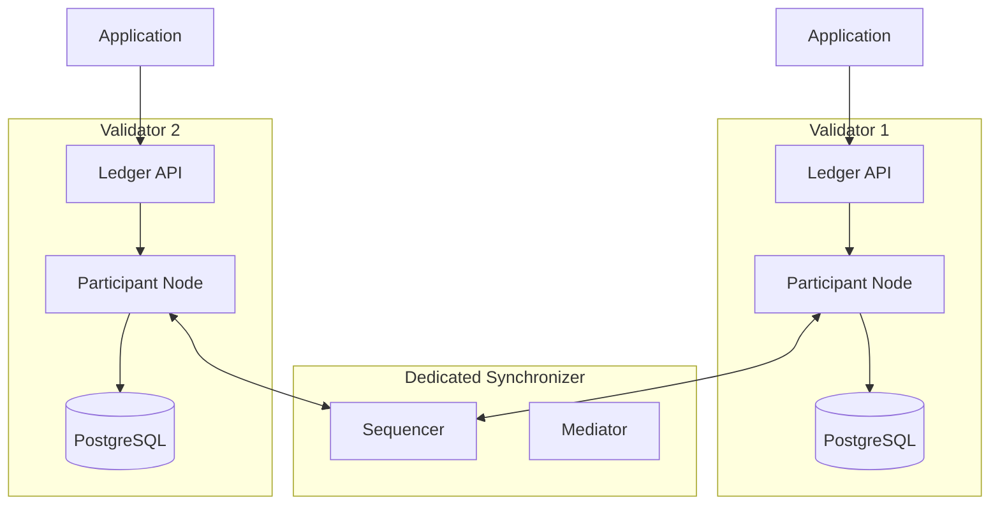

import CANTON_DOCS_CN_GS_EXTENSION_SYNCHRONIZERS_PRIVATE_VALIDATORS_0 from "/snippets/external/canton/main/docs-open/target/snippet_json_data/docs-cn/global-synchronizer-extension-synchronizers-private-validators-0.mdx";

<Warning>
  이 페이지는 팀 리서치를 위한 비공식 한글 번역입니다. 기술적 판단에는 [공식 영어 원문](https://docs.canton.network/global-synchronizer/extension-synchronizers/private-validators.md)을 사용하세요.
</Warning>

Global Synchronizer connection 없이 Dedicated Synchronizer에서만 Validator를 실행할 수 있습니다. 그러나 accounting 및 settlement를 위해 Dedicated Synchronizer에는 Global Synchronizer에 persistent connection을 유지하는 Validator가 하나 이상 있어야 합니다. 이 connection은 fee 계산 및 CC burn obligation 이행 mechanism입니다. 논리적으로 이는 Dedicated Synchronizer user에게 self-contained Canton deployment와 같은 환경을 제공합니다.

## Private-only Validator를 선택하는 경우

Private-only Validator는 특정 운영 scenario에 적합합니다.

- **Internal enterprise workflow** — Daml application이 한 조직 내부에서만 실행되고 모든 Party가 직접 운영하는 Validator에 hosting되는 경우
- **External dependency가 없는 consortium** — 폐쇄된 조직 group이 MainNet과 Transaction을 수행할 필요 없이 shared workflow를 실행하는 경우
- **규제 제약** — 외부 Network infrastructure 연결을 rule이 금지하거나 모든 Transaction 처리가 특정 관할권 내 infrastructure에서 이루어져야 하는 경우
- **Development 및 test** — Global Synchronizer connectivity를 설정하지 않고 Daml application을 build하고 test하려는 경우

## Global Synchronizer Validator와 다른 점

Global Synchronizer connection 없이 Validator를 실행하면 운영은 간소화되지만 일부 capability가 사라집니다.

**제공되는 기능:**

- 전체 Canton protocol 기능: sub-Transaction privacy, multi-Party workflow, Daml smart contract
- Ledger API는 Global Synchronizer에 연결된 Validator와 동일하게 작동
- Synchronizer user를 위한 더 간단한 Network Topology

**제공되지 않는 기능:**

- Canton Coin 없음: Canton Coin을 보유, transfer 또는 사용할 수 없음
- 기본 wallet connectivity 없음: Wallet provider에는 Global Synchronizer connectivity가 필요함
- Canton Network Party와 interoperability 없음: Contract가 Global Synchronizer의 contract와 상호 작용할 수 없음
- Validator onboarding process 없음: 전체 Topology를 직접 관리함

## Architecture

Private-only Validator는 Dedicated Synchronizer에 연결된 표준 Validator입니다. Global Synchronizer가 없으면 wallet 관리 및 traffic 구매와 같은 Canton Network 전용 기능을 처리하는 Validator process가 필요하지 않습니다.



## Deployment

Validator process 없이 Participant Node를 deploy합니다. Splice 전용 component가 필요하지 않으므로 Canton open-source distribution을 사용할 수 있습니다.

### Helm deployment

```yaml
# participant-values.yaml
participant:
  storage:
    type: postgres
    config:
      dataSourceClass: "org.postgresql.ds.PGSimpleDataSource"
      properties:
        serverName: "<postgres-host>"
        portNumber: 5432
        databaseName: "participant_db"
        user: "participant_user"
        password: "<password>"
  ledgerApi:
    port: 5001
    tls:
      certChainFile: "/certs/tls.crt"
      privateKeyFile: "/certs/tls.key"
  synchronizerConnections:
    - alias: "private-sync"
      sequencerConnection: "https://sequencer.private-sync.example.com"
```

```bash
helm install participant canton/canton-participant \
  -f participant-values.yaml \
  --namespace canton
```

### Synchronizer 연결

Participant가 시작되면 구성된 Synchronizer에 자동으로 연결됩니다. Connection을 확인합니다.


<CANTON_DOCS_CN_GS_EXTENSION_SYNCHRONIZERS_PRIVATE_VALIDATORS_0 />


## Private-only와 Global Synchronizer-connected 중 선택

다음 decision framework를 사용하세요.

- **해당 Party가 external Canton Network Party와 Transaction을 수행해야 합니까?** 그렇다면 Global Synchronizer에서 Transaction을 수행해야 합니다. 대신 [hybrid pattern](/global-synchronizer/extension-synchronizers/hybrid-synchronizer-pattern)을 고려하세요.
- **Payment 또는 settlement에 Canton Coin이 필요합니까?** 그렇다면 Global Synchronizer connection이 필요합니다.
- **향후 Network connectivity가 필요할 가능성이 있습니까?** 가능성이 있다면 지금 표준 Validator를 deploy하고 user가 나중에 Global Synchronizer에 연결할 수 있게 하세요. Synchronizer connection 추가는 disruptive하지 않습니다. [여러 Synchronizer에 연결](/global-synchronizer/extension-synchronizers/linking-validator-multi-sync)을 참조하세요.

## 나중에 Global Synchronizer로 migration

Requirement가 변경되면 Dedicated Synchronizer workflow를 중단하지 않고 Synchronizer user가 Validator를 Global Synchronizer에 연결할 수 있습니다.

1. Global Synchronizer onboarding process(sponsorship, IP allowlisting, onboarding secret)를 완료합니다.
2. Validator에 Global Synchronizer connection을 추가합니다.
3. 필요에 따라 Network 전체 visibility가 필요한 contract를 Dedicated Synchronizer에서 Global Synchronizer로 Reassignment합니다.
4. Dedicated Synchronizer에서 private workflow를 계속 실행합니다.

Global Synchronizer connection을 추가해도 Dedicated Synchronizer의 기존 application 및 contract는 영향을 받지 않습니다.
