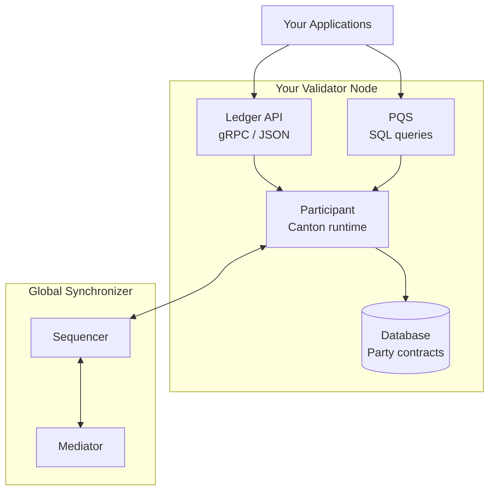
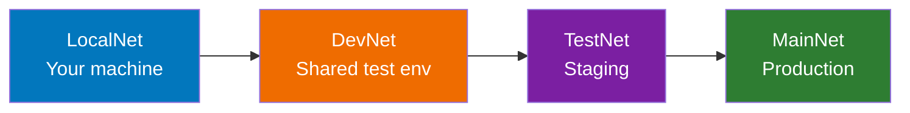

<Warning>
  이 페이지는 팀 리서치를 위한 비공식 한글 번역입니다. 기술적 판단에는 [공식 영어 원문](https://docs.canton.network/global-synchronizer/understand/introduction.md)을 사용하세요.
</Warning>

Global Synchronizer는 decentralized Validator 집합이 운영하는 Canton Network의 public coordination layer입니다. 이 section에서는 이 network에서 node를 운영한다는 것이 무엇을 의미하는지 소개합니다.

## Validator란 무엇인가?

**Validator**(Participant Node라고도 함)는 다음 역할을 수행하는 infrastructure입니다.

- **Party hosting**: Hosting하는 Party의 contract data 저장
- **Consensus 참여**: 해당 Party에 영향을 주는 transaction 확인
- **API 제공**: Application에 Ledger API access 제공
- **Global Synchronizer 연결**: Canton Network의 다른 Validator와 connectivity 제공

## Validator와 Super Validator 비교

**Validator:**

- Party를 hosting하고 contract 저장
- Application에 Ledger API 제공
- Application operator 및 enterprise가 운영

**Super Validator:**

- Synchronizer infrastructure(Sequencer 및 Mediator node) 운영
- Network governance 참여
- 주요 기관 및 승인된 operator가 운영

Validator는 다음을 수행합니다.

- 자체 Participant Node 실행
- User/application을 위한 Party hosting
- Canton Coin으로 Traffic fee 지불
- Network가 의무화한 version에 맞춰 node를 update할 책임
- Synchronizer component(Sequencer/Mediator)는 운영하지 않음
- Network governance에는 직접 참여하지 않음
- BFT consensus node는 실행하지 않음

## Network 환경

Canton Network는 다음 네 가지 환경에서 운영됩니다.

- **LocalNet**: 누구나 접근할 수 있는 local development 환경이며 local test CC 사용
- **DevNet**: VPN과 sponsorship이 필요한 integration test 환경이며 faucet에서 test CC 제공
- **TestNet**: 신청 절차가 필요한 staging 환경이며 faucet에서 test CC 제공
- **MainNet**: 전체 onboarding이 필요한 production 환경이며 CC가 실제 가치를 가짐

### 단계별 진행 경로

**환경 간 이동에 필요한 항목:**

- **LocalNet → DevNet**: VPN credential, Super Validator sponsorship
- **DevNet → TestNet**: 신청 승인, IP allowlisting
- **TestNet → MainNet**: 전체 onboarding 절차, 운영 readiness

## 운영 Model

Validator infrastructure를 운영하는 방법에는 두 가지 주요 선택지가 있습니다.

### 선택지 1: Self-Hosted

자체 server 또는 cloud server에서 Validator infrastructure를 직접 실행합니다.

| 측면 | 세부 사항 |
|--------|---------|
| **Control** | Infrastructure에 대한 완전한 control |
| **책임** | 운영, upgrade 및 security를 직접 관리 |
| **요구 사항** | 기술 전문성, 운영 capacity |
| **비용** | Infrastructure 비용 + 운영 overhead |

**적합한 대상:** DevOps/SRE capacity, 특정 compliance requirement 또는 완전한 control이 필요한 조직.

### 선택지 2: Node-as-a-Service

Provider가 Validator infrastructure를 hosting하고 관리하도록 합니다.

| 측면 | 세부 사항 |
|--------|---------|
| **Control** | Configuration은 직접 control하고 운영은 provider가 관리 |
| **책임** | Provider가 upgrade 및 availability 처리 |
| **요구 사항** | Provider와의 계약 |
| **비용** | Service fee |

**적합한 대상:** Application development에 집중하는 team, infrastructure 전문성이 없는 조직.

## Validator 운영에 포함되는 업무

### 일상 운영

| Task | 빈도 | 설명 |
|------|-----------|-------------|
| **Monitoring** | 지속적 | Health check, performance metric |
| **Log 관리** | 지속적 | Log 수집 및 분석 |
| **Upgrade** | 매주 또는 매월 | Network version에 맞춰 update |
| **Traffic 관리** | 필요 시 | Fee를 위한 Canton Coin balance 확보 |
| **Backup** | 정기적 | Database 및 identity backup |

### Upgrade 관련 기대 사항

Global Synchronizer는 자주 upgrade됩니다.

| 유형 | 빈도 | 영향 |
|------|-----------|--------|
| **Minor update** | 매주 또는 매월 | 일반적으로 backward compatible |
| **Feature release** | 분기별 | Configuration 변경이 필요할 수 있음 |
| **Security patch** | 필요 시 | 중요하며 빠른 deployment 필요 |

<Warning>
Validator는 network upgrade에 맞춰 update해야 합니다. Version이 뒤처지면 network에서 연결이 끊길 수 있습니다.
</Warning>

## 시작하기

### 사전 요구 사항

Validator를 deploy하기 전에 다음 항목을 확보하세요.

1. **Sponsorship**: Super Validator가 onboarding을 sponsor해야 함
2. **Infrastructure**: [Infrastructure requirement](/global-synchronizer/understand/infrastructure-requirements) 충족
3. **기술 capacity**: Containerized service를 운영할 수 있는 team
4. **Canton Coin**: Traffic fee를 위한 예산(TestNet/MainNet)

### Onboarding 절차

1. **Super Validator에 연락**하여 sponsor 확보([canton.foundation의 목록](https://canton.foundation))
2. Network allowlisting을 위해 **egress IP 제공**
3. **Allowlisting 완료 대기**(일반적으로 2~7일)
4. Sponsor에게서 **onboarding secret 수령**
5. Onboarding configuration으로 **Validator deploy**
6. **Connectivity 확인** 후 운영 시작

<Note>
Test에는 DevNet을 시작점으로 권장합니다. DevNet secret은 API를 통해 받을 수 있으며 1시간 동안 유효합니다. TestNet 및 MainNet secret은 sponsor가 수동으로 제공해야 합니다.
</Note>

## 핵심 책임

Validator operator는 다음을 책임집니다.

| 책임 | 설명 |
|----------------|-------------|
| **Availability** | Node를 실행 및 연결된 상태로 유지 |
| **Security** | Infrastructure 및 key 보호 |
| **Upgrade** | Network version을 최신 상태로 유지 |
| **Traffic** | Fee를 위한 Canton Coin balance 유지 |
| **Compliance** | 관할권의 규제 requirement 충족 |

## 신경 쓰지 않아도 되는 사항

Global Synchronizer는 다음을 처리합니다.

- **Consensus**: Super Validator가 BFT consensus 실행
- **Governance**: Canton Foundation(CF)이 network parameter 관리. CF는 Global Synchronizer를 govern하는 non-profit foundation임
- **Sequencing**: Synchronizer가 transaction ordering 수행
- **Mediation**: Synchronizer가 confirmation 관리

## 다음 단계

<CardGroup cols={2}>

<Card title="Infrastructure 요구 사항" icon="server" href="/global-synchronizer/understand/infrastructure-requirements">
  Hardware, software 및 network requirement를 확인합니다.
</Card>

<Card title="Validator 역할" icon="user-gear" href="/global-synchronizer/understand/validator-roles">
  Validator의 책임을 이해합니다.
</Card>

</CardGroup>
