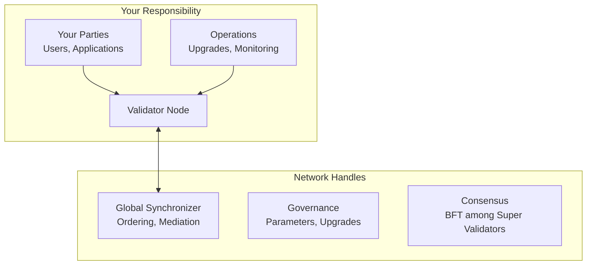

<Warning>
  이 페이지는 팀 리서치를 위한 비공식 한글 번역입니다. 기술적 판단에는 [공식 영어 원문](https://docs.canton.network/global-synchronizer/understand/validator-roles.md)을 사용하세요.
</Warning>

Canton Network에서 Validator를 운영하면 구체적인 역할, 책임 및 기대 사항이 따릅니다. 이 페이지에서는 Validator에게 기대되는 사항과 network가 처리하는 사항을 구분합니다.

## Validator의 역할

Validator는 다음 역할을 수행하는 **Participant Node**를 운영합니다.

1. User 및 application을 위한 **Party hosting**
2. 해당 Party의 **contract data 저장**
3. 해당 Party에 영향을 주는 **transaction validation**
4. 조정을 위한 **Synchronizer 연결**
5. Application이 ledger와 상호 작용할 수 있도록 **API 제공**

## 담당하는 사항

### Infrastructure 운영

- **Node availability**: Validator를 실행하고 연결된 상태로 유지
- **Performance**: Workload에 충분한 resource 확보
- **Upgrade**: Network version을 최신 상태로 유지
- **Monitoring**: Health, performance 및 error 추적
- **Backup**: Database와 identity를 정기적으로 backup
- **Security**: Infrastructure, key 및 access 보호

### Party 관리

- **Onboarding**: Validator에서 Party 생성 및 관리
- **Key 관리**: Party key를 안전하게 저장
- **Access control**: 누가 어떤 Party로 행동할 수 있는지 control
- **Data custody**: Validator가 해당 Party의 data 저장

### Traffic(Transaction Fee)

- **Canton Coin balance**: 운영에 충분한 CC 유지
- **Top-up**: 필요할 때 Traffic 보충
- **비용 관리**: Traffic 사용량 monitoring 및 최적화

## 담당하지 않는 사항

### Global Synchronizer가 처리하는 사항

| 기능 | 담당 주체 |
|----------|-------------|
| **Transaction ordering** | Synchronizer Sequencer |
| **Confirmation aggregation** | Synchronizer Mediator |
| **BFT consensus** | Super Validator |
| **Network parameter** | CF governance |
| **Upgrade 조정** | CF 및 SV |

### Trust Model

Validator는 다음을 신뢰합니다.

- Synchronizer가 transaction을 공정하게 ordering함
- Super Validator가 availability를 유지함
- Network parameter가 적절히 설정됨
- Upgrade가 적절히 조정됨

다음 작업은 필요하지 않습니다.

- Consensus node 실행
- 모든 network transaction 검증
- Governance vote 참여
- Synchronizer infrastructure 운영

## 운영 관련 기대 사항

### Availability

| 기대 사항 | 세부 사항 |
|-------------|---------|
| **Uptime 목표** | 99% 이상의 availability를 목표로 계획 |
| **계획된 maintenance** | Traffic이 적은 시간대에 조정 |
| **Incident 대응** | 문제를 monitoring하고 대응 |

<Note>
Validator가 offline인 동안 해당 Party는 transaction을 수행할 수 없습니다. Maintenance window를 신중하게 계획하고 user에게 알리세요.
</Note>

### Version 최신성

Network는 자주 upgrade됩니다. Validator는 이에 맞춰 update해야 합니다.

| 시점 | 조치 |
|-----------|--------|
| **공지 시** | Security patch 적용 |
| **Deadline 이전** | Major version upgrade 적용(사전 공지됨) |

<Warning>
오래된 version을 실행하는 Validator는 network에서 연결이 끊길 수 있습니다. 공지를 monitoring하고 upgrade window를 계획하세요.
</Warning>

### Communication

Network와 지속적으로 연결된 상태를 유지하세요.

| Channel | 목적 |
|---------|---------|
| **#validator-operations** | 운영 논의를 위한 Slack channel |
| **Mailing list** | 공지를 위한 lists.sync.global |
| **Release note** | 변경 사항 및 requirement 추적 |

## Security 책임

### 담당 Security 범위

| Asset | 담당 책임 |
|-------|---------------------|
| **Validator infrastructure** | Hardening, patching, access control |
| **Party key** | 안전한 생성, 저장 및 rotation |
| **Database** | Encryption, access control 및 backup |
| **API access** | Authentication, authorization 및 TLS |
| **Network perimeter** | Firewall 및 DDoS protection |

### 담당하지 않는 범위

| Asset | 담당 주체 |
|-------|------------|
| **Synchronizer security** | Super Validator |
| **Protocol security** | Canton/Splice development |
| **Network 전체 DoS protection** | Synchronizer operator |

## Compliance 고려 사항

관할권과 use case에 따라 다음 사항을 고려합니다.

| 고려 사항 | 조치 |
|---------------|--------|
| **Data residency** | Validator 위치가 requirement를 충족하는지 확인 |
| **Audit requirement** | Log 및 record 유지 |
| **KYC/AML** | 필요한 경우 해당 Party에 대해 구현 |
| **규제 reporting** | 필요한 capability 구축 |

<Note>
Canton의 privacy model은 data가 권한 있는 Party에게만 유지되도록 하여 compliance에 도움을 줍니다. 그러나 규제 의무에 대한 책임은 계속 Validator operator에게 있습니다.
</Note>

## 비용

Validator 운영에는 여러 비용 category가 포함됩니다.

### Infrastructure 비용

Infrastructure 비용은 deployment 방법, cloud provider 및 transaction volume에 따라 달라집니다. Hardware sizing 지침은 [사전 요구 사항](/global-synchronizer/deployment/prerequisites)을 참조하세요. MainNet 비용을 추정하기 전에 DevNet 또는 TestNet을 사용하여 실제 resource consumption을 측정하세요.

| Component | 참고 사항 |
|-----------|-------|
| **Compute** | Hosting하는 Party 수 및 transaction volume에 따라 확장 |
| **Database** | Data volume에 따라 확장되며 managed service(RDS, Cloud SQL) 권장 |
| **Network** | Egress 비용은 Traffic volume에 따라 달라짐 |
| **Storage** | 보관하는 ledger history에 따라 확장 |

### Network 비용

| 비용 | 설명 |
|------|-------------|
| **Traffic fee** | Transaction을 위한 Canton Coin |
| **Variable** | Transaction volume 및 size에 따라 달라짐 |

### 운영 비용

| 비용 | 설명 |
|------|-------------|
| **인력** | Monitoring, upgrade 및 incident에 필요한 시간 |
| **Tooling** | Monitoring, logging 및 alerting |

## Support resource

### Community support

| Resource | 설명 |
|----------|-------------|
| **Slack** | Peer support를 위한 #validator-operations |
| **Forum** | 기술 질문을 위한 forum.canton.network |
| **Documentation** | 이 site |

## Validator 되기

### 사전 요구 사항

1. **기술 capacity**: Containerized service를 운영할 수 있는 team
2. **Infrastructure**: [Infrastructure requirement](/global-synchronizer/understand/infrastructure-requirements) 충족
3. **Sponsorship**: Sponsor 역할을 할 Super Validator
4. **Canton Coin**: Traffic fee 예산

### 절차

1. **Super Validator에 연락**([canton.foundation의 목록](https://canton.foundation))
2. **Use case** 및 onboarding requirement 논의
3. Requirement에 따라 **infrastructure 준비**
4. Sponsorship을 통해 **onboarding 완료**
5. **운영 시작** 및 node 유지

## 다음 단계

<CardGroup cols={2}>

<Card title="Validator 설정" icon="server" href="/global-synchronizer/understand/introduction">
  Validator Node deployment를 시작합니다.
</Card>

<Card title="Infrastructure 요구 사항" icon="list-check" href="/global-synchronizer/understand/infrastructure-requirements">
  상세한 infrastructure requirement를 검토합니다.
</Card>

</CardGroup>
