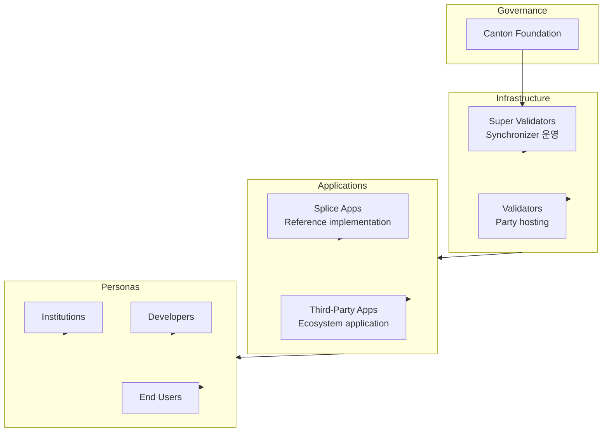

<Warning>
  이 페이지는 팀 리서치를 위한 비공식 한글 번역입니다. 기술적 판단에는 [공식 영어 원문](https://docs.canton.network/integrations/ecosystem.md)을 사용하세요.
</Warning>

Canton Network ecosystem은 network를 구성하는 조직, application 및 infrastructure를 포함합니다. 이 페이지에서는 ecosystem의 전체 구성을 설명합니다.

## Ecosystem 개요

## Governance

### Canton Foundation (CF)

CF는 Linux Foundation 산하의 독립 비영리 조직으로 Global Synchronizer를 governance합니다.

| Responsibility | Description |
|----------------|-------------|
| **Network policy** | Parameter와 rule 설정 |
| **Upgrade coordination** | Network upgrade 관리 |
| **SV oversight** | Super Validator 참여 감독 |
| **Ecosystem development** | Network 성장 촉진 |

**자세히 알아보기:** [canton.foundation](https://canton.foundation)

## Infrastructure Participant

### Super Validators

Super Validator는 Global Synchronizer infrastructure를 운영하고 governance에 참여합니다.

| Role | Function |
|------|----------|
| **Sequencer operation** | Transaction ordering |
| **Mediator operation** | Confirmation 집계 |
| **Governance** | Network parameter 투표 |
| **Sponsorship** | 신규 Validator onboarding |

현재 Super Validator 집합에는 주요 금융 기관과 technology provider가 포함됩니다.

### Validators

Validator는 Party를 hosting하고 Global Synchronizer에 연결된 Participant Node를 운영합니다.

| Type | Description |
|------|-------------|
| **Enterprise validator** | 조직이 자체 Party를 위해 운영 |
| **Service provider** | 다른 주체에 Validator service 제공 |
| **Application operator** | 특정 application을 위한 Validator 운영 |

## Applications

### Splice Applications

[Splice](https://github.com/canton-network/splice)는 Canton Network의 reference application을 제공하는 open-source project입니다.

| Application | Purpose |
|-------------|---------|
| **Canton Coin** | Native token implementation |
| **Wallet** | CC 관리를 위한 user wallet |
| **Scan** | Network explorer |
| **Validator App** | Validator Node 관리 |

### Application 분류

| Category | Examples |
|----------|----------|
| **Financial services** | Trading, settlement, custody |
| **Asset tokenization** | Securities, real estate, commodities |
| **Supply chain** | Trade finance, logistics |
| **Identity** | Digital identity, KYC |

## Developer Ecosystem

### Tools and SDKs

| Tool | Purpose |
|------|---------|
| **Daml SDK** | 핵심 development toolkit |
| **Daml** | Smart contract language |
| **Wallet SDK** | Wallet integration |
| **PQS** | Query optimization |

### Development Resources

| Resource | Description |
|----------|-------------|
| **QuickStart** | Example application과 LocalNet |
| **Documentation** | 이 site와 관련 문서 |
| **Community** | Slack, forum, event |

## Network Statistics

Canton Network는 모든 지표에서 지속적으로 성장하고 있습니다.

### Network Activity

현재 network 통계는 다음에서 확인할 수 있습니다.

- [Canton Network Explorer](https://scan.sync.global)
- [Network Status](https://canton.foundation/sv-network-status/)

## 참여 방법

### Validator로 참여

1. [Infrastructure requirement](/global-synchronizer/understand/infrastructure-requirements)을 검토합니다.
2. Sponsorship을 위해 [Super Validator](https://canton.foundation)에 연락합니다.
3. Onboarding process를 완료합니다.
4. 운영을 시작합니다.

### Developer로 참여

1. [QuickStart](/appdev/quickstart)에서 시작합니다.
2. [Daml](/appdev/get-started/choose-your-path)을 학습합니다.
3. Application을 구축하고 배포합니다.
4. Developer community에 참여합니다. {/* TODO: Add Slack link once available */}

### Institution으로 참여

1. Use case에 Canton이 적합한지 평가합니다.
2. [Canton Foundation](https://canton.foundation)에 연락합니다.
3. Partnership 기회를 살펴봅니다.

## Ecosystem Resources

### Official Channels

| Channel | Purpose |
|---------|---------|
| [canton.network](https://canton.network) | Main website |
| [canton.foundation](https://canton.foundation) | Canton Foundation 및 Validator 정보 |
| Slack | Community discussion | {/* TODO: Add Slack link once available */}
| [GitHub](https://github.com/canton-network/splice) | Splice source code |

### Events

Canton Network community는 정기적으로 다음 event를 개최합니다.

- Developer workshop
- Validator operations call
- Governance discussion

예정된 event는 [canton.network](https://canton.network)에서 확인하세요.

## 다음 단계

<CardGroup cols={2}>

<Card title="Integration Patterns" icon="puzzle-piece" href="/integrations/integration-patterns">
  일반적인 integration 접근 방식을 알아봅니다.
</Card>

<Card title="구축 시작" icon="code" href="/appdev/get-started/choose-your-path">
  Canton Network 개발을 시작합니다.
</Card>

</CardGroup>
