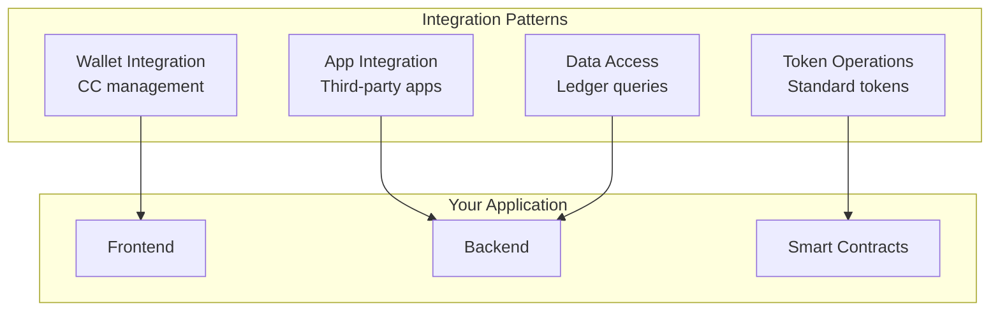
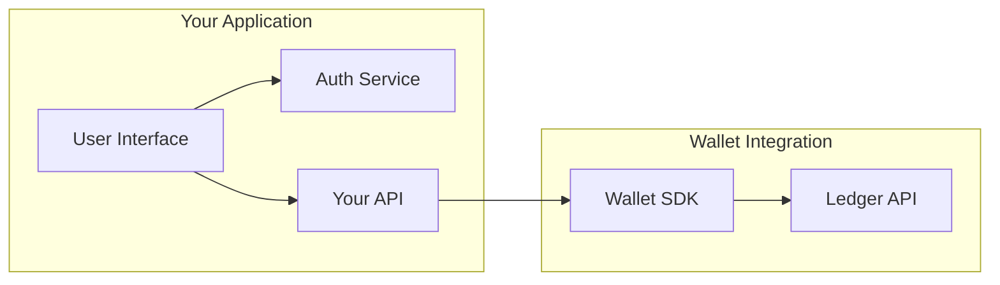
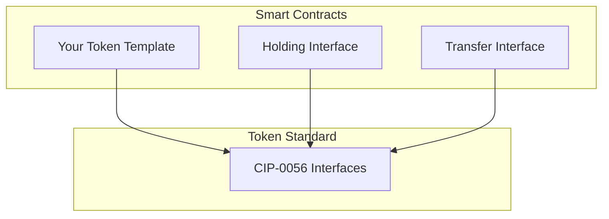
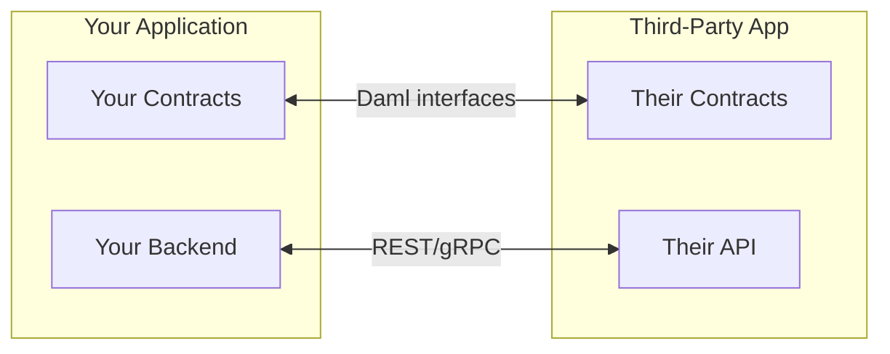
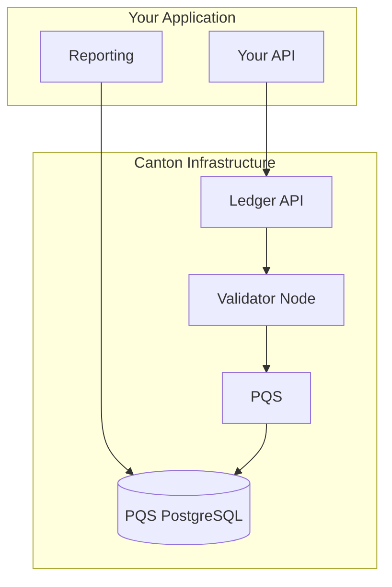

<Warning>
  이 페이지는 팀 리서치를 위한 비공식 한글 번역입니다. 기술적 판단에는 [공식 영어 원문](https://docs.canton.network/integrations/integration-patterns.md)을 사용하세요.
</Warning>

import DamlIntegrationsIntegrationPatternsL103 from "/snippets/daml-docs/integrations_integration-patterns_L103.mdx";


이 페이지에서는 Canton Network building block을 application에 통합하는 일반적인 pattern을 설명합니다. 이러한 pattern은 Canton의 privacy model을 준수하면서 효과적인 integration을 설계하는 데 도움이 됩니다.

## Pattern 개요



## Wallet Integration Pattern

### Use Case

Application에 Canton Coin 관리 기능을 추가하여 사용자가 다음 작업을 수행할 수 있게 합니다.

- CC balance 확인
- 다른 Party로 CC transfer
- Transaction을 위한 traffic top-up

### Architecture



### 주요 고려 사항

| Consideration | Approach |
|---------------|----------|
| **Authentication** | 자체 auth system과 통합하고 user를 Party에 mapping |
| **Balance display** | Wallet SDK로 query하고 적절하게 cache |
| **Transfers** | Ledger API로 submit하고 asynchronous confirmation 처리 |
| **Error handling** | Insufficient balance와 network error 처리 |

### Privacy 영향

- User는 자신의 balance만 확인합니다.
- Transfer 세부 정보는 sender와 receiver에게만 표시됩니다.
- Application backend는 권한이 있는 데이터만 확인합니다.

## Token Operations Pattern

### Use Case

Canton Token Standard인 [CIP-0056](https://github.com/canton-foundation/cips/blob/main/cip-0056/cip-0056.md)을 따르는 token을 생성, 관리 및 transfer합니다.

### Architecture



### Implementation 접근 방식

<DamlIntegrationsIntegrationPatternsL103 />

### 주요 고려 사항

| Consideration | Approach |
|---------------|----------|
| **Interoperability** | Wallet compatibility를 위해 [CIP-0056](https://github.com/canton-foundation/cips/blob/main/cip-0056/cip-0056.md)을 준수 |
| **Authorization** | 명확한 signatory/controller role 정의 |
| **Privacy** | Token balance는 holder에게만 표시 |

## Application Integration Pattern

### Use Case

다음과 같은 다른 Canton Network application과 통합합니다.

- DeFi protocol
- Identity service
- Data feed

### Architecture



### Integration 접근 방식

| Approach | When to Use |
|----------|-------------|
| **On-ledger** | Atomic execution이 필요한 multi-party workflow |
| **Off-ledger API** | Read-only query와 non-transactional operation |
| **Hybrid** | 완전한 integration을 위해 두 방식을 결합 |

### 주요 고려 사항

| Consideration | Approach |
|---------------|----------|
| **Interface compatibility** | 공개된 Daml interface 사용 |
| **Authorization** | Party requirement 이해 |
| **Privacy** | Composition을 통해 공유되는 데이터 파악 |
| **Versioning** | Contract upgrade 처리 |

## Data Access Pattern

### Use Case

Reporting, analytics 또는 application state를 위해 ledger data를 query합니다.

### Options

| Method | Use Case | Performance |
|--------|----------|-------------|
| **Ledger API** | Real-time query와 streaming | Good |
| **PQS** | Complex query와 analytics | Read에 가장 적합 |
| **Transaction trees** | Historical data와 audit | Volume에 따라 달라짐 |

### PQS Architecture



<Note>
PQS는 Ledger API를 통해 Validator Node에 연결하여 transaction update를 수신한 다음, query를 위해 자체 PostgreSQL database에 데이터를 저장합니다.
</Note>

### 주요 고려 사항

| Consideration | Approach |
|---------------|----------|
| **Query complexity** | Simple: Ledger API, Complex: PQS |
| **Latency requirement** | Real-time: Ledger API, Batch: PQS |
| **Data volume** | High volume: Indexing을 적용한 PQS |
| **Privacy scope** | 권한 있는 Party의 데이터만 query |

## Privacy-Aware Design

모든 integration pattern은 Canton의 privacy model을 고려해야 합니다.

### Design Principles

| Principle | Application |
|-----------|-------------|
| **Minimal visibility** | 필요한 observer right만 요청 |
| **Party design** | 불필요하게 Party를 생성하지 않음 |
| **Divulgence awareness** | Contract composition이 공개하는 데이터 이해 |
| **Audit consideration** | 처음부터 audit visibility 계획 |

### 일반적인 실수

| Mistake | Impact | Solution |
|---------|--------|----------|
| Over-observing | 불필요한 데이터 노출 | Observer 최소화 |
| Public queries | Global state가 있을 것으로 오해 | Party 범위의 데이터 query |
| Ignoring divulgence | 의도하지 않은 데이터 공유 | Transaction composition mapping |

## Error Handling Patterns

Integration은 다음과 같은 일반적인 error scenario를 처리해야 합니다.

| Error | Cause | Handling |
|-------|-------|----------|
| **Insufficient traffic** | Fee를 위한 CC 부족 | Top-up 안내 |
| **Authorization failure** | Party에 권한이 없음 | Party 설정 확인 |
| **Timeout** | Network 또는 Validator 문제 | Backoff를 적용해 retry |
| **Contract not found** | Archive됐거나 존재한 적이 없음 | State refresh |

### Retry Strategy

```typescript
async function submitWithRetry<T>(command: Command, maxRetries = 3): Promise<T> {
  for (let attempt = 0; attempt < maxRetries; attempt++) {
    try {
      return await ledgerApi.submit(command);
    } catch (error) {
      if (isRetryable(error) && attempt < maxRetries - 1) {
        await sleep(Math.pow(2, attempt) * 1000);
        continue;
      }
      throw error;
    }
  }
  throw new Error("Max retries exceeded");
}
```

## 다음 단계

<CardGroup cols={2}>

<Card title="Developer용 Wallet" icon="code" href="/integrations/overview">
  Application에 wallet 기능을 통합합니다.
</Card>

<Card title="Token Standard" icon="coins" href="/overview/understand/cips-introduction">
  Canton Token Standard를 구현합니다.
</Card>

</CardGroup>
