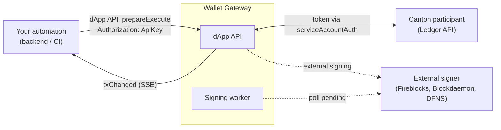

<Warning>
  이 페이지는 팀 리서치를 위한 비공식 한글 번역입니다. 기술적 판단에는 [공식 영어 원문](https://docs.canton.network/integrations/wallet-gateway/automation/service-account-automations.md)을 사용하세요.
</Warning>

Service account automation을 사용하면 사람이 개입하지 않아도 backend job, CI pipeline 또는 기타 service가 Wallet Gateway를 통해 Ledger Transaction을 제출할 수 있습니다. Interactive dApp과 **동일한 dApp API**(`prepareExecute`, `txChanged` event)를 사용하지만 user가 생성한 **API key**로 request를 authenticate합니다. API key를 사용하면 Wallet Gateway는 `prepareExecute` 후 Transaction을 prepare, sign 및 execute까지 연속으로 수행합니다.

이는 user JWT로 User API를 구동하는 [User API를 사용한 자동화](/integrations/wallet-gateway/automation/automate-with-user-api)와 다릅니다. Service account automation은 API key로 **dApp API**를 구동하며 unattended 방식으로 실행됩니다.

## 구성 요소의 연계 방식



**Authentication 동작 방식:**

1. Operator가 일반 user OAuth flow(`auth`, 일반적으로 `authorization_code`)를 사용하여 Wallet Gateway에 로그인합니다.
2. Operator가 wallet을 생성하고 **API key**를 생성합니다(User API의 `generateApiKey` 또는 User UI).
3. Automation이 dApp API request에 해당 API key를 전송합니다: `Authorization: ApiKey <key>`.
4. Wallet Gateway가 key를 validate하고, request 범위를 key owner의 저장된 wallet 및 Network로 제한하며, Network의 **`serviceAccountAuth`** configuration(일반적으로 `client_credentials` OAuth)을 사용하여 **Ledger access token**을 얻습니다.

**Service account automation이 지원하는 기능:**

- API key auth를 사용하는 `prepareExecute`에서 signing 결과가 `signed`이면 Wallet Gateway가 즉시 **prepare → sign → execute**를 실행합니다.
- 비동기 방식으로 승인하는 external custody signer의 경우 background **Signing worker**가 pending Transaction을 polling하고 provider가 승인하면 완료합니다.
- API compatibility를 위해 `prepareExecute` response에서 `userUrl`은 계속 반환됩니다. Automation은 approval UI 대신 **`txChanged`** event 또는 Transaction status polling에 의존해야 합니다.

**지원하지 않는 기능:**

- Ledger **user**, **Party** 및 **right**는 계속 Canton / IDP setup에서 가져옵니다.
- `prepareExecute`가 성공하려면 Wallet Gateway에 API key owner의 **저장된 wallet**(Party)이 필요합니다.
- Interactive user는 계속 `auth`로 authenticate합니다. API key는 추가 automation credential이며 end-user login을 대체하지 않습니다.

## 사전 요구 사항

Automation에서 `prepareExecute`를 호출하기 전에 아래 항목을 모두 완료하세요.

**1. Wallet Gateway에 Ledger user가 존재해야 합니다.** API key는 이를 생성한 Wallet Gateway user와 연결됩니다. Store에 wallet과 Network context가 존재하도록 해당 user가 일반 login session을 한 번 이상 완료해야 합니다. Ledger operation에 사용하는 Ledger user ID는 `serviceAccountAuth`로 얻은 token에서 가져옵니다. 따라서 발급된 token의 `sub` 또는 IDP mapping이 automated Party에 대한 right를 보유한 Ledger user와 일치하도록 해당 OAuth client를 구성하세요.

**2. Ledger right를 가진 wallet(Party)이 존재해야 합니다.** `actAs`를 생략하면 `prepareExecute`는 API key owner의 **primary wallet**을 사용합니다. 해당 Party는 Canton Participant에 존재해야 하고, 자동화할 Command를 prepare하고 제출할 수 있도록 Ledger user에게 충분한 right(일반적으로 `actAs` / `readAs`)를 부여해야 합니다. Automation을 실행하기 전에 [User API](/integrations/wallet-gateway/reference/user-api)의 `createWallet`, `syncWallets` 또는 User UI를 통해 wallet을 생성하거나 sync하세요. 저장된 primary wallet이 없으면 `prepareExecute`가 "No primary wallet found"로 실패합니다.

**3. Signing provider가 구성되어야 합니다.** 각 wallet은 Transaction을 signing할 driver를 선택하는 `signingProviderId`를 기록합니다.

| Provider | 일반적인 용도 |
| --- | --- |
| `participant` | Canton Participant Node의 key |
| `fireblocks` | Fireblocks custody |
| `blockdaemon` | Blockdaemon signing |
| `dfns` | DFNS custody |
| `wallet-kernel` | Internal Wallet Gateway signing(development 전용) |

Provider는 Wallet Gateway host에 설치 및 구성되어야 합니다. [Signing provider](/integrations/wallet-gateway/operate/signing-providers)를 참조하세요.

<Note>
Signing provider는 **wallet 생성** 시 선택합니다. Automation은 request마다 provider를 바꿀 수 없으며 항상 primary wallet에 구성된 provider를 사용합니다.
</Note>

**4. API key를 생성해야 합니다.** Automation owner로 로그인한 상태에서 target Network용 API key를 생성합니다.

- **User UI**: **API Keys**를 열고 key를 생성합니다. 한 번만 표시되므로 즉시 복사하세요.
- **User API**: `generateApiKey({ "name": "my-automation" })`를 호출하고 반환된 `apiKey`를 안전하게 저장합니다.

각 key는 생성 시점의 현재 Network에 binding됩니다. 더 이상 필요하지 않으면 `removeApiKey` 또는 User UI에서 revoke하세요.

**5. Network가 `serviceAccountAuth`를 정의해야 합니다.** 연속 실행에는 Network의 `serviceAccountAuth` block이 필요합니다. Wallet Gateway는 API key request가 도착할 때 이 block을 사용하여 Ledger token을 얻습니다. `client_credentials` OAuth method를 사용해야 합니다. [Wallet Gateway 구성](/integrations/wallet-gateway/operate/configure)을 참조하세요.

## Wallet Gateway configuration

### Network: `auth`, `adminAuth`, `serviceAccountAuth`

일반적인 production Network는 interactive login에 `authorization_code`를 유지하고 automation 전용 `serviceAccountAuth` block을 추가합니다.

```json
{
    "id": "canton:mainnet",
    "name": "Mainnet",
    "identityProviderId": "idp-oauth",
    "ledgerApi": {
        "baseUrl": "https://ledger.example.com"
    },
    "auth": {
        "method": "authorization_code",
        "clientId": "wallet-gateway-user",
        "audience": "https://canton.network.global",
        "scope": "openid daml_ledger_api offline_access"
    },
    "adminAuth": {
        "method": "client_credentials",
        "clientId": "wallet-gateway-admin",
        "clientSecretEnv": "WG_ADMIN_CLIENT_SECRET",
        "audience": "https://canton.network.global",
        "scope": "openid daml_ledger_api offline_access"
    },
    "serviceAccountAuth": {
        "method": "client_credentials",
        "clientId": "wallet-gateway-automation",
        "clientSecretEnv": "WG_SERVICE_ACCOUNT_CLIENT_SECRET",
        "audience": "https://canton.network.global",
        "scope": "openid daml_ledger_api offline_access"
    }
}
```

| Field | 목적 |
| --- | --- |
| `auth` | End-user OAuth login(User UI, interactive dApp) |
| `adminAuth` | 최초 setup에서 wallet sync 및 Party allocation을 위한 machine credential |
| `serviceAccountAuth` | API key automation 중 Wallet Gateway가 Ledger access에 사용하는 machine credential |

User에게 아직 wallet이 없고 Wallet Gateway가 `addSession`에서 Ledger의 Party를 찾아야 한다면 `adminAuth`가 필요합니다.

<Warning>
`serviceAccountAuth` 및 `adminAuth` secret은 config file의 plain text 대신 `clientSecretEnv` 및 Kubernetes secret(Helm `oauthSecrets`)을 통해 저장하세요.
</Warning>

### Server: signing worker

```json
{
    "server": {
        "signingWorker": {
            "pollInterval": 5000
        }
    }
}
```

| Field | 설명 |
| --- | --- |
| `signingWorker.pollInterval` | Transaction이 제출 후 `pending` 상태로 남을 때 Signing worker가 external signer를 polling하는 주기입니다. 기본값은 `5000` ms입니다. |

Participant 전용 signing에는 external custody configuration이 필요하지 않습니다.

## 일회성 setup workflow

자동화할 Wallet Gateway user 및 Network마다 다음 단계를 한 번 수행합니다. Wallet이 변경되면 반복합니다.

<Steps>
<Step title="Login and create a session">
Automation owner가 User UI에 로그인하거나 일반 user OAuth token으로 User API `addSession`을 호출합니다. 이 작업은 wallet, Network context 및 API key 생성 capability를 설정합니다.
</Step>

<Step title="Ensure a primary wallet exists">
Wallet 목록(`listWallets` 또는 User UI)을 확인합니다. 비어 있으면 wallet을 생성하거나 Ledger에서 sync한 다음 primary wallet을 설정합니다. dApp API를 통해 primary Party를 확인합니다.

```bash
curl -s -X POST "https://gateway.example.com/api/v0/dapp" \
  -H "Authorization: ApiKey ${API_KEY}" \
  -H "Content-Type: application/json" \
  -d '{"jsonrpc":"2.0","id":1,"method":"listAccounts","params":[]}'
```
</Step>

<Step title="Generate an API key">
```bash
curl -s -X POST "https://gateway.example.com/api/v0/user" \
  -H "Authorization: Bearer ${USER_ACCESS_TOKEN}" \
  -H "Content-Type: application/json" \
  -d '{
    "jsonrpc": "2.0",
    "id": 2,
    "method": "generateApiKey",
    "params": { "name": "ci-automation" }
  }'
```

반환된 `apiKey`를 안전하게 저장하세요. 다시 조회할 수 없습니다.
</Step>
</Steps>

## Transaction 제출

### `prepareExecute`(연속 실행)

API key authentication과 함께 dApp API를 사용합니다.

```bash
curl -s -X POST "https://gateway.example.com/api/v0/dapp" \
  -H "Authorization: ApiKey ${API_KEY}" \
  -H "Content-Type: application/json" \
  -d '{
    "jsonrpc": "2.0",
    "id": 3,
    "method": "prepareExecute",
    "params": {
      "commands": [{
        "CreateCommand": {
          "templateId": "#AdminWorkflows:Canton.Internal.Ping:Ping",
          "createArguments": {
            "id": "automation-ping-1",
            "initiator": "my-party::fingerprint",
            "responder": "my-party::fingerprint"
          }
        }
      }]
    }
  }'
```

Service account의 경우 Wallet Gateway는 다음을 수행합니다.

1. API key를 validate하고 owner의 wallet 및 Network를 resolve합니다.
2. `serviceAccountAuth`를 통해 Ledger token을 얻습니다.
3. Ledger에서 Transaction을 prepare합니다.
4. Primary wallet의 signing provider로 signing합니다.
5. Signing 결과가 `signed`이면 즉시 execute합니다.
6. `{ "userUrl": "…" }`를 반환합니다. Automation에서는 무시하고 대신 event를 monitoring합니다.

Command의 `actAs` / `readAs`가 Wallet Gateway store에서 API key owner가 보유한 Party와 일치하는지 확인하세요. 생략하면 primary wallet의 `partyId`가 사용됩니다.

### Participant signing(동기식)

Primary wallet이 `participant` signing을 사용하면 전체 flow가 일반적으로 `prepareExecute` 호출 안에서 완료됩니다.

### External signing(비동기식)

Primary wallet이 Fireblocks, Blockdaemon 또는 DFNS를 사용하는 경우:

1. `prepareExecute`가 Transaction을 prepare하고 custody provider에 제출합니다.
2. Provider가 request를 승인할 때까지 signing이 `pending`을 반환할 수 있습니다.
3. Signing worker background process가 pending external Transaction을 polling하고 승인이 완료되면 sign → execute를 호출합니다.
4. 더 빠른 완료가 필요하면 `signingWorker.pollInterval`을 조정합니다.

Automation은 status가 `executed`인 `txChanged` event를 기다려야 하며, `failed` 또는 장시간 지속되는 `pending`을 처리해야 합니다.

### Server-Sent Event를 사용한 monitoring

Transaction lifecycle update를 위해 dApp API event를 subscribe합니다. API key를 `token` query parameter로 전달합니다.

```javascript
const eventsUrl = new URL('/api/v0/dapp/events', 'https://gateway.example.com')
eventsUrl.searchParams.set('token', apiKey)
const es = new EventSource(eventsUrl.toString())

es.addEventListener('txChanged', (e) => {
    const tx = JSON.parse(e.data)
    console.log('Transaction update:', tx.status, tx.commandId)
})
```

[Real-time event](/integrations/wallet-gateway/reference/dapp-api#real-time-events-sse)를 참조하세요.

## End-to-end checklist

| 단계 | 조치 | API / UI |
| --- | --- | --- |
| 1 | `serviceAccountAuth`와 signing provider로 Network 구성 | Config |
| 2 | Automation owner로 로그인, wallet 생성/sync 및 primary 설정 | User API / UI |
| 3 | `generateApiKey`를 실행하고 secret 저장 | User API / UI |
| 4 | `listAccounts`로 primary Party 확인 | dApp API |
| 5 | Daml Command와 함께 `prepareExecute` 실행(`Authorization: ApiKey …`) | dApp API |
| 6 | `executed`가 될 때까지 `txChanged` 수신 | dApp SSE |

## Production 운영

Production에서는 service account automation을 critical dependency로 취급하세요.

### Configuration hardening

- Wallet이 미리 provision되어 있더라도 `adminAuth`를 구성하세요. Recovery flow 및 manual sync는 여전히 이에 의존합니다.
- Automation Ledger access 범위로 제한된 전용 OAuth client로 `serviceAccountAuth`를 구성합니다.
- 모든 automated wallet이 target 환경에 구성되고 monitoring되는 [signing provider](/integrations/wallet-gateway/operate/signing-providers)를 사용하는지 확인합니다.
- API key 및 `serviceAccountAuth` secret을 정기적으로 rotate합니다. 침해된 key는 `removeApiKey`로 즉시 revoke합니다.

### Observability

다음 structured message가 있는지 Wallet Gateway log를 monitoring합니다.

| Log message | 의미 |
| --- | --- |
| `Service account straight-through prepare/sign/execute` | `prepareExecute`가 automation path에 진입했습니다. |
| `Service account sign/execute failed after prepare` | Prepare는 성공했지만 sign 또는 execute가 실패했습니다. 즉시 조사하세요. |
| `Signing worker completed service account transaction` | External signing request가 background에서 완료되었습니다. |
| `Signing worker: transaction still awaiting external signing` | Custody 승인을 여전히 기다리는 중입니다. |
| `Skipping signing worker tick: no primary wallet configured for user` | Pending external Transaction을 위한 wallet setup이 없습니다. |

`txChanged` SSE event를 subscribe하고 status가 custody SLA보다 오래 `pending` 상태이거나, `failed`가 되거나, `prepareExecute`가 error를 반환하면 alert을 생성합니다.

### Availability

- Signing worker는 Wallet Gateway process 내부에서 실행되며 `signingWorker.pollInterval`(기본값 5초)마다 pending external Transaction을 polling합니다. 이 process가 active인 Wallet Gateway replica를 하나 이상 실행하세요. 기본적으로 시작 시 활성화됩니다.
- Wallet Gateway store는 PostgreSQL을 권장하며 지속적으로 보존하세요. 그래야 wallet, API key 및 pending Transaction이 restart 후에도 유지됩니다.

### 사전 validation

Automation을 production으로 promote하기 전에 staging에서 다음을 확인합니다.

1. `listAccounts`(API key를 사용하는 dApp API)가 예상한 primary Party를 반환합니다.
2. Test `prepareExecute`가 `executed`에 도달합니다. External signer의 경우 `pending` → `executed`에 도달합니다.
3. Revoke된 API key가 HTTP 401로 거부됩니다.

## Security 권장 사항

- API key 및 `clientSecret` value를 secret manager에 저장하며 source control에 절대 commit하지 않습니다.
- Revocation 범위를 제한할 수 있도록 automation 또는 환경별로 API key를 하나씩 발급합니다.
- IDP가 least-privilege client를 지원한다면 `adminAuth` 및 end-user `auth`와 분리된 전용 OAuth client를 `serviceAccountAuth`에 사용합니다.
- Production에서는 `wallet-kernel` internal signing보다 external custody signer를 권장합니다. [Signing provider](/integrations/wallet-gateway/operate/signing-providers)를 참조하세요.

## Troubleshooting

| 증상 | 가능한 원인 |
| --- | --- |
| `No primary wallet found` | Store에 wallet이 없거나 primary로 표시된 wallet이 없습니다. Setup 2단계를 완료하세요. |
| `API Key is invalid` | 잘못됐거나 revoke된 key입니다. 새 key를 생성하세요. |
| `Network '…' does not have a service account configured` | Network에 `serviceAccountAuth`가 없습니다. |
| `No driver found for …` | Wallet Gateway에 signing provider가 구성되지 않았습니다. |
| Transaction이 `pending` 상태로 유지됨 | External signer가 승인을 기다리고 있습니다. Custody dashboard와 Signing worker log를 확인하세요. |
| User API에서 HTTP 401 | User token이 만료되었습니다. API key는 dApp API에만 적용됩니다. |

Ledger connectivity, `addSession` error 및 auth debugging은 [Troubleshooting](/integrations/wallet-gateway/operate/troubleshooting)도 참조하세요.

## 관련 문서

- [User API를 사용한 자동화](/integrations/wallet-gateway/automation/automate-with-user-api)
- [Signing provider](/integrations/wallet-gateway/operate/signing-providers)
- [User API reference](/integrations/wallet-gateway/reference/user-api)
- [dApp API reference](/integrations/wallet-gateway/reference/dapp-api)
