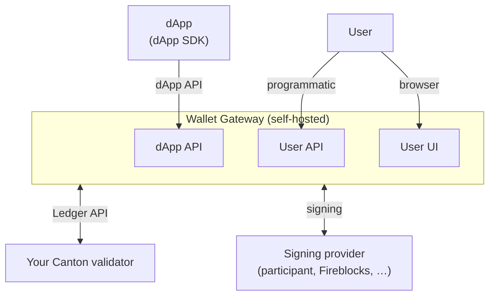
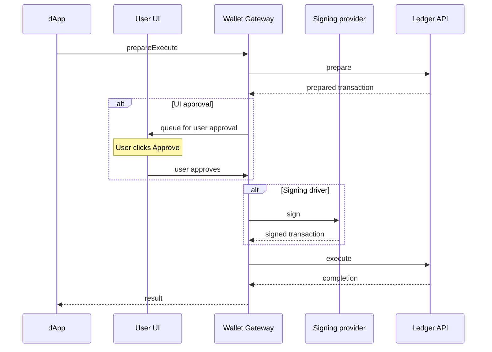

<Warning>
  이 페이지는 팀 리서치를 위한 비공식 한글 번역입니다. 기술적 판단에는 [공식 영어 원문](https://docs.canton.network/integrations/wallet-gateway/overview.md)을 사용하세요.
</Warning>

Wallet Gateway는 dApp을 Canton Network의 자체 infrastructure에 연결하는 self-hosted component입니다. 이미 운영하는 Validator 옆의 자체 environment에서 Wallet Gateway를 실행합니다. 그러면 모든 [CIP-0103](https://github.com/canton-foundation/cips/blob/main/cip-0103/cip-0103.md) dApp이 Wallet Gateway에 연결될 수 있습니다. Wallet Gateway는 **자신의** Validator와 통신하고 **자신의** signing 또는 custody provider를 통해 sign하므로 signing을 기존에 신뢰하는 infrastructure 밖으로 옮기지 않습니다.

Wallet Gateway는 다음을 위해 실행합니다.

- **dApp 연결**: 호환되는 dApp이 연결하고 account를 조회하며 transaction을 request할 수 있도록 CIP-0103 dApp API 제공
- **자체 Validator 사용**: Authenticate된 user를 대신하여 Canton Validator의 Ledger API와 통신
- **원하는 위치에서 signing 유지**: Participant Node, Fireblocks/Blockdaemon/DFNS 같은 External Custody Provider 또는 development용 internal store로 sign
- **Wallet 관리**: Web UI 또는 programmatic interface를 통해 하나 이상의 network에서 Party를 생성하고 관리
- **User authentication**: OAuth / OpenID Connect 또는 self-signed token으로 user login을 처리하고 API access용 session 발급

<Note>
Wallet Gateway는 자체 infrastructure를 운영하는 team, 즉 Validator operator, builder 및 자신이 control하는 Validator와 signing provider를 기반으로 dApp 연결을 제공하려는 조직을 위한 component입니다. dApp frontend를 구축한다면 [dApp SDK](/sdks-tools/sdks/dapp-sdk/overview)를 사용하세요.
</Note>

## Component 관계

## Core Concepts

**Networks.** Network는 Wallet Gateway를 한 Canton Validator의 Ledger API로 연결하며 [CAIP-2](https://github.com/ChainAgnostic/CAIPs/blob/main/CAIPs/caip-2.md) 형식, 예: `canton:localnet`으로 식별합니다. 하나의 Wallet Gateway에 여러 network를 설정할 수 있고 각 wallet은 정확히 하나의 network에 속합니다.

**Identity providers.** 모든 network는 Validator authentication에 사용하는 JWT를 발급하는 Identity Provider(IDP)를 참조합니다. Wallet Gateway는 production에 권장하는 **OAuth / OpenID Connect** provider와 development에서만 사용하는 **self-signed** token을 지원합니다.

**Sessions.** User는 IDP를 통해 authenticate하고 Wallet Gateway는 이후 호출을 authorize하는 JWT session을 발급합니다. Session은 연결한 dApp에 binding됩니다. 각 dApp은 연결할 때 생성되고 disconnect 또는 logout할 때 종료되는 자체 JWT session을 가집니다.

**Wallets and parties.** Wallet은 Wallet Gateway가 user를 위해 관리하는 Canton Party입니다. 각 wallet은 network와 signing provider에 연결되고 user는 하나의 wallet을 primary로 지정할 수 있습니다. dApp은 이 wallet을 user가 transaction에 사용할 수 있는 account로 인식합니다.

**Signing providers.** Wallet별로 선택한 signing provider에 signing을 위임할 수 있으므로 같은 Wallet Gateway의 서로 다른 wallet이 서로 다른 provider로 sign할 수 있습니다. Key는 선택한 provider, 즉 Participant Node, External Custody Service 또는 test용 internal store에 유지됩니다. [Signing providers](/integrations/wallet-gateway/operate/signing-providers)를 참조하세요.

## Transaction Lifecycle

dApp이 연결되면 approval과 signing을 계속 자체 control 아래 두도록 transaction이 Wallet Gateway를 통과합니다. dApp은 Wallet Gateway에 transaction execution을 요청합니다. Wallet Gateway는 자체 Validator에서 transaction을 prepare하고 user는 User UI에서 검토 및 approve합니다. 선택한 signing provider가 sign하고 Wallet Gateway가 ledger에 submit한 뒤 결과를 반환합니다. Prepare와 submit은 자체 Validator의 Ledger API에서, approval은 User UI에서, signing은 선택한 provider에서 수행되므로 private key가 dApp으로 전달되지 않습니다.

## Quickstart

실행을 시작하려면 [Quickstart](/integrations/wallet-gateway/quickstart)를 따라 Wallet Gateway를 설치하고 configuration file을 생성한 뒤 network에 연결하여 시작하고 세 endpoint를 verify하세요.

## 다음 문서

- [Quickstart](/integrations/wallet-gateway/quickstart): Wallet Gateway 설치, 설정, 실행 및 verify
- [Wallet Gateway 설정](/integrations/wallet-gateway/operate/configure): Configuration file, store 및 server setting 이해
- [Signing providers](/integrations/wallet-gateway/operate/signing-providers): Transaction signing과 key custody 위치 선택
- [API reference](/integrations/wallet-gateway/reference/user-api): User API를 사용하여 script에서 Wallet Gateway 제어
