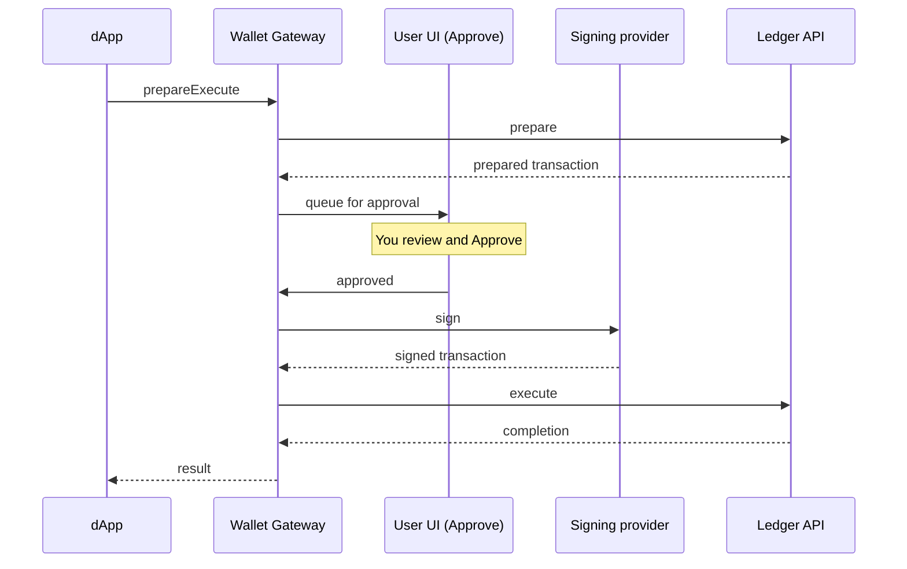

<Warning>
  이 페이지는 팀 리서치를 위한 비공식 한글 번역입니다. 기술적 판단에는 [공식 영어 원문](https://docs.canton.network/integrations/wallet-gateway/use/approve-and-sign.md)을 사용하세요.
</Warning>

dApp이 사용자를 대신해 동작하려 할 때 dApp 자체는 아무것도 signing하지 않습니다. 대신 Wallet Gateway에 Transaction 실행을 요청하며, Wallet Gateway는 승인을 위해 해당 요청을 사용자에게 전달하고 signing을 위해 signing provider로 전달합니다. 이를 통해 승인과 key custody를 사용자가 제어할 수 있으며 private key는 dApp에 전달되지 않습니다. 이 가이드에서는 **Approve** 페이지에 표시되는 내용, 승인 또는 거부 방법, 이후 Transaction을 추적하는 방법을 설명합니다.

## Transaction이 사용자에게 전달되는 방식

dApp은 [dApp SDK](/sdks-tools/sdks/dapp-sdk/overview)를 통해 Transaction을 제출하며, dApp SDK는 Wallet Gateway의 dApp API를 호출합니다. Wallet Gateway는 Validator를 대상으로 Transaction을 prepare하고, 사용자 승인을 위해 queue에 추가한 뒤, signing provider가 signing하도록 하고 Ledger에 제출합니다.

dApp은 `txChanged` event를 통해 결과를 확인합니다. 따라서 사용자가 승인하고 Transaction이 실행되면 dApp이 자체적으로 update됩니다.

## Transaction 검토

dApp이 Transaction을 요청하면 Wallet Gateway는 해당 Transaction의 **Approve** 페이지로 사용자를 이동시킵니다. dApp이 실행한 경우 popup window로 열릴 수 있습니다. 이 페이지에서는 다음 정보를 확인할 수 있습니다.

- Transaction이 동작 주체로 사용할 **wallet**(Party)
- Transaction이 제출될 **network**
- 예상한 내용과 일치하는지 확인할 수 있도록 dApp이 prepare한 **Transaction 상세 정보**

## 승인 또는 거부

- **Approve**: Wallet Gateway는 prepare된 Transaction을 wallet의 [signing provider](/integrations/wallet-gateway/operate/signing-providers)에 전달합니다. Signing provider가 Transaction을 signing하면 Wallet Gateway가 Ledger에 제출합니다. 결과는 dApp에 통지됩니다.
- **Reject**: Wallet Gateway는 요청을 폐기하고 사용자가 거부했음을 dApp에 알립니다. 아무것도 signing하거나 제출하지 않습니다.

**Approve** 페이지가 popup으로 열렸다면 사용자가 결정한 뒤 popup이 닫히고 dApp으로 돌아갑니다.

실수로 popup을 닫아 Transaction 승인 페이지를 잃은 경우 User UI를 다시 열고 **Activities**로 이동하여 Transaction을 검토하세요.

<Warning>
이해하고 예상한 Transaction만 승인하세요. 승인하면 signing provider를 통해 wallet key로 signing한 뒤 Ledger에 제출하며, 이 작업은 되돌릴 수 없습니다. 잘못된 부분이 있다면 거부하세요.
</Warning>

## Signing이 수행되는 위치

Signing은 wallet 생성 시 선택한 signing provider에 wallet별로 위임됩니다. Signing provider는 Participant Node, external custody provider(Fireblocks, Blockdaemon, DFNS) 또는 development용 internal store일 수 있습니다. Key는 해당 provider에 유지됩니다. UI에서 승인하면 provider가 signing할 권한을 부여하지만 key는 dApp이나 browser를 통과하지 않습니다. [Signing provider](/integrations/wallet-gateway/operate/signing-providers)를 참조하세요.

## Transaction 추적

**Transactions** 페이지를 열어 lifecycle 전반에 걸쳐 Transaction을 추적하고 상세 정보를 확인할 수 있습니다. 각 Transaction은 다음 상태를 거칩니다.

| Status | 의미 |
| --- | --- |
| **Pending** | Prepare되었으며 사용자 승인을 기다리는 중입니다. |
| **Signed** | 승인되고 signing provider가 signing했으며 제출 중입니다. |
| **Executed** | Ledger에 제출되어 성공적으로 완료되었습니다. |
| **Failed** | 거부되었거나 signing 또는 제출 과정에서 실패했습니다. |

이 페이지에서 Transaction이 실행되었는지 확인하거나 실패 원인을 살펴보세요. 실행이 시작되지 않거나 완료되지 않으면 [Troubleshooting](/integrations/wallet-gateway/operate/troubleshooting)을 참조하세요.

## 다음 단계

- [Party 관리](/integrations/wallet-gateway/use/party-management): User UI에 로그인하고 wallet을 생성, 구성 및 제거합니다.
- [User API를 사용한 자동화](/integrations/wallet-gateway/automation/automate-with-user-api): Program 방식으로 Transaction을 signing하고 실행합니다.
- [Signing provider](/integrations/wallet-gateway/operate/signing-providers): Signing과 key custody가 수행될 위치를 선택합니다.
- [dApp API](/integrations/wallet-gateway/reference/dapp-api): dApp이 dApp API를 통해 Transaction을 요청하는 방법을 확인합니다.
