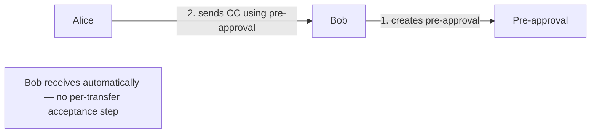
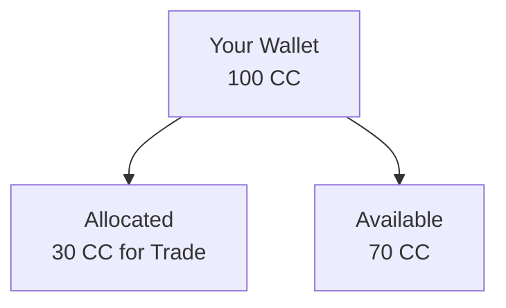
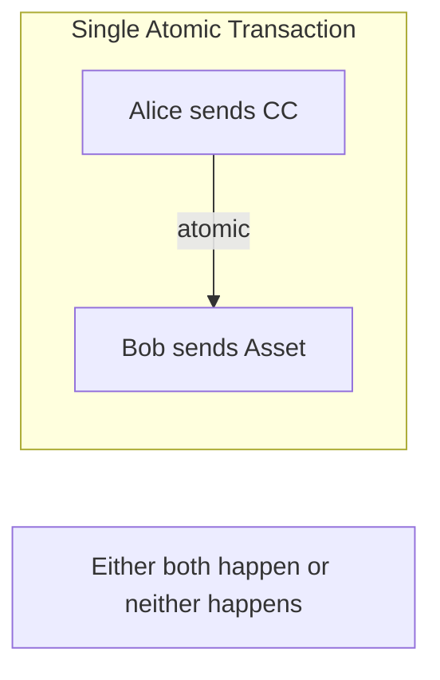
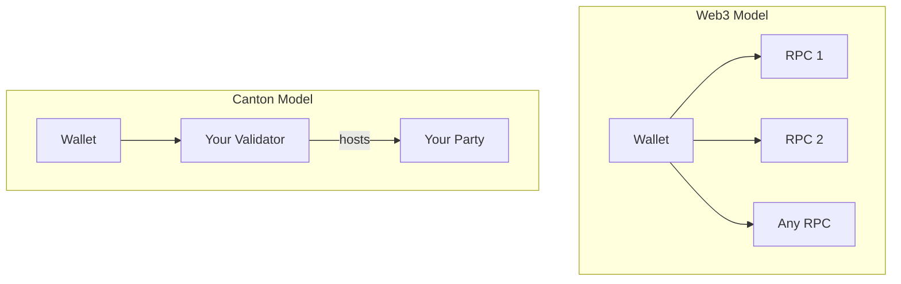

<Warning>
  이 페이지는 팀 리서치를 위한 비공식 한글 번역입니다. 기술적 판단에는 [공식 영어 원문](https://docs.canton.network/integrations/wallets/canton-vs-web3.md)을 사용하세요.
</Warning>

Canton wallet은 MetaMask와 같은 Web3 wallet과 다르게 동작합니다. 이 페이지에서는 주요 차이와 그 차이가 user와 developer에게 무엇을 의미하는지 설명합니다.

## 근본적인 차이

| Aspect | Web3 Wallets | Canton Wallets |
|--------|--------------|----------------|
| **Data visibility** | Balance가 public | CC balance는 Scan을 통해 public, private contract data는 participant에게만 표시 |
| **Transaction privacy** | 모든 transaction이 public | CC transaction은 Scan을 통해 public, private contract activity는 participant에게만 표시 |
| **Network model** | 임의의 RPC에 연결 | 자신의 Party를 hosting하는 Validator에 연결 |
| **Identity** | Pseudonymous address | Party identifier |
| **Transfer model** | Single-step send | Single-step 또는 multi-step, 예: pre-approval과 allocation |

## Privacy Model

### Web3: 기본적으로 Public

Ethereum에서 wallet은 다음 특성을 갖습니다.

- 누구나 확인할 수 있는 public address를 가집니다.
- Query하는 누구에게나 balance를 표시합니다.
- 모든 transaction이 block explorer에 표시됩니다.
- Transaction pattern을 분석할 수 있습니다.

```
Anyone can query: 0x123...abc has 45.67 ETH
Anyone can see: 0x123...abc sent 5 ETH to 0x456...def
```

### Canton: 기본적으로 Contract Privacy 적용

Canton의 privacy model은 contract type에 따라 달라집니다.

- CC balance와 transaction history는 network의 Scan service를 통해 공개됩니다.
- Private application contract data는 권한 있는 Party에게 표시됩니다.
- 모든 contract를 포괄하는 global view는 없습니다.

```
Anyone can query via scan: Your party's CC balance and transfer history
Only entitled parties see: Your private application contract data
```

## Transfer 기능

Canton wallet은 전통적인 wallet에서 지원할 수 없는 transfer pattern을 제공합니다.

### Multi-Step Transfers

전통적인 transfer는 지금 X를 보내는 방식입니다.

Canton은 다음과 같은 복잡한 workflow를 지원합니다.

| Pattern | Description |
|---------|-------------|
| **Pre-approvals** | Recipient가 모든 sender의 transfer 수락을 사전에 승인 |
| **Allocations** | 특정 목적을 위해 token reserve |
| **DvP** | Atomic delivery-versus-payment exchange |
| **Conditional** | 조건에 따라 실행되는 transfer |

### Pre-Approvals

Recipient가 매번 incoming transfer를 수락하지 않아도 모든 sender에게서 token을 받을 수 있게 합니다.



**Use case:**

- Subscription payment
- Recurring transfer
- Automated application flow

### Allocations

특정 목적을 위해 token을 reserve합니다.



**Use case:**

- Trade settlement
- Escrow arrangement
- Multi-step workflow

### Delivery vs. Payment (DvP)

서로 다른 asset을 atomic하게 교환합니다.



**중요한 이유:**

- Settlement risk 없음
- Party 간 trust 불필요
- 하나의 transaction으로 복잡한 exchange 수행

## Connection Model

### Web3: 임의의 RPC

Web3 wallet은 호환되는 임의의 RPC endpoint에 연결합니다.

- Infura, Alchemy 또는 self-hosted endpoint
- 자유로운 provider 전환
- 모든 node가 query에 응답 가능

### Canton: 자신의 Validator

Canton wallet은 하나 이상의 Validator에 연결합니다.

- 자신의 Party를 hosting하는 Validator
- Party가 특정 위치에서 hosting되므로 자유롭게 전환할 수 없음
- 자신의 Validator만 해당 데이터를 보유



## Identity Model

### Web3: Address-Based

- Public key에서 address 파생
- 누구나 address 생성 가능
- Pseudonymous, address가 identity 역할 수행

### Canton: Party-Based

- Party identifier가 Validator hosting과 연결됨
- Party 생성에 Validator가 관여
- 같은 방식의 pseudonymous model이 아님

<Note>
Local Party의 경우 Validator가 key를 보유하고 Party를 대신하여 sign합니다. External Party의 key는 외부에서 보유하며 명시적인 signing이 필요합니다.
</Note>

| Web3 Address | Canton Party |
|--------------|--------------|
| `0x742d35Cc6634C0532925a3b844Bc454e4438f44e` | `alice::1220f2fe29866fd6a0009ecc8a64ccdc09f1958bd0f801166baaee469d1251b2eb72` |

## Explorer 차이

### Web3: Global Explorer

Block explorer는 다음을 포함한 모든 network activity를 표시합니다.

- 모든 transaction
- 모든 address balance
- 모든 contract state

### Canton: CC는 Scan Service, Private Contract는 개인별 View

CC에 대해서는 network의 Scan service가 block explorer처럼 동작하여 누구나 Party별 CC balance와 transaction history를 query할 수 있습니다. Private application contract에서는 자신의 activity만 확인합니다.

- 자신의 private contract transaction
- 자신의 private contract balance
- 자신의 contract

## User에게 미치는 영향

| 기존에 익숙한 방식 | Canton에서의 방식 |
|----------------------|--------------|
| 임의의 address balance 확인 | CC balance는 Scan으로 query, private contract balance는 entitlement 필요 |
| 모든 transaction 확인 | CC history는 Scan에서 public, private contract activity는 자신에게만 표시 |
| 임의의 RPC에 연결 | 자신의 Validator에 연결 |
| 단순한 send transaction | 더 다양한 transfer option 제공 |

## Developer에게 미치는 영향

| 구축 대상 | 고려 사항 |
|----------------------|-------------|
| Wallet integration | Canton pattern을 위해 Wallet SDK 사용 |
| Transaction display | User의 transaction만 표시 |
| Balance query | CC는 Scan으로 query, private contract는 user Party로 query |
| Multi-step workflow | Pre-approval과 allocation 활용 |

## 다음 단계

<CardGroup cols={2}>

<Card title="Developer용 Wallet" icon="code" href="/integrations/overview">
  App에 wallet 기능을 통합합니다.
</Card>

<Card title="Token Standard" icon="coins" href="/overview/understand/cips-introduction">
  Canton Token Standard를 이해합니다.
</Card>

</CardGroup>
