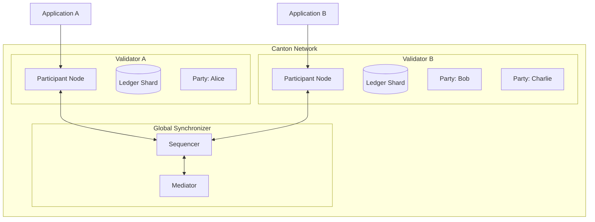
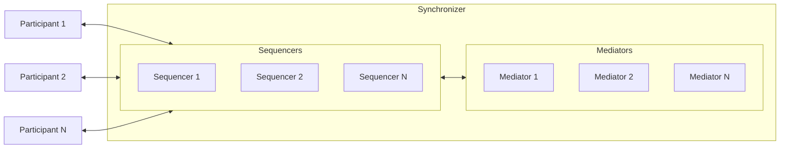
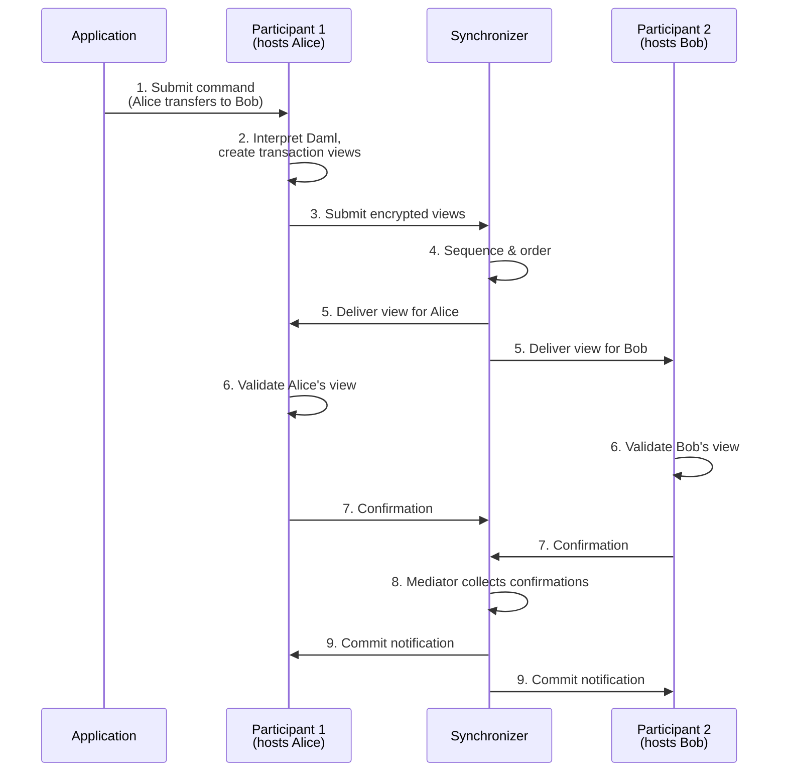
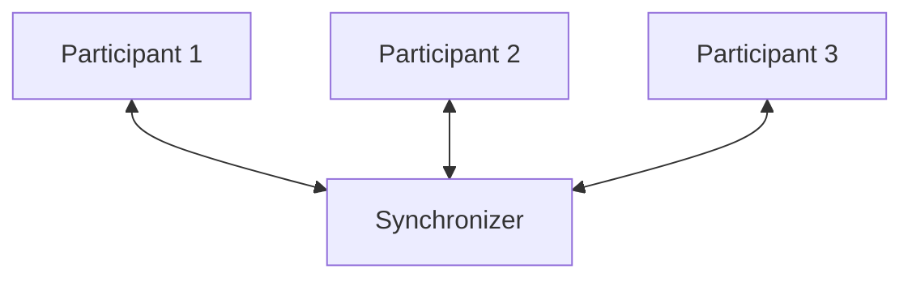
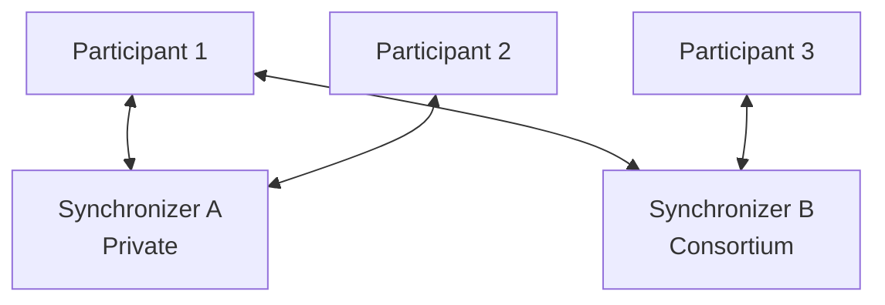
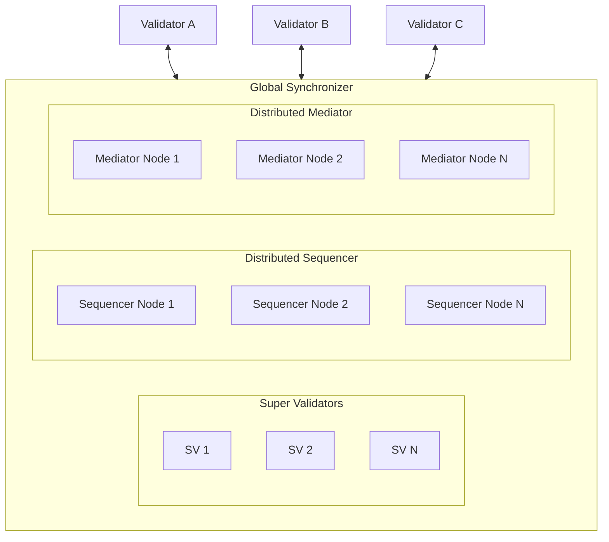
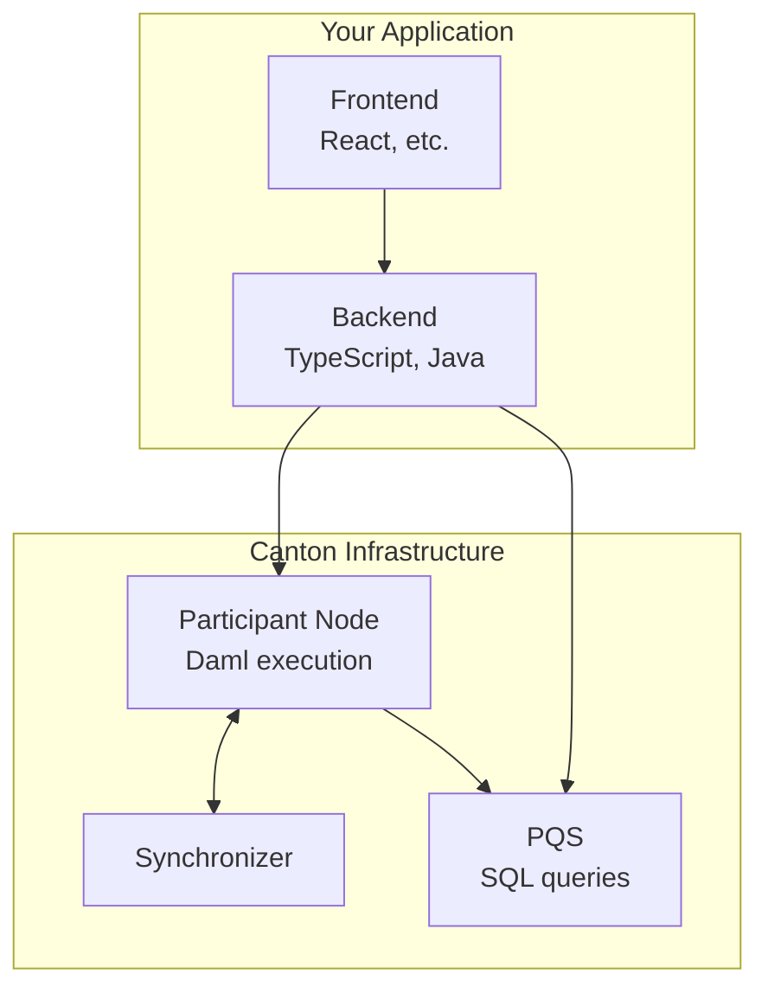

<Warning>
  이 페이지는 팀 리서치를 위한 비공식 한국어 번역입니다. 기술적 판단에는 [공식 영어 원문](https://docs.canton.network/overview/learn/architecture.md)을 사용하세요.
</Warning>

Canton architecture는 전통적인 blockchain과 근본적으로 다릅니다. Canton application을 설계하고 debug하려면 이러한 component를 이해해야 합니다.

## 전체 구조

Canton은 **coordination**과 **storage**를 분리합니다. Synchronizer는 Transaction ordering을 coordination하고 Participant Node(Validator)는 hosting하는 Party의 data를 저장합니다.



모든 node가 모든 state를 저장하는 Ethereum과 달리 Canton node는 자신의 Party data만 저장합니다. Synchronizer는 coordination하지만 Transaction 내용을 저장하지 않습니다.

## 핵심 Component

### Validator

Validator는 Canton의 핵심 실행 주체로 다음을 수행합니다.

| 기능 | 설명 |
|------|------|
| **Party hosting** | Hosting하는 Party의 contract data 저장 |
| **Daml logic 실행** | 자신의 Party에 영향을 주는 Transaction에서 smart contract code 실행 |
| **Transaction validation** | 자신의 shard에 대한 authorization과 correctness 검증 |
| **Ledger API 제공** | Application을 위한 gRPC/JSON API 제공 |

Validator는 Participant Node를 운영하는 Canton Network 역할입니다. 흔히 "Participant"로 줄여 부르는 Participant Node는 Canton Network에서 entity를 위한 private self-sovereign computation/storage unit입니다.

**주요 특성:**
- 각 Participant Node는 ledger에 대한 **localized private view**를 유지합니다
- Participant Node는 hosting하는 Party가 Stakeholder인 contract만 저장합니다
- 하나의 Participant Node가 여러 Party를 hosting할 수 있습니다
- Participant Node는 여러 Synchronizer에 연결할 수 있습니다

### Synchronizer

Synchronizer는 **Transaction 내용을 보지 않고** Transaction ordering과 consensus를 coordination합니다. 두 component로 구성됩니다.



**Sequencer**
- Participant 사이에서 암호화된 message의 순서를 정하고 배포함
- 해당 Synchronizer의 Transaction에 total ordering을 제공함
- Decrypt된 Transaction 내용을 **보지 않음**
- 모든 Participant가 해당 Synchronizer의 message를 동일한 순서로 받도록 보장함

**Mediator**
- Consensus protocol 지원
- Participant의 confirmation verdict 수집
- Transaction verdict(committed 또는 rejected) 선언
- Decrypt된 Transaction 내용을 **보지 않음**

<Note>
Synchronizer는 coordination layer이지 state storage layer가 아닙니다. Transaction data를 저장하거나 이에 접근하지 않으며 암호화된 message와 confirmation result만 처리합니다.
</Note>

### Party

Party는 Canton의 on-ledger identity로 다른 blockchain의 address나 externally owned account(EOA)와 비슷합니다.

```
alice::1220f2fe29866fd6a0009ecc8a64ccdc09f1958bd0f801166baaee469d1251b2eb72
└┬┘  └─────────────────────────────────────────┘
 name                              fingerprint (hash of public key)
```

**Party Capability:**

| Capability | 설명 |
|------------|------|
| **Validate** | 자신의 contract에 영향을 주는 Transaction confirm |
| **Control** | 특정 action(Choice) 시작 |
| **Observe** | 특정 state와 Transaction 열람 |

**Local Party와 External Party:**

| 유형 | Key Storage | Control | Use Case |
|------|-------------|---------|----------|
| **Local Party** | Validator가 보유 | Validator가 대신 signing | 더 단순함, Validator가 완전한 control 보유 |
| **External Party** | 외부에서 보유 | 명시적인 signature 필요 | 더 큰 control, wallet과 유사한 경험 |

<Warning>
Ethereum address와 달리 Party는 생성 비용이 있고 Validator에 state를 만듭니다. 일시적인 존재가 아니므로 Party 구조를 신중히 설계하세요.
</Warning>

## Transaction 작동 방식

### Transaction Flow



### 단계별 설명

| 단계 | Component | Action |
|------|-----------|--------|
| **1. Submit** | Application | Ledger API를 통해 Participant에 Command 전송 |
| **2. Interpret** | 제출 Participant | Daml code를 실행하고 view가 있는 Transaction 생성 |
| **3. Submit** | 제출 Participant | Synchronizer에 암호화된 view 전송 |
| **4. Sequence** | Sequencer | Transaction ordering과 timestamp 할당 |
| **5. Distribute** | Sequencer | 각 view를 권한 있는 Participant에게만 전송 |
| **6. Validate** | 모든 Participant | 각자 자신의 view를 독립적으로 validate |
| **7. Confirm** | 모든 Participant | Mediator에 confirmation/rejection verdict 전송 |
| **8. Collect** | Mediator | Verdict를 집계하고 결과 결정 |
| **9. Commit** | 모든 Participant | Local ledger shard에 Transaction 적용 |

**핵심 사항:**
- Transaction은 **view**로 분해되며 각 Party는 자신의 view만 봅니다
- Synchronizer는 sequence하지만 내용을 **decrypt하지 않습니다**
- Confirmation에는 관련 Participant의 **threshold agreement**가 필요합니다
- 각 Participant는 commit된 자신의 view만 저장합니다

## Network Topology 선택지

Canton은 여러 Topology configuration을 지원합니다.

### Single Synchronizer(단순)



Use case: 단순한 deployment, test, single-organization application.

### Multiple Synchronizer(Federated)



Use case: 서로 다른 workflow를 위한 서로 다른 Synchronizer, regulatory separation, consortium governance.

### Global Synchronizer(Canton Network)



Use case: Public Canton Network, decentralized application, cross-organization workflow.

## Code가 실행되는 곳

| Component | 위치 | 기술 | 책임 |
|-----------|------|------|------|
| **Smart Contract(Template)** | Participant Node | Daml | Business logic, authorization, privacy rule |
| **Backend Service** | 사용자의 infrastructure | 모든 언어(TypeScript, Java, Python) | Off-ledger automation, integration |
| **Frontend** | Browser/mobile | 모든 framework | User interface |
| **Query** | Participant(Ledger API) 또는 PQS | gRPC, JSON, SQL | Ledger state 조회 |



### Application Architecture 결정

| 결정 | On-Ledger(Daml) | Off-Ledger(Backend) |
|------|-----------------|---------------------|
| **Multi-party agreement** | ✓ 필수 | |
| **Authorization enforcement** | ✓ 권장 | 가능하지만 더 약함 |
| **복잡한 business logic** | 가능 | ✓ 대체로 더 쉬움 |
| **External API call** | 불가능 | ✓ 필수 |
| **High-frequency operation** | Batching 고려 | ✓ 더 적합함 |
| **Audit trail 요구 사항** | ✓ 내장됨 | 직접 구현해야 함 |

## Component Communication

### API 개요

| API | Protocol | Use Case |
|-----|----------|----------|
| **Ledger API(gRPC)** | gRPC/Protobuf | High-performance backend integration |
| **Ledger API(JSON)** | HTTP/JSON | 더 단순하고 browser-friendly한 integration |
| **Admin API** | gRPC/Protobuf | Node administration, Party management |
| **PQS SQL API** | PostgreSQL | 복잡한 query, reporting |

### Ledger API Operation

| Operation | 설명 |
|-----------|------|
| **Command Submission** | Daml Command 제출(contract 생성, Choice exercise) |
| **Transaction Stream** | 자신의 Party에 대한 Transaction event 구독 |
| **Active Contract Set** | 현재 active contract query |
| **Completions** | Command completion status 추적 |

## 다음 단계

- **[Privacy Model 설명](/overview/learn/privacy-model)** - Sub-transaction privacy 상세 분석
- **[Global Synchronizer](/overview/understand/global-synchronizer)** - Public network infrastructure 이해
- **[Validator 운영](/global-synchronizer/understand/introduction)** - Validator를 배포하고 운영하는 사용자를 위한 안내
