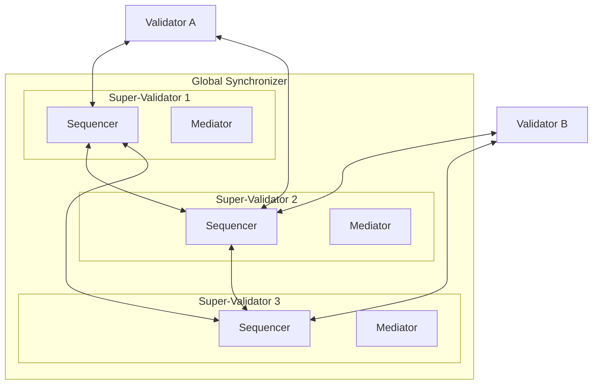

<Warning>
  이 페이지는 팀 리서치를 위한 비공식 한국어 번역입니다. 기술적 판단에는 [공식 영어 원문](https://docs.canton.network/overview/learn/global-synchronizer-architecture.md)을 사용하세요.
</Warning>

Global Synchronizer는 서로 다른 Validator에 있는 Party 간 Transaction을 가능하게 하는 shared infrastructure입니다. Canton Foundation의 governance 아래 Super Validator(SV) 집합이 이를 운영합니다. Synchronizer는 Transaction ordering과 consensus를 coordination하지만 자신이 처리하는 Transaction의 내용을 볼 수는 없습니다.

## Component

Global Synchronizer는 여러 Super Validator node에서 실행되는 여러 Sequencer와 Mediator로 구성됩니다. 이 distributed architecture는 Byzantine Fault Tolerance(BFT)를 제공합니다. 일부 node가 침해되거나 장애를 일으켜도 system은 계속 올바르게 작동합니다.

### Sequencer

Sequencer는 Synchronizer의 모든 message에 total ordering을 제공합니다. Validator로부터 암호화된 Transaction message를 받아 해당 Transaction에 관여한 모든 Participant에게 일관된 순서로 전달합니다. 서로 다른 SV에서 여러 Sequencer가 실행되며, BFT consensus protocol을 사용하여 message ordering에 합의합니다.

Sequencer는 암호화된 message envelope를 볼 수 있지만 그 내용을 읽을 수는 없습니다. Addressing metadata를 바탕으로 어떤 Participant가 message를 받아야 하는지는 알지만 Transaction의 동작은 알지 못합니다.

### Mediator

Mediator는 Validator의 confirmation response를 수집하고 필요한 모든 Party가 Transaction을 승인했는지 판단합니다. Sequencer와 마찬가지로 Mediator는 암호화된 view를 대상으로 작동합니다. Transaction의 내용을 알지 못한 채 올바른 Party가 Transaction을 confirm했는지 확인할 수 있습니다.

각 SV는 Sequencer와 Mediator를 모두 실행합니다. 특정 Transaction을 담당할 Mediator는 해당 Transaction의 confirmation request를 처음 처리하는 Sequencer가 결정합니다.

## Synchronizer를 통과하는 Transaction flow

Validator가 Transaction을 제출하면 다음 절차가 진행됩니다.

1. Validator가 관여한 각 Participant를 수신자로 지정하여 암호화된 Transaction view를 Sequencer에 보냅니다
2. Sequencer가 message의 순서를 정하고 지정된 Participant에게 배포합니다
3. 수신하는 각 Participant가 자신의 view를 decrypt하고 Transaction을 validate한 다음 confirmation 또는 rejection을 Mediator에 보냅니다
4. Mediator가 response를 모아 Transaction 결과를 결정합니다
5. 결과가 Sequencer를 통해 모든 관여 Participant에게 다시 broadcast됩니다
6. 각 Participant가 결과를 local ledger에 적용합니다

Synchronizer는 암호화되지 않은 Transaction data에 접근할 수 없습니다. 무엇이 거래되는지 알지 못한 채 protocol을 coordination합니다.

## BFT 보장

Distributed design 덕분에 단일 SV가 일방적으로 Transaction을 censor하거나 confirmation을 위조하거나 ordering을 중단할 수 없습니다. SV의 3분의 1 미만이 faulty 또는 malicious한 한 Synchronizer는 올바르게 작동합니다. 정확한 BFT threshold는 Canton Foundation governance가 설정한 consensus configuration에 따라 달라집니다.

## Validator와 Synchronizer

일반 Validator(SV가 아닌 Validator)는 client로 Synchronizer에 연결합니다. 일반 Validator는 Sequencer나 Mediator component를 실행하지 않습니다. Validator에는 SV endpoint로 향하는 outbound connectivity만 필요하며, 표준 Validator에는 inbound connection 요구 사항이 없습니다.
