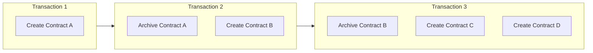
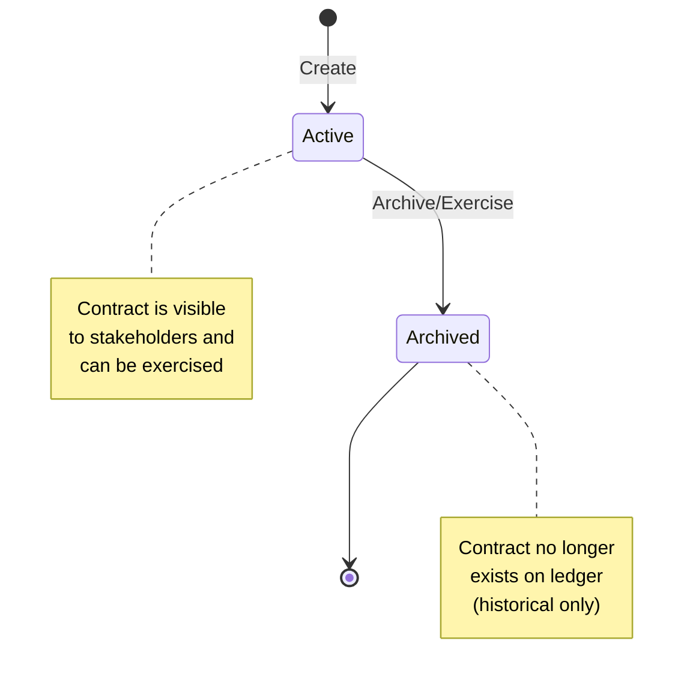
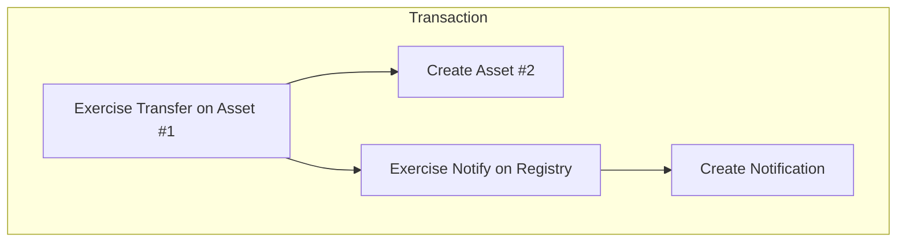
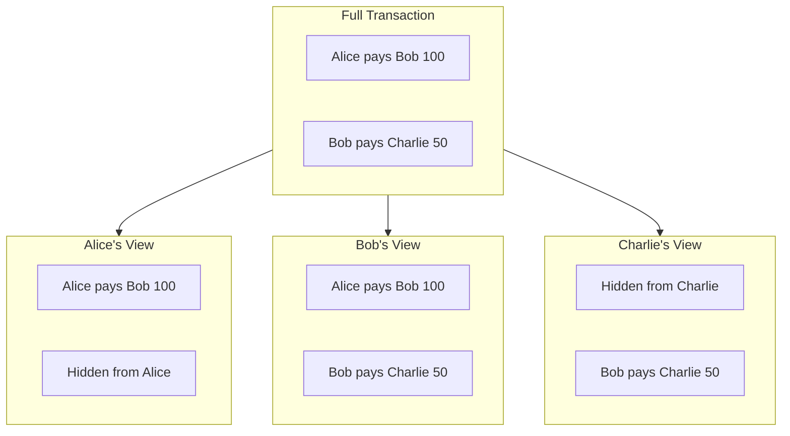

<Warning>
  이 페이지는 팀 리서치를 위한 비공식 한국어 번역입니다. 기술적 판단에는 [공식 영어 원문](https://docs.canton.network/overview/learn/ledger-model.md)을 사용하세요.
</Warning>

import DamlOverviewLearnLedgerModelL101 from "/snippets/daml-docs/overview_learn_ledger-model_L101.mdx";
import DamlOverviewLearnLedgerModelL122 from "/snippets/daml-docs/overview_learn_ledger-model_L122.mdx";
import DamlOverviewLearnLedgerModelL180 from "/snippets/daml-docs/overview_learn_ledger-model_L180.mdx";
import DamlOverviewLearnLedgerModelL241 from "/snippets/daml-docs/overview_learn_ledger-model_L241.mdx";
import DamlOverviewLearnLedgerModelL269 from "/snippets/daml-docs/overview_learn_ledger-model_L269.mdx";
import DamlOverviewLearnLedgerModelL283 from "/snippets/daml-docs/overview_learn_ledger-model_L283.mdx";
import DamlOverviewLearnLedgerModelL81 from "/snippets/daml-docs/overview_learn_ledger-model_L81.mdx";

Canton은 mutable account balance 대신 생성되고 archive되는 개별 object인 contract로 구성된 **extended UTXO(eUTXO)** ledger model을 사용합니다. 이 model은 Canton이 privacy와 composability를 달성하는 방식의 토대입니다.

## UTXO인 Contract

Canton에서 ledger는 **active contract**의 collection입니다. 각 contract는 다음 특성을 가집니다.

- Transaction으로 생성됨
- 다른 Transaction이 archive할 때까지 존재함
- Immutable함
- 고유한 Contract ID를 가짐

### UTXO를 사용하는 이유

| 속성 | UTXO Model | Account Model |
|------|------------|---------------|
| **Parallelism** | 높음, 독립적인 contract를 parallel 처리 | 낮음, account lock 필요 |
| **Privacy** | 자연스러움, 각 contract에 특정 Stakeholder가 있음 | 어려움, account가 data를 aggregate함 |
| **Composability** | 내장됨, contract가 서로를 reference함 | 신중한 설계 필요 |
| **Double-spend 방지** | 구조적, contract는 한 번만 archive됨 | Sequence number 필요 |

### Contract Lifecycle

## Stakeholder 역할

모든 contract에는 그 contract와 특정 관계를 가진 Party인 **Stakeholder**가 있습니다. Stakeholder 역할이 visibility와 authorization을 결정합니다.

### Signatory

Signatory는 contract의 주요 authority입니다.

**속성:**
- Contract 생성을 authorize해야 함
- Consuming Choice의 Controller인 경우 contract archive를 authorize할 수 있음
- 항상 contract와 그 contract의 모든 action을 봄
- Template에서 `signatory` keyword로 정의

<DamlOverviewLearnLedgerModelL81 />

**사용 시점:** Party의 agreement가 contract 존재에 필수적일 때.

### Observer

Observer는 contract를 볼 수 있지만 일방적으로 action을 수행할 수는 없습니다.

**속성:**
- Contract와 그 contract의 action을 봄
- Controller이기도 한 경우가 아니면 archive하거나 Choice를 exercise할 수 없음
- `observer` keyword로 정의

<DamlOverviewLearnLedgerModelL101 />

**사용 시점:** Party에 compliance, audit 또는 information 목적의 visibility가 필요할 때.

### Controller

Controller는 contract의 특정 Choice를 exercise할 수 있습니다.

**속성:**
- 자신이 control하는 Choice를 exercise할 수 있음
- Choice와 그 결과를 봄
- Choice별로 `controller` keyword를 사용해 정의

<DamlOverviewLearnLedgerModelL122 />

**사용 시점:** Party가 특정 action을 trigger할 수 있어야 할 때.

### Actor

Actor는 Transaction을 제출하거나 authorize하는 Party입니다.

### 역할 비교

| 역할 | 생성 가능? | 볼 수 있음? | Exercise 가능? | Archive 가능? |
|------|------------|--------------|----------------|----------------|
| **Signatory** | 예 | 항상 | Controller인 경우 | Authorize해야 함 |
| **Observer** | 아니요 | 항상 | Controller인 경우 | 아니요 |
| **Controller** | 아니요 | Choice + 결과 | 예, 자신의 Choice | Consuming Choice를 통해 |
| **Actor** | Signatory인 경우 | Stakeholder인 경우 | Controller인 경우 | Signatory인 경우 |

## Transaction 구조

Canton의 Transaction은 **action**의 tree입니다. 각 action은 contract를 create, exercise 또는 fetch합니다. Fetch는 일반적으로 Transaction stream에서 반환되지 않습니다.

### Action 유형

- **Create**는 ledger에 새 contract를 추가하고 Contract ID를 반환합니다.
- **Exercise**는 contract의 Choice를 실행하며 contract를 archive할 수 있습니다. Choice result와 모든 결과를 반환합니다.
- **Fetch**는 state를 변경하지 않고 contract를 읽으며 contract data를 반환합니다.

### Transaction Tree

Transaction tree는 하나의 Transaction 안에서 발생한 모든 create, exercise, fetch, archive를 기록합니다.

### Consuming Choice와 Non-Consuming Choice

기본값인 **consuming** Choice는 exercise할 때 contract를 archive합니다. State transition과 transfer에 사용합니다. **Non-consuming** Choice는 contract를 active 상태로 유지하므로 query, notification, read에 유용합니다.

<DamlOverviewLearnLedgerModelL180 />

## View

각 Stakeholder는 자신에게 권한이 있는 부분만 담긴 Transaction **view**를 봅니다.

### View 구성

### Visibility Rule

1. **Signatory는 contract**, contract에서 exercise된 consuming Choice와 non-consuming Choice를 봅니다
2. **Observer는 contract**와 contract에서 exercise된 consuming Choice를 봅니다
3. **Controller는 자신이 exercise할 수 있는 Choice**와 그 결과를 봅니다

## Contract Key

<Note>
Contract Key는 아직 Canton Network deployment에서 지원되지 않습니다. 사용 가능 여부는 [release note](/global-synchronizer/release-notes/canton)를 확인하세요.
</Note>

Contract에는 Contract ID를 알지 못해도 조회할 수 있는 identifier인 **key**가 있을 수 있습니다.

<DamlOverviewLearnLedgerModelL241 />

Key는 **lookup**을 지원하므로 Contract ID를 알지 못해도 key로 contract를 찾을 수 있습니다. 모든 key에는 key를 책임지는 Party인 **maintainer**가 있습니다.

<Warning>
Key는 Synchronizer 내에서 global합니다. Contract 존재 여부에 관한 정보가 유출되지 않도록 key를 신중히 설계하세요.
</Warning>

## Ledger Time

Canton은 contract operation에 **ledger time**을 사용합니다. Time은 다음 특성을 가집니다.

- Synchronizer가 할당함
- Synchronizer별로 monotonically increasing함
- Time 기반 contract logic에 사용됨

<DamlOverviewLearnLedgerModelL269 />

Canton 3.x에서 사용할 수 있는 전체 time primitive는 [Time 다루기](/appdev/modules/m3-working-with-time)를 참고하세요.

## Composability

UTXO model은 여러 contract가 하나의 Transaction에서 all-or-nothing 방식으로 영향을 받을 수 있는 **atomic composition**을 가능하게 합니다.

<DamlOverviewLearnLedgerModelL283 />

Ledger가 이 atomicity를 enforce하므로 전체 swap이 commit되거나 어느 부분도 commit되지 않습니다.

## 관련 주제

- [Contract Template](/appdev/modules/m3-contract-templates): 첫 Daml contract 작성
- [Choice](/appdev/modules/m3-choices): Contract에 behavior 추가
- [Privacy Model](/overview/learn/privacy-model): View가 privacy를 가능하게 하는 방식
