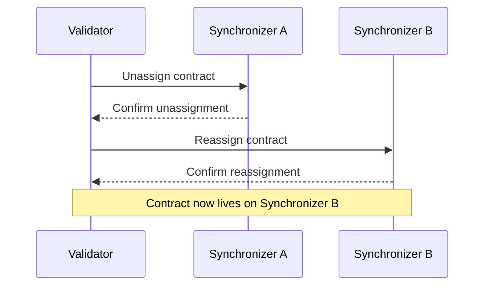

<Warning>
  이 페이지는 팀 리서치를 위한 비공식 한국어 번역입니다. 기술적 판단에는 [공식 영어 원문](https://docs.canton.network/overview/learn/multi-synchronizer.md)을 사용하세요.
</Warning>


Canton Network는 여러 Synchronizer가 동시에 운영되는 방식을 지원합니다. Ledger의 각 contract는 특정 Synchronizer에 assign되며 필요에 따라 Synchronizer 사이에서 이동할 수 있습니다. 이 설계를 통해 network를 horizontally scale하고 서로 다른 use case를 위한 특화 Synchronizer를 지원할 수 있습니다.

## Contract와 Synchronizer Assignment

Canton의 모든 active contract는 어느 시점이든 정확히 하나의 Synchronizer에 assign됩니다. Synchronizer는 해당 contract가 포함된 Transaction의 ordering과 consensus를 처리합니다. Transaction이 서로 다른 Synchronizer의 contract를 다루면 Canton은 두 Synchronizer 전체에서 Transaction을 coordination합니다.

Validator는 Party의 contract data를 local에 저장합니다. Contract가 assign된 Synchronizer에 따라 해당 Transaction을 처리할 Sequencer와 Mediator가 결정되지만 contract data 자체는 contract의 Stakeholder를 hosting하는 Validator에 유지됩니다.

## Unassignment와 Reassignment

Contract는 unassignment/reassignment protocol을 통해 한 Synchronizer에서 다른 Synchronizer로 이동할 수 있습니다.

1. **Unassignment**: Contract가 현재 Synchronizer에서 제거됩니다. 이 짧은 기간에는 Transaction에서 contract를 사용할 수 없습니다.
2. **Reassignment**: Contract가 target Synchronizer에 assign되어 다시 사용할 수 있게 됩니다.

이 operation은 contract의 Stakeholder 관점에서 atomic합니다. Contract가 두 Synchronizer에 동시에 존재하거나 유실될 수 있는 state에 놓이는 일은 없습니다.



## Global Synchronizer

Global Synchronizer는 Canton Network의 주요 Synchronizer입니다. Canton Foundation governance 아래 Super Validator가 운영합니다. Canton Network의 대부분 contract는 Global Synchronizer에 assign되며 Global Synchronizer는 새 contract의 기본 Synchronizer 역할을 합니다.

특정 use case를 위한 추가 Synchronizer를 만들 수도 있습니다. 예를 들어 일부 Transaction을 격리하려는 consortium을 위한 Dedicated Synchronizer가 있을 수 있습니다. Dedicated Synchronizer의 contract도 cross-synchronizer Transaction을 통해 Global Synchronizer의 contract와 상호 작용할 수 있습니다.

## 여러 Synchronizer를 사용하는 경우

대부분의 application에는 Global Synchronizer만 필요합니다. 다음이 필요하면 여러 Synchronizer가 중요해집니다.

- **Isolation**: 특정 Transaction flow를 public network와 완전히 분리
- **Performance**: High-throughput workflow를 여러 Synchronizer에 분산하여 contention 감소
- **Regulatory compliance**: 특정 jurisdiction의 특정 Validator만 일부 Transaction을 처리하도록 보장


{/* COPIED_START source="docs-website:docs/replicated/canton/3.5/overview/explanations/canton/multi-synchronizer.rst" hash="5d738e2e" */}

# Multiple Synchronizer

## Motivation

Participant Node는 Global Synchronizer 또는 privately operated Synchronizer를 사용하여 Daml Transaction을 실행합니다. 둘 이상의 Synchronizer가 필요한 이유는 여러 가지입니다.

- **Regulation**

  일부 규제 환경에서는 core infrastructure를 직접 control해야 합니다. 또는 data domicile law에 따라 자신의 operation zone에 배포되지 않은 Synchronizer에 연결하지 못할 수 있습니다.

- **Performance**

  Synchronizer마다 performance 특성이 다릅니다. 어떤 Synchronizer는 high throughput을, 다른 Synchronizer는 low latency를 목표로 할 수 있습니다. 자신의 non-functional requirement에 맞는 Synchronizer를 선택해야 합니다.

- **Governance**

  Synchronizer governance는 centralized 또는 decentralized일 수 있습니다.

- **Cost**

  High-throughput use case에서는 Global Synchronizer의 fee가 너무 높아 다른 Synchronizer를 선호할 수 있습니다.

- **Application restriction**

  Application Provider는 application 사용을 특정 Synchronizer로 제한할 수 있습니다.

서로 다른 use case를 지원하기 위해 하나의 Participant Node가 여러 Synchronizer에 연결할 수 있습니다.

<div id="def-multi-sync-assignation">

Contract의 **assignation** 정의:
모든 Daml contract에 대해 contract의 Stakeholder를 하나 이상 hosting하는 Participant는 해당 contract의 변경을 coordination하는 데 사용할 Synchronizer에 합의합니다. 합의한 Synchronizer를 contract의 *assignation*이라고 합니다.

</div>

더 일반적인 guiding principle은 모든 shared state에 대해 이 state를 유지하는 Participant가 state 변경을 coordination하는 데 사용할 Synchronizer에 합의한다는 것입니다.

Contract의 Stakeholder는 contract에 assign된 Synchronizer를 변경하는 데 합의할 수 있습니다. 이 절차를 *Reassignment*라고 하며 아래에서 설명합니다. Daml Transaction은 단일 Synchronizer에서 실행되므로, 즉 모든 input contract가 이 Synchronizer에 assign되어야 하므로 Reassignment가 필요합니다.

## 여러 Synchronizer를 사용하는 Transaction

사용자가 현재 서로 다른 Synchronizer에 assign된 contract를 포함하는 Daml Transaction을 실행하려 한다고 가정합니다. 다음 단계를 통해 Transaction을 실행할 수 있으며 아래에서 더 정확히 설명합니다.

1. Transaction에 적합한 Synchronizer를 찾아 `S`라고 합니다

    `S`가 충족해야 할 조건은 아래 [reassignment-validations](#reassignment-validations)에서 더 정확히 설명합니다. 최소한 모든 Stakeholder가 `S`에서 hosting되어야 하고 모든 input contract의 모든 Package가 `S`에서 vet되어야 합니다.

2. 모든 input contract의 assignation을 `S`로 변경합니다. 즉, 모든 input contract를 `S`로 reassign합니다.

3. `S`에서 Transaction을 실행합니다.

4. 필요하면 output contract의 assignation을 다른 Synchronizer로 변경합니다.

Contract의 assignation을 변경하는 방법은 두 가지입니다.

- **자동**

  사용자가 Transaction을 제출하면 Canton의 Synchronizer router가 Transaction 제출에 사용할 최적의 Synchronizer를 식별하려고 합니다. 그런 다음 Transaction의 input contract가 선택된 Synchronizer로 reassign되도록 Reassignment confirmation request를 제출합니다. 모든 Reassignment가 완료되면 Synchronizer router가 선택된 Synchronizer에 Daml Transaction을 제출합니다.

  이 경우 사용자는 Synchronizer 선택이나 Reassignment 수행을 걱정할 필요가 없습니다. 따라서 Synchronizer를 고려하지 않고 application을 설계할 수 있습니다. 그러나 application은 inhomogeneous Topology, Synchronizer별 Package Vetting 또는 Party Hosting, 그리고 explicitly disclosed contract를 사용해 routing에 영향을 줄 수 있습니다.

- **명시적**

  사용자는 다음과 같이 Synchronizer routing을 정밀하게 control할 수 있습니다.

  - Ledger API는 Reassignment를 제출하는 Command를 받습니다.
  - Daml Transaction을 제출할 때 사용할 Synchronizer를 지정할 수 있습니다. 지정한 Synchronizer가 Transaction에 적합하지 않으면 submission이 실패합니다.

### Synchronizer 자동 선택

모든 input contract가 같은 Synchronizer에 assign되지 않아 단일 Synchronizer에서 Transaction을 실행할 수 없으면 Synchronizer router가 submission에 가장 적합한 common Synchronizer를 찾으려고 합니다.

각 input contract c_i에 대해 submission 시점의 assignation을 S_i라고 합니다. 다음을 만족하면 Synchronizer `S`는 Transaction에 admissible합니다.

- c_i를 S_i에서 `S`로 reassign하는 것이 valid합니다.
- Submitting Participant가 각 c_i에 대해 submitting Party의 reassigning participant입니다.

Router는 모든 admissible Synchronizer 중 다음 조건을 중요도 순서대로 만족하는 Synchronizer를 선택합니다.

- Priority가 가장 높음
- Reassignment 수를 최소화함
- Synchronizer ID가 가장 낮음

### Global Synchronizer의 중요성

앞서 설명했듯 Daml Transaction을 실행하려면 모든 input contract의 모든 Stakeholder가 하나의 Synchronizer를 신뢰해야 합니다. 또한 모든 input Package가 이 common Synchronizer에서 vet되어야 합니다. Global Synchronizer의 목적은 모든 Party가 신뢰하는 표준 Synchronizer가 되어 대부분의 Transaction settlement에 사용할 수 있게 하는 것입니다.

## Reassignment Protocol

Synchronizer `S`를 사용하여 contract `c`를 생성하면 Stakeholder는 `S`를 사용하여 contract의 추가 변경, 예를 들어 exercise와 archive를 coordination하는 데 합의합니다. 이 시점에 `c`의 assignation은 `S`입니다. `c`의 assignation을 다른 Synchronizer `S'`로 변경하기 위해 `c`의 Stakeholder는 `c`를 `S`에서 `S'`로 *reassign*합니다.

이 section에서는 Reassignment protocol을 설명합니다.

### 개요

Contract `c`를 *source* Synchronizer인 `S1`에서 *target* Synchronizer인 `S2`로 reassign하면 Stakeholder가 assignation을 `S1`에서 `S2`로 변경할 수 있습니다. 절차는 두 단계로 구성됩니다.

- **Unassignment**

  Contract의 Stakeholder가 source Synchronizer에서 contract를 unassign하는 Command를 제출합니다. Unassignment가 commit되면 `c`는 source Synchronizer에서 inactive해지고 더 이상 사용할 수 없습니다.

  Unassignment는 Transaction protocol과 같은 phase를 거칩니다.

- **Assignment**

  Contract의 Stakeholder가 target Synchronizer에서 contract를 assign하는 Command를 제출합니다. Unassignment를 제출한 Stakeholder와 같을 필요는 없습니다. Assignment가 commit되면 `c`는 target Synchronizer에서 active해지고 다시 사용할 수 있습니다.

  Assignment는 Transaction protocol과 같은 phase를 거칩니다.

두 단계는 다음 diagram으로 나타낼 수 있습니다.

<div id="reassignment-high-level">

</div>


따라서 contract Reassignment는 source와 target이라는 서로 다른 두 Synchronizer의 두 confirmation request가 포함되는 **non-atomic** 절차입니다. Unassignment가 성공하면 contract는 **pending assignment**로 표시되며 Assignment가 수행될 때까지 사용할 수 없습니다.

Ledger API 관점의 Reassignment를 설명하기 전에 다음 정의를 살펴봅니다.

<div id="def-multi-sync-reassignment-counter">

정의: **reassignment counter**
**Reassignment counter**는 contract가 reassign된 횟수를 추적합니다. Contract 생성 시 0으로 설정되고 Unassignment마다 1씩 증가합니다. Unassignment event와 해당 Assignment event의 Reassignment counter는 같습니다.

</div>

### Ledger API와 Application 관점의 Reassignment

Unassign Command는 다음 field로 구성됩니다.

- Reassign할 contract. Batch의 모든 contract는 동일한 Signatory 집합과 Stakeholder 집합을 가져야 합니다
- Source Synchronizer, 현재 assignation
- Target Synchronizer

성공한 Unassignment는 다음 field가 포함된 unassigned event를 생성합니다.

- Unassign ID: Reassignment를 고유하게 식별하고 Assignment 제출에 사용하는 opaque identifier
- Reassignment counter: Contract가 reassign된 횟수
- Assignment exclusivity: Target Synchronizer에서 측정한 이 시점 전에는 Unassignment submitter만 Assignment를 시작할 수 있음

Assign Command는 다음 field로 구성됩니다.

- Unassign ID
- Source Synchronizer, 이전 assignation
- Target Synchronizer

성공한 Assignment는 다음 field가 포함된 assigned event를 생성합니다.

- Unassign ID: Unassigned event와 assigned event의 correlation에 사용 가능
- Reassignment counter: Unassigned event와 같은 값
- Created event: Contract data. 목적은 `entering-leaving-visibility` 참고

### 실행 예제

여러 scenario와 정의를 설명하기 위해 Bank가 Signatory이고 Alice가 Observer(owner)인 `Iou`를 생각해 보겠습니다. `Iou`를 `S1`에서 `S2`로 reassign하는 상황을 다룹니다.

Network Topology는 다음과 같습니다.

- Participant `P1`, ..., `P3` 다섯 개와 Synchronizer `S1`, `S2` 두 개
- 아래 그림과 같은 Hosting relationship. 괄호 안 문자는 permission(Submission, Confirmation, Observation)을 나타냄

<div id="multi-synchronizer-running-example">

</div>


### Reassignment 관련 주요 정의

Unassignment와 Assignment request confirmation의 일부로 수행되는 validation을 설명하기 전에 몇 가지 정의가 필요합니다.

#### Target Timestamp

Unassignment request를 처리할 때 Confirming Participant는 target Synchronizer가 몇 가지 요구 사항, 예를 들어 필요한 Package가 vet되었는지를 충족하는지 확인해야 합니다. 이 요구 사항은 시간이 지나면서 달라질 수 있는 target Synchronizer의 Topology에 따라 달라집니다. 관여한 모든 Participant가 같은 validation을 수행하고 같은 결론에 도달하도록 Unassignment request에는 모든 Topology 관련 validation에 사용하는 target Synchronizer timestamp가 포함됩니다.

정의: **target timestamp**
Unassignment를 제출할 때 target Synchronizer에 time proof를 요청합니다. 이 timestamp는 Unassignment 처리 중 target Synchronizer 관련 validation, 예를 들어 Package Vetting, target Synchronizer의 Stakeholder Hosting 등에 사용합니다. 이 timestamp를 **target timestamp**라고 합니다.

#### Reassigning Participant

Stakeholder는 여러 Participant Node에서 hosting될 수 있고 Topology가 inhomogeneous할 수 있으므로, 예를 들어 Participant Node가 연결된 Synchronizer 중 일부에서만 Party를 hosting할 수 있으므로 Reassignment에 관여하는 Participant Node가 Unassignment request 또는 Assignment request 중 하나의 informee일 수 있습니다. 아래 Participant Node의 visibility에 contract가 들어오고 나가는 상황에 관한 설명을 참고하세요. 이러한 Participant Node는 source와 target Synchronizer 모두에 연결되어야 가능한 모든 validation을 수행할 수 없고, reassign된 contract가 source와 target Synchronizer에서 동시에 active해지는 double-spend를 막을 수도 없습니다. 이에 따라 다음을 정의합니다.

정의: **reassigning participant**
Contract `c`에 대해 다음 조건을 만족하면 Participant `P`는 Party `S`의 **reassigning participant**입니다.

1. `S`는 `c`의 Stakeholder입니다.
2. Target timestamp에 `S`가 target Synchronizer의 `P`에서 hosting됩니다.
3. `S`가 source Synchronizer의 `P`에서 hosting됩니다.

마지막 조건은 submission 중에는 최근 Topology snapshot으로, protocol phase 3 중에는 request time의 Topology snapshot으로 확인합니다.

실행 예제에서 `P1`, `P3`, `P5`는 reassigning participant입니다. `P2`는 target Synchronizer에 연결되지 않았으므로 reassigning participant가 아닙니다. 마찬가지로 `P4`는 source Synchronizer에 연결되지 않아 reassigning participant가 아닙니다.

#### Signatory Unassigning Participant

Reassignment confirmation policy를 설명하려면 Participant Node가 Unassignment request의 confirmer가 되기 위해 충족해야 할 조건을 도출해야 합니다. 앞서 설명했듯 node가 reassigning participant여야 한다는 것이 한 가지 요구 사항입니다.

또한 contract Signatory만 confirm하도록 합니다. Signatory는 source Synchronizer에서 contract를 archive하고 target Synchronizer에서 다시 생성할 수 있으므로 Observer 같은 다른 Party까지 Unassignment request를 confirm하도록 요구해도 safety가 추가되지 않습니다.

이에 따라 다음을 정의합니다.

정의: **signatory unassigning participant**
Contract `c`에 대해 다음 조건을 만족하면 Participant `P`는 Party `S`의 **signatory unassigning participant**입니다.

1. `S`는 `c`의 **Signatory**입니다.
2. `P`는 `S`의 reassigning participant입니다.
3. `S`는 source Synchronizer의 `P`에서 최소한 confirmation right로 hosting됩니다.

실행 예제에서 signatory unassigning participant는 `P3`와 `P5`입니다. Participant `P1`은 contract의 Signatory를 hosting하지 않으며 `P2`와 `P4`는 어떤 Party의 reassigning participant도 아닙니다.

#### Signatory Assigning Participant

정의: **signatory assigning participant**
Contract `c`에 대해 다음 조건을 만족하면 Participant `P`는 Party `S`의 **signatory assigning participant**입니다.

1. `S`는 c의 **Signatory**입니다.
2. `P`는 `S`의 reassigning participant입니다.
3. `S`는 target Synchronizer의 `P`에서 최소한 confirmation right로 hosting됩니다.

비공식적으로 signatory assigning participant는 contract의 Unassignment와 Assignment를 모두 전달받으며 Assignment request의 confirmer입니다.

실행 예제에서 signatory assigning participant는 `P5`뿐입니다.

- `P1`은 contract의 Signatory를 hosting하지 않습니다.
- `P3`는 Signatory를 hosting하지만 observation right만 있습니다.

### Confirmation Policy

이 section에서는 어떤 informee participant가 Unassignment 또는 Assignment request에 confirmation response를 보내야 하는지 설명합니다.

일부 validation은 reassigning participant만 수행할 수 있고 contract의 Signatory만 Reassignment request를 confirm해야 하므로, Unassignment confirmer는 정확히 signatory unassigning participant이며 Assignment confirmer는 정확히 signatory assigning participant입니다.

Mediator가 하나의 Signatory에 대해 기대하는 confirmation 수는 정확히 그 Signatory의 confirmation threshold입니다. Unassignment에는 source Synchronizer의 threshold를, Assignment에는 target Synchronizer의 threshold를 사용합니다.

### Unassignment와 Assignment Request의 Validation

Reassignment validation rule의 guiding principle은 다음과 같습니다.

- Contract를 reassign하더라도 Stakeholder가 contract를 사용할 능력을 잃어서는 안 됩니다.
- Contract를 unassign한 뒤 assign할 수 없게 되는 위험을 최소한으로 줄여야 합니다. Reassignment는 non-atomic임을 기억하세요.

이제 Unassignment request 처리의 일부로 수행해야 할 validation을 정리할 수 있습니다.

- Contract `c`가 source Synchronizer에서 active합니다.
- 모든 Stakeholder가 reassigning participant에서 hosting됩니다.
- 각 Signatory `S`가 충분한 수의 signatory assigning participant에서 hosting됩니다. 더 정확히는 target Synchronizer에서 `S`의 confirmation threshold가 `t`이면 `S`에는 최소 `t`개의 signatory assigning participant가 있어야 합니다. 이를 통해 signatory assigning participant가 충분하지 않아 Reassignment를 완료하지 못하는 위험을 제거합니다.
- Contract에 해당하는 Package가 target Synchronizer에서 vet되어야 합니다.
- Request에 여러 contract가 포함되면 batch의 모든 contract가 동일한 Signatory와 Stakeholder를 가져야 합니다.

Assignment request 처리의 일부로 수행해야 할 validation은 더 단순합니다. Confirming Participant는 다음을 확인해야 합니다.

- Assignment가 아직 완료되지 않은 Reassignment에 해당합니다.
- Contract에 해당하는 Package가 vet되어 있습니다.

Unassignment나 Assignment에만 해당하지 않고 일반 Daml Transaction에도 수행하는 추가 validation은 다음과 같습니다.

- View를 올바르게 decrypt할 수 있음
- Recipient list가 올바름
- Root hash message가 올바름
- 기타

### Submission Policy

Participant `P`가 contract `c`의 Stakeholder `S`를 하나 이상 hosting하고 `S`의 reassigning participant이면 `P`가 `c`의 Reassignment, 즉 Unassignment 또는 Assignment를 제출할 수 있습니다. `P`가 submission permission으로 `S`를 hosting해야 하는 것은 아닙니다.

Reassignment 제출에 submission permission을 요구하지 않는 이유는 여러 가지입니다.

- 실행 예제에서 Alice는 Synchronizer `S2`에서 submission permission으로 hosting되지 않기 때문에 `Iou`가 `S2`로 reassign되면 Choice exercise capability를 잃습니다. Alice는 `S1`으로 되돌리는 Reassignment를 시작할 수 있으므로 `Iou`에서 Choice를 exercise할 가능성을 되찾을 수 있습니다.
- Decentralized Party는 Daml Transaction을 제출할 수 없지만 application composability를 위해 Reassignment는 제출할 수 있어야 합니다.

<div className="todo">

구현되면 External Party use case 언급 \<[https://github.com/DACH-NY/canton/issues/25878](https://github.com/DACH-NY/canton/issues/25878)\>

</div>

### Participant Visibility에 들어오고 나가는 Contract

이 페이지의 실행 예제를 생각해 보세요.

Participant `P2`는 Unassignment confirmation request의 informee participant이지만 `S2`에서 Alice를 hosting하지 않기 때문에 Assignment request의 informee participant는 아닙니다. 따라서 `P2`의 관점에서 Assignment가 완료되어도 contract가 active해지지 않습니다. 해당 Participant에서 contract를 사용할 수 없게 됩니다. 이는 Alice가 `S1`과 `S2` 모두의 `P1`에서 hosting되기 때문에만 허용됩니다. 이 scenario에서는 contract가 `P2`의 *visibility에서 나간다*고 합니다.

이제 "반대" scenario를 생각해 보세요. Participant `P4`는 `S2`에서 Bank를 hosting하는 Participant로서 Assignment confirmation request의 informee participant이며 Assignment의 일부로 contract를 알게 됩니다. 완료되면 `P4`에서 contract를 사용할 수 있습니다. 이 scenario에서는 contract가 `P4`의 *visibility에 들어온다*고 합니다. Created event가 assigned event에 포함되므로 application은 contract가 Participant Node의 visibility에 들어올 때 contract payload를 알 수 있습니다.

Participant 관점에서 하나의 contract는 lifecycle 동안 여러 번 visibility에 들어오고 나갈 수 있습니다. Participant에서 hosting하는 모든 Stakeholder가 multi-hosted이면 이런 일이 발생할 수 있습니다.

### Update Stream의 Non-Causality

이 section에서는 contract의 activation/deactivation인 `Created`, `Archived`, `Unassigned`, `Assigned`만 포함하는 **update stream**을 다룹니다. Non-consuming exercise도 포함하는 update tree stream을 다루도록 쉽게 확장할 수 있습니다.

Contract `c`와 `c`의 Stakeholder를 hosting하는 Participant Node에 대해 `c`의 update stream에 emit된 모든 event 목록을 생각해 보겠습니다. 단일 Synchronizer만 관여하면 이 목록에는 정확히 최대 두 element가 포함됩니다.

- 첫 element는 `c`의 `Created`, 즉 activation입니다.
- Contract가 active하지 않으면 마지막 element는 `Archived` 또는 `Exercised`, 즉 deactivation입니다.
- Activation record time은 deactivation record time보다 엄격하게 작습니다. 더 일반적으로 update stream의 event는 record time 순서입니다.

Participant Node가 여러 Synchronizer에 연결되면 update stream은 모든 Synchronizer의 event를 merge한 것입니다. Synchronizer 간에는 time을 비교할 수 없으므로 global event ordering에 관한 보장을 제공하지 않습니다. 구체적으로 다음을 의미합니다.

- 서로 다른 Synchronizer에서 발생한 event의 ordering에 관해 어떤 assumption도 할 수 없습니다.
- Participant마다 ordering이 다를 수 있습니다.

따라서 multi-Synchronizer scenario에서는 **update stream에 global causality가 없습니다**.

예를 들어 다음 scenario를 생각해 보세요.

- Contract `c`가 Synchronizer `S1`에서 생성됩니다.
- `c`가 `S1`에서 `S2`로 unassign됩니다.
- `c`가 `S2`에 assign됩니다.
- `c`가 archive됩니다.

`S1`과 `S2` 모두에서 Stakeholder를 hosting하는 Participant의 update stream에서 event는 다음 순서 중 어느 것으로도 나타날 수 있습니다.

- `created`, `unassigned`, `assigned`, `archived`
- `created`, `assigned`, `unassigned`, `archived`
- `assigned`, `created`, `unassigned`, `archived`
- `assigned`, `archived`, `created`, `unassigned`
- `created`, `assigned`, `archived`, `unassigned`
- `assigned`, `created`, `archived`, `unassigned`

특히 `created` event가 반드시 첫 event인 것도 아니고 `archived` event가 반드시 마지막 event인 것도 아닙니다.

각 Synchronizer에 대한 event projection은 causally consistent합니다. 이는 다음을 의미합니다.

- `created`는 항상 모든 `unassigned` 또는 `archived`보다 먼저 나타남
- `archived`는 항상 모든 `assigned` 또는 `created`보다 나중에 나타남
- 연속 activation이나 deactivation이 없으며 특히 연속 `assigned` 또는 `unassigned`가 없음

마지막으로 앞서 설명했듯 Participant Node가 Assignment를 통해 contract를 알게 될 수 있으므로 update stream에 `Created` 또는 `Archived`가 포함된다는 보장은 없습니다.

### Reassignment와 Contention

Assignment는 activation이므로 create와 유사한 영향을 줍니다. 마찬가지로 Unassignment는 deactivation이므로 archive와 유사한 영향을 줍니다. 특히 Assignment와 Unassignment 모두 contract를 lock하므로 Reassignment는 read-only Transaction을 포함한 다른 workflow와 contention을 일으킵니다. Transaction submission의 일부로 Synchronizer router가 Reassignment를 자동 수행하면 이러한 추가 contention이 예상 밖일 수 있고 debug하기 어려울 수 있습니다. Contention을 최소화할 수 있도록 Daml workflow를 설계할 때 Reassignment를 명시적으로 고려하는 것이 좋습니다.

## Multi-Synchronizer Time

<div className="todo">

이 section 작성 \<[https://github.com/DACH-NY/canton/issues/25859](https://github.com/DACH-NY/canton/issues/25859)\>

</div>

Ledger model의 time monotonicity와 연결

Command dedup time model과 대조


{/* COPIED_END */}


{/* COPIED_START source="docs-website:docs/replicated/canton/3.5/overview/explanations/canton/traffic-management.rst" hash="646cccf4" */}

# Traffic Management

Sequencer는 Canton Synchronizer의 핵심 component이며 상당한 운영 비용을 발생시킵니다. 따라서 Canton은 abuse로부터 Sequencer를 보호하고 Synchronizer의 개별 member가 시간에 따라 sequence할 수 있는 data 양을 control하는 mechanism을 제공합니다. 이를 위해 Synchronizer의 Sequencer는 Traffic accounting을 수행하고 Traffic limit을 enforce합니다. 이 페이지에서는 이 mechanism을 설명합니다.

## Submission Request

Sequencer API는 Synchronizer에서 event를 sequence하기 위한 `SendAsync` RPC를 제공합니다. Submission request는 SendAsync RPC의 payload이며 Sequencer가 대부분의 resource를 이 RPC 처리에 사용하므로 Traffic management의 주요 대상입니다.

### Traffic Cost

Traffic cost는 다음 두 차원에서 submission request 처리 비용을 포착하는 것을 목표로 합니다.

- Recipient가 event를 읽으면서 발생하는 network Traffic
- Sequencer의 event storage cost

Traffic cost는 submission request의 두 component를 고려합니다.

- Sender

- Envelope 목록. 각 envelope에는 다음이 포함됩니다.

  > - Payload, 임의의 byte
  >
  > - Recipient 목록, Synchronizer member. Recipient는 다음 방식으로 addressing할 수 있습니다.
  >
  >   > - 개별적으로
  >   > - Group addressing을 통해. Group addressing을 사용하면 특정 recipient 집합을 group으로 addressing할 수 있습니다. 예를 들어 group address `AllMembersOfSynchronizer`는 Synchronizer의 모든 member에게 payload를 보냅니다.

Submission request의 Traffic cost는 다음과 같이 계산합니다(pseudo-code).

```
fn calculate_submission_request_traffic_cost:
    envelopes_cost = 0

    for envelope in envelopes:
        storage_cost = envelope.payload
        network_cost = envelope.payload * envelope.recipients.size * read_vs_write_scaling_factor
        submission_request = storage_cost + network_cost
        envelopes_cost = envelopes_cost + submission_request

    return base_event_cost + envelopes_cost
```

여기서 `base_event_cost`는 envelope cost에 더하는 submission request의 constant cost이고 `read_vs_write_scaling_factor`는 recipient 수를 바탕으로 network cost를 scale하는 constant factor입니다. 둘 다 Synchronizer configuration parameter이며 Topology의 일부입니다. 자세한 내용은 configuration section을 참고하세요. 일반적으로 `read_vs_write_scaling_factor`는 1/10000 정도이며 recipient가 event를 읽을 때의 network bandwidth를 반영하도록 payload size를 줄입니다.

Group address는 cost 계산 전에 resolve됩니다. 따라서 `AllMembersOfSynchronizer`로 address된 message의 network cost는 request submission 시점의 Synchronizer member 수에 따라 scale됩니다.

Synchronizer에서 sequence되는 모든 submission request의 Traffic cost는 sender에게 청구됩니다. Submission request에는 confirmation request, confirmation response, ACS commitment, Topology request, time proof가 포함됩니다.

Time proof는 기술적으로 empty message이므로 Traffic cost는 항상 `base_event_cost`와 같습니다.

Synchronizer member는 일반적으로 자신에게 전송된 event를 받았음을 확인하기 위해 정기적으로 Synchronizer에 acknowledgement를 보냅니다. 이를 통해 Sequencer가 event를 안전하게 prune할 수 있습니다. Acknowledgement에는 Traffic cost가 없지만 abuse를 방지하기 위해 rate limit이 적용됩니다.

## Traffic Accounting

Synchronizer의 Sequencer가 공동으로 Traffic accounting을 수행합니다. Synchronizer의 authorize된 각 member는 request가 sequence되면 Traffic balance에서 submission request cost가 차감됩니다. 위에서 설명한 Traffic parameter는 Synchronizer의 dynamic domain parameter 일부로 설정되므로 변경될 수 있습니다. 따라서 그 사이에 Traffic parameter가 변경되면 Sequencer API에 request를 제출한 시점과 sequence된 시점 사이에 request cost가 달라질 수 있습니다. 이를 위해 각 member는 submission request를 전송할 때 expected cost를 계산하여 request metadata에 포함합니다. Traffic parameter가 동시에 update될 때 submission failure를 방지하기 위해 Sequencer는 member가 계산한 cost와 sequencing 시점의 cost가 달라도 submission 시점에 cost가 올바르게 계산된 경우 이를 허용하는 grace period를 제공합니다. 이 time window가 지나면 submission은 reject되며 최신 Traffic cost로 retry해야 합니다. Window duration은 `(confirmationResponseTimeout + mediatorReactionTimeout) * 2`입니다. 이 parameter에 관한 자세한 내용은 dynamic Synchronizer parameter 문서를 참고하세요.

Node가 특정 Synchronizer의 여러 Sequencer에서 event를 받도록 subscribe하면 모든 Sequencer에 현재 Traffic state를 요청하고 Byzantine Fault Tolerant(BFT) 방식으로 비교합니다. 이를 통해 node가 initial Traffic state를 얻고, 이후 subscription에서 자신의 event가 sequence되는 것을 관찰하면서 memory의 Traffic state를 계속 update합니다.

### Traffic Enforcement

다음 diagram은 enforcement flow와 scenario를 high level로 보여 줍니다.


이 diagram에서 강조할 몇 가지 사항이 있습니다.

Enforcement는 submission flow의 두 지점에서 이루어집니다.

- 1단계 후 Sequencer가 sender의 submission request를 받았을 때입니다. 이 단계에서 Sequencer는 sender의 Traffic state에 관한 local knowledge를 사용하여 sender에게 request를 처리할 충분한 Traffic이 있는지 판단합니다. 충분한 Traffic이 없다고 판단하면 이 단계에서 request를 reject합니다.

- 3단계 후 모든 Sequencer가 BFT ordering layer에서 sequenced event를 읽을 때입니다. 이 단계에서 각 Sequencer는 1단계와 같은 logic을 실행하지만 이 event의 sequencing time에 해당하는 sender Traffic state를 사용합니다. 이를 통해 모든 Sequencer가 sender의 Traffic이 충분한지에 대해 같은 deterministic decision을 내릴 수 있습니다.

  > - Sender에게 충분한 Traffic이 없으면 event를 recipient에게 보내지 않고 sender는 이유가 표시된 deliver error를 받습니다. 이를 "wasted sequencing"이라고 하며 metric에도 그렇게 report됩니다.
  > - Sender에게 충분한 Traffic이 있으면 sender balance에서 Traffic을 차감합니다. 그다음 일어나는 일은 event가 valid하고 recipient에게 deliver될 수 있는지에 따라 달라집니다. Event를 deliver하기 전에 Sequencer에서 Traffic control 외의 추가 validation, 예를 들어 signature validation, recipient 존재 여부 등을 수행합니다. Validation을 통과하면 event가 deliver되고 sender는 `TrafficReceipt`가 포함된 delivery receipt를 받습니다. Sender는 receipt를 사용해 Traffic state를 update할 수 있습니다. Event가 다른 이유로 invalid하면 event를 deliver하지 않고 sender는 failure 이유가 표시된 delivery error를 받습니다. 이 경우를 "wasted traffic"이라고 하며 metric에도 그렇게 report됩니다.

## Traffic 획득

### Base Traffic

Synchronizer의 모든 member는 시간이 지나면서 base Traffic을 수동적으로 축적합니다. 여기서 time은 sender의 wall clock time이 아니라 Synchronizer time입니다. Traffic 축적 속도와 member가 축적할 수 있는 maximum base Traffic은 Synchronizer Traffic configuration으로 결정됩니다. Base Traffic은 일반적으로 제한적이며 node bootstrap과 최소한의 Traffic을 요구하는 Synchronizer 연결에 사용합니다. 실제 scenario 대부분에서는 추가 Traffic을 획득해야 합니다.

### Extra Traffic

최소 `SequencerSynchronizerState.threshold`개의 Sequencer에서 Sequencer Admin API의 `SetTrafficPurchased` RPC를 호출하여 Synchronizer의 모든 member를 위한 extra Traffic을 획득할 수 있습니다. `SequencerSynchronizerState`는 Synchronizer의 active Sequencer를 정의하는 Topology Transaction입니다. Sequencer에 영향을 주는 변경 사항에 승인해야 하는 최소 Sequencer 수를 정의하는 threshold가 있으며 Traffic state도 여기에 포함됩니다. 따라서 Synchronizer의 member에게 extra Traffic을 추가하려면 동일한 Traffic purchase request를 설정 가능한 time window 안에 최소 threshold개의 Sequencer에 제출해야 합니다.

<Warning>
Request는 member를 위해 구매한 total extra Traffic의 새로운 absolute value를 설정합니다. Traffic delta가 **아닙니다**. 예를 들어 Participant P1에 현재 extra Traffic이 `0`이고 extra Traffic Credit `1000`을 구매하려면 amount가 `1000`인 `SetTrafficPurchased` request가 최소 `SequencerSynchronizerState.threshold`개의 Sequencer에서 성공적으로 처리되어야 합니다. 나중에 P1이 extra Traffic Credit `500`을 더 구매하려면 amount가 `1500`인 새 `SetTrafficPurchased` request가 성공적으로 처리되어야 합니다.
</Warning>

<Tip>
Extra Traffic 획득은 문서에서 흔히 "top up"이라고 합니다.
</Tip>

#### Serial

각 `SetTrafficPurchased` request에는 serial number를 설정해야 합니다. Serial number는 request idempotency를 보장하고 같은 member의 concurrent Traffic update를 올바르게 처리하기 위해 사용하는 integer입니다. Request가 전송되면 Sequencer는 serial number가 해당 member에 마지막으로 사용한 serial number보다 높은지 확인합니다. Serial이 너무 낮으면 request가 실패하며 올바른 serial로 retry해야 합니다. 현재 serial을 얻는 방법은 Traffic observation을 참고하세요.

Extra Traffic 획득에는 Sequencer Admin API access와 Sequencer 간 synchronization이 필요합니다. Canton Network에서는 이 synchronization을 on-ledger Daml workflow가 처리하며, 그 결과 각 Super Validator가 Traffic을 획득하는 member의 extra Traffic balance를 update합니다.

## Traffic 관찰

### Traffic State

Sequencer Admin API는 `SequencerAdministrationService.TrafficControlState` RPC를 통해 Synchronizer의 모든 member Traffic state를 제공합니다. Participant Node의 Admin API는 `TrafficControlService.TrafficControlState` RPC를 통해 Participant Node의 Traffic state를 제공합니다.

Participant Node에서 관찰되는 state는 해당 Participant Node의 Sequencer에서 관찰되는 state보다 약간 지연됩니다. Participant는 Sequencer가 event를 sequence한 후에 이루어지는 Sequencer subscription event를 통해 state를 update하기 때문입니다.

### Metric

Sequencer는 여러 Traffic 관련 metric을 report하며 Synchronizer Traffic state monitoring에 사용할 수 있습니다. Canton Metric을 참고하세요.

## Configuration

Traffic은 Synchronizer별 dynamic Synchronizer parameter를 통해 설정합니다.

``` protobuf
// In bytes, the maximum amount of base traffic that can be accumulated
uint64 max_base_traffic_amount = 1;

// Maximum duration over which the base rate can be accumulated
// Consequently, base_traffic_rate = max_base_traffic_amount / max_base_traffic_accumulation_duration
google.protobuf.Duration max_base_traffic_accumulation_duration = 3;

// Read scaling factor to compute the event cost. In parts per 10 000.
uint32 read_vs_write_scaling_factor = 4;

// Window size used to compute the max sequencing time of a submission request
// This impacts how quickly a submission is expected to be accepted before a retry should be attempted by the caller
// Default is 5 minutes
google.protobuf.Duration set_balance_request_submission_window_size = 5;

// If true, submission requests without enough traffic credit will not be delivered
bool enforce_rate_limiting = 6;

// In bytes, base event cost added to all sequenced events.
// Optional
optional uint64 base_event_cost = 7;
```

Traffic 설정 방법은 how-to section에서 확인할 수 있습니다.


{/* COPIED_END */}
