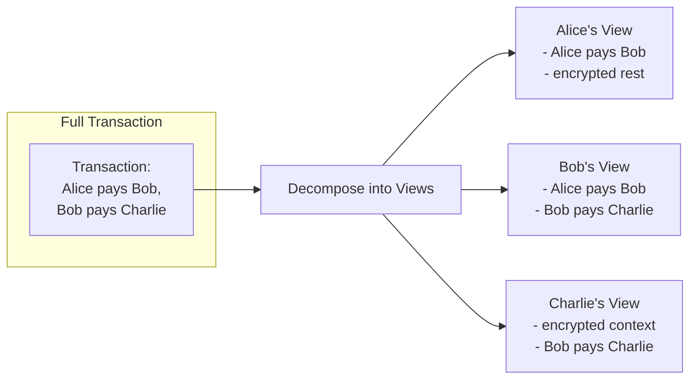

<Warning>
  이 페이지는 팀 리서치를 위한 비공식 한국어 번역입니다. 기술적 판단에는 [공식 영어 원문](https://docs.canton.network/overview/learn/privacy-model.md)을 사용하세요.
</Warning>

import DamlOverviewLearnPrivacyModelL138 from "/snippets/daml-docs/overview_learn_privacy-model_L138.mdx";
import DamlOverviewLearnPrivacyModelL157 from "/snippets/daml-docs/overview_learn_privacy-model_L157.mdx";
import DamlOverviewLearnPrivacyModelL184 from "/snippets/daml-docs/overview_learn_privacy-model_L184.mdx";
import DamlOverviewLearnPrivacyModelL217 from "/snippets/daml-docs/overview_learn_privacy-model_L217.mdx";
import DamlOverviewLearnPrivacyModelL231 from "/snippets/daml-docs/overview_learn_privacy-model_L231.mdx";
import DamlOverviewLearnPrivacyModelL263 from "/snippets/daml-docs/overview_learn_privacy-model_L263.mdx";
import DamlOverviewLearnPrivacyModelL281 from "/snippets/daml-docs/overview_learn_privacy-model_L281.mdx";
import DamlOverviewLearnPrivacyModelL90 from "/snippets/daml-docs/overview_learn_privacy-model_L90.mdx";

Canton의 privacy model은 Canton을 규정하는 핵심 기능입니다. 이 section에서는 sub-transaction privacy의 작동 방식, 제공하는 보장, privacy를 고려한 개발에서 자주 쓰는 pattern을 설명합니다.

## Blockchain의 Privacy 문제

대부분의 blockchain에서 Transaction integrity를 달성하려면 global visibility가 필요합니다. 모든 Validator가 모든 Transaction을 보면서 double-spend가 발생하지 않고 모든 rule이 지켜지는지 검증합니다.

이는 본질적인 긴장 관계를 만듭니다.

| 요구 사항 | 전통적인 접근 방식 | 문제 |
|-----------|--------------------|------|
| **Integrity** | Validator가 모든 Transaction 검증 | Visibility 필요 |
| **Verification** | Transaction 내용 확인 | Private data 노출 |
| **Privacy** | Transaction 내용 숨김 | Verification 약화 |

전통적인 blockchain은 privacy보다 integrity를 선택합니다. 모두가 모든 것을 봅니다.

### Enterprise 도입을 가로막는 이유

규제 산업에서 global visibility는 받아들일 수 없습니다.

- **Position visibility**: 경쟁자가 trading strategy를 볼 수 있음
- **Front-running 위험**: 관찰자가 Transaction information을 악용할 수 있음
- **Regulatory compliance**: 권한 없는 Party와 data를 공유할 수 없음
- **Confidential agreement**: Business term은 Party 사이에서만 유지되어야 함

## Canton의 접근 방식: Sub-Transaction Privacy

Canton은 Transaction을 view로 분해하여 각 Party가 자신의 부분을 검증하는 데 필요한 내용만 보게 하는 **sub-transaction privacy**로 integrity와 privacy의 긴장 관계를 해결합니다.

### 작동 방식

Transaction에 여러 Party가 관여할 때 Canton은 전체 Transaction을 모두에게 보내지 않습니다. 대신 다음을 수행합니다.

1. **Decomposition**: Stakeholder 관계를 바탕으로 Transaction을 **view**로 분할
2. **Encryption**: 각 view를 해당 수신자를 위해 암호화
3. **Distribution**: Synchronizer가 각 Participant에게 권한 있는 view만 전달
4. **Validation**: 각 Participant가 자신의 view를 독립적으로 validate
5. **Confirmation**: Participant가 자신의 view만 바탕으로 confirm

즉, Participant는 privacy model에 따라 자신에게 권한이 있는 Transaction 부분만 봅니다. 권한이 없는 다른 Transaction 부분에 대해서는 Transaction payload는 물론 관여한 Participant나 Party 같은 metadata도 보지 못합니다.

Synchronizer는 **이 중 아무것도 보지 못하며** 암호화된 message와 confirmation result만 봅니다.

### 각 Party가 보는 것

| Party | 보는 것 | 보지 못하는 것 |
|-------|---------|-----------------|
| **Alice** | 자신이 Bob에게 한 payment | Bob이 Charlie에게 한 payment, Charlie의 identity |
| **Bob** | 두 payment 모두, 둘 다에 관여하기 때문 | - |
| **Charlie** | 자신이 Bob에게 받은 payment | Alice의 관여, 원래 fund source |

Synchronizer는 **이 중 아무것도 보지 못하며** 암호화된 message와 confirmation result만 봅니다.

## Stakeholder Visibility Rule

Canton의 visibility는 두 가지 핵심 원칙을 따릅니다.

### 원칙 1: Party는 자신이 이해관계를 가진 Action을 봄

| 역할 | Visibility |
|------|------------|
| **Signatory** | 항상 contract와 모든 event를 봄 |
| **Observer** | 명시적인 선언에 따라 contract를 봄 |
| **Controller** | 자신이 exercise할 수 있는 Choice를 봄 |

### 원칙 2: Action을 보는 Party는 그 결과도 봄

Action을 보면 그 action이 만든 create/archive도 봅니다. 이를 통해 독립적인 verification이 가능합니다. 관찰한 결과를 바탕으로 action이 올바르게 실행되었는지 confirm할 수 있습니다.

### Visibility 예제

<DamlOverviewLearnPrivacyModelL90 />

| Party | Contract Visibility | Choice Visibility |
|-------|---------------------|-------------------|
| **sender** | ✓, Signatory | ✓, 결과를 봄 |
| **receiver** | ✓, Observer | ✓, Controller |
| **그 외 누구나** | ✗ | ✗ |

## Privacy 보장

### Canton이 보장하는 것

<Check>
**Transaction 내용**은 authorize된 Party(Signatory, Observer, Controller)만 볼 수 있습니다.
</Check>

<Check>
**Synchronizer operator**는 Transaction data를 읽을 수 없으며 암호화된 message만 봅니다.
</Check>

<Check>
Action을 볼 권한이 없는 Party에 관한 **metadata leakage가 없습니다**. 다른 Participant와 Party는 보이지 않습니다.
</Check>

<Check>
**Validator는 hosting하는 Party의 data만 저장**하므로 global state replication이 없습니다.
</Check>

## Privacy Pattern

### Pattern 1: Bilateral Agreement

두 Signatory만 contract를 봅니다. Two-party agreement에 maximum privacy를 제공합니다.

<DamlOverviewLearnPrivacyModelL138 />

**사용 시점**: 제3자 visibility 없이 두 Party에 private agreement가 필요할 때.

**Visibility**: `partyA`와 `partyB`만.

### Pattern 2: Observer를 통한 Selective Disclosure

Visibility는 필요하지만 control은 필요 없는 특정 Party를 Observer로 추가합니다.

<DamlOverviewLearnPrivacyModelL157 />

**사용 시점**: Compliance, audit 또는 information 목적으로 제3자에게 visibility가 필요할 때.

**Visibility**: `issuer`(Signatory), `owner`와 `regulator`(Observer). `owner`는 `Transfer`의 Controller이기도 하므로 해당 Choice를 일방적으로 실행할 수 있습니다.

### Pattern 3: Divulgence

Transaction에서 contract를 사용하면 해당 Transaction의 Party가 그 contract를 알게 될 수 있습니다. 이 "divulgence"는 자동으로 발생합니다.

<DamlOverviewLearnPrivacyModelL184 />

**발생하는 일**: `Execute`가 실행될 때 Bob은 원래 Observer가 아니었지만 Trade의 Party이므로 Alice가 소유한 Asset contract를 봅니다.

**주의해서 사용**: Divulgence는 의도치 않게 정보를 공개할 수 있습니다. 공개되는 내용을 인지하고 Transaction을 설계하세요.

## Privacy와 Auditability

Canton은 auditability를 희생하지 않고 privacy를 제공합니다. 자주 쓰는 pattern은 다음과 같습니다.

### Observer인 Auditor

<DamlOverviewLearnPrivacyModelL217 />

### Selective Audit Right

<DamlOverviewLearnPrivacyModelL231 />

### Auditability 모범 사례

| 관행 | 설명 |
|------|------|
| **명시적인 Auditor Party** | Audit trail이 필요한 곳에 Auditor를 Observer로 추가 |
| **Audit Choice** | Audit information을 반환하는 non-consuming Choice 생성 |
| **별도 Audit Contract** | Full visibility가 필요하지 않다면 전용 audit trail contract 생성 |
| **Time-bounded access** | Workflow pattern으로 임시 audit access 부여 |

## 흔한 Privacy 실수

### 실수 1: Observer를 통한 과도한 공유

<DamlOverviewLearnPrivacyModelL263 />

**문제**: `allUsers`의 모든 Party가 필요 여부와 관계없이 이 contract를 봅니다.

**해결책**: 실제로 visibility가 필요한 Observer만 추가합니다.

### 실수 2: Divulgence 무시

<DamlOverviewLearnPrivacyModelL281 />

**문제**: Transaction에서 contract를 composition하면 원래 Stakeholder가 아니었던 Party에 정보가 공개될 수 있습니다.

**해결책**: 어떤 contract가 fetch되고 누가 Transaction을 보는지 파악합니다.

### 실수 3: Timing Attack

**문제**: 내용을 보지 못하더라도 관찰자가 다음 정보에서 무언가를 추론할 수 있습니다.
- Transaction 발생 시점
- Transaction size
- Activity pattern

**해결책:**
- 민감한 operation을 batching하는 방안 고려
- 적절한 경우 noise 또는 randomization 추가
- Timing information leakage를 최소화하도록 workflow 설계

## Privacy 설계 Checklist

Canton application을 설계할 때 다음을 확인하세요.

| 질문 | 고려 사항 |
|------|-----------|
| **Signatory는 누구인가?** | 항상 모든 것을 보게 됨 |
| **누구에게 observation이 필요한가?** | 기본값으로 추가하지 말고 신중하게 Observer 추가 |
| **무엇이 divulge되는가?** | Transaction composition을 따라가며 추적 |
| **Contract Key가 무엇을 드러내는가?** | Key가 민감한 relationship을 encode해서는 안 됨 |
| **Timing이 무엇을 드러낼 수 있는가?** | 내용뿐 아니라 pattern도 고려 |
| **자신의 Validator는 누구인가?** | 모든 data를 보므로 신중히 선택 |

## 다음 단계

- **[Global Synchronizer](/overview/understand/global-synchronizer)** - Public network infrastructure 이해
- **[Developer Track Module 3: Daml Development](/appdev/modules/m3-dev-environment)** - Code에 privacy pattern 적용
- **[Glossary](/overview/understand/glossary)** - Privacy 관련 용어를 포함한 terminology reference
