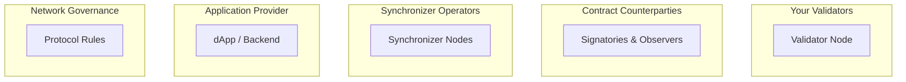

<Warning>
  이 페이지는 팀 리서치를 위한 비공식 한국어 번역입니다. 기술적 판단에는 [공식 영어 원문](https://docs.canton.network/overview/learn/trust-model.md)을 사용하세요.
</Warning>

Canton의 trust model은 전통적인 blockchain과 근본적으로 다릅니다. "모두를 신뢰"하거나 "아무도 신뢰하지 않음"이 아니라, Canton에서는 **선택적 신뢰**가 가능합니다. 어떤 목적에 누구를 신뢰할지 선택할 수 있습니다.

## 핵심 질문

모든 distributed system의 핵심 질문은 **누구를 어떤 목적으로 신뢰해야 하는가?**입니다.

Canton은 이를 서로 다른 Participant와 assumption을 가진 별개의 trust domain으로 나눕니다.

## 다섯 가지 Trust Domain

### 1. 자신의 Validator

**다음 목적에 Validator를 신뢰합니다.**
- Contract data를 안전하게 저장하고 사용할 수 있도록 제공
- Node RPC에 접근하게 하고 Transaction을 제출할 수 있도록 허용
- 권한 없는 Party에 data를 공개하지 않음
- Party를 대신하여 consensus에 올바르게 참여
- Internal Party를 사용하는 경우 signing key 처리

**다음 목적에는 Validator를 신뢰하지 않습니다.**
- External Party를 사용하는 경우 Transaction signing

**완화책:**
- 직접 Validator 운영
- 평판이 좋은 Validator operator 선택
- 여러 Validator에서 Party를 co-host
- 직접 key를 보유하는 External Party key 사용
- Validator의 cryptographic key를 보호하기 위해 KMS/HSM solution 사용

### 2. Contract Counterparty

**다음 목적에 Counterparty를 신뢰합니다.**
- 자신이 Stakeholder인 Transaction을 정직하게 validate하여 Transaction이 finalize될 수 있게 함
- 공유받은 private data를 유출하지 않음

**다음 목적에는 Counterparty를 신뢰하지 않습니다.**
- Ledger integrity와 consistency. 자신의 Validator가 정직한 한 Counterparty는 자신이 관여한 invalid Transaction을 finalize할 수 없습니다.

**완화책:**
- Daml authorization rule로 Party가 할 수 있는 일과 confirmation이 필요한 지점을 제한
- Privacy가 중요한 data는 신뢰하는 Counterparty와만 공유
- 중요한 operation에 multi-signature 요구
- Audit trail에 cryptographic signature 적용

### 3. Synchronizer

**다음 목적에 Synchronizer를 신뢰합니다.**
- 모든 Validator에 일관된 순서로 message 전달
- Transaction을 무기한 censor하지 않음
- Availability 유지
- Confirmation vote를 올바르게 집계
- 정확한 verdict 전달
- Dedicated Synchronizer의 경우 Transaction metadata를 private하게 유지

**다음 목적에는 Synchronizer를 신뢰하지 않습니다.**
- Privacy: 암호화된 Transaction 내용을 읽을 수 없음
- Authorization: Signature가 필요하므로 message나 Transaction을 위조할 수 없음
- Conformance: Stakeholder가 validate하므로 invalid Transaction을 승인할 수 없음

**완화책:**
- 여러 독립 operator가 운영하는 BFT Synchronizer
- 직접 Synchronizer 운영

### 4. Application Provider

**다음 목적에 Application Provider를 신뢰합니다.**
- 사용자 action을 대신 제출하는 경우 실제로 제출하고 censor하지 않음
- 안전한 smart contract logic을 올바르게 구현
- Off-ledger business logic을 올바르게 구현
- Web2 방식의 login과 authentication을 수행하는 경우 credential/session 보호

**완화책:**
- Off-ledger 대신 on-ledger authorization(Daml) 사용
- External Party Signing으로 각 Transaction을 직접 승인
- Open source/audit된 application 사용
- 자신의 Validator로 Transaction을 준비하고 제출

### 5. Network Governance

**다음 목적에 Network Governance를 신뢰합니다.**
- Protocol upgrade가 application과 관련 contract를 중단시키지 않음
- Network parameter와 Traffic 비용을 공정하게 설정
- Dispute resolution 절차

**완화책:**
- 투명한 governance(Canton Network의 CIP)
- Exit right(다른 Synchronizer로 이동)
- Upgrade를 고려한 contract 설계

## Trust 한눈에 보기

자신의 Validator는 모든 data를 볼 수 있고 사용자를 차단할 수 있습니다. Counterparty는 자신이 Party인 contract만 보며, Daml rule과 Canton consensus가 Counterparty의 행동을 제한합니다. Sequencer와 Mediator는 암호화된 data만 처리합니다. 일시적으로 message를 지연할 수는 있지만 message를 읽거나 위조할 수 없습니다. Application Provider와 governance body에 부여하는 신뢰는 그 설계와 구조에 따라 달라집니다.

## Decentralization 선택지

Canton은 각 layer에서 decentralization을 지원합니다.

**Validator level**에서는 단일 operator를 신뢰하며 하나의 Validator를 실행하거나, multi-hosted Party를 사용해 여러 operator에 신뢰를 분산할 수 있습니다.

**Synchronizer level**에서는 single-operator Synchronizer가 한 entity에 대한 신뢰를 요구합니다. BFT Sequencer는 node 중 3분의 2만 정직하면 system이 작동하도록 신뢰를 분산합니다. 여러 Synchronizer에 연결하면 single point of failure 위험을 더 줄일 수 있습니다.

**Global Synchronizer**는 가장 높은 수준의 decentralization을 제공합니다. 여러 독립 Super Validator가 Sequencer와 Mediator node를 실행하고, BFT consensus가 threshold까지 Byzantine failure를 감내하며, 투명한 CIP 절차가 protocol 변경을 governance합니다.

## Canton과 전통적인 Blockchain 비교

전통적인 blockchain에서는 모두가 모든 Transaction을 보고 모든 node가 validate합니다. 사용자는 다수가 정직하게 행동할 것이라고 신뢰합니다. Canton은 이 model을 뒤집습니다. Stakeholder만 Transaction을 보고 영향을 받는 Party만 validate하며, 주로 자신의 Validator를 신뢰합니다. Synchronizer는 암호화된 data만 보고 governance는 Synchronizer별 level과 network level에서 운영됩니다.

## 관련 주제

- [Two-Layer Consensus](/overview/learn/two-layer-consensus): Consensus layer의 상호 작용 방식
- [Architecture 개요](/overview/learn/architecture): Component별 책임
- [Privacy Model](/overview/learn/privacy-model): 각 Party가 볼 수 있는 내용
