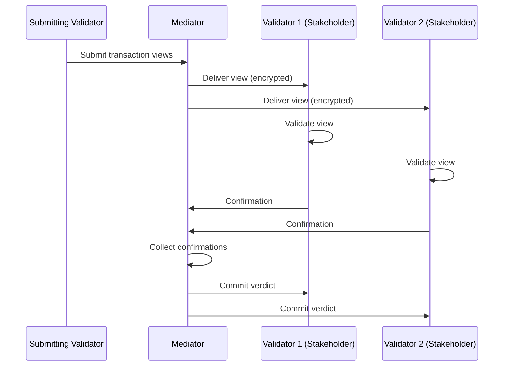
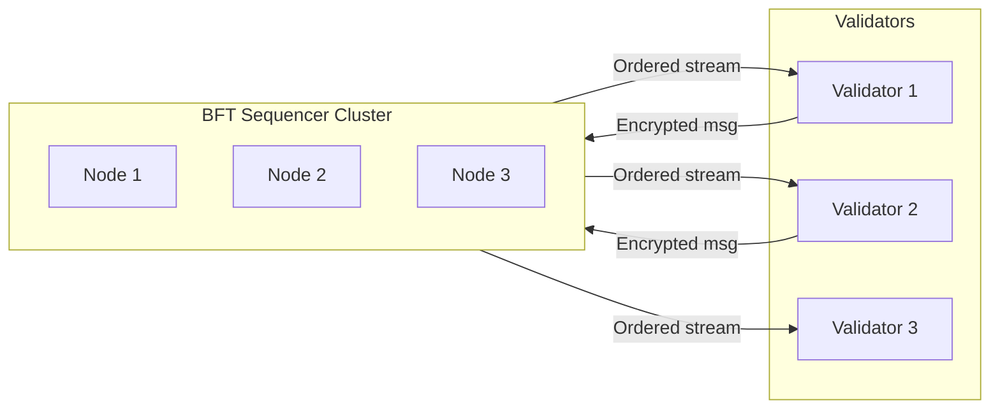
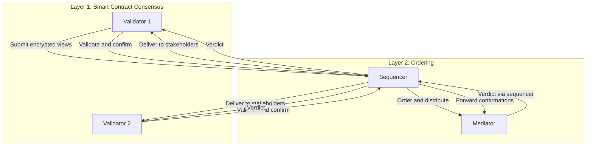

<Warning>
  이 페이지는 팀 리서치를 위한 비공식 한국어 번역입니다. 기술적 판단에는 [공식 영어 원문](https://docs.canton.network/overview/learn/two-layer-consensus.md)을 사용하세요.
</Warning>

Canton은 **smart contract Transaction consensus**와 **ordering consensus**를 분리하는 two-layer consensus architecture를 사용합니다. 이 분리 덕분에 Canton은 integrity를 유지하면서 privacy를 달성할 수 있습니다.

## 두 Layer가 필요한 이유

전통적인 blockchain은 ordering과 validation을 하나의 consensus 절차로 결합합니다. 모든 Validator가 correctness를 검증하고 순서에 합의하기 위해 모든 Transaction을 봅니다. 이러한 강한 결합은 본질적인 privacy 제약을 만듭니다.

Canton은 이 두 concern을 두 layer로 분리합니다.

- **Smart contract consensus**는 Transaction correctness를 validate합니다. 영향을 받는 Stakeholder만 참여하며 각자 Transaction에서 자신의 부분만 봅니다.
- **Ordering consensus**는 global Transaction order를 정합니다. Synchronizer node가 참여하지만 암호화된 message만 봅니다.

## Layer 1: Smart Contract Consensus(Proof of Stakeholder)

Canton의 smart contract consensus는 **Proof of Stakeholder** model을 따릅니다. Contract에 이해관계가 있는 Party만 해당 contract에 영향을 주는 Transaction을 validate할 수 있습니다.

### 작동 방식

1. **Stakeholder 식별**: Transaction이 contract에 영향을 주면 Canton은 모든 Stakeholder(Signatory, Observer, Controller)를 식별합니다
2. **View 배포**: 각 Stakeholder는 볼 권한이 있는 Transaction view만 받습니다
3. **독립적 Validation**: 각 Stakeholder는 Daml rule에 따라 자신의 view를 validate합니다
4. **Confirmation**: Stakeholder가 Mediator에 confirmation 또는 rejection을 보냅니다
5. **Verdict**: 충분한 confirmation을 받으면 전체 Transaction이 commit되거나 abort됩니다

Non-stakeholder는 Transaction을 전혀 보지 못합니다. 영향을 받는 Party만 validation 작업을 수행하며 Stakeholder가 직접 Daml authorization rule을 enforce합니다.

여기서 trust assumption은 명확합니다. Signatory와 Controller가 자신의 부분을 올바르게 validate할 것이라고 신뢰합니다. 이들은 contract에 직접적인 이해관계가 있으므로, 즉 contract에 서명했거나 이를 관찰하므로, 정직하게 validate할 incentive가 있습니다.

## Layer 2: Ordering Consensus(BFT Sequencing)

Ordering layer는 Synchronizer의 모든 Transaction에 **total order**를 정합니다. 이를 통해 모든 Participant가 같은 Synchronizer에서 동일한 순서로 event를 보도록 하여 double-spend를 방지하고 consistency를 보장합니다.

### 작동 방식

Synchronizer의 Sequencer component는 다음을 수행합니다.

1. Participant로부터 암호화된 Transaction message 수신
2. 해당 Synchronizer에서 globally unique한 timestamp/sequence number 할당
3. 권한 있는 모든 수신자에게 순서대로 message 배포
4. 모든 수신자가 동일한 ordering을 보도록 보장

### BFT Ordering

Global Synchronizer 같은 decentralized Synchronizer에서는 Byzantine Fault Tolerant(BFT) consensus로 ordering합니다.

- 여러 Sequencer node가 ordering protocol을 실행
- 최대 3분의 1의 Byzantine(malicious) node를 감내
- ISS(Insanely Scalable State-Machine Replication) algorithm 기반
- Safety와 liveness 보장 제공

모든 Validator가 동일한 순서로 message를 받아 consistency가 보장됩니다. Sequencer는 암호화된 message만 보므로 ordering이 privacy를 침해하지 않습니다. 또한 일부 node가 장애를 일으켜도 BFT protocol은 계속 작동합니다.

Trust assumption은 Sequencer node의 3분의 1 미만이 malicious하다는 것입니다. Global Synchronizer에서는 이 신뢰가 독립적인 Super Validator에 분산됩니다.

## 두 Layer의 상호 작용

두 layer는 Canton의 Transaction protocol에서 함께 작동합니다.

Flow는 ordering layer에서 시작합니다. Validator가 암호화된 Transaction을 제출하면 Sequencer가 global order에서 그 위치를 할당합니다. 그런 다음 Sequencer는 관련 view를 Stakeholder에게 배포합니다. Mediator는 verdict에 도달하는 데 필요한 confirmation 수를 전달받습니다. 이 시점에 smart contract consensus가 시작되어 각 Stakeholder가 자신의 view를 validate하고 Mediator에 confirmation을 보냅니다. 마지막으로 Mediator가 confirmation을 집계하고 Sequencer의 ordering layer를 통해 verdict를 broadcast합니다.

## 분리의 이점

**Integrity를 희생하지 않는 privacy.** Ordering layer는 double-spend를 방지하여 integrity와 consistency를 제공하고, smart contract layer는 Stakeholder만 data를 보도록 하여 privacy를 제공합니다. 어느 layer도 단독으로는 두 특성을 모두 달성할 수 없습니다.

**유연한 trust model.** 서로 다른 Synchronizer가 서로 다른 ordering trust model을 사용할 수 있습니다. Private deployment에서는 single-operator Sequencer를, decentralized network에서는 BFT Sequencer를 사용할 수 있으며 smart contract consensus는 어느 경우에도 동일하게 유지됩니다.

**Scalability.** Ordering layer는 synchronization만 처리하므로 가볍습니다. Validation 작업은 영향을 받는 Validator에만 분산되며 global state replication이 필요하지 않습니다.

## 다른 접근 방식과 비교

| 접근 방식 | Ordering | Validation | Privacy |
|-----------|----------|------------|---------|
| **전통적인 Blockchain** | 모든 Validator | 모든 Validator | 없음 |
| **L2 Rollup** | Sequencer | Fraud/validity proof | 제한적 |
| **Canton** | Synchronizer(BFT) | 영향을 받는 Stakeholder만 | 완전한 sub-transaction privacy |

## 관련 주제

- [Trust Model 개요](/overview/learn/trust-model): 각 layer의 trust assumption
- [Architecture 개요](/overview/learn/architecture): Component 결합 방식
- [Privacy Model](/overview/learn/privacy-model): 자세한 sub-transaction privacy
