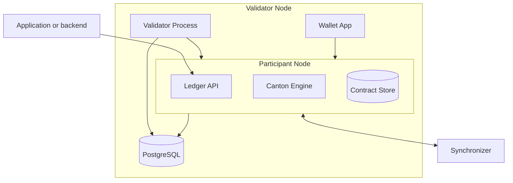

<Warning>
  이 페이지는 팀 리서치를 위한 비공식 한국어 번역입니다. 기술적 판단에는 [공식 영어 원문](https://docs.canton.network/overview/learn/validator-architecture.md)을 사용하세요.
</Warning>

Validator는 Canton Network의 기본 infrastructure 단위입니다. Party를 hosting하고 해당 Party의 contract data를 저장하며 Party를 대신하여 Transaction을 처리합니다. Validator 내부 구성을 이해하면 배포 계획, 문제 해결, 용량 산정에 도움이 됩니다.

## Validator의 component

Validator는 두 가지 주요 process와 이를 지원하는 infrastructure로 구성됩니다.

### Participant Node

Participant Node는 핵심 component이며 다음을 수행합니다.

- Party를 hosting하고 identity를 관리합니다
- Hosting하는 Party의 contract data를 local database에 저장합니다
- Application이 Command를 제출하고 Transaction을 읽고 Party를 관리할 수 있도록 Ledger API를 제공합니다
- Transaction 처리, validation, privacy를 담당하는 Canton protocol engine을 실행합니다
- Data Transaction을 제출하고 수신하기 위해 Synchronizer와 통신합니다
- Topology Transaction을 제출하고 수신하기 위해 Synchronizer와 통신합니다

### Validator process

Validator process는 Participant Node 위에서 Canton Network에 특화된 기능을 처리합니다.

- Global Synchronizer onboarding 관리
- Canton Coin을 이용한 Traffic 구매 처리
- Hosting하는 Party를 위한 Splice wallet application 실행
- Traffic 자동 충전, Canton Coin sweep configuration 같은 자동 operation 관리

### Database

Participant Node와 Validator process는 모두 persistent storage로 PostgreSQL을 사용합니다. Production에서는 적절한 backup과 high availability configuration을 갖춘 managed database service(Cloud SQL 또는 RDS 등)를 사용해야 합니다.

## Validator가 Synchronizer에 연결하는 방식

Validator는 TLS(port 443)를 통해 Sequencer endpoint에 연결하여 Synchronizer와 통신합니다. 연결은 outbound 전용이므로 Validator가 network의 incoming connection을 받을 필요가 없습니다.

하나의 Validator가 여러 Synchronizer에 동시에 연결할 수 있습니다. Validator는 hosting하는 Party와 관련된 Transaction만 수신하므로 Synchronizer가 모든 Participant 사이의 coordination을 수행하더라도 privacy가 유지됩니다.

## Ledger API

Ledger API는 application이 ledger와 상호 작용하는 기본 interface입니다. gRPC 또는 JSON API transport를 사용하여 다음을 수행할 수 있습니다.

- **Command 제출**: Contract 생성과 Choice exercise
- **Transaction stream**: Commit되는 confirmed Transaction 읽기
- **Active Contract Set**: 현재 active contract 집합 조회
- **Party 관리**: Party 할당과 관리

Application은 gRPC를 통해 Ledger API에 직접 연결하거나, 그 위에 HTTP/JSON layer를 제공하는 JSON API를 통해 연결합니다.
