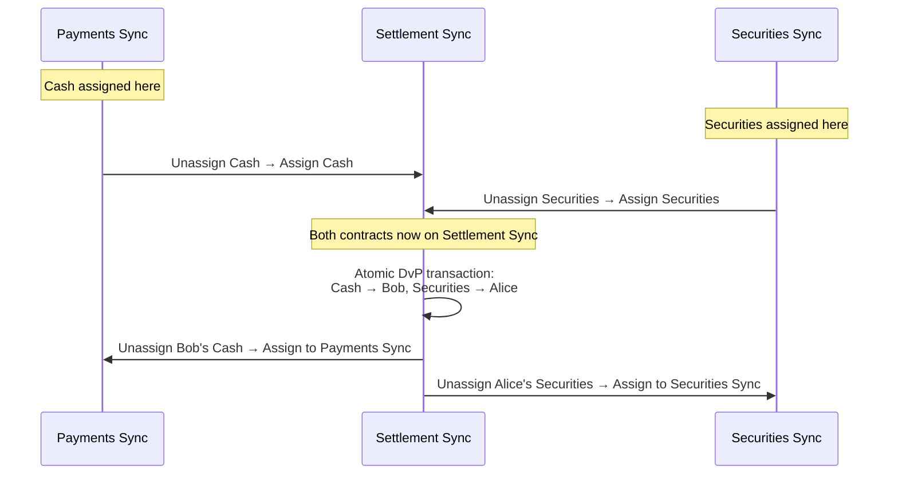

<Warning>
  이 페이지는 팀 리서치를 위한 비공식 한국어 번역입니다. 기술적 판단에는 [공식 영어 원문](https://docs.canton.network/overview/reference/cross-sync-dvp-example.md)을 사용하세요.
</Warning>

이 페이지에서는 서로 다른 Synchronizer에 asset이 존재하는 두 Party의 Delivery-versus-Payment(DvP) 거래를 단계별로 살펴봅니다. Canton Reassignment protocol을 통해 모든 asset이 같은 infrastructure에서 시작하지 않아도 atomic settlement가 가능한 방식을 보여 줍니다.

## 설정

**Party와 역할:**
- **Alice**(buyer) -- securities를 acquire하려 하며 cash를 보유함
- **Bob**(seller) -- securities를 sell하려 하며 cash를 받음
- **PaymentBank** -- cash contract의 Signatory
- **SecuritiesDepository** -- securities contract의 Signatory

**Synchronizer:**
- **Payments Sync** -- payment consortium이 운영하며 cash contract가 assign됨
- **Securities Sync** -- capital markets infrastructure provider가 운영하며 securities contract가 assign됨
- **Settlement Sync** -- 두 Party와 Signatory가 모두 연결된 common Synchronizer, 예: Global Synchronizer

**Contract:**
- `Cash` -- Signatory: PaymentBank, owner: Alice. Payments Sync에 assign됨.
- `Securities` -- Signatory: SecuritiesDepository, owner: Bob. Securities Sync에 assign됨.

각 Party의 Validator는 해당 Party와 관련된 Synchronizer에 연결됩니다. Alice의 Validator는 Payments Sync와 Settlement Sync에, Bob의 Validator는 Securities Sync와 Settlement Sync에 연결됩니다. PaymentBank와 SecuritiesDepository의 Validator는 세 Synchronizer 모두에 연결됩니다.

## 여러 Synchronizer를 사용하는 이유

Cash와 securities contract는 현실적인 이유로 서로 다른 Synchronizer에 존재합니다. 서로 다른 entity가 settlement infrastructure를 governance하고, 서로 다른 regulatory regime에서 운영될 수 있으며, performance 또는 cost 특성도 다를 수 있습니다. Payment network와 securities settlement system이 하나의 Synchronizer를 공유할 가능성은 낮습니다.

Daml Transaction은 같은 Synchronizer에 assign된 contract만 consume할 수 있습니다. Cash를 Bob에게, securities를 Alice에게 하나의 indivisible step으로 전달하여 DvP를 atomically settle하려면 먼저 두 contract를 common Synchronizer로 reassign해야 합니다.

## DvP Workflow

### 1단계: 거래 조건 합의

Alice와 Bob은 off-ledger 또는 `TradeAgreement` contract를 통해 DvP 거래에 합의합니다. 조건에는 exchange할 cash contract와 securities contract를 지정합니다.

### 2단계: Settlement Sync 연결

관여한 모든 Validator가 Settlement Sync에 연결되어야 합니다. Settlement Sync가 Global Synchronizer이면 대체로 이미 연결되어 있습니다. Dedicated Synchronizer라면 Reassignment 전에 Alice, Bob, PaymentBank, SecuritiesDepository의 각 Validator가 active connection을 가져야 합니다.

### 3단계: Cash를 Settlement Sync로 Reassign

`Cash` contract를 Payments Sync에서 Settlement Sync로 reassign합니다. 다음 2-phase process입니다.

1. Payments Sync에서 **Unassignment** -- Contract가 Payments Sync에서 inactive해지고 "pending assignment" state에 들어갑니다.
2. Settlement Sync에서 **Assignment** -- Contract가 Settlement Sync에서 active해집니다.

이 단계 후 `Cash` contract는 Settlement Sync의 Transaction에서 사용할 수 있지만 Payments Sync에서는 더 이상 사용할 수 없습니다.

### 4단계: Securities를 Settlement Sync로 Reassign

같은 Unassignment/Assignment sequence로 `Securities` contract를 Securities Sync에서 Settlement Sync로 reassign합니다.

### 5단계: Atomic Settlement

이제 두 contract 모두 Settlement Sync에 assign되었습니다. 하나의 Daml Transaction이 swap을 exercise하여 원래 `Cash`와 `Securities` contract를 archive하고 Bob이 소유한 `Cash`와 Alice가 소유한 `Securities`를 새로 생성합니다. 두 input contract가 같은 Synchronizer에 있으므로 Transaction은 atomic합니다. 두 transfer가 모두 일어나거나 어느 쪽도 일어나지 않습니다.

### 6단계: 원래 Synchronizer로 Reassign

Settlement 후 새 contract를 home Synchronizer로 reassign할 수 있습니다.
- Bob의 새 `Cash` contract를 Settlement Sync에서 Payments Sync로 reassign합니다.
- Alice의 새 `Securities` contract를 Settlement Sync에서 Securities Sync로 reassign합니다.

이 단계는 optional입니다. Contract는 Settlement Sync에서도 작동하지만 원래 Synchronizer로 되돌리면 future transfer, corporate action 등 lifecycle에 가장 적합한 infrastructure에 asset이 유지됩니다.

## Sequence Diagram

## 각 State의 Contract 위치

| State | Cash Contract | Securities Contract |
|------|--------------|---------------------|
| Initial state | Payments Sync(owner: Alice) | Securities Sync(owner: Bob) |
| Cash Reassignment 후 | Settlement Sync(owner: Alice) | Securities Sync(owner: Bob) |
| Securities Reassignment 후 | Settlement Sync(owner: Alice) | Settlement Sync(owner: Bob) |
| Atomic settlement 후 | Settlement Sync(owner: **Bob**) | Settlement Sync(owner: **Alice**) |
| 원래 Synchronizer로 Reassignment 후 | Payments Sync(owner: Bob) | Securities Sync(owner: Alice) |

## Atomicity Boundary

Reassignment 단계(3, 4, 6)는 각각 두 단계이며 별도의 Transaction에서 일어납니다. Contract의 Unassignment Transaction과 Assignment Transaction 사이에는 "pending assignment" state에 있어 사용할 수 없습니다. Topology change 등의 이유로 Assignment가 실패하면 상황이 해결될 때까지 contract는 pending 상태로 남습니다.

Settlement 단계(5)는 **atomic합니다**. Daml Transaction은 전체가 commit되거나 전혀 commit되지 않습니다. Alice가 cash를 지불했지만 securities를 받지 못하거나 그 반대인 state는 없습니다.

이 차이가 핵심 설계 속성입니다. Reassignment는 atomic Transaction으로 거래를 settle할 수 있는 common Synchronizer로 contract를 이동합니다. Reassignment는 별개의 두 Transaction으로 구성되며 contract를 일시적으로 사용하지 못할 가능성이 있지만 settlement risk를 수반하지는 않습니다. Atomic step이 실행될 때까지 value는 교환되지 않습니다.

## 추가 자료

- [Reassignment Protocol](/overview/reference/reassignment-protocol) -- Unassignment와 Assignment의 자세한 protocol mechanism
- [Architecture 개요](/overview/learn/architecture) -- Synchronizer, Validator, Global Synchronizer의 결합 방식
