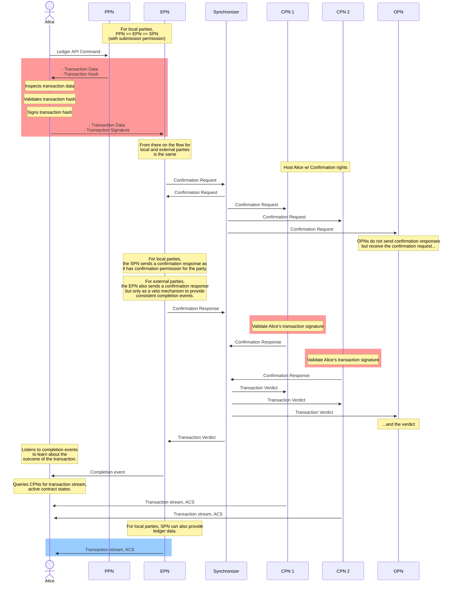

<Warning>
  이 페이지는 팀 리서치를 위한 비공식 한국어 번역입니다. 기술적 판단에는 [공식 영어 원문](https://docs.canton.network/overview/reference/external-party.md)을 사용하세요.
</Warning>

{/* COPIED_START source="canton:docs-open/src/sphinx/overview/explanations/canton/external-party.rst@5f96e9893" hash="f641c3de" */}

# Local Party와 External Party

Canton에서 **Party**는 ledger에서 contract를 생성하고 상호 작용할 수 있는 entity를 나타냅니다. 각 Party는 하나 이상의 **Participant Node**에서 hosting되며 Participant Node는 Party와 ledger 사이의 intermediary 역할을 합니다. 상호 작용 유형에 따라 Party의 적절한 authentication과 authorization이 필요합니다. 이 페이지에서는 Party가 Canton Protocol에 통합되어 상호 작용하는 방식, 관련 trust relationship, 그 implication을 설명합니다.

<Tip>
Signing key와 authorization에 관한 자주 묻는 질문은 이 페이지 끝의 FAQ section을 확인하세요.
</Tip>

## Hosting Relationship

Party의 Hosting relationship은 각 Participant Node permission과 confirmation threshold를 지정합니다.

Participant Node는 Hosting Party를 대신해 서로 다른 permission을 가질 수 있습니다.

### Submitting Participant Node

Submission permission이 있는 node를 **Submitting Participant Node(SPN)**라고 합니다. Party는 SPN이 자신을 대신해 ledger에 Daml Transaction submission을 일방적으로 authorize하도록 신뢰합니다. 각 SPN은 자체 private key로 Party를 대신해 Transaction에 signing하고 authorize합니다. 이는 Participant Node에 제공되는 가장 강한 permission이며 SPN은 정의상 CPN이자 OPN이기도 합니다. 아래를 참고하세요.

### Confirming Participant Node

Confirmation permission이 있는 node를 **Confirming Participant Node(CPN)**라고 합니다. Party는 CPN이 자신을 대신해 valid Transaction의 ledger commit을 confirm하고 authorize하도록 신뢰합니다. CPN은 자체 private key로 confirmation response에 signing하여 Transaction을 confirm할 수 있지만 Party의 Transaction을 시작할 수는 없습니다. CPN은 정의상 OPN이기도 합니다. 아래를 참고하세요. CPN에는 threshold가 설정됩니다. Canton protocol은 valid Transaction이 ledger에 commit되려면 Party CPN 중 최소 threshold 수의 confirmation을 요구합니다. 이를 통해 Party에 추가 resiliency와 security를 제공합니다. Threshold가 1인 단일 CPN이 가장 단순한 scenario입니다.

그 결과 availability와 security 사이에 즉각적인 tradeoff가 생깁니다.

- Threshold가 높을수록 security는 높지만 availability guarantee는 낮아집니다. 더 적은 수의 offline CPN으로도 Transaction approval을 차단할 수 있습니다.
- Threshold가 낮을수록 availability guarantee는 높지만 security는 낮아집니다. 더 적은 수의 malicious CPN으로 invalid Transaction을 approve할 수 있습니다.

<Note>
Canton의 privacy property 때문에 CPN과 SPN만 Submitting Node에 submission permission이 있는지 안정적으로 enforce할 수 있습니다. 따라서 원칙적으로 malicious CPN이 submission permission이 없는데도 Party를 대신해 Transaction 제출을 시도할 수 있습니다. Threshold가 \> 1인 여러 Hosting CPN을 선택하면 이 위험을 효과적으로 완화할 수 있습니다. 또한 Party가 Local Party이면 어떤 SPN도 혼자 Transaction submission을 authorize할 수 없으므로 해당 Party를 대신한 submission을 사실상 불가능하게 합니다.
</Note>

### Observing Participant Node

Observation permission이 있는 node를 **Observing Participant Node(OPN)**라고 합니다. Party는 OPN이 ledger에서 자신이 관여한 Transaction을 충실히 기록하고 read access를 제공하도록 신뢰합니다. Observation permission만 있는 node는 Hosting Party를 대신해 Transaction을 제출하거나 confirm할 수 없습니다.

## Submission Key Holder

자체 submission signing key를 보유하고 control하는 Party가 submission key holder입니다. Canton은 threshold와 함께 여러 submission signing key pair를 등록하는 방식을 지원합니다. 관련 private signing key는 Party만 control하고 사용할 수 있습니다. Party는 private key 관리와 유지 책임을 집니다. 그 방법은 Party operator 또는 client application에 맡기며 Canton scope 밖입니다. 일반적으로 사용자는 crypto custody provider 또는 다른 cryptographic key management service로 key를 보호할 수 있습니다.

가장 단순한 경우 threshold가 `1`인 단일 key pair를 사용하여 하나의 signature로 Transaction을 제출할 수 있습니다. 더 복잡한 process에는 여러 signature가 필요할 수 있습니다. 이 경우 submission key holder는 여러 unique key pair를 더 높은 threshold와 함께 등록할 수 있습니다. Canton protocol은 ledger에서 Transaction을 authorize하려면 서로 다른 key에서 valid signature를 최소 threshold 수만큼 제공하도록 보장합니다. 이 key와 관련 threshold는 `PartyToParticipant` Topology Transaction에 정의됩니다.

``` protobuf
// Mapping that maps a party to a participant
// The PartyToParticipant mapping may also specify a list of signing keys for setting up an external party, in which
// case the keys and the threshold take precedence over any PartyToKeyMapping for the same party.
// Additionally, the list of signing keys may contain the public key of the party's namespace, which allows this
// mapping to authorize itself without the need of a NamespaceDelegation root certificate (called self-signed).
// authorization: the required authorization of the mapping is a union of the authorization for individual changes
//  - threshold change: party namespace
//  - adding a signing key: party namespace + all the new signing key
//  - removing a signing key: party namespace
//  - changing the signing key threshold: party namespace
//  - upgrading a participant permission or adding a new participant: namespaces from party and the participant namespace
//  - downgrading a participant permission or removing a participant: party namespace OR the participant namespace
//  - setting a participant's onboarding flag from false to true: party namespace
//  - setting a participant's onboarding flag from true to false: participant namespace
//  - the removal of a PTP must be authorized just by the party
// revocation: Revoking a self-signed PTP does not prevent later re-creation of a PTP with the same partyId.
//  To prevent further usage of the key associated with the party's namespace,
//  revoke a NamespaceDelegation root certificate for that namespace.
// UNIQUE(party)
message PartyToParticipant {
  message HostingParticipant {
    message Onboarding {}

    // the target participant that the party should be mapped to
    string participant_uid = 1;

    // permission of the participant for this particular party (the actual
    // will be min of ParticipantSynchronizerPermission.ParticipantPermission and this setting)
    Enums.ParticipantPermission permission = 2;

    // optional, present iff the party is being onboarded to the participant
    Onboarding onboarding = 3;
  }

  // the party that is to be represented by the participants
  string party = 1;

  // the signatory threshold required by the participants to be able to act on behalf of the party.
  // a mapping with threshold > 1 is considered a definition of a consortium party
  uint32 threshold = 2;

  // which participants will host the party.
  // if threshold > 1, must be Confirmation or Observation.
  // if all participants have Observation permission, the confirmation treshold is ignored, making the party
  // a purely observing party.
  repeated HostingParticipant participants = 3;

  reserved 4; // was group_addressing = 4;

  reserved 5; // was synchronizer = 5;

  // Contains protocol signing keys for the party used to authorize externally signed Daml transactions,
  // along with a signing threshold.
  // The max number of keys is 20
  optional com.digitalasset.canton.crypto.v30.SigningKeysWithThreshold party_signing_keys = 6;
}
```

## Namespace

Namespace는 Canton Topology의 개념입니다. 모든 Party는 해당 Namespace의 root signing key pair public key에서 도출되는 Namespace 안에 존재하므로 Party와 관련됩니다. 모든 Canton node도 자체 Namespace를 정의합니다. Namespace는 본질적으로 network에서 Party 또는 node identity를 정의합니다.

## Local Party

Local Party는 하나 이상의 SPN이 있는 Party로 정의합니다. 해당 SPN 중 하나와 Namespace를 공유하므로 Topology management를 SPN operator에 delegate합니다. Local Party는 Canton ledger와 상호 작용하는 가장 간단한 방법이자 Hosting Node를 가장 많이 신뢰하는 방법입니다. SPN은 명시적인 approval 없이 Transaction을 제출할 full authority가 있으므로 Party를 대신해 Command를 실행하는 automation이 필요한 상황에 대체로 가장 적합합니다.

## External Party

External Party는 SPN이 **없고** 자체 signing key로 control하는 고유한 Namespace가 있는 submission key holder로 정의합니다. Local Party는 SPN Namespace 안에 존재한다는 점에서 다릅니다. `PartyToParticipant` Topology Transaction의 signing key를 통해 Party는 자체 key로 ledger에 Transaction을 제출할 수 있습니다. 중요한 점은 이것이 어떤 node에도 **submission permission을 부여하지 않는다**는 것입니다. Party의 explicit approval 없이 Participant Node가 ledger에서 행동할 능력을 제거하므로 Participant Node의 잠재적 regulatory burden을 줄입니다. External Party에도 Transaction을 대신 confirm하고 ledger state를 기록할 **최소 하나의 CPN**이 필요합니다. 이를 통해 적절한 network latency를 유지하고 Party activity를 ledger에 기록하는 trusted source를 제공합니다.

## Local Party와 External Party Hosting

다음 표는 서로 다른 node permission을 사용하는 Local Party와 External Party의 Hosting relationship을 요약합니다.

|        | Local Party | External Party |
|--------|-------------|----------------|
| \# SPN | 최소 1개  | 0              |
| \# CPN | 임의 개수  | 최소 1개     |
| \# OPN | 임의 개수  | 임의 개수     |

## Submission Flow

Local Party와 External Party의 차이는 External Party가 Transaction authorization에 사용하는 private key를 전적으로 Party가 control한다는 것입니다. Local Party에서는 SPN이 key를 control합니다. External Party는 대신 private key로 각 Transaction submission에 명시적으로 signing합니다. 구체적으로 Transaction이 ledger에 성공적으로 commit될 때 발생할 모든 ledger effect를 정확히 나타내는 Transaction tree hash에 signing합니다. 이 Transaction을 생성하려면 복잡한 logic, Daml interpretation engine, 최신 Topology, ACS knowledge 등이 필요합니다. Process를 단순화하기 위해 External Party submission flow는 두 단계로 나뉩니다.

- **Preparation:** Ledger API Command를 Daml Transaction으로 transform합니다.
  이 단계는 선택한 Transaction Synchronizer에 연결되고 Transaction에 필요한 Package를 보유한 모든 Participant Node가 수행할 수 있습니다. 이러한 node를 **Preparing Participant Node(PPN)**라고 합니다. Party를 대신해 Transaction을 prepare하려면 Party에 대한 `readAs` scope가 있는 Ledger API User가 필요합니다.

- **Execution:** Transaction과 signature를 Transaction을 실행할 Synchronizer에 연결된 Participant Node로 보냅니다.
  이 Participant Node는 Transaction을 Synchronizer에 단순히 forward합니다. 이러한 node를 **Executing Participant Node(EPN)**라고 합니다. Party를 대신해 Transaction을 execute하려면 Party에 대한 `actAs` scope가 있는 Ledger API User가 필요합니다.

이것이 submission path입니다. Read path, 즉 ledger에 commit된 Transaction을 observe하는 경우 External Party는 CPN 또는 OPN에서 Transaction stream을 읽을 수 있습니다. 추가 security를 위해 여러 node에서 읽고 threshold 방식으로 result를 cross-compare하여 Byzantine fault tolerance를 달성할 수 있습니다.

다음 sequence diagram은 Local Party와 External Party의 submission flow를 모두 설명하고 차이를 강조합니다.

- 빨간 background의 interaction은 External Party에만 해당합니다
- 파란 background의 interaction은 Local Party에만 해당합니다
- Background가 없는 interaction은 둘 다에 공통입니다



## 제약

- **Local Party:**
  - Participant threshold가 \> 1이면 Party는 Transaction을 제출할 수 없고 자신이 Stakeholder인 Transaction만 confirm할 수 있습니다.
- **External Party:**
  - Single root node: Root node가 하나인 Transaction만 지원됩니다.
  - Single submitting party: 단일 Party의 authorization을 요구하는 Transaction만 지원됩니다.
- **Local Party와 External Party 모두:**
  - 개별 submission의 Command completion은 submission에 사용한 SPN, External Party의 경우 EPN에서만 사용할 수 있습니다.
  - 개별 submission의 Command deduplication은 submission에 사용한 SPN, External Party의 경우 EPN에서만 사용할 수 있습니다.

## Trust Model

### 정의

- **User:** Party를 `actAs`할 permission이 있는 Ledger API User입니다. Command submission에서 Party intent에 따라 충실하게 행동한다고 가정합니다.
- **Party owner:** Party Namespace key를 control하는 individual 또는 entity입니다. Party governance에서 Party intent에 따라 충실하게 행동한다고 가정합니다.

### Trust Relationship

- **SPN:** User는 SPN을 완전히 신뢰합니다. 예를 들어 SPN은 User approval 없이 Local Party가 required authorizer인 모든 Transaction을 제출하고 authorize할 수 있습니다.

- **CPN:**

  - User는 threshold 미만의 CPN만 Canton protocol에 따라 예상되는 방식과 다르게 Hosting Party를 대신해 request를 approve 또는 reject한다고 신뢰합니다. 그러나 threshold 수의 CPN이 malicious하면 invalid Transaction을 잘못 approve할 수 있습니다. External Party의 invalid external signature가 있는 Transaction도 포함됩니다.
  - User는 threshold 미만의 CPN operator만 malicious 또는 invalid Daml package를 vet한다고 신뢰합니다. 특히 Participant Node ACS에 이전 Package version으로 생성된 active contract가 있으면 honest CPN operator는 새 Package를 해당 Package의 이전 version과 비교해야 합니다. 이 경우 honest CPN operator는 새 Package version을 vet하기 전에 contract Signatory의 approval을 얻어야 합니다. 그러나 threshold 수의 CPN operator가 malicious Package를 vet하면 새 contract나 기존 contract에서 arbitrary smart contract code가 실행될 수 있습니다.

- **PPN:** User는 PPN을 신뢰하지 않습니다.

- **EPN:** User는 다음 경우를 제외하고 EPN을 신뢰하지 않습니다.

  > - EPN에서 얻은 Command completion을 바탕으로 행동할 때
  > - `max_record_time` field를 통해 Time To Live(TTL) 기능을 사용할 때

예를 들어 EPN은 의도적으로 잘못된 completion event를 emit하여 실제로 성공한 submission을 실패했다고 생각한 User가 retry하게 만들 수 있습니다. `max_record_time` field를 ignore하거나 modify할 수도 있으며 이 경우 User intent대로 enforce되지 않습니다.

### User 책임

User는 Command submission을 위해 Participant Node와 상호 작용할 때 다음 guideline을 따라야 합니다.

- **SPN과 CPN:** Party owner가 SPN과 CPN을 신중하게 선택합니다.

- **PPN:** User가 PPN에서 prepared Transaction을 visualize합니다.
  Intent와 일치하는지 확인하고 포함된 data를 validate하여 Transaction을 안전하게 제출할 수 있는지 보장합니다. 특히 다음을 확인합니다.

  - Transaction이 User가 생성하려는 ledger effect에 해당함

  - Preparation time이 Synchronizer의 current Sequencer time보다 앞서지 않음. 이를 확인하는 reliable way는 `preparation_time`을 다음 값 중 minimum과 비교하는 것입니다.

    > - Submitting application의 wall clock time
    > - 최소 participant threshold 수 CPN이 emit한 last record time + Synchronizer의 configured `mediatorDeduplicationTimeout`

    - Prepare request에 `min_ledger_time`이 정의되었다면 response의 `min_ledger_effective_time`이 비어 있거나 request한 `min_ledger_time`보다 나중인지 validate합니다.

    - User가 여기서 설명하는 specification에 따라 Transaction hash를 계산합니다.
      PPN을 신뢰하지 않는 한 PPN response에 제공된 hash는 ignore해야 합니다.

- **EPN:**
  - User가 Daml Transaction에서 직접 계산한 hash에 signing합니다.
  - Transaction signing에 사용하는 key는 이 목적으로만 사용합니다.
  - Signature에 사용하는 key를 안전하게 저장하고 private하게 유지합니다.
  - User는 Command completion의 submission ID에 의존하지 않습니다.

### 완화책

**Malicious CPN:** Party owner는 Participant threshold를 1보다 높게 설정하여 여러 CPN이 fault-tolerant mode로 Party를 공동 hosting하게 합니다. Faulty CPN 수가 threshold보다 적으면 threat가 완화됩니다. Canton은 ledger에 commit할 Transaction에 대해 Participant threshold 수 CPN의 approval을 요구하여 fault tolerance를 달성합니다. Rejection도 마찬가지로 Transaction을 reject하려면 최소 threshold 수의 rejection에 도달해야 합니다. Party가 CPN의 Transaction stream 같은 information을 consume한다면 fault tolerance를 달성하기 위해 서로 다른 Participant threshold 수 CPN의 information을 cross-check해야 합니다.

**Malicious EPN:** Malicious EPN은 의도적으로 잘못된 completion event를 emit할 수 있습니다. 현재 실용적인 일반 완화책은 없습니다. 그러나 self-conflicting Transaction은 이 threat의 영향을 받지 않습니다. 예를 들어 Transaction에 Submitting Party가 Signatory인 contract 하나 이상의 archive가 포함된 경우 CPN이 Transaction resubmission을 reject합니다. User는 completion event를 trusted CPN의 Transaction stream과 correlate할 수 있습니다. Transaction stream은 committed Transaction만 emit하므로 실제로 활용하기 어렵다는 점에 유의하세요.

## FAQ

### Local Party가 사용하는 Cryptographic Key는 무엇인가요?

Local Party가 authorization에 사용하는 모든 key는 Party Hosting Node에서 관리합니다.

> - Transaction submission을 authorize하는 Submitting Node protocol key
> - Namespace management를 authorize하는 Submitting Node Namespace key
> - Valid Transaction confirmation을 authorize하는 Confirming Node protocol key

### External Party가 사용하는 Cryptographic Key는 무엇인가요?

> - Transaction submission과 Namespace management를 authorize하는 Party 자체 key
> - Valid Transaction confirmation을 authorize하는 Confirming Node key

### Multi-Hosting이 External Party에 미치는 영향은 무엇인가요?

External Party multi-hosting의 핵심 차이는 Namespace를 어떤 Hosting Node와도 공유하지 않는다는 것입니다. 이는 External Party가 관여한 Topology Transaction에 Party External Namespace key로 signing해야 함을 의미합니다. Party Hosting을 설정하는 Party-to-Participant mapping도 포함됩니다.

자세한 내용은 Multi-Hosted Party 문서를 참고하세요.

## 추가 Resource

- SDK External Signing Overview
- External Party Onboarding Tutorial
- External Party Transaction Submission Tutorial
- External Signing Transaction Hash


{/* COPIED_END */}
