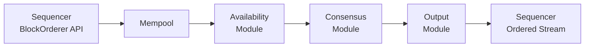

<Warning>
  이 페이지는 팀 리서치를 위한 비공식 한국어 번역입니다. 기술적 판단에는 [공식 영어 원문](https://docs.canton.network/overview/reference/ordering-consensus.md)을 사용하세요.
</Warning>

Ordering consensus layer는 Canton [two-layer consensus architecture](/overview/reference/canton-protocol-specification)의 한 축입니다. Smart contract consensus layer가 영향을 받는 Party 사이에서 Transaction correctness를 validate한다면 Ordering layer는 특정 Synchronizer에 single global event sequence를 설정합니다. 이 과정에서 Transaction 내용에 접근하지 않습니다. Payload는 end-to-end로 encrypt된 상태를 유지하며 Ordering infrastructure는 metadata만 봅니다.

## Synchronizer Component

Synchronizer는 **Sequencer**와 **Mediator**라는 두 node type으로 구성됩니다. 이들은 함께 authenticated ordered message delivery와 Transaction finalization을 제공합니다. 어느 type도 decrypt된 Transaction payload를 저장하거나 이에 접근하지 않습니다.

### Sequencer Node

Sequencer는 authenticated timestamped multicast를 제공하며 Synchronizer의 message routing backbone 역할을 합니다.

- **Synchronizer의 total ordering:** Sequencer에 제출되는 각 message batch는 timestamp 역할을 하는 monotonically increasing value를 받습니다. 모든 recipient는 이 timestamp에서 도출되는 동일한 global ordering을 observe합니다. 이 total ordering은 Synchronizer의 모든 state change에 deterministic position을 부여하여 double-spend를 방지합니다.
- **Encrypted payload forwarding:** Sequencer는 opaque encrypted message를 forward합니다. Recipient list와 message size 같은 metadata는 보지만 Transaction 내용은 보지 않습니다. Encryption key는 Participant 사이에서 관리되며 Sequencer는 decryption key를 보유하지 않습니다.
- **Sender privacy:** Recipient는 sender의 Party ID를 알지 못합니다. Sequencer는 다른 Party에 message를 deliver하기 전에 sender information을 제거합니다.
- **Traffic management:** Sequencer는 abuse와 denial-of-service attack으로부터 Synchronizer를 보호하기 위해 Traffic limit을 enforce합니다. Authorize된 각 member가 Traffic balance를 축적하며 available balance를 초과하는 submission request는 reject됩니다. Traffic cost는 payload size, recipient 수, per-event base cost에 따라 증가합니다.

Participant와 Mediator는 직접 통신하지 않으며 모든 protocol message가 Sequencer를 통과합니다.

### Mediator Node

Mediator는 Transaction을 finalize하는 two-phase commit protocol을 synchronization합니다. Sequencer가 영향을 받는 Participant에 encrypted Transaction view를 배포하면 Participant가 view를 validate하고 Sequencer를 통해 Mediator에 confirmation response(approve/reject)를 보냅니다.

- **Confirmation collection:** 특정 Transaction에 대한 모든 Confirming Participant의 confirmation response를 수집합니다.
- **Verdict issuance:** Outcome을 결정할 만큼 충분한 response를 받으면 commit 또는 reject Transaction verdict를 발행합니다. 이후 Sequencer가 영향을 받는 모든 Participant에 verdict를 배포합니다.
- **Limited visibility:** Mediator는 informee list, 즉 어느 Party가 어느 Transaction view에 관여하는지와 confirmation result(view별 approve/reject)를 봅니다. Encrypted Transaction payload 자체는 보지 않습니다.

하나의 Synchronizer에서 여러 Mediator group을 실행하여 workload를 분산할 수 있습니다. Synchronizer owner는 Topology Transaction을 통해 Mediator group membership을 설정합니다.

## BFT Ordering Service

Sequencer를 지원하는 Ordering service는 여러 configuration으로 운영할 수 있습니다. 가장 중요한 차이는 centralized backend와 Byzantine-fault tolerant(BFT) backend 사이에 있습니다.

BFT Orderer가 active하면 Canton Sequencer JVM process 안에서 실행됩니다. Message signing, signature verification, key management, governance(Topology state)를 위해 colocated Sequencer에 의존합니다. BFT Orderer는 Sequencer가 ordering request(write)를 제출하고 globally ordered Transaction stream(read)을 subscribe할 수 있게 하는 `BlockOrderer` API를 구현합니다.

BFT Orderer는 두 guarantee를 제공합니다.

- **Safety(consistency):** 모든 correct node가 동일한 ordered output을 생성합니다. 두 correct Sequencer가 conflicting Transaction ordering을 deliver하지 않습니다.
- **Liveness(progress):** Fault tolerance threshold를 초과하지 않는 한 system이 계속 Transaction을 order합니다.

## BFT Trust Model

BFT Orderer는 표준 Byzantine fault tolerance assumption을 사용합니다.

- **Fault threshold:** 전체 BFT Orderer node 중 3분의 1 미만이 동시에 Byzantine failure를 보일 수 있습니다. 여기에는 crash, message corruption, active malice를 포함한 arbitrary behavior가 포함됩니다. 전체 node가 N개이면 3f + 1 ≤ N을 만족하는 f개의 Byzantine fault를 감내합니다.
- **Agreement quorum:** Trust threshold k = floor(2N/3)입니다. Ordering을 진행하려면 최소 k + 1개의 node가 agree해야 합니다.
- **Cryptographic assumption:** Adversary가 큰 bandwidth와 computational resource를 가질 수 있지만 digital signature와 hash function 같은 표준 cryptographic primitive를 깨뜨릴 수는 없습니다.
- **Shared fate:** BFT Orderer node와 colocated Sequencer는 shared fate model로 운영됩니다. 하나가 compromise되면 다른 하나도 compromise된 것으로 가정해야 합니다.
- **Governance and onboarding:** Trusted administrator가 BFT Orderer configuration을 관리합니다. Onboarding되는 새 node는 epoch number, block number, timestamp 같은 BFT metadata를 bundle하는 peer Sequencer snapshot에서 correct startup state를 얻습니다.
- **Storage integrity:** Underlying database가 corruption되지 않았다고 가정합니다.

## BFT Architecture

BFT Orderer는 공개된 두 algorithm을 활용합니다.

**ISS(Insanely Scalable State-Machine Replication)**는 parallel leader-based BFT replication protocol입니다. ISS는 BFT Orderer의 core consensus subprotocol에 영감을 제공합니다. Work를 고정 block length의 epoch로 나누고 여러 leader가 epoch의 서로 다른 segment에서 block을 parallel로 propose합니다. 이 parallelism은 일부 leader를 사용할 수 없을 때 downtime 없이 leader 역할의 높은 비용을 load balance합니다.

**Narwhal**은 data dissemination과 data ordering을 분리합니다. BFT Orderer는 pre-consensus availability subprotocol에 이 아이디어를 적용합니다. Data를 먼저 배포한 뒤 consensus가 data 자체가 아니라 이미 available한 data reference를 order합니다. 이러한 decoupling은 Ordering service의 bottleneck이 되기 쉬운 consensus protocol의 communication load를 줄입니다.

### Module Architecture

BFT Orderer는 pipeline을 이루는 네 module로 구성됩니다.

**Mempool** — `BlockOrderer` API를 통해 local Sequencer의 ordering request를 받습니다. Request는 in-memory queue에 보관됩니다. Queue가 가득 차면 mempool은 incoming request를 reject하여 backpressure를 적용합니다. Downstream Availability module이 data를 요청하면 mempool이 queued request를 batch로 묶어 forward합니다.

**Availability module** — Narwhal-inspired data dissemination phase를 구현합니다. Mempool에서 batch를 받으면 local에 저장하고 다른 BFT Orderer node의 peer Availability module로 forward합니다. Batch를 성공적으로 받은 각 peer가 signed availability acknowledgment(ACK)를 반환합니다. Module은 서로 다른 ACK를 최소 f + 1개 수집하여, 여기서 f는 허용되는 Byzantine fault 수이며, **proof of availability(PoA)**를 생성합니다. 더 강한 guarantee를 위해 최대 N - f개의 ACK를 기다릴 수 있습니다. PoA는 최소 하나의 correct node가 data를 보유하며 필요한 모든 node에 제공할 수 있음을 certify합니다. 따라서 Byzantine node가 실제로 존재하지 않는 data reference를 propose하지 못하게 합니다.

**Consensus module** — ISS-inspired ordering protocol을 구현합니다. Work는 고정 block length의 discrete epoch로 나뉩니다. 모든 node는 Topology state를 통해 각 epoch의 eligible leader 집합에 agree합니다. Leader는 epoch 전체 block에 deterministically assign되며 각 leader는 PBFT에서 도출된 3-phase protocol로 자신에게 assign된 block을 독립적으로 order합니다.

1. **Pre-prepare:** Leader가 PoA reference가 포함된 ordering block을 broadcast합니다.
2. **Prepare:** 다른 node가 pre-prepare를 acknowledge합니다.
3. **Commit:** Valid pre-prepare와 prepare message의 3분의 2를 초과하는 수를 받은 뒤 node가 commit message를 보냅니다.

Node가 valid pre-prepare와 commit message의 3분의 2를 초과하는 수를 받으면 block은 ordered로 간주됩니다.

**Output module** — Consensus output에서 완전한 globally ordered Transaction stream을 reconstruct합니다. PoA reference를 사용해 Availability module에서 full request data를 fetch합니다. Cache되어 있으면 local에서, 아니면 remote peer에서 가져옵니다. Leader가 block을 parallel로 order하므로 Output module이 올바른 global order로 block을 re-sequence합니다. 각 block에 strictly increasing BFT timestamp를 할당합니다. Consensus module이 candidate timestamp를 계산하고 Output module이 monotonicity를 보장하도록 deterministically 조정합니다. Final ordered stream은 colocated Sequencer에 deliver됩니다.

### Network Transport

BFT Orderer node는 peer-to-peer로 통신합니다. 각 node가 Ordering service의 다른 모든 peer에 gRPC/HTTP2 stream을 설정합니다. 이 connection은 point-to-point authentication과 integrity를 위해 TLS를 사용합니다. Peer-to-peer API는 대체로 public하게 expose하지 않으며 known BFT Orderer peer로 access를 제한합니다.

## Centralized Option과 Decentralized Option

Canton은 여러 Sequencer backend를 지원합니다. Backend 선택이 Synchronizer trust model을 결정합니다.

**Centralized(single database backend).** 단일 database가 ordering을 제공합니다. 가장 단순한 configuration으로 latency가 가장 낮고 운영이 가장 쉽지만 single point of trust/failure입니다. Database 또는 operator가 compromise되면 ordering integrity를 잃습니다. 모든 Participant가 Synchronizer operator를 신뢰하는 Dedicated Synchronizer에 적합합니다. Centralized Orderer는 Alpha state이며 아직 production-ready하지 않습니다. Single-Sequencer deployment에서도 Native BFT Orderer를 실행하는 방식으로 대체되어 이 option은 제거될 예정입니다.

**CometBFT driver.** [CometBFT](https://cometbft.com/)를 사용하는 external BFT ordering service입니다. Canton에는 CometBFT를 Sequencer backend로 통합하는 driver가 있습니다. 확립된 consensus engine을 통해 Byzantine fault tolerance를 제공하지만 Sequencer JVM 밖에서 별도 process로 실행됩니다.

**Native BFT Orderer.** 위에서 설명한 ISS-inspired Orderer로 Sequencer와 같은 process 안에서 실행됩니다. Canton이 Sequencer requirement에 맞게 직접 구현한 BFT이며 Canton Topology와 key management에 긴밀히 통합됩니다.

**Global Synchronizer**는 Super Validator가 운영하는 BFT configuration을 사용합니다. 각 Super Validator가 Sequencer와 Mediator Node를 실행하며 BFT Orderer node가 Super Validator infrastructure 전체에서 peer-to-peer로 통신합니다. Dedicated Synchronizer는 어떤 backend든 사용할 수 있습니다. 단순성을 위한 single-database backend 또는 여러 operator에 trust를 분산해야 할 때 BFT backend를 사용할 수 있습니다.

## Sequencer Guarantee

Backend와 관계없이 Sequencer는 Canton protocol에 다음 guarantee를 제공합니다.

- **Total ordering:** 모든 recipient가 동일한 message sequence를 observe합니다. 이는 double-spend 방지와 같은 Synchronizer에 연결된 Participant 간 consistency 보장의 토대입니다.
- **Timestamping:** 각 message batch가 monotonically increasing timestamp를 받습니다. 이 timestamp가 모든 protocol timeout과 ordering decision을 구동합니다.
- **Authenticated delivery:** Sequencer가 deliver하는 message에 signing하므로 recipient가 message가 실제로 sequence되었고 third party가 위조하지 않았음을 verify할 수 있습니다.
- **Payload privacy:** Transaction payload는 Participant 사이에서 encrypt됩니다. Sequencer는 ciphertext를 transport하며 routing하는 message 내용을 읽을 수 없습니다.
- **Sender privacy:** Sequencer는 recipient에게 sender identity를 공개하지 않습니다. 이를 통해 sender-recipient correlation에 기반한 Traffic analysis를 방지합니다.
- **Traffic management:** Sequencer가 member별 Traffic limit을 enforce합니다. Member는 base allocation(Synchronizer time에 따른 passive accumulation)과 purchased extra Traffic을 통해 Traffic을 축적합니다. Available Traffic balance를 초과하는 submission은 reject되어 Synchronizer의 resource exhaustion을 방지합니다.
