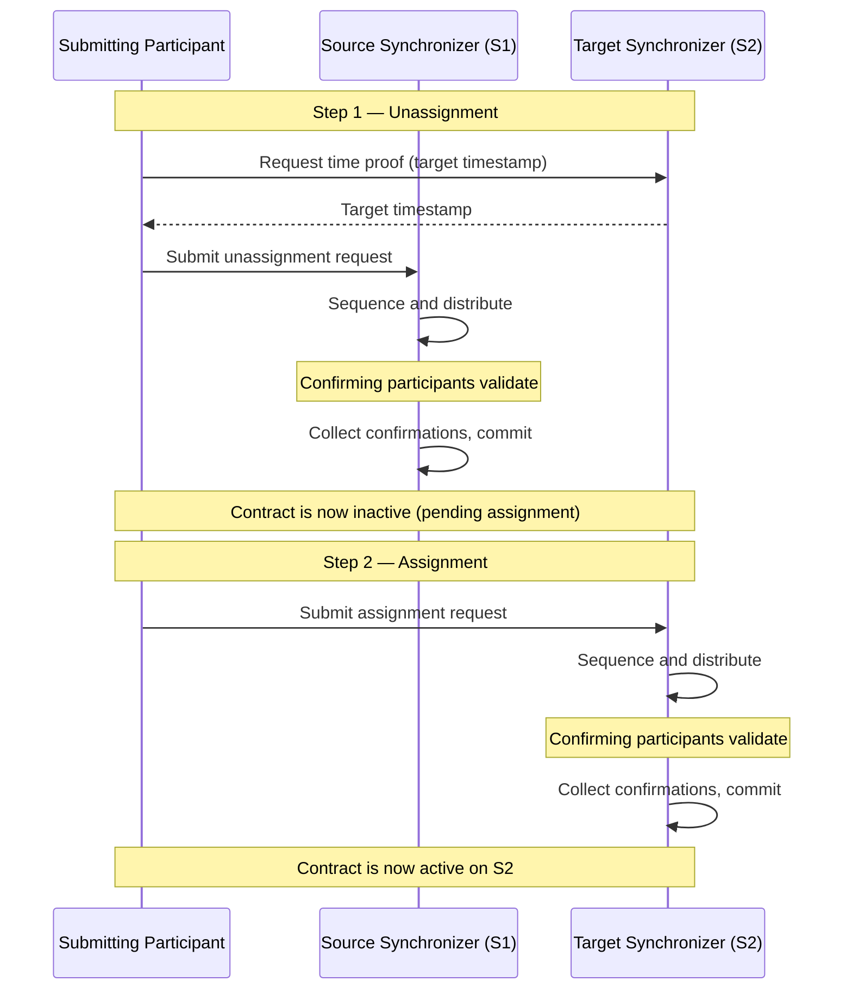

<Warning>
  이 페이지는 팀 리서치를 위한 비공식 한국어 번역입니다. 기술적 판단에는 [공식 영어 원문](https://docs.canton.network/overview/reference/reassignment-protocol.md)을 사용하세요.
</Warning>

## Reassignment가 존재하는 이유

Participant Node는 여러 Synchronizer에 연결할 수 있습니다. 서로 다른 Synchronizer는 regulatory compliance, performance 특성, cost, governance model, application-specific restriction 등 서로 다른 목적을 담당할 수 있습니다. 서로 다른 Synchronizer에서 생성된 contract가 같은 Transaction에 참여할 방법이 필요하며 그 mechanism이 Reassignment입니다.

<Note>
Synchronizer는 Stakeholder가 contract 변경을 synchronization하는 데 사용하는 commodity입니다. Contract 자체는 Participant Node에만 저장됩니다. Assignation은 Stakeholder 사이의 합의이며 Reassignment를 통해 시간이 지나면서 변경할 수 있습니다.
</Note>

## 2단계 절차: Unassignment와 Assignment

## 주요 정의

### Reassignment Counter

**Reassignment counter**는 contract가 reassign된 횟수를 추적합니다. Contract 생성 시 0으로 설정되고 Unassignment마다 1씩 증가합니다. Unassignment event와 그에 해당하는 Assignment event의 Reassignment counter는 같습니다.

### Target Timestamp

Unassignment가 제출되면 target Synchronizer에 time proof를 요청합니다. 이 timestamp인 **target timestamp**는 Unassignment 처리 중 target Synchronizer 관련 validation, 즉 Package Vetting, Stakeholder Hosting 등에 사용됩니다. 하나의 고정된 target timestamp를 사용하여 모든 Confirming Participant가 같은 Topology snapshot을 기준으로 동일한 validation을 수행하도록 보장합니다.

### Reassigning Participant

Reassigning Participant는 source와 target Synchronizer 모두에 연결되며 양쪽에서 Stakeholder를 hosting합니다. 이 dual connectivity 덕분에 전체 Reassignment를 validate하고 double-spend를 방지할 수 있습니다.

정식으로 다음 조건을 모두 충족하면 Participant `P`는 Party `S`와 contract `c`의 **reassigning participant**입니다.

- `S`가 `c`의 Stakeholder입니다.
- [Target timestamp](#target-timestamp)에 `S`가 target Synchronizer의 `P`에서 hosting됩니다.
- `S`가 source Synchronizer의 `P`에서 hosting됩니다.

마지막 조건은 submission 중에는 최근 Topology snapshot으로, protocol phase 3 중에는 request time의 Topology snapshot으로 확인합니다.

### Signatory Unassigning Participant

Contract `c`와 Party `S`의 **signatory unassigning participant**는 다음 조건을 만족하는 [reassigning participant](#reassigning-participant)입니다.

- `S`가 `c`의 **Signatory**입니다.
- Source Synchronizer의 `P`에서 최소한 confirmation right로 `S`가 hosting됩니다.

Signatory unassigning participant는 Unassignment request의 confirmer입니다. Non-signatory Observer는 어느 경우든 Reassignment를 차단하지 않으므로 Signatory만 confirm해야 합니다.

### Signatory Assigning Participant

Contract `c`와 Party `S`의 **signatory assigning participant**는 다음 조건을 만족하는 [reassigning participant](#reassigning-participant)입니다.

- `S`가 `c`의 **Signatory**입니다.
- Target Synchronizer의 `P`에서 최소한 confirmation right로 `S`가 hosting됩니다.

Signatory assigning participant는 contract의 Unassignment와 Assignment를 모두 전달받으며 Assignment request의 confirmer입니다.

## Confirmation Policy

## Validation Rule

### Unassignment Validation

### Assignment Validation

두 단계 모두 일반 Daml Transaction에도 적용되는 표준 validation을 수행합니다. 올바른 view decryption, 올바른 recipient list, 올바른 root hash message를 확인합니다.

<Warning>
Unassignment와 Assignment 사이에 Topology가 변경되면 Reassignment를 완료하지 못할 수 있습니다. 이 경우 Assignment를 허용하도록 Topology를 조정하거나 repair service를 사용해 모든 관련 Participant Node에서 contract assignation을 수동으로 수정할 수 있습니다.
</Warning>

## Submission Policy

이 완화된 requirement에는 두 이유가 있습니다. 첫째, Reassignment 후 Synchronizer에서 submission permission을 잃은 Party도 되돌리는 Reassignment를 시작할 수 있으므로 Choice exercise capability를 유지할 수 있습니다. 둘째, Daml Transaction을 제출할 수 없는 Decentralized Party도 composability를 위해 Reassignment는 제출할 수 있어야 합니다.

## Assignment Exclusivity

이 mechanism은 initiator가 방해받지 않고 Reassignment를 완료할 window를 제공하면서도 다른 Participant가 방치된 Reassignment를 마칠 수 있게 합니다.

## 자동 Reassignment와 명시적 Reassignment

Reassignment는 두 방식으로 trigger할 수 있습니다.

### 자동(Synchronizer Router)

Ledger API를 통해 Transaction을 제출하면 Canton의 Synchronizer router가 적합한 Synchronizer를 자동으로 식별합니다. 모든 input contract를 해당 Synchronizer로 reassign하고 Transaction을 실행한 다음 필요하면 output contract를 다시 reassign합니다. Application이 Synchronizer 선택이나 Reassignment Command를 관리할 필요가 없습니다.

Router는 admissible Synchronizer 중 priority가 가장 높고 Reassignment 수를 최소화하며 tie-breaker로 Synchronizer ID가 가장 낮은 Synchronizer를 선택합니다. Application은 Synchronizer별 Package Vetting, inhomogeneous Party Hosting, explicitly disclosed contract를 통해 routing에 영향을 줄 수 있습니다.

### 명시적(Ledger API Command)

정밀한 control이 필요하면 Ledger API를 통해 Reassignment Command를 직접 제출할 수 있습니다. Unassign Command는 contract, source Synchronizer, target Synchronizer를 지정합니다. Assign Command는 Unassignment가 반환한 Unassign ID를 reference합니다. Transaction submission 시 사용할 Synchronizer도 지정할 수 있으며 해당 Synchronizer가 적합하지 않으면 submission이 실패합니다.

<Note>
Automatic Reassignment는 편리하지만 예상하지 못한 contention을 일으킬 수 있습니다. Unassignment와 Assignment 모두 contract를 lock하므로 read-only Transaction을 포함한 다른 workflow와 경쟁합니다. Contention이 우려된다면 explicit Reassignment를 고려하여 Daml workflow를 설계하세요.
</Note>

## Ledger API Data

### Unassign Command Field

- **Contracts**: Reassign할 contract. 모두 동일한 Signatory와 Stakeholder를 가져야 합니다.
- **Source synchronizer**: 현재 assignation.
- **Target synchronizer**: 원하는 assignation.

### Unassigned Event Field

- **Unassign ID**: Reassignment를 고유하게 식별하고 Assignment submission에 사용하는 opaque identifier.
- **Reassignment counter**: Contract가 reassign된 횟수.
- **Assignment exclusivity**: Unassignment submitter만 Assignment를 제출할 수 있는 기한.

### Assign Command Field

- **Unassign ID**: Unassigned event의 identifier.
- **Source synchronizer**: 이전 assignation.
- **Target synchronizer**: 새 assignation.

### Assigned Event Field

- **Unassign ID**: Unassigned event와 assigned event를 correlate하는 데 사용.
- **Reassignment counter**: Unassigned event와 같은 값.
- **Created event**: Contract data. Contract가 visibility에 들어와 처음 알게 되는 Participant가 payload에 access할 수 있도록 포함됩니다.

## Visibility에 들어오고 나가는 Contract

Participant가 target Synchronizer에서 Stakeholder를 hosting하여 Assignment의 Informee이지만 source Synchronizer에서는 Stakeholder를 hosting하지 않아 Unassignment의 Informee가 아니었다면 contract가 Participant의 **visibility에 들어올** 수 있습니다. Assigned event에 포함된 created event를 통해 Participant는 contract를 처음 사용할 수 있게 될 때 payload를 알게 됩니다.

반대 상황, 즉 contract가 Participant의 **visibility에서 나가는** 것은 Participant가 source Synchronizer에서 Stakeholder를 hosting하여 Unassignment의 Informee였지만 Assignment의 Informee는 아닐 때 발생합니다. 같은 Stakeholder가 target Synchronizer에서 hosting되지 않거나 다른 node에서 hosting될 수 있습니다. Contract는 다른 Stakeholder를 위해 target Synchronizer에서 active하더라도 Unassignment 후 해당 Participant에서는 사용할 수 없게 됩니다.

Contract는 lifecycle 동안 한 Participant의 visibility에 여러 번 들어오고 나갈 수 있습니다. 대체로 Participant에서 hosting하는 Stakeholder가 시간에 따라 달라지는 방식으로 Synchronizer 전체에 multi-hosted되어 있을 때 발생합니다.

## Update Stream Ordering

Participant가 여러 Synchronizer에 연결되면 update stream은 모든 Synchronizer의 event를 merge합니다. Synchronizer 간에는 time을 비교할 수 없으므로 update stream에 global causality guarantee가 없습니다. 서로 다른 Synchronizer의 event는 어떤 순서로든 나타날 수 있으며 Participant마다 다른 ordering을 볼 수 있습니다.

단일 Synchronizer 안에서는 ordering이 consistent합니다. 특정 contract의 created event는 항상 unassigned 또는 archived event보다 먼저 나타나며 archived event는 항상 assigned 또는 created event보다 나중에 나타납니다.
