<Warning>
  이 페이지는 팀 리서치를 위한 비공식 한국어 번역입니다. 기술적 판단에는 [공식 영어 원문](https://docs.canton.network/overview/reference/super-validator-components.md)을 사용하세요.
</Warning>

Super Validator(SV)는 일반 Validator가 실행하는 모든 항목에 더해 Global Synchronizer infrastructure와 governance tooling까지 실행합니다. SV는 DSO governance process를 통해 승인된 주요 institution이 운영하며, Global Synchronizer의 decentralized operation을 뒷받침합니다.

## Component Architecture

SV node는 base Validator stack, Synchronizer infrastructure, SV-specific application의 세 layer로 구성됩니다.

```mermaid
flowchart TB
    subgraph SV["Super Validator Node"]
        direction TB

        subgraph SVApps["SV-Specific Applications"]
            SVAPP[SV App<br>Governance]
            SVUI[SV Web UI<br>Dashboard]
            SCANAPP[Scan App<br>Transaction Index]
            SCANUI[Scan Web UI<br>Network Explorer]
        end

        subgraph SyncInfra["Synchronizer Infrastructure"]
            SEQ[Sequencer Node]
            MED[Mediator Node]
            BFT[CometBFT / BFT Orderer Node]
        end

        subgraph ValStack["Validator Stack"]
            VALAPP[Validator App]
            WALLET[Wallet UI]
            CNSUI[Canton Name Service UI]
            PART[Canton Participant<br>with Splice DARs<br>Ledger API &#8226; Admin API]
            JAPI[JSON API]
            SCANPROXY[Scan Proxy]
            DB[(PostgreSQL Databases)]
        end

        SVAPP --> PART
        SCANAPP --> PART
        VALAPP --> PART
        PART --> DB
        SEQ --> DB
        MED --> DB
        BFT --> SEQ
        JAPI --> PART
    end

    ExtVal[External Validators] <-->|Sequencer API| SEQ
    OtherSV[Other SV Nodes] <-->|BFT P2P + Gossip| BFT
    OtherSV <-->|Scan Backfill| SCANAPP
    Apps[Applications] --> PART
    Apps --> JAPI
    Public[Public Clients] --> SCANAPP
```

## Validator Stack

모든 SV에는 전체 Validator stack이 포함됩니다. 자세한 분석은 [Validator Node Components](/overview/reference/validator-node-components) reference를 참조하세요.

Validator layer는 다음을 제공합니다.

- **Validator App** -- Validator lifecycle, Party onboarding, traffic top-up, Wallet automation 관리
- **Canton Participant** -- Party를 hosting하고 Contract를 저장하며 Canton protocol에 참여하는 Daml execution engine입니다. Splice DAR(Canton Coin, governance, Wallet)가 Participant에 설치됩니다.
- **Wallet UI and Canton Name Service UI** -- Canton Coin Holding을 관리하고 사람이 읽을 수 있는 Party name을 등록하는 web interface
- **Ledger API (gRPC) and JSON API** -- Command 제출과 Transaction streaming을 위한 application-facing API
- **Admin API** -- Node administration, Party management, identity operation
- **Scan Proxy** -- 여러 SV가 hosting하는 Scan API를 대상으로 BFT read를 제공하므로 Validator가 단일 SV의 Scan instance를 신뢰할 필요가 없습니다.
- **PostgreSQL databases** -- Participant의 Ledger shard와 application state를 위한 persistent storage

## Synchronizer Infrastructure

SV는 자체 Participant를 포함한 모든 Validator가 연결되는 distributed Synchronizer를 운영합니다. 각 SV는 Synchronizer component별 instance를 하나씩 실행하며, SV들은 함께 distributed Global Synchronizer를 구성합니다.

### Sequencer Node

Sequencer는 Global Synchronizer에 authenticated, timestamped multicast를 제공합니다. Participant로부터 encrypted Transaction message를 받아 지정된 recipient에게 일관된 total order로 전달합니다.

Sequencer는 message content를 decrypt하지 않습니다. Encrypted envelope과 metadata를 바탕으로 routing과 ordering을 처리합니다.

Global Synchronizer에서 각 SV는 Sequencer node를 실행합니다. Validator는 BFT Sequencer connection을 사용하여 여러 SV Sequencer에 연결합니다. Faulty하거나 unavailable한 node를 tolerate하기 위해 여러 Sequencer의 threshold를 대상으로 read와 write를 수행합니다.

### Mediator Node

Mediator는 Global Synchronizer의 Transaction을 위한 two-phase commit protocol을 지원합니다. Transaction에 관여한 stakeholder Participant의 confirmation verdict를 수집하고 이를 aggregate하여 Transaction outcome(committed 또는 rejected)을 선언합니다.

Sequencer와 마찬가지로 Mediator는 decrypted Transaction content를 보지 않습니다. Encrypted confirmation message를 대상으로 동작합니다.

각 SV는 Mediator node를 실행합니다. Mediator는 BFT state machine replication을 사용하므로 충분한 threshold의 Mediator가 honest하고 available한 동안 confirmation protocol이 계속 작동합니다.

### CometBFT / BFT Orderer Node

BFT Orderer node는 Sequencer가 처리하는 message의 total ordering을 정하는 consensus protocol에 참여합니다. 현재 implementation은 [CometBFT](https://cometbft.com/)(이전 명칭 Tendermint)를 사용하며 각 SV는 block production과 voting에 참여하는 CometBFT Validator를 실행합니다.

CometBFT node는 다른 모든 SV CometBFT node와 peer-to-peer connection을 유지하고 dedicated TCP gossip/consensus channel(Validator가 사용하는 HTTPS API와 별도)을 통해 통신합니다. BFT consensus는 block을 생성하기 위해 SV node의 3분의 2를 초과하는 합의를 요구합니다. 따라서 전체 SV 수를 `n`이라 할 때 `f = floor((n-1)/3)`인 최대 `f`개의 Byzantine(faulty 또는 malicious) node를 tolerate합니다.

Ordering consensus의 작동 방식은 [Ordering Consensus](/overview/reference/ordering-consensus)를 참조하세요.

## SV-Specific Applications

이 Splice application은 SV node에만 있으며 governance 참여와 public Network transparency를 제공합니다.

### SV App

SV App은 DSO governance에 대한 SV의 참여를 관리합니다. SV는 이를 통해 다음을 수행합니다.

- Canton Improvement Proposal(CIP)에 vote
- Network parameter 변경(traffic pricing, reward distribution, upgrade schedule)에 vote
- 새 SV onboarding request를 approve 또는 reject
- SV가 sponsor하는 Validator의 onboarding secret 생성
- SV의 Amulet(Canton Coin) conversion rate vote 관리
- 구성된 beneficiary에 SV reward coupon 분배

SV App은 Ledger API를 사용하여 local Participant에 연결하고 OIDC로 authenticate합니다.

### SV Web UI

SV Web UI는 governance와 node monitoring을 위한 operator dashboard입니다. 다음을 제공합니다.

- DSO governance overview(active vote, Network parameter, SV membership)
- CIP와 parameter 변경을 위한 vote creation 및 management interface
- Validator onboarding secret 생성
- CometBFT debug information(peer connectivity, block height, consensus state)
- Global Synchronizer node status(Sequencer와 Mediator health)

### Scan App

Scan App은 Global Synchronizer에서 DSO Party에 visible한 Transaction history를 index합니다. SV의 Participant node를 subscribe하고 Canton Coin transfer, governance operation, mining round, reward distribution에 대한 query 가능한 view를 reconstruct합니다.

각 SV는 자체 Scan App instance를 실행합니다. Scan App은 BFT 방식으로 다른 SV Scan instance의 data를 backfill하여 Network 전반에서 record가 일관되도록 합니다. 따라서 public은 단일 SV를 신뢰할 필요 없이 여러 SV가 hosting하는 Scan instance의 data를 비교할 수 있습니다.

### Scan API

Scan API는 Scan App이 expose하는 public HTTP API입니다. 다음을 제공합니다.

- Canton Coin balance와 transfer history
- Mining round data(open, closing, closed round와 issuance information)
- SV information(identity, reward weight, governance participation)
- Global Synchronizer connectivity information(Sequencer URL, Package reference)
- Network activity에 대한 aggregated statistic
- 전체 history export와 ACS snapshot을 위한 bulk data API

Scan API는 OpenAPI specification으로 문서화되어 있습니다. `external`로 표시된 endpoint는 third-party가 사용하도록 제공되며 release 간 backward compatibility를 유지합니다.

## Network Connectivity

SV node에는 일반 Validator에 필요한 것 외에도 서로 구분되는 여러 Network connectivity requirement가 있습니다.

**BFT peer-to-peer connections**: 각 SV의 CometBFT node는 dedicated P2P port(예: port `26<MIGRATION_ID>56`)에서 다른 모든 SV의 CometBFT node와 TCP connection을 유지합니다. 이 connection은 consensus gossip protocol을 전달합니다.

**Sequencer API**: SV는 External Validator와 다른 SV의 Participant가 연결할 수 있도록 HTTPS로 Sequencer를 expose합니다. Validator는 여러 SV Sequencer를 동시에 대상으로 read와 write를 수행하는 BFT Sequencer connection을 사용합니다.

**Scan backfill**: 각 SV의 Scan App은 BFT 방식으로 Transaction history를 backfill하고 cross-check하기 위해 다른 모든 SV의 Scan API에 연결합니다.

**Sponsor connectivity**: 새 SV를 onboarding할 때 sponsor SV의 Sequencer, Scan, SV App endpoint에 joining node가 접근할 수 있어야 합니다.

## SV Roles and Responsibilities

SV node 운영은 다음 역할을 동시에 수행하는 것을 의미합니다.

- **Synchronizer operator** -- Validator의 Transaction processing에 필요한 Sequencer와 Mediator node를 실행하고 유지 관리
- **BFT consensus participant** -- Block production과 message ordering에 기여하는 CometBFT Orderer node 실행
- **Governance participant** -- CIP에 vote하고 새 Validator와 SV를 approve하며 DSO governance process를 통해 Network parameter 설정
- **Scan infrastructure provider** -- Transparency와 third-party integration을 위해 Global Synchronizer activity를 index하는 public Scan instance hosting
- **Validator operator** -- Network의 다른 Validator처럼 Party를 hosting하고 Canton Coin Holding을 관리하며 application 실행

## Key Properties

각 SV는 Validator layer, Synchronizer infrastructure, governance application의 전체 stack을 실행합니다. Partial SV deployment는 없습니다. 모든 component를 실행하지 않는 SV는 DSO에서 자신의 역할을 수행할 수 없습니다.

SV는 DSO governance process를 통해 승인된 institution이 운영합니다. SV를 추가하거나 제거하려면 기존 SV approval의 threshold를 충족하는 governance vote가 필요합니다.

BFT ordering service의 safety(conflicting ordering 없음)와 liveness(지속적인 block production)를 위해 SV의 3분의 2를 초과하는 수가 honest해야 합니다. SV가 `n`개이면 system은 최대 `floor((n-1)/3)`개의 Byzantine fault를 tolerate합니다.

SV는 Canton Coin minting mechanism을 통해 Network activity에 따른 reward를 얻습니다. Infrastructure operation, governance participation, Validator activity가 모두 SV minting right에 기여합니다.

## Database Requirements

SV node에는 PostgreSQL instance 네 개가 필요합니다(통합할 수 있지만 운영 유연성을 위해 분리하는 것이 권장됩니다).

- **Sequencer database** -- Sequencer state와 message queue 저장
- **Mediator database** -- Mediator state와 confirmation data 저장
- **Participant database** -- Participant의 Ledger shard(hosted Party의 Contract) 저장
- **Apps database** -- SV App, Scan App, Validator App, Wallet의 state 저장

## Deployed Pods

Kubernetes에서 실행 중인 SV node는 다음 pod로 구성됩니다(`kubectl get pods`에 표시되는 이름).

- `global-domain-<M>-cometbft` -- CometBFT consensus node
- `global-domain-<M>-sequencer` -- Sequencer node
- `global-domain-<M>-mediator` -- Mediator node
- `participant-<M>` -- Canton Participant
- `sv-app` -- SV governance application
- `sv-web-ui` -- SV operator dashboard
- `scan-app` -- Scan indexer와 API
- `scan-web-ui` -- Scan Network Explorer UI
- `validator-app` -- Validator application
- `wallet-web-ui` -- Wallet interface
- `ans-web-ui` -- Canton Name Service interface
- `info` -- Node information service
- `sequencer-pg`, `mediator-pg`, `participant-pg`, `apps-pg` -- PostgreSQL instance

여기서 `<M>`은 Global Synchronizer의 현재 migration ID입니다.
