<Warning>
  이 페이지는 팀 리서치를 위한 비공식 한국어 번역입니다. 기술적 판단에는 [공식 영어 원문](https://docs.canton.network/overview/reference/validator-node-components.md)을 사용하세요.
</Warning>

Canton Network의 Validator는 단순한 Canton Participant Node가 아닙니다. Canton Participant와 Canton Coin, Wallet, Canton Name Service, Network management automation을 구현하는 software인 Splice application layer를 함께 제공합니다. 이 페이지에서는 각 component layer와 layer 간 관계를 설명합니다.

## Component Architecture

```mermaid
flowchart TB
    subgraph UI["Application Layer (Web UIs)"]
        direction TB
        WUI[Wallet UI]
        CNSUI[Canton Name Service UI]
    end

    subgraph APIS["External APIs"]
        direction TB
        VALAPI[Validator App API]
        JAPI[JSON API &#40;HTTP&#41;]
        SCANP[Scan Proxy]
    end

    subgraph SPLICE["Splice Layer"]
        direction TB
        VAPP[Validator App]
        SDARS[Splice DARs<br>Amulet &#8226; Wallet &#8226; Name Service]
        TSDARS[Token Standard DARs]
    end

    subgraph PARTICIPANT["Canton Participant"]
        direction TB
        LAPI[Ledger API &#40;gRPC&#41;]
        AAPI[Admin API]
        ENGINE[Daml Engine]
        ACS[(Active Contract Set)]
        PROTO[Protocol Layer<br>preparation &#8226; validation &#8226; confirmation]
    end

    subgraph DATA["Data Layer"]
        direction TB
        PQS[PQS<br>Participant Query Store]
        PG[(PostgreSQL)]
    end

    subgraph SYNC["Synchronizer Connections"]
        direction TB
        GS[Global Synchronizer<br>via sequencer&#40;s&#41;]
        PS[Dedicated Synchronizer&#40;s&#41;<br>optional]
    end

    WUI --> VALAPI
    CNSUI --> VALAPI
    VALAPI --> VAPP
    VAPP --> LAPI
    SDARS --> ENGINE
    TSDARS --> ENGINE
    LAPI --> ENGINE
    JAPI --> LAPI
    PQS --> LAPI
    ENGINE --> ACS
    ENGINE --> PROTO
    AAPI --> PARTICIPANT
    PARTICIPANT --> PG
    PQS --> PG
    PROTO <--> GS
    PROTO <--> PS
    SCANP --> GS
```

## Application Layer

{/* COPIED_START source="docs-website:replicated/canton/3.5/overview/explanations/canton/participant.rst" hash="3ccc7b7d" */}

Participant Node

Participant Node 자세히 살펴보기

Diagram:

- PN은 여러 Synchronizer에 연결됨(상세 내용은 향후 별도 section에서 보완 예정)
- 여러 user를 위한 isolation을 제공하는 gRPC Ledger API access, operator access를 위한 Admin API
- Private Contract Store(PCS)는 historical data를 포함하지만 ACS는 포함하지 않음

##

{/* COPIED_END */}

Application layer는 모든 Validator deployment와 함께 제공되는 web UI로 구성됩니다.

**Wallet UI** -- Validator operator와 선택적으로 hosted user가 Canton Coin Holding을 관리하고 Transaction history를 보며 transfer offer를 accept 또는 send하고 reward collection을 monitor하는 browser-based interface입니다. Wallet UI는 Validator App API와 통신합니다.

**Canton Name Service (CNS) UI** -- 사람이 읽을 수 있는 name을 구매하고 관리하며 Network의 Party identifier에 mapping하는 browser-based interface입니다. CNS name은 DNS record처럼 작동합니다. Party는 globally unique name(예: `alice.unverified.cns`)을 등록하고 전체 Party identifier 대신 사용할 수 있습니다.

두 UI 모두 external OIDC provider(예: Auth0 또는 Keycloak)를 통해 user를 authenticate하며 Validator ingress 뒤에서 single-page application으로 serve됩니다.

## Splice Layer

Splice layer는 Validator와 일반 Canton Participant를 구분하는 요소입니다.

### Validator App

Validator App은 web UI와 Canton Participant 사이에 위치하는 backend process입니다. 다음을 수행합니다.

- Participant의 Global Synchronizer connection 관리(outage 또는 migration 후 reconnect 포함)
- Onboarding 자동화: sponsoring Super Validator에 onboarding secret을 제시하고 handshake 완료
- Participant에 Splice DAR Package upload 및 vetting
- Party allocation과 user-to-Party mapping 관리
- Wallet automation 실행: Validator reward collection, recurring subscription payment 실행, traffic 구매
- Wallet operation, user management, CNS entry management, External Signing, Scan Proxy endpoint를 포함하는 REST API surface expose(아래 [APIs](#apis) 참조)

### Splice DARs

Splice DAR은 Canton Network의 built-in application을 구현하는 Daml Package입니다. Canton Participant에서 일반 Smart Contract로 실행되며 다음을 포함합니다.

- **Amulet** -- Canton Coin의 Daml logic: minting round, reward coupon, holding fee, coin transfer
- **Wallet** -- Transfer offer, buy-traffic request, subscription payment, sweep automation
- **Amulet Name Service (ANS)** -- Name registration, renewal, resolution

### Token Standard DARs

Token Standard DAR은 [Canton Network Token Standard (CIP-0056)](https://github.com/canton-foundation/cips/blob/main/cip-0056/cip-0056.md)을 구현합니다. Daml interface를 통해 Canton Coin과 잠재적으로 다른 token을 transfer하기 위한 standardized interface를 제공합니다. Canton Coin과 integration하는 application은 lower-level Amulet Contract가 아니라 이 interface를 대상으로 구축해야 합니다.

## Canton Participant

Canton Participant는 Daml Smart Contract를 실행하고 Canton Transaction Protocol에 참여하는 core runtime입니다. 세 가지 주요 sub-component가 있습니다.

### Daml Engine

Daml engine은 Daml Smart Contract code를 interpret하고 execute합니다. Application이 Ledger API를 통해 Command를 제출하면 Daml engine은 다음을 수행합니다.

1. Command parse 및 validate
2. Daml code를 evaluate하여 root action과 그에 따른 모든 consequence를 포함하는 Transaction tree 생성
3. Privacy를 위한 view decomposition 계산(각 Party는 자신이 볼 권한이 있는 sub-view만 확인)

### Active Contract Set (ACS)

ACS는 Active Contract에 대한 Participant의 local projection입니다. 해당 Participant에서 hosting되는 Party가 stakeholder(Signatory 또는 Observer)인 Contract만 포함합니다. ACS는 Participant의 PostgreSQL database에 저장됩니다.

Transaction이 commit되면 Participant는 consumed Contract를 archive하고 새로 생성된 Contract를 insert합니다. Transaction이 reject되면 locked Contract가 release됩니다. 따라서 ACS는 이 Participant의 관점에서 현재 Ledger state를 반영합니다.

### Protocol Layer

Protocol layer는 multi-step Canton Transaction Protocol을 처리합니다.

- **Preparation**: Submitting Participant가 confirmation request를 구성하고 Transaction을 Merkle tree에 embed하며 recipient별 encrypted envelope을 생성
- **Submission**: Encrypted envelope을 ordering과 distribution을 위해 Sequencer로 전송
- **Validation**: Receiving Participant가 Daml engine과 local Contract state를 기준으로 자신의 view를 validate
- **Confirmation**: Participant가 Sequencer를 통해 Mediator에 approval 또는 rejection response 전송
- **Result**: Mediator가 response를 aggregate하고 Sequencer를 통해 commit 또는 rollback을 선언하며 Participant가 outcome 적용

이 단계에 대한 전체 설명은 [Transaction Lifecycle](/overview/reference/transaction-lifecycle)을 참조하세요.

## APIs

Validator는 consumer별로 여러 API surface를 expose합니다.

### Ledger API (gRPC)

Ledger API는 Canton Participant에 대한 primary application interface입니다. 다음과 같은 주요 service endpoint가 있는 gRPC service입니다.

- **Command Submission Service** -- 실행할 Daml Command(create, exercise) 제출
- **Command Completion Service** -- 제출한 Command outcome polling
- **Transaction Service** -- Party 집합에 visible한 committed Transaction streaming
- **Active Contract Service** -- Party 집합에 대한 현재 ACS snapshot 획득
- **State Service** -- Active Contract와 Transaction tree query

Application은 구성된 OIDC provider를 통해 verify되는 JWT token을 사용하여 Ledger API에 authenticate합니다.

### JSON API

JSON API는 Ledger API의 HTTP 및 WebSocket wrapper입니다. JSON request를 gRPC call로 translate하고 JSON response를 반환합니다. Canton 3.x에서 JSON API는 Canton Participant process에 integrate되어 있습니다(2.x처럼 별도 sidecar가 아님). 많은 backend application은 gRPC Ledger API를 직접 사용하며 high-throughput backend에는 gRPC가 권장됩니다. JSON API endpoint는 ingress를 통해 구성할 때 일반적으로 `/api/json-api`로 expose됩니다.

### Admin API

Admin API는 Node administration capability를 제공합니다. Operator는 이를 통해 다음을 수행할 수 있습니다.

- Synchronizer connection 관리(connect, disconnect, reconnect)
- DAR Package upload(Ledger API에서도 가능)
- Party allocate 및 관리
- Topology state와 Node identity query
- Pruning schedule 구성

Admin API는 기본적으로 ingress를 통해 expose되지 않으며 trusted operator로 access를 제한해야 합니다.

### Validator App API

Validator App은 port 5003에서 기능별로 grouping된 endpoint를 제공하는 REST API를 expose합니다.

- **Wallet API** (`/v0/wallet/*`) -- Transfer offer 생성, traffic 구매, balance와 Transaction history query
- **User Management API** (`/v0/admin/users/*`, `/v0/register`) -- Validator에서 hosting하는 user onboard 및 offboard
- **CNS API** (`/v0/entry/*`) -- Canton Name Service entry 생성 및 list
- **External Signing API** (`/v0/admin/external-party/*`) -- Canton Coin을 위한 externally-signed Party setup 및 operation
- **Validator Management API** (`/v0/admin/participant/*`) -- Participant identity와 Synchronizer connection configuration query

### Scan Proxy

Scan Proxy(`/v0/scan-proxy/*`)는 Super Validator가 hosting하는 public Scan API data에 대한 BFT read access를 제공합니다. 단일 SV Scan instance를 신뢰하는 대신 Scan Proxy가 각 query를 여러 SV Scan service에 broadcast하고 consensus result를 반환합니다. Endpoint에는 Amulet rule, open mining round, CNS entry, transfer command status query가 포함됩니다.

## Data Layer

### PostgreSQL

Participant는 PostgreSQL database에 state를 저장합니다. Primary store에는 다음이 포함됩니다.

- **Ledger store** -- Committed Transaction과 ACS
- **Sequencer client store** -- Synchronizer에서 받은 message
- **Topology store** -- Identity mapping, key registration, Party-to-Participant assignment([Topology](/overview/reference/topology) 참조)
- **Validator app store** -- Validator App 자체 operational state

Splice application layer(Validator App, Wallet automation)는 동일한 PostgreSQL instance 안에서 추가 database schema를 사용합니다.

Operator는 retention window를 지난 historical Transaction을 제거하고 ACS만 유지하도록 Participant pruning을 구성할 수 있습니다. 이는 database가 무제한으로 증가하는 것을 방지하지만 예상 downtime을 기준으로 retention window를 신중하게 sizing해야 합니다.

### PQS (Participant Query Store)

PQS는 Participant의 Ledger API Transaction stream을 subscribe하고 denormalized projection을 자체 PostgreSQL database에 기록하는 optional read-side component입니다. Application은 gRPC Ledger API 대신 standard SQL(JDBC)을 통해 PQS를 query합니다.

PQS는 application에 다음이 필요할 때 유용합니다.

- Contract payload에 대한 SQL 기반 query(Ledger API는 Template field를 index하지 않음)
- Projection 구축을 위해 Contract data에 걸쳐 SQL join(예: 여러 Template type join)
- Audit trail과 compliance query를 위한 historical Contract data retention
- Participant에 과부하를 줄 수 있는 analytics 또는 reporting workload
- Command 제출(Ledger API)과 read query(PQS database) 사이의 CQRS-style separation

PQS는 Ledger에 write하지 않으며 Transaction data를 passive하게 consume합니다.

## Synchronizer Connections

Validator는 하나 이상의 Synchronizer에 연결됩니다. 각 connection에는 Synchronizer의 Sequencer node와 연결되는 authenticated channel이 포함되며 Validator는 이 channel을 통해 Mediator를 포함한 더 광범위한 Synchronizer infrastructure와 통신합니다.

### Global Synchronizer

Canton Network의 모든 Validator는 Global Synchronizer에 연결됩니다. 이 connection은 다음을 전달합니다.

- Canton Coin, CNS entry, Global Synchronizer의 다른 모든 Contract가 관여하는 Transaction의 encrypted confirmation request 및 response
- State consistency를 verify하기 위한 Participant 간 ACS commitment exchange
- Topology Transaction(Party allocation, Package Vetting, key rotation)

Sequencer endpoint URL과 connection parameter는 일반적으로 onboarding 중 Scan API에서 얻습니다. 기본적으로 Validator는 BFT fault tolerance를 위해 여러 Sequencer endpoint에 연결하지만 operator가 single trusted Sequencer를 선택적으로 구성할 수도 있습니다.

### Dedicated Synchronizers

Validator는 Global Synchronizer 외의 추가 Synchronizer에 연결할 수 있습니다. Dedicated Synchronizer는 enterprise 또는 consortium이 자체 application domain을 위해 운영합니다. 서로 다른 Synchronizer의 Contract는 Contract를 한 Synchronizer에서 다른 Synchronizer로 이동하는 Reassignment(transfer) operation을 통해 상호 작용할 수 있습니다.

Multi-Synchronizer connectivity를 통해 하나의 Validator가 여러 application domain의 workflow에 참여하면서 Global Synchronizer를 통해 fee를 settle하는 Party를 hosting할 수 있습니다.

## Traffic Management

Global Synchronizer에 Transaction을 제출하면 traffic을 소비합니다. 모든 Participant에는 configurable time window 동안 재생되는 무료 base-rate traffic allowance가 있습니다. 이 baseline을 넘으면 Validator가 Canton Coin을 burn하여 extra traffic을 구매해야 합니다.

Validator App에는 built-in top-up automation이 포함됩니다. Operator가 target throughput을 구성하면 App이 충분한 balance를 유지하도록 traffic을 자동 구매합니다. Traffic balance가 reserved threshold 아래로 떨어지면 Validator App은 top-up Transaction에 충분한 balance를 남겨 두기 위해 자체 Ledger submission을 pause합니다.

Traffic accounting은 Participant별로 이루어지며 동일한 Validator에서 hosting하는 모든 Party가 하나의 traffic balance를 공유합니다.

## Kubernetes Pod Topology

일반적인 Validator Kubernetes deployment는 다음 pod를 생성합니다.

- `postgres` -- PostgreSQL instance
- `participant` -- Canton Participant process
- `validator-app` -- Splice Validator App backend
- `wallet-web-ui` -- Wallet UI frontend
- `ans-web-ui` -- Canton Name Service UI frontend

각 pod는 별도 Kubernetes deployment(PostgreSQL은 StatefulSet)로 실행됩니다. Validator App을 시작하려면 Participant가 실행 중이어야 하며 둘 중 하나를 실행하기 전에 PostgreSQL이 실행 중이어야 합니다.

## How the Layers Relate

일반 Canton Participant는 Daml Contract를 실행하고 Synchronizer에 연결할 수 있지만 Canton Coin, Wallet, Canton Name Service에 관한 knowledge가 없습니다. Splice layer는 Daml Package(DAR)를 Participant에 deploy하고 on-ledger event에 반응하는 automation layer로 Validator App을 실행하여 이 knowledge를 추가합니다.

Participant 관점에서 Splice DAR은 다른 Daml Package와 같습니다. Validator App도 또 하나의 Ledger API client일 뿐입니다. Splice layer upgrade(새 DAR version, 새 Validator App release)는 Canton Participant runtime upgrade와 독립적이라는 점에서 이 구분이 중요하지만, 둘 다 Network가 요구하는 version과 compatible해야 합니다.

## Related Pages

<CardGroup cols={2}>

<Card title="Transaction Lifecycle" icon="arrows-spin" href="/overview/reference/transaction-lifecycle">
  Canton protocol이 제출부터 commit까지 Transaction을 처리하는 방식입니다.
</Card>

<Card title="Topology" icon="sitemap" href="/overview/reference/topology">
  Identity management, key registration, Party-to-Participant mapping입니다.
</Card>

<Card title="Super Validator Components" icon="server" href="/overview/reference/super-validator-components">
  Super Validator가 standard Validator 외에 운영하는 추가 component입니다.
</Card>

<Card title="Canton Coin Tokenomics" icon="coins" href="/overview/reference/canton-coin-tokenomics">
  Minting, burning, reward, burn-mint equilibrium mechanism입니다.
</Card>

</CardGroup>
