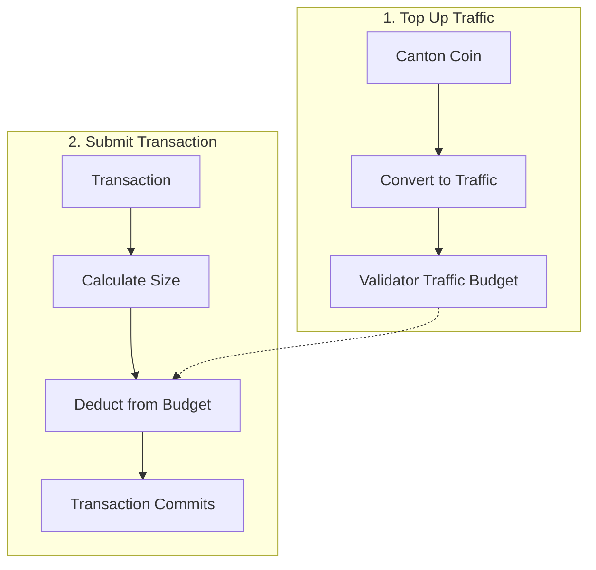

<Warning>
  이 페이지는 팀 리서치를 위한 비공식 한국어 번역입니다. 기술적 판단에는 [공식 영어 원문](https://docs.canton.network/overview/understand/canton-coin.md)을 사용하세요.
</Warning>

Canton Coin(CC)은 Global Synchronizer의 native utility token으로 network operation을 위한 경제적 토대를 제공합니다.

## Canton Coin이란 무엇인가요?

Canton Coin은 다음 용도로 쓰이는 native token입니다.

| 용도 | 설명 |
|------|------|
| **Transaction fee(Traffic)** | Transaction 제출 시 network 사용료 지불 |
| **Validator reward** | Infrastructure operator에게 incentive 제공 |
| **Governance** | Super Validator가 참여를 위해 CC를 stake함 |

Canton Coin은 decentralized Canton Synchronizer를 위한 open-source infrastructure인 [Splice](https://github.com/canton-network/splice)를 통해 구현됩니다.

## Traffic: Transaction Fee

"Traffic"은 Canton에서 Transaction fee를 가리키는 용어입니다. Global Synchronizer에서 Transaction을 처리하려면 Validator의 Traffic budget에 Traffic Credit이 있어야 합니다.

**2단계 절차:**
1. **충전**: Canton Coin을 Traffic Credit으로 변환하여 Validator의 Traffic budget에 추가합니다
2. **소비**: Transaction이 제출되면 budget에서 Traffic Credit이 차감됩니다

Traffic Credit은 양도할 수 없습니다. CC를 Traffic으로 변환하고 나면 Transaction fee 지불에만 사용할 수 있습니다.

### Traffic 작동 방식

Traffic 비용은 다음 요소에 따라 달라집니다.

| 요소 | 영향 |
|------|------|
| **Transaction size** | Transaction이 클수록 비용 증가 |
| **Computational complexity** | Operation이 복잡할수록 비용 증가 |
| **Network demand** | Network load에 따라 달라질 수 있음 |

### Traffic 관리

Transaction이 처리될 수 있도록 다음을 수행하세요.

1. Validator의 Traffic budget에 **Traffic Credit을 유지**합니다
2. Budget이 부족해지면 CC를 Traffic Credit으로 변환하여 **충전**합니다
3. 비용을 계획할 수 있도록 **사용량을 monitoring**합니다

<Note>
Validator의 Traffic budget이 소진되면 Transaction이 실패합니다. Validator는 잔액이 threshold 아래로 내려갈 때 CC를 Traffic Credit으로 자동 변환하도록 auto-top-up을 설정할 수 있습니다.
</Note>

## Canton Coin 획득하기

CC 획득 방식은 environment에 따라 다릅니다.

| Environment | 방법 |
|-------------|------|
| **LocalNet** | 자동으로 제공됨(test CC) |
| **DevNet** | Faucet("tapping")에서 test CC 제공 |
| **TestNet** | Faucet에서 test CC 제공 |
| **MainNet** | 구매하거나 network activity를 통해 획득 |

### DevNet/TestNet Faucet

Test network에서는 무료 test CC를 "tap"할 수 있습니다.

1. Wallet interface에 접근합니다
2. Tap/faucet 기능을 사용합니다
3. Test CC를 받습니다. 실제 가치는 없습니다

Test CC에는 rate limit이 적용되며 경제적 가치가 없습니다.

### MainNet에서 획득

MainNet에서 CC는 실제 경제적 가치를 지닙니다.

| 방법 | 설명 |
|------|------|
| **Exchange** | 지원하는 exchange에서 구매 |
| **Network activity** | Validator operation을 통해 획득 |
| **Direct transfer** | 다른 Party로부터 수령 |

## Validator Reward

Global Synchronizer에서 운영되는 Validator는 **activity reward**를 통해 CC를 받습니다. Validator 사용자가 Traffic 구매나 transfer를 위해 CC를 burn하면 Validator는 burn된 양에 비례하여 CC를 mint합니다. [CIP-0096](https://github.com/canton-foundation/cips/blob/main/cip-0096/cip-0096.md)은 uptime만으로 Validator에 지급되던 기존 liveness reward를 중단하여 2026-04-30부터 $0으로 제한했습니다. 이제 activity reward가 유일한 Validator minting mechanism입니다.

Super Validator에는 Synchronizer infrastructure 운영에 대한 추가 reward mechanism이 있습니다.

## Tokenomics

Global Synchronizer의 tokenomics는 다음 목표를 위해 설계되었습니다.

| 목표 | Mechanism |
|------|-----------|
| **Infrastructure 유지** | Operator를 위한 reward |
| **공정한 가격 보장** | Market-driven Traffic 비용 |
| **Governance 이해관계 조율** | Stake 기반 참여 |
| **Network 성장 촉진** | 도입 incentive |

자세한 tokenomics는 [canton.foundation](https://canton.foundation)을 참고하세요.

## Canton Coin과 다른 Cryptocurrency 비교

| 항목 | Canton Coin | 다른 L1 Token |
|------|-------------|---------------|
| **주요 용도** | Network utility | 다양함 |
| **Privacy** | Scan을 통해 balance 공개 | 대체로 공개 |
| **Holder visibility** | Scan service를 통해 공개 | 공개 |
| **Transaction fee** | Traffic 지불 | Gas 지불 |

### Holding의 Visibility

대부분의 다른 cryptocurrency와 마찬가지로 CC balance와 Transaction history는 network의 scan service를 통해 공개됩니다. 이는 기본적으로 private하고 권한 있는 Party만 볼 수 있는 다른 Canton application contract와 다릅니다.

## 통합 시 고려 사항

### Application Developer

| 고려 사항 | 접근 방식 |
|-----------|-----------|
| **Traffic estimation** | 사용자 operation 비용 추정 |
| **Top-up flow** | 자동 또는 사용자 요청 방식의 top-up 구축 |
| **Error handling** | 잔액 부족을 적절히 처리 |
| **사용자 communication** | 사용자에게 Traffic 비용 안내 |

### Validator

| 고려 사항 | 접근 방식 |
|-----------|-----------|
| **Traffic budget monitoring** | Hosting하는 Party의 Traffic Credit balance 추적 |
| **Auto-top-up** | Budget이 부족할 때 CC를 Traffic으로 자동 변환하도록 설정 |
| **Reward management** | 획득한 CC reward 처리 |

## 다음 단계

<CardGroup cols={2}>

<Card title="사용자용 Wallet" icon="wallet" href="/integrations/wallets/for-users">
  Canton Coin을 관리합니다.
</Card>

<Card title="Validator 운영" icon="server" href="/global-synchronizer/understand/introduction">
  Validator를 운영하고 reward를 획득합니다.
</Card>

</CardGroup>
