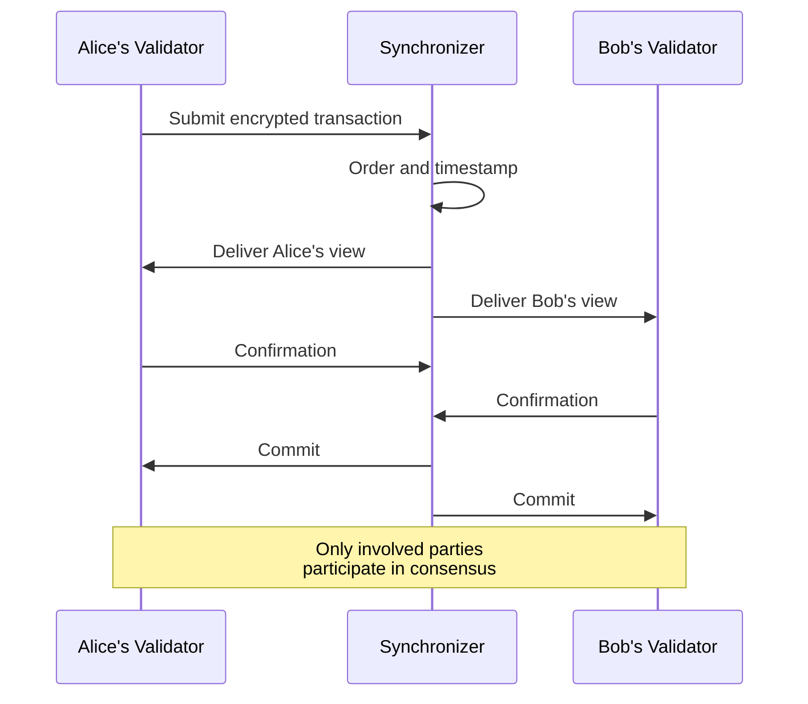
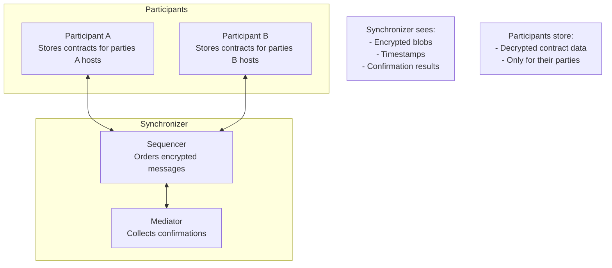
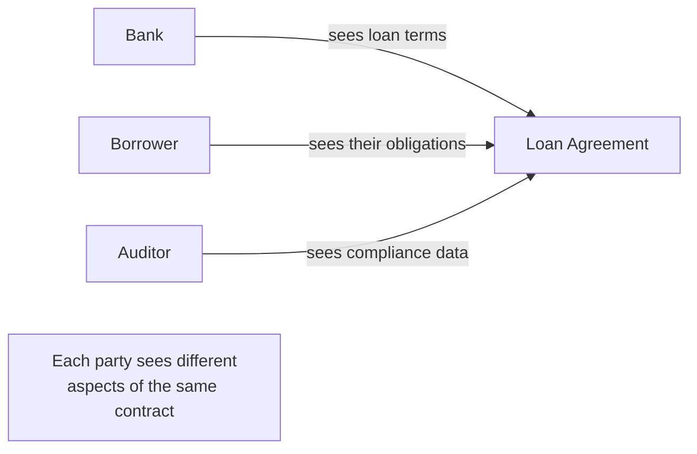

<Warning>
  이 페이지는 팀 리서치를 위한 비공식 한국어 번역입니다. 기술적 판단에는 [공식 영어 원문](https://docs.canton.network/overview/understand/cantons-solution.md)을 사용하세요.
</Warning>

Canton은 강력한 privacy 보장과 blockchain 수준의 integrity를 함께 제공하는 세 가지 architecture 축을 통해 privacy와 integrity의 tradeoff를 해결합니다.

## 축 1: Sub-Transaction Privacy

Canton의 핵심 혁신은 **sub-transaction privacy**입니다. 이는 두 수준에서 작동합니다.

1. **Transaction isolation**: 서로 다른 Transaction을 완전히 분리하므로 관련 없는 Party는 다른 Transaction의 존재조차 알지 못합니다
2. **View decomposition**: 하나의 Transaction 안에서도 각 Party는 자신과 관련된 부분만 봅니다

Transaction에 여러 Party가 관여하면 Canton은 Stakeholder 관계를 바탕으로 Transaction을 view로 나누고, 각 수신자를 위해 view를 암호화한 후 각 Participant가 볼 권한이 있는 view만 Synchronizer를 통해 전달합니다. 각 Participant는 자신의 view를 바탕으로 validate하고 confirm합니다. Synchronizer는 암호화되지 않은 Transaction 내용을 절대 보지 못합니다.

이는 단순히 data를 숨기는 것이 아니라 information flow의 경계를 수학적으로 강제합니다. View가 분해되는 방식, 구체적인 예제에서 각 Party가 보는 내용, Daml application의 privacy design pattern을 자세히 알아보려면 [Privacy Model 설명](/overview/learn/privacy-model)을 참고하세요.

## 축 2: Proof of Stakeholder Consensus

전통적인 blockchain에서는 모든 Validator가 모든 Transaction을 검증해야 합니다. Canton은 다른 접근 방식을 사용합니다. **Transaction의 Stakeholder만 해당 Transaction을 confirm하면 됩니다.**

### 이 방식이 작동하는 이유

생각해 보세요. Validator가 자신이 관여하지 않은 Transaction을 검증해야 할 이유가 있을까요?

전통적인 blockchain에서 Validator는 double-spend를 방지하고 규칙 준수를 보장하기 위해 모든 것을 검증합니다. 그러나 Transaction의 영향을 받는 주체가 Alice와 Bob뿐이라면 Alice와 Bob만 검증하면 됩니다. 다음 조건이 충족되면 됩니다.

- Alice의 Validator가 Alice가 Transaction을 authorize했음을 confirm함
- Bob의 Validator가 Bob이 받아야 할 것을 받고 있음을 confirm함
- 둘 모두 Transaction이 valid하다는 데 동의함

그러면 Transaction은 valid합니다. Charlie의 Validator는 Transaction을 보거나 검증하거나 그 존재를 알 필요도 없습니다.

### Global Visibility 없는 Integrity

이 접근 방식이 integrity를 유지하는 이유는 다음과 같습니다.

- **Double-spend 방지**: Alice의 Validator는 Alice의 contract를 추적하므로 존재하지 않는 것을 지출할 수 없습니다. 평판 있는 token의 예에서는 발행에 issuer의 승인이 필요합니다.
- **Authorization enforcement**: Controller로 선언된 Party만 Choice를 exercise할 수 있습니다
- **Consistency**: Synchronizer는 모든 Party가 일관된 event 순서를 보도록 보장합니다
- **Atomicity**: 관여한 모든 Party가 confirm하거나 Transaction이 reject됩니다

## 축 3: Visibility 없는 Synchronization

**Synchronizer**(Sequencer와 Mediator node)는 Transaction 내용을 보지 않고 Transaction ordering과 confirmation을 synchronization합니다.

### Synchronizer가 하는 일

| 기능 | 설명 |
|------|------|
| **Ordering** | Transaction과 event에 timestamp와 total order 할당 |
| **Distribution** | 권한 있는 Participant에게 암호화된 view routing |
| **Mediation** | Confirmation 수집과 결과 선언 |
| **Consistency** | 모든 Participant가 동일한 ordering을 보도록 보장 |

### Synchronizer가 할 수 없는 일

| 제약 | 보장 |
|------|------|
| **내용 읽기** | 암호화된 view만 봄 |
| **최종 사용자 식별** | Routing을 위해 Party를 알지만 그 이면의 사람이나 system은 알지 못함 |
| **Transaction 수정** | 그대로 전달하거나 reject할 수만 있음 |
| **State 저장** | Persistent Transaction data가 없음 |

### Trust Model

Synchronizer의 제한된 capability는 단점이 아니라 기능입니다.

- **Data에 관해서는 Synchronizer를 신뢰할 필요가 없습니다.** Synchronizer가 data를 읽을 수 없기 때문입니다
- **Ordering과 availability에 관해서는 Synchronizer를 신뢰합니다**
- **Synchronizer는 자신이 synchronization하는 내용을 볼 수 없으므로 속일 수 없습니다**

이러한 concern 분리는 다음을 의미합니다.
- Privacy는 policy가 아니라 cryptography로 강제됨
- Synchronizer operator가 Transaction intelligence를 추출할 수 없음
- Synchronizer operator를 더 추가해도 data 노출 범위가 커지지 않음

## 세 가지 축이 함께 작동하는 방식

세 가지 축은 서로 의존합니다.

| 축 | 가능하게 하는 것 |
|----|------------------|
| **Sub-transaction privacy** | 독립적으로 validate할 수 있는 view |
| **Proof of stakeholder** | Global visibility 없는 consensus |
| **Visibility 없는 synchronization** | Data 노출 없는 ordering |

이 셋은 함께 다음과 같은 system을 만듭니다.

1. 각 Party는 자신의 view만 받습니다
2. 각 Party는 자신의 view만 validate합니다
3. Synchronizer는 어떤 view도 보지 못합니다
4. 모든 Stakeholder가 confirm하면 Transaction이 atomically commit됩니다

## 현실 세계의 영향

이 architecture는 전통적인 blockchain에서 실현하기 어려운 use case를 가능하게 합니다.

### 기밀 다자간 Workflow

여러 organization이 각자 자신의 부분만 보는 workflow를 공유할 수 있습니다.

### Privacy-Preserving Settlement

Trading Party는 관찰자에게 가격을 공개하지 않고 settlement합니다.

- Buyer가 보는 것: 받은 asset, 지급한 payment
- Seller가 보는 것: transfer한 asset, 받은 payment
- Market이 보는 것: 가격이나 Party를 볼 수 없음

### Regulatory Compliance

Shared truth를 유지하면서 data protection 요구 사항을 충족합니다.

- 권한 있는 Party에 data가 유지됨
- Audit 권한이 있는 주체를 위한 audit trail이 존재함
- Cross-border data flow가 최소화됨

## 다음 단계

<CardGroup cols={2}>

<Card title="Use Case" icon="building" href="/overview/understand/use-cases">
  실제 작동하는 Canton의 구체적인 예제를 살펴봅니다.
</Card>

<Card title="핵심 개념" icon="book" href="/overview/understand/core-concepts">
  Party, Validator, Synchronizer를 알아봅니다.
</Card>

<Card title="Architecture 상세 분석" icon="diagram-project" href="/overview/learn/architecture">
  Component가 함께 작동하는 기술적 방식을 이해합니다.
</Card>

<Card title="Privacy Model" icon="lock" href="/overview/learn/privacy-model">
  Privacy 보장을 자세히 살펴봅니다.
</Card>

</CardGroup>
