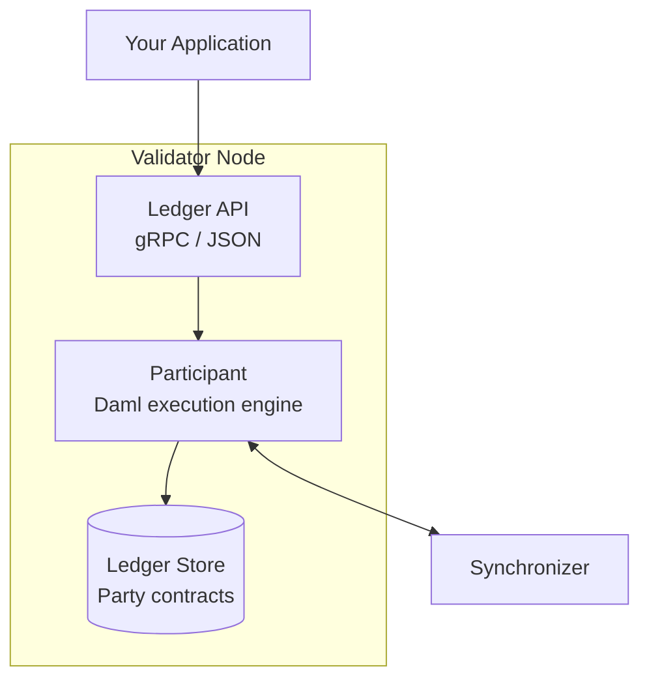
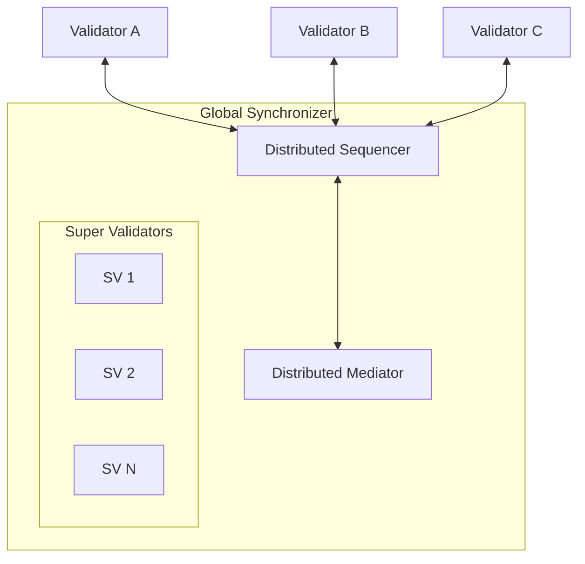
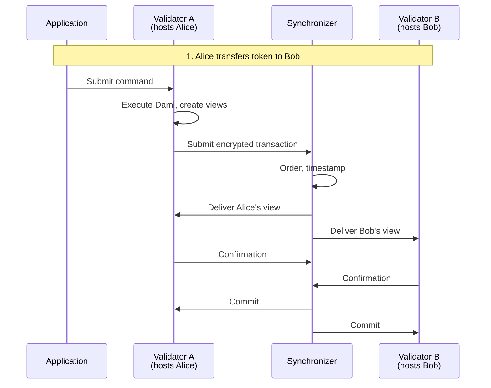

<Warning>
  이 페이지는 팀 리서치를 위한 비공식 한국어 번역입니다. 기술적 판단에는 [공식 영어 원문](https://docs.canton.network/overview/understand/core-concepts.md)을 사용하세요.
</Warning>

import DamlPartyRolesAsset from "/snippets/external/daml/main/tutorials-smart-contracts-daml-daml-intro-choices-daml-party-roles-asset-begin.mdx";
import DamlPartyRolesTemplateStructure from "/snippets/external/daml/main/tutorials-smart-contracts-daml-daml-intro-choices-daml-party-roles-template-structure-begin.mdx";
import DamlOverviewUnderstandCoreConceptsL223 from "/snippets/daml-docs/overview_understand_core-concepts_L223.mdx";


Canton을 이해하려면 **Party**, **Validator** node, **Synchronizer**, **Template**(smart contract)이라는 네 가지 기본 개념을 파악해야 합니다. 이 페이지에서는 각 개념과 이들이 함께 작동하는 방식을 설명합니다.

## Party

**Party**는 Canton의 on-ledger identity입니다. 다른 blockchain의 address나 account와 비슷하지만 명시적인 authorization 의미론을 갖습니다.

### Party Identifier 형식

```
alice::1220f2fe29866fd6a0009ecc8a64ccdc09f1958bd0f801166baaee469d1251b2eb72
└┬┘  └─────────────────────────────────────────┘
name                                fingerprint (hash of public key)
```

### Party가 하는 일

| Capability | 설명 |
|------------|------|
| **Sign** | Signatory로서 contract 생성을 authorize |
| **Act** | Controller로서 contract의 Choice를 exercise |
| **See** | Stakeholder로서 contract와 Transaction을 observe |
| **Validate** | 자신의 contract에 영향을 주는 Transaction을 confirm |

### Local Party와 External Party

| 유형 | Key 보유 주체 | Use Case |
|------|---------------|----------|
| **Local Party** | Validator | 단순한 방식. Validator가 Party를 대신해 signing함. Automation에 적합함. |
| **External Party** | External system | User wallet. 명시적인 signing workflow가 필요함. |

<Note>
Ethereum address와 달리 Party는 Validator에 state를 만들며 생성 비용이 발생합니다. Party 구조를 신중히 설계하고 불필요한 Party를 만들지 마세요.
</Note>

### Contract에서 Party의 역할

Party는 세 역할로 contract와 상호 작용합니다.

<DamlPartyRolesAsset />

| 역할 | 생성 가능 | 볼 수 있음 | Action 가능 |
|------|-----------|-------------|-------------|
| **Signatory** | 반드시 authorize해야 함 | 항상 | Controller이기도 한 경우 |
| **Observer** | 아니요 | 예 | Controller이기도 한 경우 |
| **Controller** | 아니요 | Exercise할 때 | 예, 특정 Choice |

<Note>
**Stakeholder** = Signatory + Observer. Stakeholder는 contract를 볼 수 있는 모든 Party입니다. Validator가 hosting하는 Party가 Stakeholder이면 해당 Party를 위해 contract를 저장합니다.
</Note>

## Validator(Participant Node)

**Validator**는 Party를 hosting하고 contract data를 저장하며 Canton protocol에 참여합니다. Validator는 Participant Node(Daml execution engine)와 Validator process로 구성됩니다.

### Validator가 하는 일

| 기능 | 설명 |
|------|------|
| **Party hosting** | Hosting하는 Party의 contract 저장 |
| **Daml 실행** | Smart contract logic 실행 |
| **Transaction validation** | Authorization과 correctness 검증 |
| **API 제공** | Application에 Ledger API 제공 |

### Validator Architecture



### 주요 특성

- 각 Validator는 **localized private view**인 _Active Contract Set_을 유지합니다
- Validator는 hosting하는 Party가 Stakeholder인 contract만 저장합니다
- 하나의 Validator가 여러 Party를 hosting할 수 있습니다
- Validator가 여러 Synchronizer에 연결할 수 있습니다
- 하나의 Party를 여러 Validator에서 hosting할 수 있습니다

<Warning>
Hosting Validator는 사용자의 모든 data를 봅니다. 이는 trust relationship이므로 Validator를 신중히 선택하세요.
</Warning>

## Synchronizer

**Synchronizer**는 Transaction 내용을 보지 않고 Transaction ordering과 consensus를 coordination합니다. Synchronizer는 두 component로 구성됩니다.

### Sequencer

Sequencer는 message의 순서를 정하고 배포합니다.

| 기능 | 설명 |
|------|------|
| **Order** | Timestamp와 total ordering 할당 |
| **Distribute** | 수신자에게 암호화된 message routing |
| **Consistency** | 모든 Participant가 같은 순서를 보도록 보장 |

Sequencer는 다음을 **하지 않습니다**.
- Message decrypt
- Transaction 내용 열람
- Transaction data 영구 저장. 단, cache할 수는 있습니다
- 관여한 최종 사용자 식별. 단, Party information을 바탕으로 routing합니다

### Mediator

Mediator는 Transaction을 confirm하는 consensus protocol을 지원합니다.

| 기능 | 설명 |
|------|------|
| **Collect** | Participant의 confirmation 수집 |
| **Aggregate** | Consensus threshold 충족 여부 판단 |
| **Declare** | Transaction 결과(commit/reject) 발표 |

Mediator는 다음을 **하지 않습니다**.
- Transaction 내용 열람
- 무엇을 confirm하는지 파악
- Confirmation detail 저장

### Global Synchronizer

**Global Synchronizer**는 Canton Network의 public Synchronizer입니다.



- 주요 기관인 **Super Validator**가 운영
- Decentralized되어 단일 operator가 통제하지 않음
- Transaction fee 지불에 필요한 Traffic을 구매하기 위해 **Canton Coin(CC)** 사용
- **Canton Foundation**이 governance함

## Smart Contract(Template)

Canton의 smart contract는 다자간 workflow를 위해 특별히 설계된 언어인 **Daml**로 정의합니다. Daml **Template**은 일반적으로 다음을 정의합니다.

- **Data**: Contract가 보유하는 정보
- **Party**: Contract를 보고 action을 수행할 수 있는 주체
- **Choice**: 가능한 action

### Template 구조

<DamlPartyRolesTemplateStructure />

### Contract는 Immutable함

Mutable state를 가진 Solidity contract와 달리 Daml contract(Template instance)는 immutable합니다. `created` 또는 `archived`만 가능합니다.

| Solidity | Daml |
|----------|------|
| State를 그 자리에서 수정 | 기존 contract를 archive하고 새 contract 생성 |
| `balances[addr] = newValue` | `create Token with owner = newOwner` |
| State history가 암묵적 | Contract를 통해 state history가 명시적 |

이러한 immutability는 Canton의 privacy와 integrity 보장에 핵심적입니다.

### Choice: Consuming과 Non-Consuming

| 유형 | 효과 | Use Case |
|------|------|----------|
| **Consuming** | Contract를 archive | State transition, transfer |
| **Non-consuming** | Contract가 active 상태로 유지 | Query, read operation, listening client용 event |

<DamlOverviewUnderstandCoreConceptsL223 />

## Component가 함께 작동하는 방식

완전한 Transaction flow에는 네 가지 개념이 모두 관여합니다.



| 단계 | Component | Action |
|------|-----------|--------|
| 1 | **Application** | Ledger API로 Command 제출 |
| 2 | **Validator A** | Daml 실행, Transaction view 생성 |
| 3 | **Synchronizer** | 암호화된 view의 순서를 정하고 배포 |
| 4 | **Validator** | 각자 자신의 view를 validate |
| 5 | **Synchronizer** | Confirmation을 수집하고 commit 선언 |
| 6 | **Validator** | Commit된 contract 저장 |

## 요약 표

| 개념 | 의미 | 주요 속성 |
|------|------|-----------|
| **Party** | On-ledger identity | 명시적인 authorization 역할을 가짐 |
| **Validator** | Party를 hosting하는 node | Hosting하는 Party의 data만 저장 |
| **Synchronizer** | Coordination layer | 내용을 보지 않고 ordering |
| **Template** | Smart contract 정의 | Data, Party, Choice 정의 |
| **Contract** | Template instance | Immutable, 변경 시 새 contract 생성 |

## 다음 단계

<CardGroup cols={2}>

<Card title="Architecture 상세 분석" icon="diagram-project" href="/overview/learn/architecture">
  Component가 함께 작동하는 기술적 방식을 살펴봅니다.
</Card>

<Card title="Global Synchronizer" icon="globe" href="/overview/understand/global-synchronizer">
  Public coordination layer를 알아봅니다.
</Card>

<Card title="Privacy Model" icon="lock" href="/overview/learn/privacy-model">
  Sub-transaction privacy를 자세히 이해합니다.
</Card>

<Card title="개발 시작" icon="code" href="/appdev/get-started/choose-your-path">
  Canton에서 개발을 시작합니다.
</Card>

</CardGroup>
