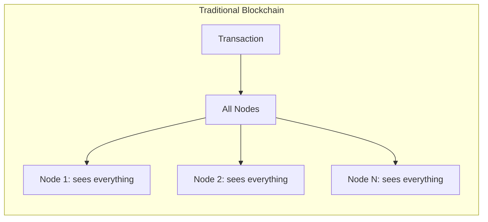
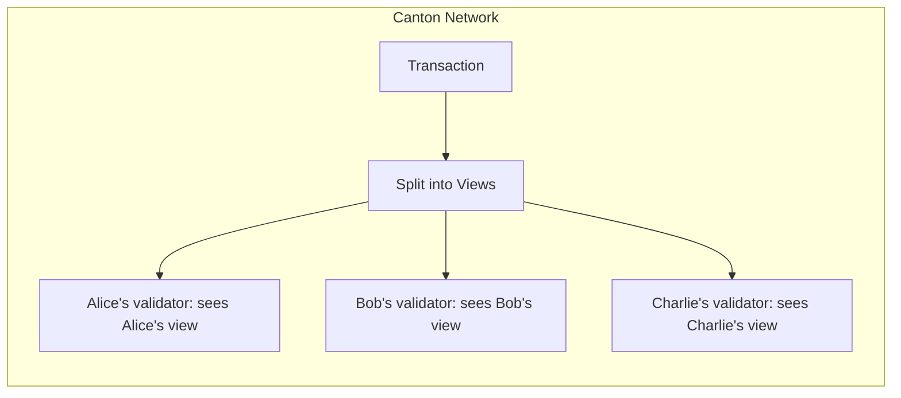
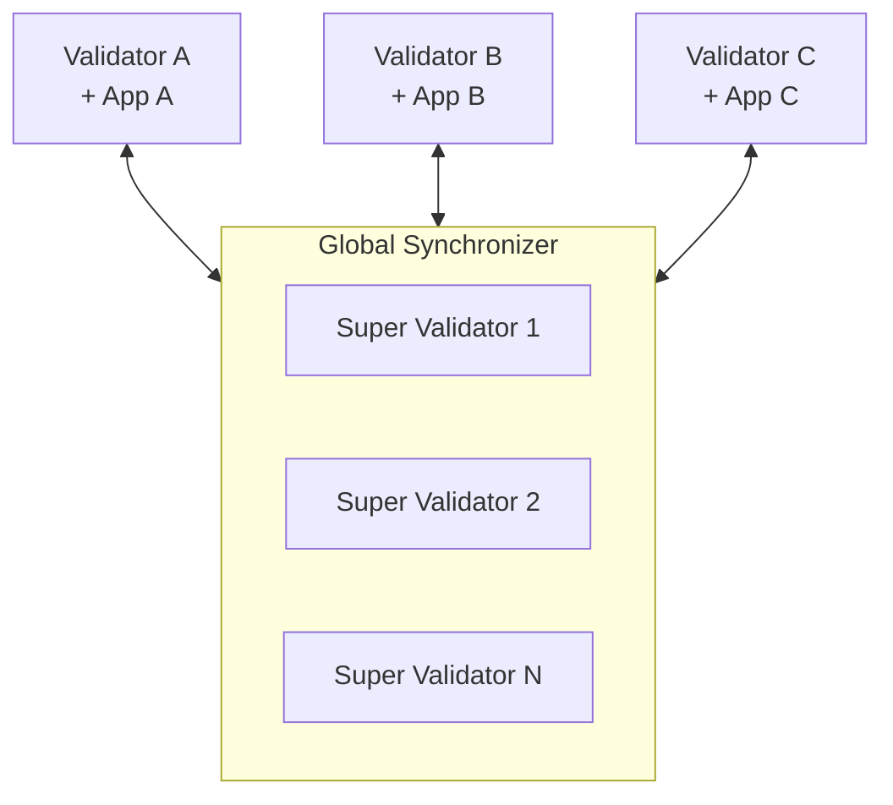

<Warning>
  이 페이지는 팀 리서치를 위한 비공식 한국어 번역입니다. 기술적 판단에는 [공식 영어 원문](https://docs.canton.network/overview/understand/five-minute-overview.md)을 사용하세요.
</Warning>

import DamlOverviewUnderstandFiveMinuteOverviewL64 from "/snippets/daml-docs/overview_understand_five-minute-overview_L64.mdx";

Canton Network는 민감한 data를 모두에게 공개하지 않고도 blockchain의 이점인 shared truth, automation, auditability를 얻는 방법이라는 근본적인 문제를 해결하는 public blockchain입니다.

## 핵심 통찰

전통적인 blockchain은 모든 data를 모든 node에 복제합니다. 이는 강력한 integrity 보장을 제공하지만 추가 layer 없이는 privacy를 확보할 수 없게 합니다.

Canton은 이 model을 뒤집습니다. **Data는 필요한 곳에만 전달됩니다.** Party는 자신에게 권한이 있는 내용만 보지만 system은 완전히 복제되는 blockchain과 동일한 integrity 보장을 유지합니다.

## 이를 달성하는 방식

Canton은 세 가지 핵심 혁신을 통해 이를 달성합니다.

### 1. Sub-Transaction Privacy

Transaction은 **view**로 분해됩니다. 각 Party는 Signatory, Observer, Controller 등 자신의 역할을 바탕으로 볼 권한이 있는 view만 받습니다.

하나의 atomic Transaction에서 Alice가 Bob에게 지불하고 Bob이 Charlie에게 지불한다면:
- Alice는 자신이 Bob에게 한 지불을 봅니다
- Bob은 두 지불을 모두 봅니다. 두 지불에 모두 관여하기 때문입니다
- Charlie는 Bob에게서 받은 지불만 봅니다
- 다른 누구도 아무것도 보지 못합니다

### 2. Synchronizer는 동기화만 하고 Transaction state를 저장하지 않음

**Global Synchronizer**는 Transaction의 순서를 정하고 consensus를 지원하지만 Transaction 내용은 절대 보지 못합니다. 암호화된 message와 confirmation 결과만 처리합니다.

이러한 분리는 다음을 의미합니다.
- 모든 data를 읽을 수 있는 중앙 지점이 없음
- Visibility 없는 synchronization
- Validator가 hosting하는 Party의 data를 저장함

### 3. Smart Contract가 Privacy를 정의함

Privacy는 덧붙인 기능이 아닙니다. Daml smart contract는 다음을 명시적으로 선언합니다.
- **Signatory**: Contract를 authorize해야 하며 항상 볼 수 있는 주체
- **Observer**: 볼 수 있지만 action을 수행할 수 없는 주체
- **Controller**: 특정 action을 실행할 수 있는 주체

<DamlOverviewUnderstandFiveMinuteOverviewL64 />

## Network

Canton Network는 다음으로 구성됩니다.

| Component | 역할 |
|-----------|------|
| **Global Synchronizer** | Super Validator가 운영하는 public synchronization layer |
| **Validator** | Party를 hosting하고 contract data를 저장하는 node |
| **Canton Coin (CC)** | Transaction fee를 위한 native token |
| **Application** | 사용자가 그 위에 구축하는 대상 |

각 Validator는 일반적으로 하나 이상의 application을 실행합니다. Application끼리 결합할 수도 있습니다. 공개된 Daml package를 사용해 기존 기능 위에 privacy를 유지하면서 새로운 기능을 구축할 수 있습니다.

## 이것이 중요한 이유

Canton은 전통적인 blockchain에서는 실현하기 어려운 use case를 가능하게 합니다.

| Use Case | Canton이 작동하는 이유 |
|----------|------------------------|
| **규제 금융** | 권한 있는 Party에 data가 유지되므로 compliance가 가능함 |
| **다자간 workflow** | Visibility를 공유하지 않고도 truth를 공유함 |
| **기밀 계약** | Signatory만 조건을 볼 수 있음 |
| **Position privacy** | Trading strategy가 보호됨 |

## 차이점

다른 blockchain에 익숙하다면 다음 차이를 참고하세요.

| 전통적인 Blockchain | Canton |
|---------------------|--------|
| 모두가 모든 것을 봄 | Party는 자신의 view만 봄 |
| Global state replication | Party별 distributed state |
| Privacy = 추가 layer | Privacy = core protocol |
| Gas fee | Traffic fee |
| EOA/Address | Party |
| Mutable contract | Immutable, 변경 시 새 contract 생성 |

## 다음 단계

<CardGroup cols={2}>

<Card title="왜 Canton인가?" icon="question" href="/overview/understand/the-problem">
  Canton이 해결하는 문제를 자세히 알아봅니다.
</Card>

<Card title="핵심 개념" icon="book" href="/overview/understand/core-concepts">
  Party, Validator, Synchronizer, smart contract를 알아봅니다.
</Card>

<Card title="Ethereum Developer를 위한 안내" icon="ethereum" href="/appdev/modules/m2-canton-for-ethereum-devs">
  기존 blockchain 지식을 Canton에 연결합니다.
</Card>

<Card title="Architecture" icon="diagram-project" href="/overview/learn/architecture">
  Component가 함께 작동하는 방식을 살펴봅니다.
</Card>

</CardGroup>
