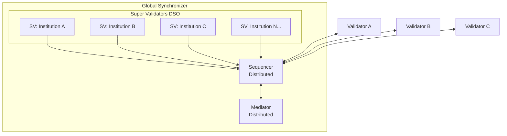
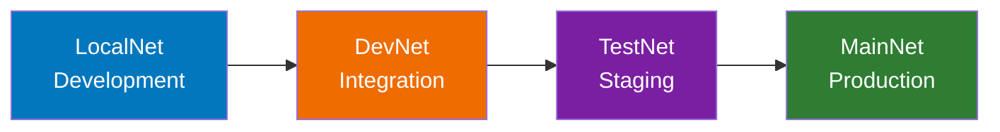

<Warning>
  이 페이지는 팀 리서치를 위한 비공식 한국어 번역입니다. 기술적 판단에는 [공식 영어 원문](https://docs.canton.network/overview/understand/global-synchronizer.md)을 사용하세요.
</Warning>

Global Synchronizer는 Canton Network의 public infrastructure backbone으로, Super Validator가 운영하는 decentralized Synchronizer입니다.

## Global Synchronizer란 무엇인가요?

Global Synchronizer는 다음과 같습니다.
- 여러 독립 Party가 운영하는 **Synchronizer instance**(여러 Sequencer와 Mediator node의 BFT configuration)
- **Decentralized**: 단일 entity가 통제하지 않음
- Canton Network application을 위한 **기본 coordination layer**
- Linux Foundation 산하 **Canton Foundation**이 governance함

다음 사항에 유의하세요.
- Global Synchronizer는 Canton Network와 별개의 blockchain이 **아닙니다**
- Validator가 자체 state를 저장하며 Global Synchronizer는 별도의 storage layer가 **아닙니다**
- Dedicated Synchronizer도 존재할 수 있으며 모든 Canton application에 Global Synchronizer가 **필수는 아닙니다**

## Canton Coin(CC)

Canton Coin은 Global Synchronizer의 native utility token이며 다음 용도로 사용됩니다.

| 용도 | 설명 |
|------|------|
| **Transaction fee(Traffic)** | Transaction 제출 시 network 사용료 지불 |
| **Infrastructure reward** | Infrastructure를 제공하는 Synchronizer operator에게 incentive 제공 |
| **Governance 참여** | Super Validator가 governance 참여를 위해 CC stake |

Canton Coin은 decentralized Synchronizer를 위한 경제와 governance infrastructure를 제공하는 reference application 집합인 **Splice**를 통해 구현됩니다.

### Traffic(Transaction Fee)

"Traffic"은 Canton에서 Transaction fee를 가리키는 용어입니다. Global Synchronizer를 통해 Transaction을 제출하면 Canton Coin으로 Traffic 비용을 지불합니다.

Traffic 비용은 주로 다음 요소에 따라 달라집니다.
- Transaction size
- Computational complexity
- 현재 network demand

### Canton Coin 획득하기

| Environment | 방법 |
|-------------|------|
| **LocalNet** | 실제 가치가 없는 local test CC |
| **DevNet** | Faucet("tapping")에서 test CC 제공 |
| **TestNet** | Faucet에서 test CC 제공 |
| **MainNet** | Exchange에서 구매하거나 network activity로 획득 |

## Network Environment

Canton Network는 development lifecycle에서 서로 다른 목적을 담당하는 네 environment에서 운영됩니다.

| Environment | 목적 | 접근 방법 | CC 유형 |
|-------------|------|-----------|---------|
| **LocalNet** | Local 개발 | 자신의 machine에서 local로 실행 | Test(가치 없음) |
| **DevNet** | Integration test | VPN credential + SV sponsorship | Test(faucet) |
| **TestNet** | Staging/validation | 신청 절차 | Test(faucet) |
| **MainNet** | Production | 전체 onboarding | 실제 가치 |

### LocalNet

<Note>
LocalNet은 전적으로 사용자의 machine에서 실행되는 Global Synchronizer를 simulation하므로 external network가 필요하지 않습니다.
</Note>

- **목적**: 개발과 최초 test
- **접근**: Daml SDK를 설치한 누구나
- **제약**: 단일 machine에서 실행되므로 실제 network behavior를 test하지 않음

**사용 시점**: Daml contract 작성과 test, 최초 application 개발, Canton 학습.

### DevNet

- **목적**: 실제 network infrastructure를 이용한 integration test
- **접근**: VPN credential과 Super Validator sponsorship 필요
- **CC**: Faucet("tapping")을 통해 test token 제공

**사용 시점**: Multi-validator workflow test, network integration validation, pre-production test.

**접근 절차:**
1. Super Validator sponsor에게 문의합니다
2. VPN credential을 받습니다
3. 연결하도록 Validator를 설정합니다
4. Test CC를 tap합니다

### TestNet

- **목적**: Staging environment, production 전 최종 validation
- **접근**: Canton Network를 통한 신청 절차
- **CC**: 실제 가치가 없는 test token

**사용 시점**: 최종 integration test, performance validation, user acceptance test, CN과 application upgrade 연습.

### MainNet

- **목적**: Production environment
- **접근**: 전체 onboarding 절차 완료
- **CC**: Featured application으로 승인되면 실제 경제적 가치가 있음

**사용 시점**: Production deployment, 실제 Transaction, live application.

<Note>
DevNet, TestNet, MainNet은 모두 동일한 Super Validator가 운영하는 infrastructure에서 실행됩니다. 차이는 접근 요구 사항과 Canton Coin에 실제 경제적 가치가 있는지 여부입니다.
</Note>

### Environment 진행 경로

Environment 간 이동에는 다음이 필요합니다.
- **LocalNet → DevNet**: VPN access, SV sponsorship
- **DevNet → TestNet**: Application approval, operational readiness
- **TestNet → MainNet**: 전체 onboarding, production readiness review

## Super Validator

Super Validator(SV)는 Global Synchronizer infrastructure를 운영하는 entity입니다.

### 책임

| 책임 | 설명 |
|------|------|
| **Infrastructure operation** | Sequencer와 Mediator node 실행 |
| **Governance 참여** | Network parameter와 upgrade에 투표 |
| **Validator sponsorship** | Network에 새로 참여하는 Validator sponsor |
| **Reward 배포** | Validator reward 수령과 배포 |

### Decentralized Synchronizer Operator(DSO)

Node를 함께 운영하는 Super Validator 집합이 DSO를 구성합니다. DSO는 공동으로 다음을 수행합니다.
- Synchronizer infrastructure 운영
- Governance decision 수행
- Splice application 관리
- 새 Participant onboarding

Super Validator에는 주요 금융 기관과 technology provider가 포함됩니다. 최신 목록은 Canton Foundation이 관리합니다.

## Validator 되기

Global Synchronizer에 Validator로 참여하려면 다음을 참고하세요.

### 선택지

| 접근 방식 | 설명 | 노력 | 통제력 |
|-----------|------|------|--------|
| **Node-as-a-Service** | Provider가 Validator를 hosting | 최소 | 중간 |
| **Self-hosted** | 자신의 Validator infrastructure 운영 | 최대 | 전체 |

### 요구 사항

1. **Sponsorship 획득**: Super Validator가 onboarding을 sponsor해야 합니다
2. **Infrastructure 배포**: 필요한 사양으로 Validator node를 설정합니다
3. **Synchronizer 연결**: Network connectivity를 설정합니다
4. **Upgrade 관리**: Network가 자주 upgrade되므로 Validator가 그 속도를 따라야 합니다

### Sponsorship 절차

1. [canton.foundation](https://canton.foundation)에서 목록을 확인하고 Super Validator에 문의합니다
2. Use case와 organization을 설명합니다
3. 필요한 agreement를 완료합니다
4. Sponsorship과 access credential을 받습니다

<Note>
Application Developer에게는 self-hosting보다 기존 Validator(node-as-a-service)를 사용하는 편이 더 간단한 경로인 경우가 많습니다. 운영 overhead 없이 network에 접근할 수 있습니다.
</Note>

## Governance

### Canton Foundation

**Canton Foundation(CF)**은 Global Synchronizer를 governance하는 Linux Foundation 산하의 독립 nonprofit body입니다.

**책임:**
- Network policy와 parameter 설정
- Upgrade와 maintenance coordination
- Super Validator 참여 감독
- Splice codebase governance 관리
- Featured application 검토와 commission

### 의사 결정

Governance decision은 다음과 같은 구조화된 절차를 따릅니다.
1. **Proposal**: 모든 SV가 변경을 제안할 수 있습니다
2. **Discussion**: SV가 영향과 수정 사항을 논의합니다
3. **Voting**: Governance rule에 따라 SV가 투표합니다
4. **Implementation**: 승인된 변경 사항을 구현합니다

### Governance 대상

| 영역 | 예제 |
|------|------|
| **Protocol parameter** | Transaction limit, timing window |
| **Economic parameter** | Fee structure, reward distribution |
| **Membership** | SV admission, Validator requirement |
| **Upgrade** | Protocol version, upgrade schedule |

## Splice Application

**Splice**는 decentralized Canton Synchronizer의 운영, funding, governance를 위한 infrastructure를 제공하는 Hyperledger Labs 산하 open-source project입니다.

### Component

| Component | 목적 |
|-----------|------|
| **Canton Coin** | Native token 구현 |
| **Validator App** | Validator node 관리 |
| **Wallet** | CC용 user wallet |
| **Scan** | Network explorer |
| **Governance** | Voting과 proposal 관리 |

### Token Standard

Splice에는 Canton Network에서 token을 생성하기 위한 token standard([CIP-0056](https://github.com/canton-foundation/cips/blob/main/cip-0056/cip-0056.md))가 포함됩니다. 이는 다음을 제공합니다.
- Token operation을 위한 표준 interface
- Application 간 interoperability
- 일관된 wallet integration

## Upgrade 고려 사항

현재 Global Synchronizer와 Validator는 자주 upgrade되며, 그 빈도는 다음 해에 감소할 것으로 예상됩니다. Validator 또는 Application Developer는 다음을 예상해야 합니다.

| 빈도 | 유형 | 영향 |
|------|------|------|
| **매주 또는 매월** | Minor update | 최소, 대체로 backward compatible |
| **분기별** | Feature release | Application update가 필요할 수 있음 |
| **필요할 때** | Security patch | 중요, 신속한 배포 필요 |

### 최신 상태 유지하기

- **Announcement monitoring**: Canton Network communication 구독
- **DevNet/TestNet에서 test**: MainNet upgrade 전에 compatibility validation
- **Maintenance window 계획**: Update를 위한 시간 예약
- **Rollback capability 유지**: 필요한 경우 되돌릴 절차 마련
- **Community channel 참여**: [#gsf-global-synchronizer-appdev](https://daholdings.slack.com/archives/C08FQRCRFUN), [#gsf-outreach](https://daholdings.slack.com/archives/C08PT9P8ERM), [#validator-operations](https://daholdings.slack.com/archives/C08AP9QR7K4)

## 다음 단계

- **[Glossary](/overview/understand/glossary)** - 용어 reference
- **[Validator 운영](/global-synchronizer/understand/introduction)** - 자신의 Validator 배포
- **[Deployment 진행 경로](/appdev/modules/m5-deployment-progression)** - Environment를 거쳐 application 배포

{/* COPIED_START source="docs-website:docs/replicated/canton/3.5/overview/explanations/canton/synchronizers.rst" hash="37269fce" */}

# Synchronizer

Synchronizer architecture 상세 분석. Functional requirement는 protocols.rst에서 이미 정립되었습니다.

## Sequencer

{/* TODO: https://github.com/DACH-NY/canton/issues/25653 See also https://github.com/DACH-NY/canton/blob/main/docs/src/sphinx/arch/canton/sequencing.rst */}

- Member, confidential delivery인 projection을 포함한 envelope와 recipient
- Ordering 보장
  - 별도 protocol layer로서의 ordering(아래 참고)
- Traffic management
- Sequencer가 관리하고 Sequencer operator가 충전하는 Traffic Credit
- Time source
  - Ledger time, submission time(preparation time으로 이름 변경???), skew

## Mediator

\<[https://github.com/DACH-NY/canton/issues/25653](https://github.com/DACH-NY/canton/issues/25653)\>

Mediator = Two-phase commit coordinator

- Expected quorum 목록 확보(현재는 tree)
  - 제한된 기간 내 request deduplicate

### Ordering Layer

\<[https://github.com/DACH-NY/canton/issues/25653](https://github.com/DACH-NY/canton/issues/25653)\> \* API spec

- Link가 포함된 integration 개요
  - CometBFT
  - DA BFT(관련 문서가 준비되면)
  - DB sequencer(준비되면)
- Fabric/Besu 언급 없음

\<[https://github.com/DACH-NY/canton/issues/25653](https://github.com/DACH-NY/canton/issues/25653)\> \* 모든 implementation detail, 특히 internal architecture 제거

- 적합하다면 "Dedicated Synchronizer" chapter로 이동합니다.

{/* COPIED_END */}

