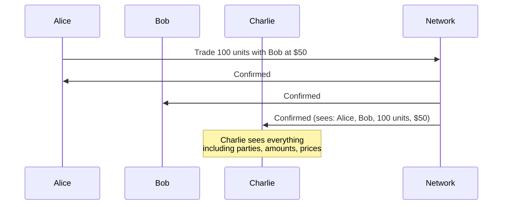

<Warning>
  이 페이지는 팀 리서치를 위한 비공식 한국어 번역입니다. 기술적 판단에는 [공식 영어 원문](https://docs.canton.network/overview/understand/the-problem.md)을 사용하세요.
</Warning>

Blockchain 기술은 서로 완전히 신뢰하지 않는 Party 사이에 shared truth를 제공하겠다고 약속합니다. 그러나 전통적인 blockchain은 모두가 모든 것을 보는 완전한 public visibility를 통해 이러한 신뢰를 달성합니다. 많은 실제 application에서는 이 특성이 치명적인 문제입니다.

## Public Visibility 문제

Alice가 Bob과 거래할 때 Ethereum에서 일어나는 일을 생각해 보세요.

1. Alice가 Transaction을 제출합니다
2. Transaction이 mempool에 들어갑니다. 이 내용은 모두에게 보입니다
3. Miner/Validator가 Transaction을 block에 포함합니다
4. Network의 모든 node가 Transaction을 저장합니다
5. 누구나 Transaction detail을 영구적으로 조회할 수 있습니다

이는 다음을 의미합니다.
- Charlie는 Alice가 Bob과 거래했다는 사실을 볼 수 있습니다
- Charlie는 가격, asset, amount를 볼 수 있습니다
- Charlie는 시간에 따른 Alice의 trading pattern을 분석할 수 있습니다
- Charlie가 경쟁자라면 가치 있는 정보를 얻게 됩니다

## Privacy가 중요한 이유

Public transparency 문제는 이론에 그치지 않습니다. 실제 도입을 가로막습니다.

### Front-Running 위험

Transaction이 실행 전과 실행 중에 보이면 관찰자는 그 정보를 악용할 수 있습니다. 전통 금융에서 이는 불법입니다. Public blockchain에서는 구조적인 문제입니다.

### 경쟁 정보

모든 Transaction은 정보를 드러냅니다.
- **Trading strategy**: Pattern 분석을 통해 접근 방식이 노출됩니다
- **Business relationship**: 거래 상대를 통해 partner가 드러납니다
- **Position size**: 경쟁자가 exposure를 파악합니다
- **Pricing information**: Counterparty가 다른 거래를 볼 수 있습니다

### 규제 장벽

많은 산업에는 data와 관련된 법적 요구 사항이 있습니다.
- **금융 규제**: Client data를 보호해야 합니다
- **Data sovereignty**: 특정 jurisdiction 밖으로 정보를 반출할 수 없습니다
- **기밀 유지 의무**: Contract에 따른 privacy 요구 사항이 있습니다

### 비즈니스 현실

경쟁자가 읽을 수 있는 system에 민감한 business logic과 Transaction을 올릴 enterprise는 없습니다. 이것이 현실입니다.

## 불완전한 완화책

업계는 public blockchain에 privacy를 추가하기 위해 여러 접근 방식을 시도했습니다.

### Private Channel

Hyperledger Fabric 같은 system은 Participant의 일부 집합을 위한 별도 channel을 만듭니다.

**문제점:**
- Fragmentation: Channel 간 shared state가 없음
- Complexity: Channel membership 관리
- 제한된 interoperability: Cross-channel Transaction이 어려움

### Zero-Knowledge Proof

ZK-rollup과 ZK 기반 system은 내용을 공개하지 않고 Transaction validity를 증명합니다.

**문제점:**
- Computational overhead: Proof 생성 비용이 큼
- Complexity: ZK circuit을 개발하고 audit하기 어려움
- 제한된 expressiveness: 모든 business logic이 ZK 제약에 맞지는 않음
- Trusted setup 요구 사항: 일부 system에는 trust assumption이 필요함

### Layer 2 Solution

Transaction을 main chain 밖으로 옮기고 주기적으로 on-chain settlement를 수행합니다.

**문제점:**
- Data availability: 일반적으로 L2 operator가 모든 Transaction을 봄
- Trust assumption: 사용자가 L2 operator를 신뢰해야 함
- Settlement delay: Finality를 위해 L1 confirmation을 기다려야 함
- Bridge 위험: Layer 간 asset 이동으로 attack surface가 생김

### Encryption at Rest

On-chain에 저장된 data를 암호화합니다.

**문제점:**
- Key management: 누가 decryption key를 보유하는가?
- Metadata 노출: Transaction pattern은 여전히 보임
- 미래의 취약성: 오늘 암호화한 data가 미래에 decrypt될 수 있음
- Computation 제약: 암호화된 data를 대상으로 쉽게 연산할 수 없음

## 근본적인 긴장 관계

이러한 접근 방식은 모두 public system 위에 privacy를 추가할 대상으로 취급합니다. Architecture와 함께 작동하는 것이 아니라 architecture에 맞서고 있습니다.

근본적인 긴장 관계는 다음과 같습니다.

| 요구 사항 | 전통적인 접근 방식 | 결과 |
|-----------|--------------------|------|
| **Integrity** | 모든 node가 모든 Transaction을 검증 | Visibility가 필요함 |
| **Verification** | Validator가 Transaction 내용을 봄 | Private data가 노출됨 |
| **Privacy** | Transaction 내용을 숨김 | Verification을 약화함 |

전통적인 blockchain에서는 integrity와 privacy 중 하나를 선택해야 합니다.

## Canton의 통찰

Canton은 "consensus"의 의미를 바꾸어 이 긴장 관계를 해결합니다.

- Validator는 자신이 관여하지 않은 Transaction을 볼 필요가 없습니다
- Transaction에 관여한 Party가 consensus를 이룰 수 있습니다
- Coordinator는 Transaction 내용을 보지 않고도 순서를 정할 수 있습니다

이는 임시방편이 아니라 다른 architecture 토대입니다. Privacy는 위에 추가되는 것이 아니라 Transaction의 작동 방식에 내장되어 있습니다.

<Note>
Canton은 이 접근 방식을 **sub-transaction privacy**라고 합니다. 각 Party는 Signatory, Observer, Controller 등 자신의 역할을 바탕으로 볼 권한이 있는 Transaction 부분만 봅니다. System은 global visibility 없이 integrity를 유지합니다.
</Note>

## 다음 단계

<CardGroup cols={2}>

<Card title="Canton의 해결책" icon="lightbulb" href="/overview/understand/cantons-solution">
  Canton이 privacy와 integrity의 tradeoff를 해결하는 방식을 알아봅니다.
</Card>

<Card title="Privacy Model" icon="lock" href="/overview/learn/privacy-model">
  Sub-transaction privacy의 동작 방식을 자세히 살펴봅니다.
</Card>

</CardGroup>
